# Usar conjuntos de dados compartilhados no Construtor de Relatórios do Power BI

Você pode usar um conjunto de dados que você cria no Power BI Desktop como uma fonte de dados para relatórios paginados do Construtor de Relatórios do Power BI. Imagine este cenário: Você criou um relatório do Power BI no Power BI Desktop. Você passou muito tempo projetando o modelo de dados e criou um relatório excelente do Power BI, com visuais variados e maravilhosos. O relatório tem uma matriz com muitas linhas, portanto, você precisa rolar para ver todas elas. Seus leitores de relatório desejam um relatório que possa ser impresso, isso mostrará todas as linhas nessa matriz. Um relatório paginado do Power BI pode fazer isso: imprimir uma tabela ou matriz que se estende por várias páginas, com cabeçalhos e rodapés de página e um layout da página perfeito que você cria. Ele complementará o relatório de Power BI Desktop. É interessante para você que eles se baseiem exatamente nos mesmos dados, sem discrepâncias, então você usa o mesmo conjunto de dados.

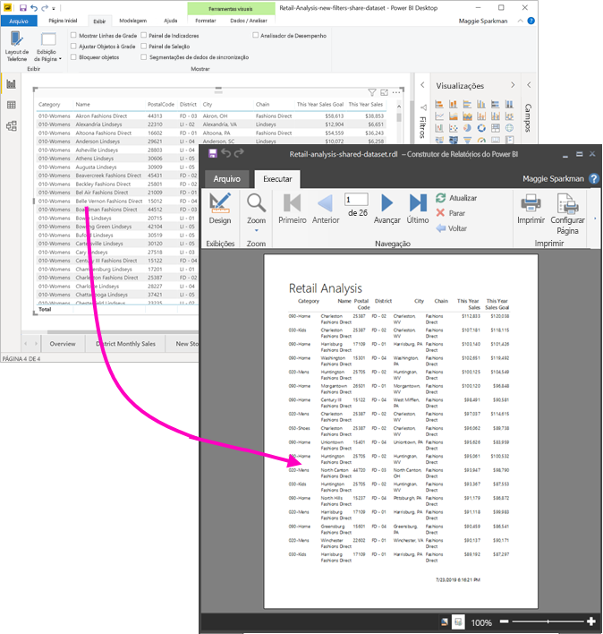

O conjunto de recursos não precisa estar em um workspace em uma capacidade Premium e você não precisa ser um membro desse workspace. Você só precisa ter [permissão de build](service-datasets-build-permissions.md) para o conjunto de dados. Para publicar o relatório paginado, você precisa de uma licença do Power BI Pro. Você também precisa de pelo menos uma função de colaborador para um workspace em uma capacidade Premium.

## O que você precisa

Aqui está uma lista de o que você precisa e não precisa para usar um conjunto de dados compartilhado no Construtor de Relatórios do Power BI.

- O Construtor de Relatórios do Power BI. [Baixe e instale o Construtor de Relatórios do Power BI](https://go.microsoft.com/fwlink/?linkid=2086513).
- Para acessar um conjunto de dados do Power BI, você precisa ter permissão de build para esse conjunto. Leia sobre [permissão de build](service-datasets-build-permissions.md).
- Você não precisa de uma licença do Power BI Pro para criar um relatório paginado no Construtor de Relatórios. 
- Você precisa de uma licença do Power BI Pro para publicar o relatório paginado. Você também precisa de pelo menos uma função de colaborador para um workspace em uma capacidade Premium. 
- Opcional: Se você quiser acompanhar este artigo, baixe o arquivo [.pbix de exemplo de análise de varejo](http://download.microsoft.com/download/9/6/D/96DDC2FF-2568-491D-AAFA-AFDD6F763AE3/Retail%20Analysis%20Sample%20PBIX.pbix), abra-o no Power BI Desktop e adicione uma tabela com muitas colunas. No painel **Formatar**, desative os **Totais**. Em seguida, publique-o em um workspace no serviço do Power BI.

    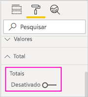

## Conectar-se ao conjunto de dados do Power BI

1. Abra o Construtor de Relatórios do Power BI.
1. Selecione **Entrar** no canto superior direito do Construtor de Relatórios para entrar na sua conta do Power BI.
1. No painel de Dados do Relatório, selecione **Novo** > **Conexão de Conjunto de Dados do Power BI**.

    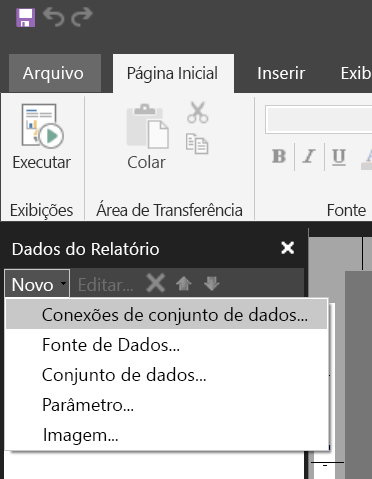

    > [!NOTE]
    > Você não pode criar a fonte de dados ou o conjunto de dados para um conjunto de dados do Power BI usando os assistentes de Tabela, Matriz ou Gráfico do Construtor de Relatórios. Depois de criá-los, você pode usar os assistentes para criar tabelas, matrizes ou gráficos com base neles.

1. Pesquise ou procure pelo conjunto de dados ou o workspace em que ele está e pressione **Selecionar**.
    O Construtor de Relatórios preenche o nome do conjunto de dados.

    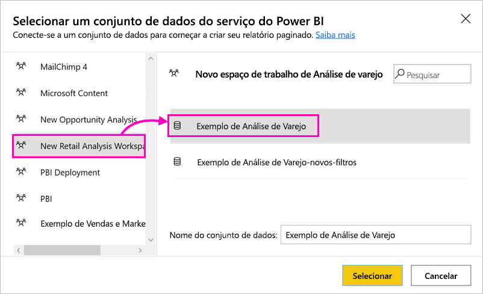
    
1. O conjunto de dados está listado em Fontes de Dados no painel de Dados do Relatório.

    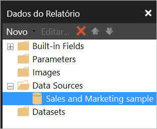

    Lembre-se de que você pode se conectar a vários conjuntos de dados do Power BI e a outras fontes de dados no mesmo relatório paginado.

## Obter a consulta para o conjunto de dados

Quando você desejar que os dados em seu relatório do Power BI e aqueles no relatório do Construtor de Relatórios sejam os mesmos, conectar-se ao conjunto de dados não será suficiente. Você também precisará da consulta criada nesse conjunto de dados.

1. Abra o relatório do Power BI (.pbix) no Power BI Desktop.
1. Verifique se você tem uma tabela em seu relatório que contém todos os dados desejados em seu relatório paginado.

1. Na faixa de opções **Exibir**, selecione **Performance Analyzer**.

    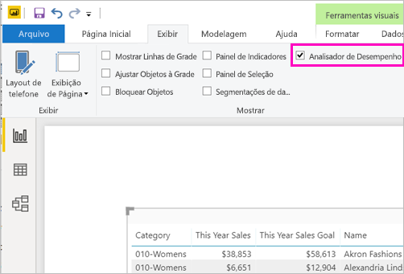

1. No painel **Performance Analyzer**, selecione **Iniciar gravação** e, em seguida, selecione **Atualizar visuais**.

    

1. Expanda o sinal de adição ( **+** ) ao lado do nome da tabela e selecione **Copiar consulta**. A consulta é a fórmula DAX que você precisa para o conjunto de dados no Construtor de Relatórios do Power BI.

    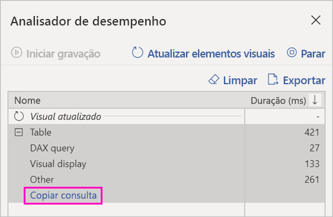

## Criar o conjunto de dados com a consulta

1. Retorne ao Construtor de Relatórios do Power BI.
1. Clique com o botão direito do mouse no conjunto de dados em **Fontes de Dados** e selecione **Adicionar Conjunto de Dados**.

    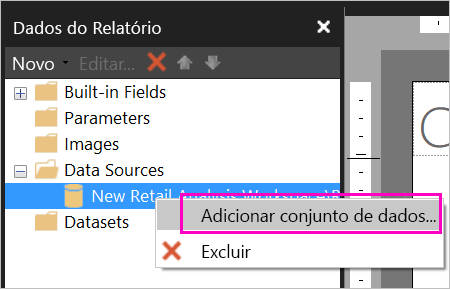

1. Em Propriedades do Conjunto de Dados, dê a ele um nome e selecione **Designer de Consulta**.

4. Verifique se **DAX** está selecionado e anule a seleção do ícone **Modo de Design**.

    

1. Na caixa superior, Cole a consulta que você copiou do Power BI Desktop.

1. Selecione **Executar Consulta** (o ponto de exclamação vermelho, !) para ter certeza de que a consulta funciona. 

    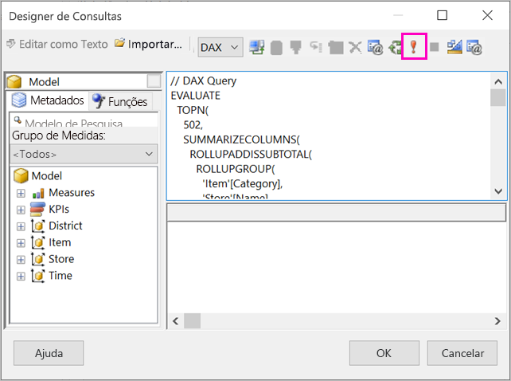

    Você vê os resultados da consulta na caixa inferior.

    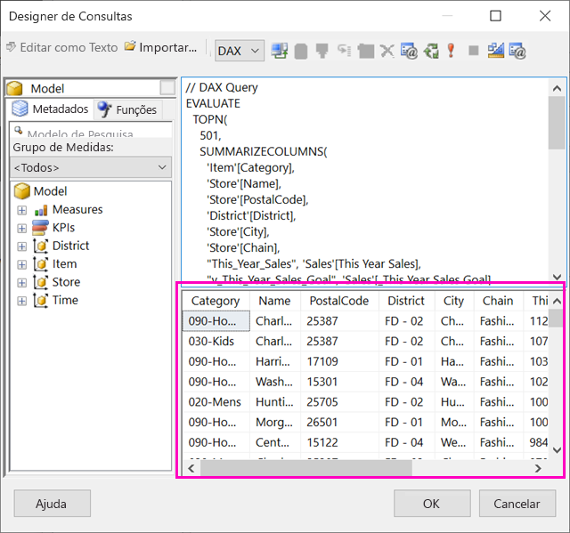

1. Selecione **OK**. 

    Você vê a consulta na janela **Consulta** da caixa de diálogo **Propriedades do Conjunto de Dados**.

    

1. Selecione **OK**.

    Agora você vê o novo conjunto de dados com uma lista dos respectivos campos no painel de Dados do Relatório.

    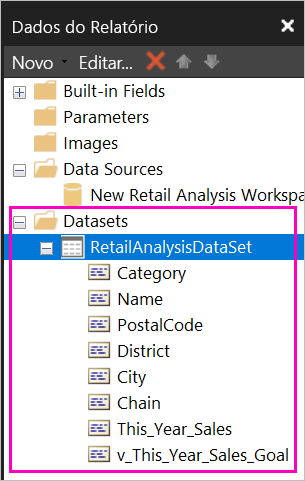

## Criar uma tabela no relatório

Uma maneira rápida de criar uma tabela é usar o Assistente de Tabela.

1. Na faixa de opções **Inserir**, selecione **Tabela** > **Assistente de Tabela**.

    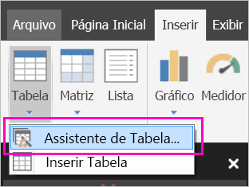

1. Escolha o conjunto de dados que você criou com a consulta DAX e selecione **Avançar**.

    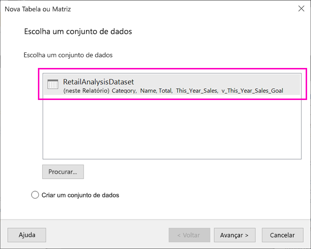

1. Para criar uma tabela simples, selecione os campos desejados em **Campos disponíveis**. Você pode selecionar vários campos simultaneamente selecionando o primeiro que desejar, mantendo a tecla Shift pressionada e selecionando o último.

    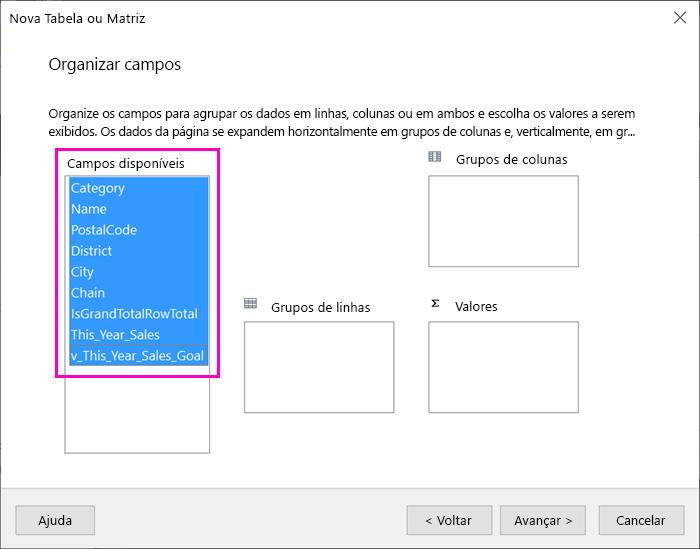

1. Arraste os campos para a caixa **Valores** e selecione **Avançar**.

    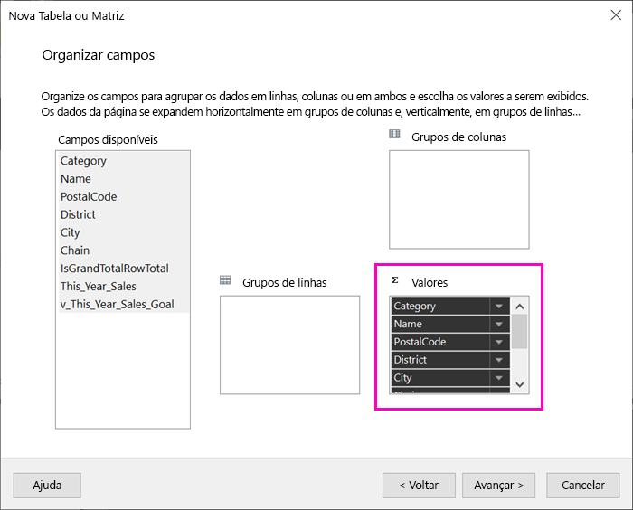

1. Escolha as opções de layout que você deseja e selecione **Avançar**.

1. Selecione **Concluir**.
    Você vê sua tabela no modo de exibição de Design.

    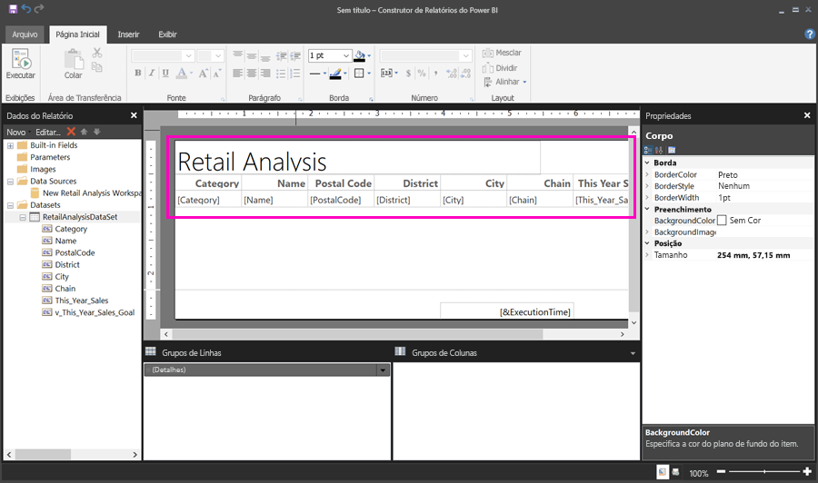

1. Selecione **Clique para adicionar um título** e adicione um título.

1. Selecione **Executar** para visualizar o relatório.

    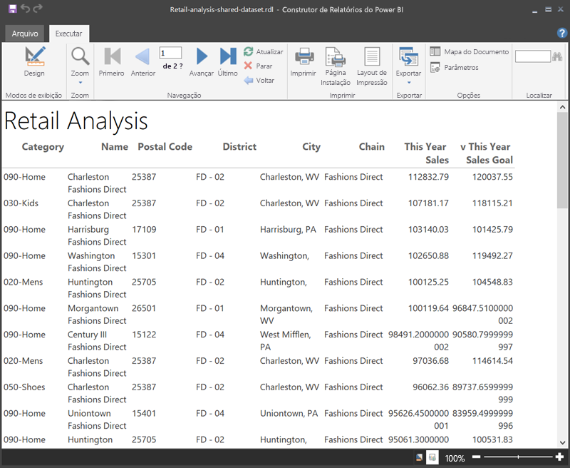

1. Selecione **Layout de Impressão** para ver como seu relatório será impresso. 

    Esse layout de relatório precisa ser melhorado. Ele tem 54 páginas porque as colunas e margens deixam a tabela com duas páginas de largura.

    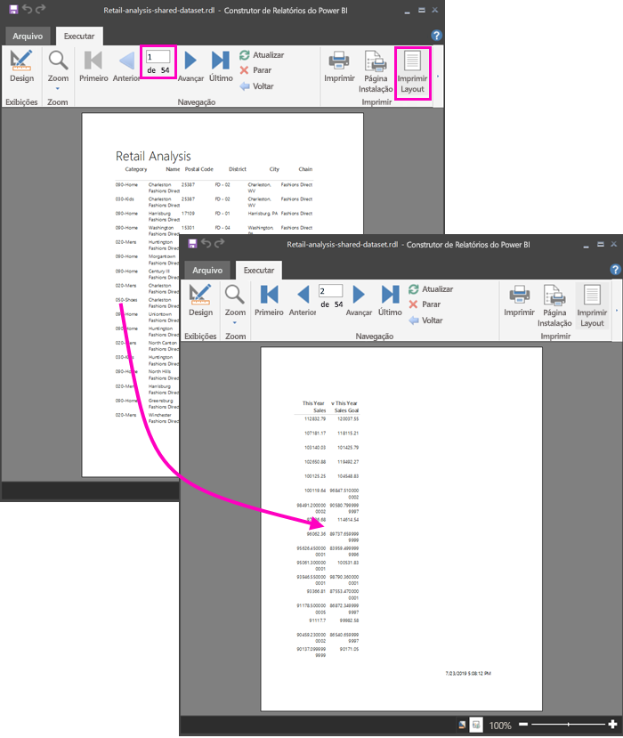

## Formatar o relatório

Você tem várias opções de formatação para fazer com que sua tabela caiba em uma única página. 

1. Você pode diminuir as margens da página no painel Propriedades. Se você não vir o painel Propriedades, na faixa de opções **Exibir**, marque a caixa de seleção **Propriedades**.

1. Selecione o relatório, não a tabela nem o título.
1. No painel **Propriedades do Relatório**, em **Página**, expanda **Margens** e altere cada uma para **0,75 pol**.

    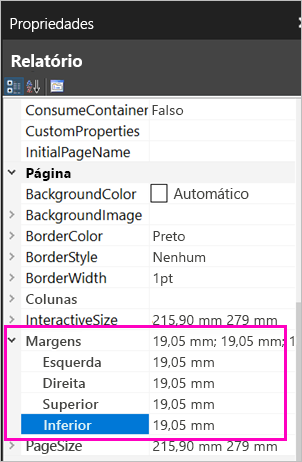

1. Você também pode tornar as colunas mais estreitas. Selecione a borda da coluna e arraste o lado direito para a esquerda.

    

1. Outra opção é verificar se os valores numéricos estão bem formatados. Selecione uma célula com um valor numérico. 
    > [!TIP]
    > Você pode formatar mais de uma célula por vez, mantendo a tecla Shift pressionada enquanto seleciona as outras células.

    

1. Na faixa de opções **Página Inicial**, na seção **Número**, altere o formato **Padrão** para um formato numérico como **Moeda**.

    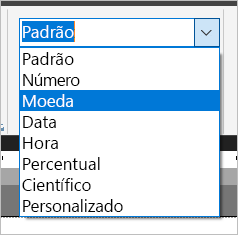

1. Altere o estilo de **Espaço Reservado** para **Valores de Exemplo** para que você possa ver a formatação na célula. 

    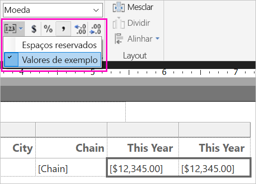

1. Se apropriado, na seção **Número**, diminua os decimais para economizar mais espaço.

### Como livrar-se de páginas em branco

Mesmo que você tenha tornado as margens e as colunas da tabela mais estreitas, ainda poderá ficar com todas as outras páginas em branco. Por que? Por causa da matemática. 

Quando você soma as margens de página que define à largura do *corpo* do relatório, o resultado deve ser menor que a largura do formato do relatório.

Por exemplo, digamos que o relatório tenha um formato de 8,5 X 11 polegadas e que você tenha definido as margens laterais para 0,75 polegadas cada. As duas margens juntas somam 1,5 polegada, portanto, o corpo deve ter largura inferior a 7 polegadas.

1. Selecione a borda direita da superfície de design do relatório e arraste-a para que ela seja menor do que o número desejado na régua. 

    > [!TIP]
    > Você pode defini-la com mais precisão nas **Propriedades** do corpo. Em **Tamanho**, defina a propriedade **Largura**.

    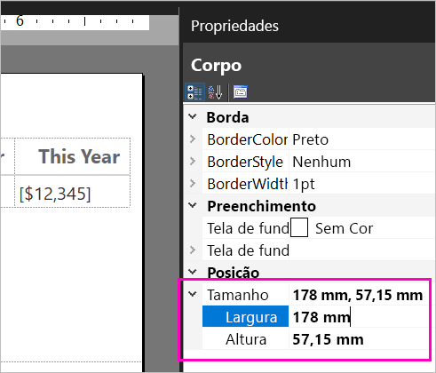

1. Selecione **Executar** para visualizar o relatório e certificar-se de que você se livrou das páginas em branco. Este relatório agora tem apenas 26 páginas, em vez das 54 originais. Êxito!

    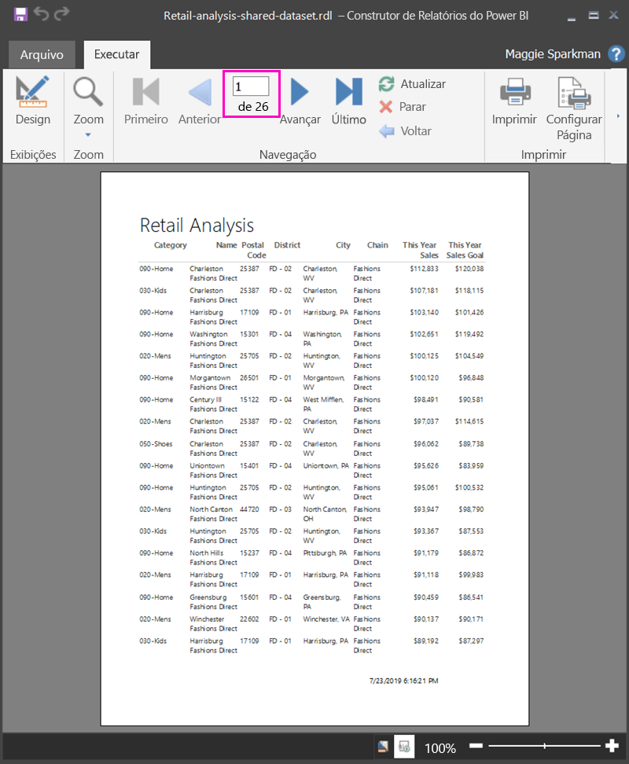

## Limitações e considerações 

- Para conjuntos de valores que usam uma conexão dinâmica ao Analysis Services, você pode se conectar diretamente usando a conexão subjacente ao Analysis Services em vez de um conjunto de dados compartilhado.
- Os conjuntos de dados com endossos promovidos ou certificados são exibidos na lista de conjuntos de dados disponíveis, mas não são marcados como tal. 

## Próximas etapas

- [O que são os relatórios paginados no Power BI Premium?](paginated-reports-report-builder-power-bi.md)