# <a name="configure-power-bi-report-server-with-azure-application-proxy"></a>Configurar o Servidor de Relatórios do Power BI com o Proxy de Aplicativo do Azure

Este artigo descreve como usar o Proxy de Aplicativo do Azure Active Directory para se conectar ao Servidor de Relatórios do Power BI e ao SSRS (SQL Server Reporting Services) 2016 e posterior. Por meio dessa integração, os usuários que estiverem fora da rede corporativa poderão acessar o Servidor de Relatórios do Power BI e os relatórios do Reporting Services em seus navegadores clientes e serão protegidos pelo Azure AD (Azure Active Directory). Saiba mais sobre o acesso remoto a aplicativos locais por meio do [Proxy de Aplicativo do Azure Active Directory](https://docs.microsoft.com/azure/active-directory/manage-apps/application-proxy).

## <a name="environment-details"></a>Detalhes do ambiente

Nós usamos esses valores no exemplo que criamos. 

- Domínio: umacontoso.com
- Servidor de Relatórios do Power BI: PBIRSAZUREAPP.umacontoso.com
- Fonte de dados do SQL Server: SQLSERVERAZURE.umacontoso.com

## <a name="configure-power-bi-report-server"></a>Configurar o Servidor de Relatório do Power BI

Após a instalação do Servidor de Relatórios do Power BI (em uma VM do Azure), configure as URLs do serviço Web e do portal da Web do Servidor de Relatórios do Power BI usando as etapas a seguir:

1. Crie regras de entrada e de saída no firewall da VM na porta 80 (porta 443 se houver URLs HTTPS configuradas). Além disso, crie regras de entrada e de saída para a VM do Azure no portal do Azure para a porta TCP – 80.
2. O nome DNS configurado para a VM em nosso ambiente é `pbirsazureapp.eastus.cloudapp.azure.com`.
3. Configure a URL do serviço Web externo e do portal da Web do Servidor de Relatórios do Power BI selecionando a guia **Avançado** > botão **Adicionar** > **Escolher Nome do Cabeçalho Host** e adicionando o nome do host (nome DNS), conforme mostrado aqui.

    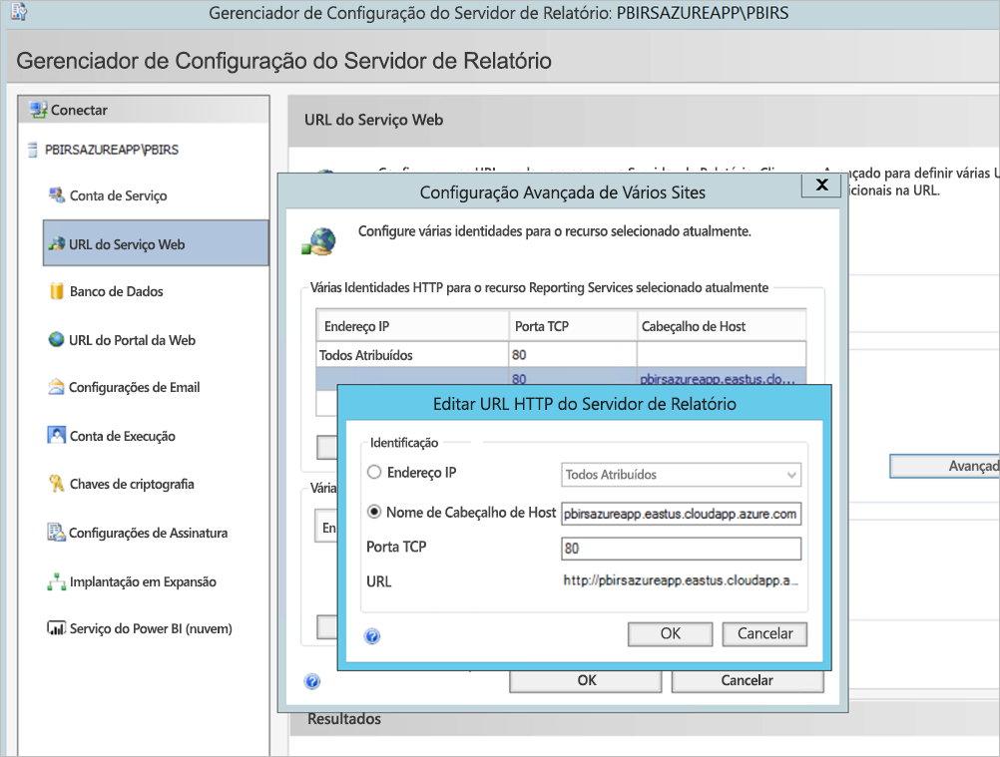

1. Realizamos a etapa anterior para o serviço Web e para a seção do portal da Web e obtivemos as URLs registradas no Gerenciador de Configurações do Servidor de Relatórios:

    - `https://pbirsazureapp.eastus.cloudapp.azure.com/ReportServer`
    - `https://pbirsazureapp.eastus.cloudapp.azure.com/Reports`

2. No portal do Azure, vemos dois endereços IP para a VM na seção de rede 

    - **IP Público**. 
    - **IP Privado**. 
    
    O endereço IP Público é usado para acessos de fora da máquina virtual.

3. Portanto, adicionamos a entrada de arquivo de host na VM (Servidor de Relatórios do Power BI) para incluir o endereço IP Público e o nome do host`pbirsazureapp.eastus.cloudapp.azure.com`.
4. Observe que, ao reiniciar a VM, o endereço IP dinâmico pode mudar, e talvez seja necessário adicionar o endereço IP correto novamente no arquivo de host. Para evitar isso, defina o endereço IP Público como estático no portal do Azure.
5. As URLs do serviço Web e do portal da Web devem ficar acessíveis após as alterações mencionadas acima.
6. Ao acessar a URL `https://pbirsazureapp.eastus.cloudapp.azure.com/ReportServer` no servidor, recebemos três vezes a solicitação para inserir as credenciais e vemos uma tela em branco.
7. Adicione a seguinte entrada do Registro:

    Chave do Registro `HKEY\_LOCAL\_MACHINE \SYSTEM\CurrentControlset\Control \Lsa\ MSV1\_0`

1. Adicione um novo valor `BackConnectionHostNames`, um valor com múltiplas cadeias de caracteres, e forneça o nome do host `pbirsazureapp.eastus.cloudapp.azure.com`.

Depois disso, também podemos acessar as URLs no servidor.

## <a name="configure-power-bi-report-server-to-work-with-kerberos"></a>Configurar o Servidor de Relatórios do Power BI para funcionar com o Kerberos

### <a name="1-configure-the-authentication-type"></a>1. Configurar o tipo de autenticação

É necessário configurar o tipo de autenticação para que o servidor de relatório possibilite a delegação restrita de Kerberos. Isso é feito no arquivo **rsreportserver.config**.

No arquivo rsreportserver.config, encontre a seção **Authentication/AuthenticationTypes**.

Queremos garantir que o RSWindowsNegotiate esteja listado e seja o primeiro na lista de tipos de autenticação. Ela deve ser semelhante à seguinte.

```
<AuthenticationTypes>

    <RSWindowsNegotiate/>

</AuthenticationTypes>
```

Se você precisar alterar o arquivo de configuração, **pare e reinicie o serviço do servidor de relatórios** no Gerenciador de Configurações do Servidor de Relatórios para garantir que as alterações entrem em vigor.

### <a name="2-register-service-principal-names-spns"></a>2. Registrar SPNs (nome da entidade de serviço)

Abra o prompt de comando como administrador e execute as etapas a seguir.

Registre estes SPNs na conta de **serviço do Servidor de Relatórios do Power BI** usando os comandos a seguir

```
setspn -s http/ Netbios name\_of\_Power BI Report Server\_server<space> Power BI Report Server\_ServiceAccount

setspn -s http/ FQDN\_of Power BI Report Server\_server<space> Power BI Report Server\_ServiceAccount
```

Registre os estes SPNs na conta de serviço do SQL Server usando os comandos a seguir (para uma instância padrão do SQL Server):

```
setspn -s MSSQLSVC/FQDN\_of\_SQL\_Server: 1433 (PortNumber) <SQL service service account>

setspn -s MSSQLSVC/FQDN\_of\_SQL\_Server<SQL service service account>
```

### <a name="3-configure-delegation-settings"></a>3. Definir configurações de delegação

Precisamos definir as configurações de delegação na conta de serviço do servidor de relatórios.

1. Abra Usuários e Computadores do Active Directory.
2. Abra as Propriedades da conta de serviço do servidor de relatórios nos Usuários e Computadores do Active Directory.
3. Queremos configurar a delegação restrita com trânsito de protocolo. Com a delegação restrita, é necessário ser explícito sobre os serviços para os quais queremos delegar.
4. Clique com o botão direito na **conta de serviço do servidor de relatórios** e selecione **Propriedades**.
5. Selecione a guia **Delegação**.
6. Selecione **Confiar no computador para delegação apenas a serviços especificados**.
7. Selecione **Usar qualquer protocolo de autenticação**.
8. Em **Serviços aos quais esta conta pode apresentar credenciais delegadas**, selecione **Adicionar**.
9. Na caixa de diálogo, selecione **Usuários ou computadores**.
10. Insira a **conta de serviço para o serviço SQL Server** e selecione **OK**.

    Ela começa com MSSQLSVC.

1. Adicione os SPNs.
2. Selecione **OK**. Agora você verá o SPN na lista.

Essas etapas ajudam a configurar o Servidor de Relatórios do Power BI para funcionar com o mecanismo de autenticação Kerberos e fazer a conexão de teste com a fonte de dados funcionar no computador local.

## <a name="configure-azure-application-proxy-connector"></a>Configurar o conector do Proxy de Aplicativo do Azure

Confira o artigo sobre [configuração relacionada ao conector do Proxy de Aplicativo](https://docs.microsoft.com/azure/active-directory/manage-apps/application-proxy-add-on-premises-application#add-an-on-premises-app-to-azure-ad)

Instalamos o conector do Proxy de Aplicativo no Servidor de Relatórios do Power BI, mas você pode configurá-lo em um servidor separado e verificar se a delegação foi configurada corretamente.

### <a name="ensure-the-connector-is-trusted-for-delegation"></a>Verificar se o conector é confiável para delegação

Verifique se o conector é confiável para delegação ao SPN adicionado à conta de pool de aplicativos do servidor de relatórios.

Configure a KCD (Delegação Restrita de Kerberos) para que o serviço Proxy de Aplicativo do Azure AD possa delegar identidades do usuário à conta do pool de aplicativos do servidor de relatórios. Configure a KCD habilitando o conector Proxy de Aplicativo para recuperar tíquetes Kerberos para seus usuários que foram autenticados no Azure AD. Em seguida, esse servidor passa o contexto ao aplicativo de destino, ou ao Servidor de Relatórios do Power BI, no caso.

Para configurar a KCD, repita as etapas a seguir para cada computador conector.

1. Entre como administrador de domínio em um controlador de domínio e abra **Usuários e Computadores do Active Directory**.
2. Encontre o computador em que o conector está em sendo executado.
3. Clique duas vezes no computador e selecione a guia **Delegação**.
4. Defina as configurações de delegações como **Confiar neste computador para delegação somente para os serviços especificados**. Depois, selecione **Usar qualquer protocolo de autenticação**.
5. Selecione **Adicionar** e, depois, selecione **Usuários ou Computadores**.
6. Insira a conta de serviço que você está usando para o Servidor de Relatórios do Power BI. Essa foi a conta em que você adicionou o SPN na configuração do servidor de relatórios.
7. Clique em **OK**. 
8. Clique em **OK** novamente para salvar as alterações.

## <a name="publish-through-azure-ad-application-proxy"></a>Publicar por meio do Proxy de Aplicativo do Azure AD

Você já pode configurar o Proxy de Aplicativo do Azure AD.

Use as configurações a seguir para publicar o Servidor de Relatórios do Power BI por meio do Proxy de Aplicativo. Para obter instruções detalhadas sobre como publicar um aplicativo por meio do Proxy de Aplicativo, confira [Publicar aplicativos usando o Proxy de Aplicativo do Azure AD](https://docs.microsoft.com/azure/active-directory/manage-apps/application-proxy-add-on-premises-application#add-an-on-premises-app-to-azure-ad).

- **URL interna**: insira a URL para o servidor de relatórios que o conector pode acessar na rede corporativa. Verifique se essa URL pode ser acessada no servidor no qual o conector está instalado. É considerada uma melhor prática usar um domínio de nível superior, como `https://servername/`, para evitar problemas com subcaminhos publicados no Proxy de Aplicativo. Por exemplo, use `https://servername/`, e não `https://servername/reports/` ou `https://servername/reportserver/`. Configuramos nosso ambiente com `https://pbirsazureapp.eastus.cloudapp.azure.com/`.

    > [!NOTE]
    > Recomendamos usar uma conexão HTTPS segura para o servidor de relatórios. Para saber mais, confira [Configurar conexões SSL em um servidor de relatórios do modo nativo](https://docs.microsoft.com/sql/reporting-services/security/configure-ssl-connections-on-a-native-mode-report-server?view=sql-server-2017).

- **URL externa**: insira a URL pública à qual o aplicativo móvel do Power BI se conectará. Por exemplo, poderá se parecer com `https://reports.contoso.com` se um domínio personalizado for usado. Para usar um domínio personalizado, carregue um certificado para o domínio e aponte um registro DNS ao domínio padrão msappproxy.net para seu aplicativo. Para obter etapas detalhadas, confira [Trabalhar com domínios personalizados no Proxy de Aplicativo do Azure AD](https://docs.microsoft.com/azure/active-directory/manage-apps/application-proxy-configure-custom-domain).

Configuramos a URL externa para ser `https://pbirsazureapp-umacontoso2410.msappproxy.net/` em nosso ambiente.

- **Método de pré-autenticação**: Azure Active Directory.
- **Grupo de Conectores:** Padrão.

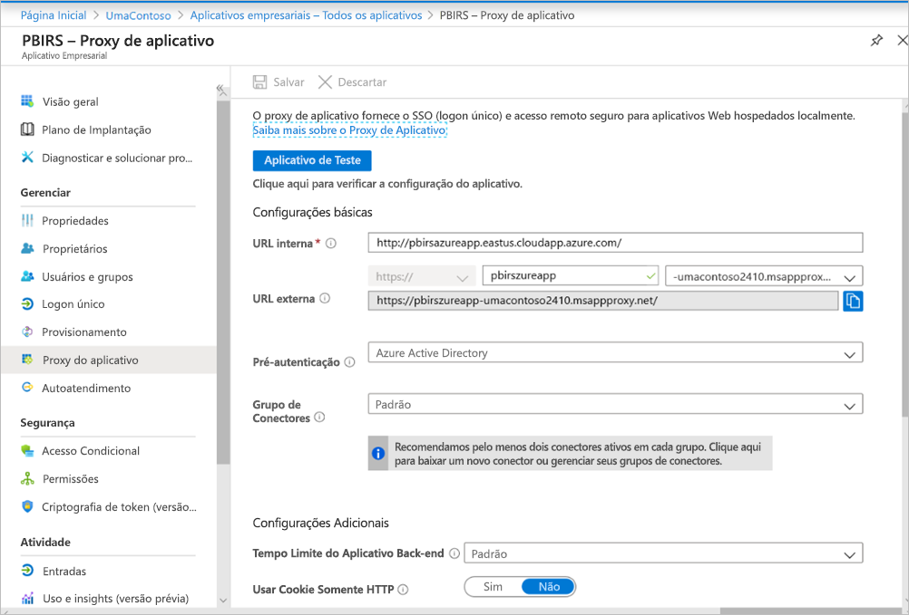

Não fizemos nenhuma alteração na seção **Configurações Adicionais**. Ela está configurada para funcionar com as opções padrão.

> [!IMPORTANT]
> Ao configurar o proxy de aplicativo, observe que a propriedade **Tempo Limite do Aplicativo de Back-end** é definida como **Padrão** (85 segundos). Se você tiver relatórios que levam mais que 85 segundos para serem executados, defina essa propriedade como **Longo** (180 segundos), que é o maior valor de tempo limite possível. Quando configurado para **Longo**, todos os relatórios precisarão ser concluídos dentro de 180 segundos ou atingirão o tempo limite e resultarão em um erro.


### <a name="configure-single-sign-on"></a>Configurar o logon único

Depois que seu aplicativo for publicado, defina as configurações de logon único com as seguintes etapas:

1. Na página de aplicativo no portal, selecione **Logon único**.
2. Para o **Modo de Logon Único**, selecione **Autenticação Integrada do Windows**.
3. Defina o **SPN do Aplicativo Interno** para o valor que você definiu anteriormente. Você pode identificar esse valor usando as etapas a seguir:

    - Tente executar um relatório ou uma conexão de teste com a fonte de dados para que um tíquete Kerberos seja criado.
    - Após a execução bem-sucedida do relatório/da conexão de teste, abra o prompt de comando e execute o comando: `klist`. No resultado, você deverá ver um tíquete com o SPN `http/`. Se for o mesmo SPN configurado com Servidor de Relatórios do Power BI, use esse SPN nesta seção.

1. Escolha a **Identidade de Logon Delegada** para que o conector use em nome de seus usuários. Para saber mais, confira [Trabalhar com diferentes identidades de nuvem e locais](https://docs.microsoft.com/azure/active-directory/manage-apps/application-proxy-configure-single-sign-on-with-kcd#working-with-different-on-premises-and-cloud-identities).

    Recomendamos usar o nome UPN. Em nosso exemplo, configuramos para funcionar com a opção **nome UPN**:

    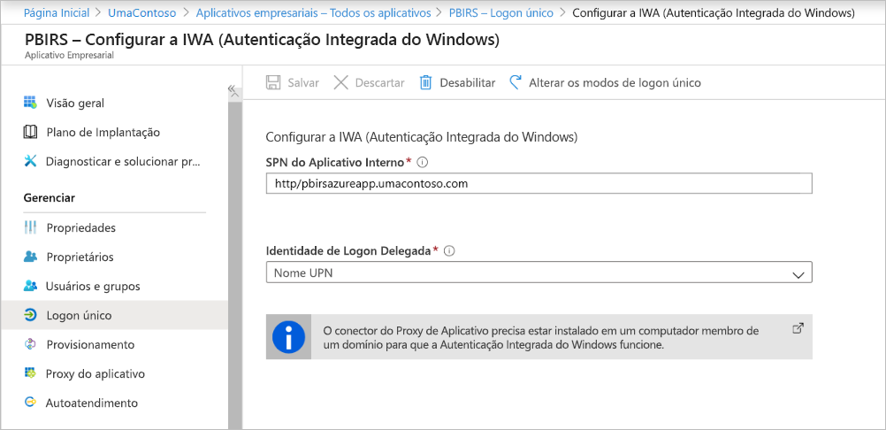

1. Clique em **Salvar** para salvar as alterações.

### <a name="finish-setting-up-your-application"></a>Concluir a configuração do aplicativo

Para concluir a configuração de seu aplicativo, vá para a seção **Usuários e grupos** e atribua usuários ao acessar este aplicativo.

1. Configure a seção **Autenticação** do registro de aplicativo para o aplicativo Servidor de Relatórios do Power BI da seguinte maneira para **URLs de Redirecionamento** e **Configurações avançadas**:

    - Crie uma nova URL de Redirecionamento e configure-a com **Tipo** = **Web** e **URI de Redirecionamento** = `https://pbirsazureapp-umacontoso2410.msappproxy.net/`
    - Na seção **Configurações Avançadas**, defina **URL de Logoff** como `https://pbirsazureapp-umacontoso2410.msappproxy.net/?Appproxy=logout`

    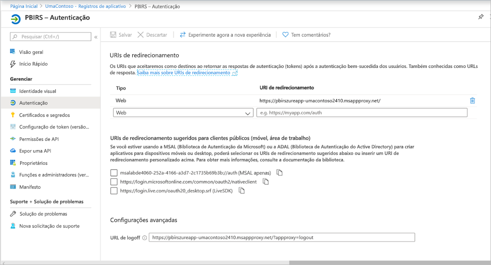

1. Continue configurando a seção **Autenticação** do registro do aplicativo para o aplicativo Servidor de Relatórios do Power BI da seguinte maneira para **Concessão implícita**, **Tipo de cliente padrão** e **Tipos de conta com suporte**:

    - Defina **Concessão implícita** como **Tokens de ID**.
    - Defina **Tipo de cliente padrão** como **Não**.
    - Defina **Tipos de conta com suporte** como **Contas somente neste diretório organizacional (UmaContoso somente – Locatário único)** .

    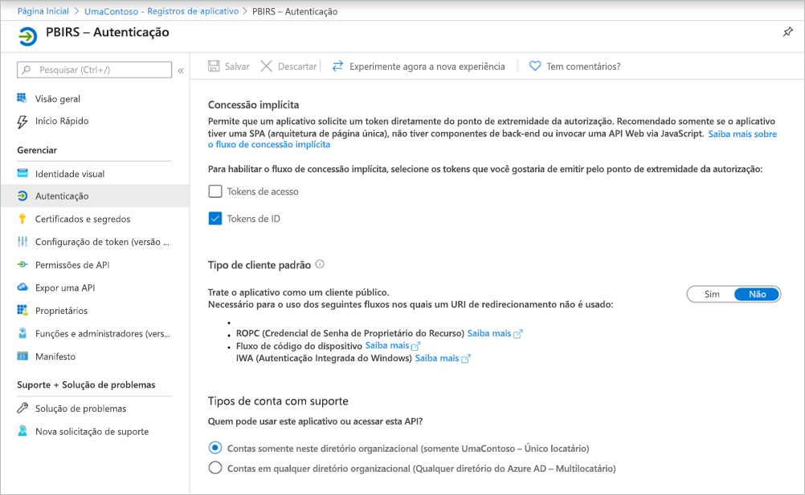

1. Após a configuração do logon único, e a URL `https://pbirsazureapp-umacontoso2410.msappproxy.net` voltar a funcionar, temos que verificar se a conta na qual fizemos logon está sincronizada com a conta à qual as permissões foram fornecidas no Servidor de Relatórios do Power BI.

1. Primeiro, precisamos configurar o domínio personalizado que pretendemos usar no logon e, depois, confirmar se foi verificado
2. Nesse caso, adquirimos um domínio chamado umacontoso.com e configuramos a zona DNS com as entradas. Você também pode tentar usar o domínio `onmicrosoft.com` e sincronizá-lo com o AD local.

    Confira o artigo [Tutorial: Mapear um nome DNS personalizado existente para o Serviço de Aplicativo do Azure](https://docs.microsoft.com/Azure/app-service/app-service-web-tutorial-custom-domain) para obter referência.

1. Depois de verificar a entrada DNS do domínio personalizado, você verá o status **Verificado** correspondente ao domínio no portal.

    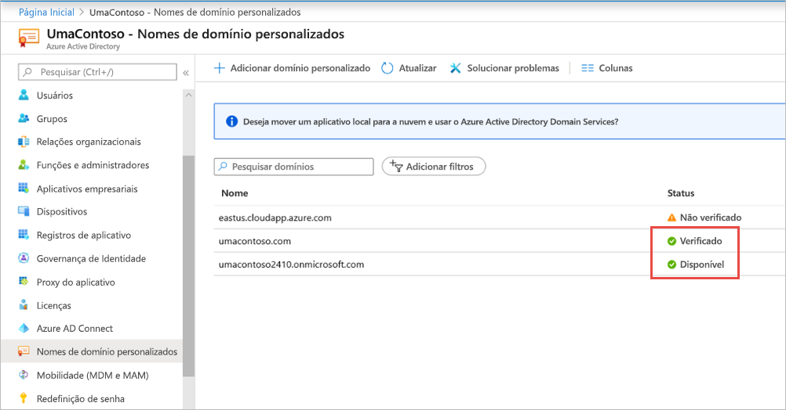

1. Instale o conector do Microsoft Azure AD no servidor do controlador de domínio e configure-o para sincronizar com o Azure AD.

    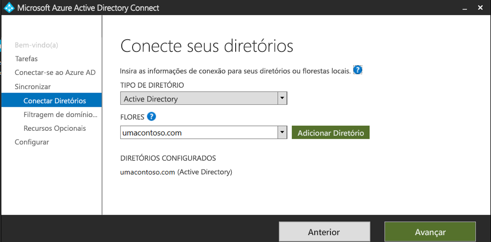

1. Após a sincronização do Azure AD com o AD local, vemos o seguinte status no portal do Azure:

    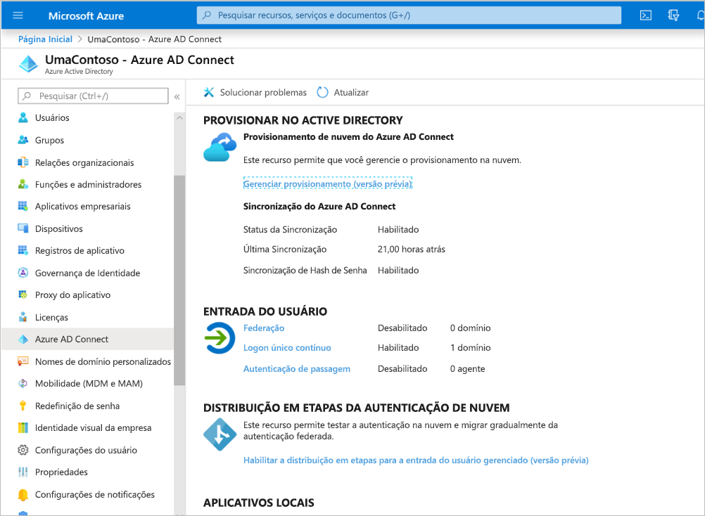

1. Além disso, com o sucesso da sincronização, abra os domínios e as relações de confiança do AD no Controlador de domínio. Clique com o botão direito em Domínio e Relações de Confiança do Active Directory > Propriedades e adicione o UPN. Em nosso ambiente, `umacontoso.com` é o domínio personalizado que adquirimos.

1. Depois de adicionar o UPN, você deve ser capaz de configurar as contas de usuário com o UPN para que a conta do Azure AD e a conta do AD local estejam conectadas e o token seja reconhecido durante a autenticação.

    O nome de domínio do AD está na lista suspensa da seção **Nome de logon do usuário** após a etapa anterior. Configure o nome de usuário e selecione o domínio na lista suspensa da seção **Nome de logon do usuário** nas propriedades de usuário do AD.

    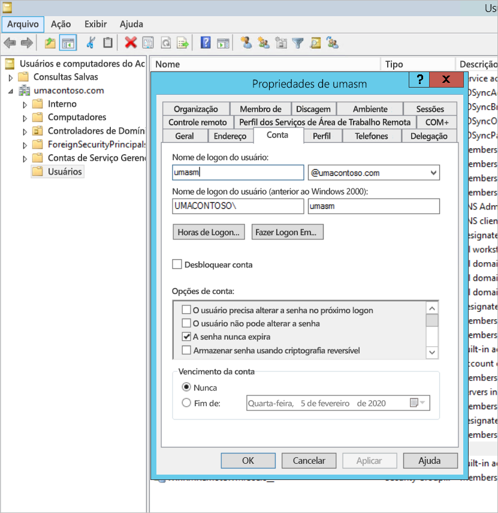

1. Após a sincronização do AD, você verá a conta do AD local no portal do Azure na seção **Usuários e Grupos** do aplicativo. A origem da conta é **Windows Server AD.**
2. Fazer logon com `umasm@umacontoso.com` será equivalente a usar as credenciais do Windows `Umacontoso\umasm`.

    As etapas anteriores serão aplicáveis se você tiver o AD local configurado e estiver planejando sincronizá-lo com o Azure AD.

    Entrada bem-sucedida depois de implementar as etapas acima:

    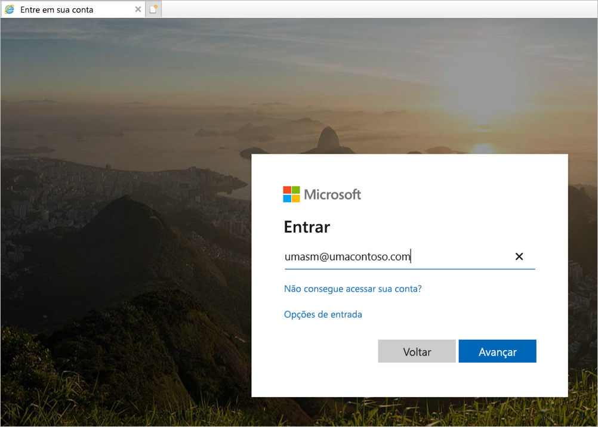

    Seguida pela exibição do portal da Web:

    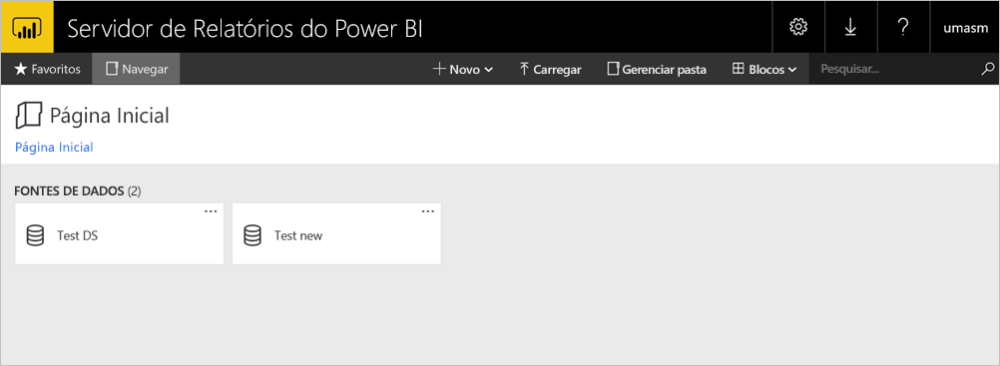

    Com uma conexão de teste bem-sucedida com a fonte de dados usando o Kerberos como autenticação:

    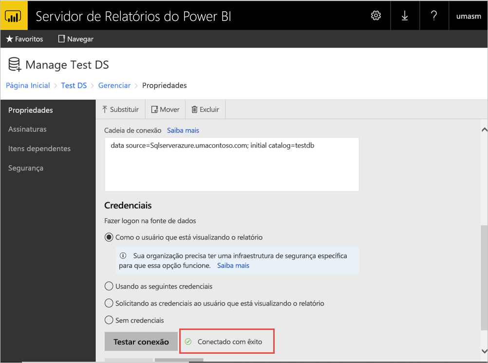

## <a name="access-from-power-bi-mobile-apps"></a>Acesso em aplicativos móveis do Power BI

### <a name="configure-the-application-registration"></a>Configurar o registro de aplicativo

Antes do aplicativo móvel do Power BI poder se conectar e acessar Servidor de Relatórios do Power BI, você deve configurar o registro de aplicativo que foi criado automaticamente para você em [Publicar por meio do Proxy de Aplicativo do Azure AD](#publish-through-azure-ad-application-proxy), anteriormente neste artigo.

1. Na página **Visão geral** do Azure Active Directory, selecione **Registros de aplicativo**.
2. Na guia **Todos os aplicativos**, pesquise o aplicativo que você criou para o Servidor de Relatórios do Power BI.
3. Selecione o aplicativo e, depois, selecione **Autenticação**.
4. Adicione os seguintes URIs de Redirecionamento com base na plataforma que você está usando.

    Ao configurar o aplicativo para Power BI Mobile **iOS**, adicione os seguintes URIs de Redirecionamento do tipo Cliente Público (Mobile e Desktop):

    - `msauth://code/mspbi-adal%3a%2f%2fcom.microsoft.powerbimobile`
    - `msauth://code/mspbi-adalms%3a%2f%2fcom.microsoft.powerbimobilems`
    - `mspbi-adal://com.microsoft.powerbimobile`
    - `mspbi-adalms://com.microsoft.powerbimobilems`

    Ao configurar o aplicativo para Power BI Mobile **Android**, adicione os seguintes URIs de Redirecionamento do tipo Cliente Público (Mobile e Desktop):

    - `urn:ietf:wg:oauth:2.0:oob`
    - `mspbi-adal://com.microsoft.powerbimobile`
    - `msauth://com.microsoft.powerbim/g79ekQEgXBL5foHfTlO2TPawrbI%3D`
    - `msauth://com.microsoft.powerbim/izba1HXNWrSmQ7ZvMXgqeZPtNEU%3D`

    Ao configurar o aplicativo para o Power BI Mobile iOS e Android, adicione o seguinte URI de Redirecionamento do tipo Cliente Público (Mobile e Desktop) à lista de URIs de Redirecionamento configurados para iOS:

    - `urn:ietf:wg:oauth:2.0:oob`

    > [!IMPORTANT]
    > É necessário adicionar os URIs de Redirecionamento para que o aplicativo funcione corretamente.

### <a name="connect-from-the-power-bi-mobile-apps"></a>Conectar dos aplicativos móveis do Power BI

1. No aplicativo móvel do Power BI, conecte-se à instância do servidor de relatórios. Para se conectar, insira a **URL Externa** do aplicativo que você publicou por meio do Proxy de Aplicativo.
2. Selecione **Conectar**. Você será direcionado à página de entrada do Azure Active Directory.
3. Insira credenciais válidas para o seu usuário e selecione **Entrar**. Você verá os elementos do seu servidor de relatórios.

## <a name="next-steps"></a>Próximas etapas

[Habilitar acesso remoto ao Power BI Mobile com o Proxy de Aplicativo do Azure AD](https://docs.microsoft.com/azure/active-directory/manage-apps/application-proxy-integrate-with-power-bi)

Mais perguntas? [Experimente perguntar à Comunidade do Power BI](https://community.powerbi.com/)

                
