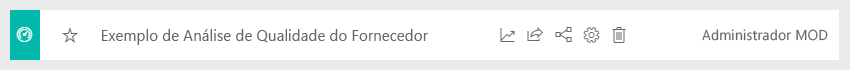
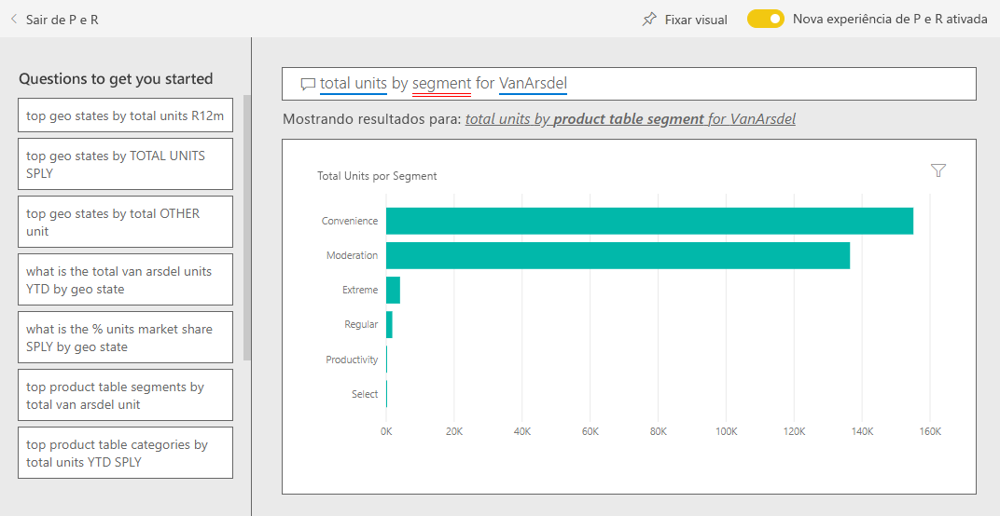
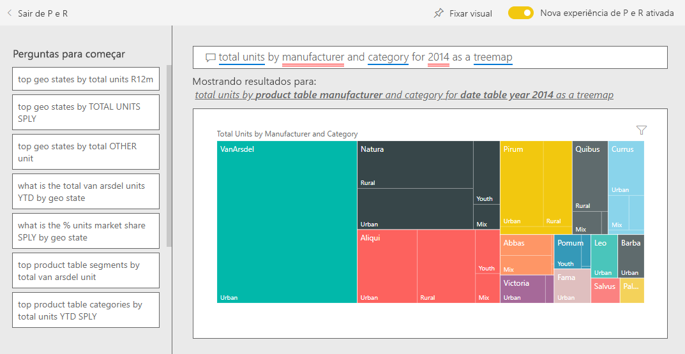

# Exemplo de Vendas e Marketing para o Power BI: Faça um tour

O exemplo de Marketing e Vendas contém um painel de controle e um relatório para uma empresa de fabricação fictícia chamada VanArsdel Ltd. O CMO (diretor executivo de marketing) da VanArsdel criou esse dashboard para ficar atento ao setor e sua participação de mercado da empresa, volume de produto, vendas e sensibilidade.

A VanArsdel tem muitos concorrentes, mas é líder do mercado em seu setor. O CMO quer aumentar a participação no mercado e descobrir as oportunidades de crescimento. Porém, por um motivo desconhecido, a participação no mercado da VanArsdel começou a cair, com uma queda significativa em junho.

Este exemplo faz parte de uma série que mostra como o Power BI pode ser usado com dados, relatórios e painéis orientados aos negócios. Ele foi criado pela [obviEnce](http://www.obvience.com/) usando dados reais, que foram mantidos anônimos. Os dados estão disponíveis em vários formatos: pacote de conteúdo, arquivo .pbix do Power BI Desktop ou pasta de trabalho do Excel. Confira [Exemplos para o Power BI](sample-datasets.md). 

Este tutorial explora o pacote de conteúdo de exemplo de Vendas e Marketing no serviço do Power BI. Como as experiências de relatório são muito semelhantes no Power BI Desktop e no serviço, você também pode acompanhar usando o arquivo de exemplo .pbix no Power BI Desktop. 

Você não precisa de uma licença do Power BI para explorar os exemplos no Power BI Desktop. Se você não tiver uma licença do Power BI Pro, poderá salvar a amostra em Meu Espaço de Trabalho no serviço do Power BI. 

## Obter o exemplo

Antes de usar o exemplo, primeiro você deve baixá-lo como um [pacote de conteúdo](#get-the-content-pack-for-this-sample), [arquivo .pbix](#get-the-pbix-file-for-this-sample) ou [pasta de trabalho do Excel](#get-the-excel-workbook-for-this-sample).

### Obter o pacote de conteúdo para este exemplo

1. Abra o serviço do Power BI (app.powerbi.com), entre e abra o workspace em que você deseja salvar o exemplo.

   Se você não tiver uma licença do Power BI Pro, poderá salvar a amostra em Meu Espaço de Trabalho.

2. No canto inferior esquerdo, selecione **Obter Dados**.
   
   
3. Na página **Obter Dados** que aparece, selecione **Exemplos**.
   
4. Selecione **Exemplo de Marketing e Vendas** e, em seguida, escolha **Conectar**.   
  
   
   
5. O Power BI importa o pacote de conteúdo e adiciona um novo dashboard, um relatório e um conjunto de dados ao seu workspace atual.
   
   
  
### Obter o arquivo. pbix para este exemplo

Como alternativa, você pode baixar o exemplo de Vendas e Marketing como um [arquivo .pbix](https://download.microsoft.com/download/9/7/6/9767913A-29DB-40CF-8944-9AC2BC940C53/Sales%20and%20Marketing%20Sample%20PBIX.pbix), que é projetado para uso com o Power BI Desktop.

### Obter a pasta de trabalho do Excel para este exemplo

Se quiser exibir a fonte de dados deste exemplo, ela também está disponível como uma [Pasta de trabalho do Excel](https://go.microsoft.com/fwlink/?LinkId=529785). A pasta de trabalho contém planilhas do Power View que você pode exibir e modificar. Para ver os dados brutos, habilite os suplementos de Análise de Dados e, em seguida, selecione **Power Pivot > Gerenciar**. Para habilitar os suplementos do Power View e do Power Pivot, confira [Explorar os exemplos do Excel no Excel](sample-datasets.md#explore-excel-samples-inside-excel) para saber mais.

## O que é nosso painel está dizendo?
Vamos começar nosso tour no painel e examinar as peças que o CMO decidiu fixar. Podemos ver informações sobre nossa participação no mercado, vendas e sensibilidade. Os dados são divididos por região, hora e concorrência.

* Os blocos de número ao longo da coluna esquerda mostram volume de vendas do setor este ano passado (50 mil), participação de mercado (32,86%), volume de vendas (16 mil), pontuação de sentimento (68) lacuna de sentimento (4) e o total de unidades vendidas (1 milhão).
* O gráfico de linhas superior (**Participação de Mercado % em Unidades vs. Participação de Mercado % em Unidades em 12 Meses Dinâmicos**) mostra como nossa participação no mercado flutua ao longo do tempo. Observe a grande queda em junho. Nossa participação R12M (12 meses dinâmicos), que estava aumentado por um tempo, agora está começando a ficar estagnada.
* Nosso maior concorrente é a Aliqui, como fica evidente no bloco de gráfico de coluna do meio (**Variação % Total de Unidades Acumuladas no Ano**).
* A maioria dos nossos negócios é na região leste e central.
* O gráfico de linha na parte inferior (**Total de Unidades para 2014**) mostra que a nossa queda em junho não é sazonal – nenhum de nossos concorrentes mostram a mesma tendência.
* Os blocos **Total de Unidades no Geral** e **Totais de Unidades Acumuladas no Ano** à direita mostram as unidades vendidas por segmento e por região/fabricante. O segmento de mercado maior para nosso setor são **Produtividade** e **Conveniência**.

## Usar P e R para aprofundar-se

Ao usar o P e R, você pode descobrir detalhes adicionais nos dados.

### Quais segmentos conduzem nossas vendas? Eles correspondem à tendência do setor?
1. Selecione o bloco **Total de Unidades no Geral por Segmento**, que abre P e R e preenche-o com a consulta, *total de unidades por segmento*.
2. Ao fim da consulta existente, adicione: *para VanArsdel*. P e R interpreta a pergunta e exibe um gráfico atualizado com a resposta. Observe que o volume do produto é grande parte dos segmentos de **Conveniência** e **Moderação**.

   
3. Nossa participação nas categorias **Moderação** e **Conveniência** é alta; esses segmentos são aqueles em que podemos concorrer.
4. Retorne ao dashboard selecionando o **Exemplo de Vendas e Marketing** no painel de navegação.

### Com o que aparece participação de mercado total para a categoria (versus região)?
1. Observe o bloco **Total de Unidades Acumuladas no Ano por Fabricante, Região**. Qual é a participação de mercado total da unidade por categoria?

   
2. Selecione a caixa de perguntas na parte superior do dashboard e digite a pergunta *total de unidades por fabricante e categoria em 2014 como um mapa de árvore*. Observe como a visualização atualiza conforme você digita a pergunta.

   
3. Para comparar as descobertas, fixe o gráfico até o painel. Observe este fato interessante: Em 2014, a VanArsdel vendeu apenas produtos na categoria **Urbana**.
4. Retornar ao dashboard.

## Relatório de Exemplo de Vendas e Marketing

Os dashboards são um ponto de entrada em relatórios. Se um bloco foi criado por meio de um relatório subjacente, a seleção desse bloco abre o relatório.

Em nosso painel, a linha **Participação de Mercado % em Unidades R12M** no gráfico **Participação de Mercado % em Unidades vs. Participação de Mercado % em Unidades em 12 Meses Dinâmica** mostra que nossa participação no mercado não está mais aumentando com o passar do tempo. Está, inclusive, diminuindo um pouco. E por que temos uma grande queda na participação do mercado em junho? 

O relatório para o exemplo de vendas e marketing tem quatro páginas.
 
### Página VanArsdel – Participação de Mercado
A página um do relatório se concentra no mercado da VanArsdel.

1. No painel, selecione o gráfico **Participação de Mercado % em Unidades vs. Participação de Mercado % em Unidades Dinâmica em 12 meses** para abrir a página **Participação de Mercado da VanArsdel** do relatório de Exemplo de Vendas e Marketing.

   

2. Examine o gráfico de colunas **Total de unidades por mês e isVanArsdel** na parte inferior do relatório. A coluna preta representa VanArsdel (nossos produtos) e a coluna verde é nossa concorrência. A queda em junho de 2014 que VanArsdel teve não foi apresentada pelos concorrentes.

3. O gráfico de barras **Volume de Categoria Total por Segmento** à direita é filtrado para mostrar os dois principais segmentos da VanArsdel. Dê uma olhada em como esse filtro foi criado:  

   a. Selecione o gráfico **Volume Total da Categorias por Segmento**.

   b. Selecione o painel **Filtros** à direita para expandi-lo.  

   c. Em **Filtros de nível Visual**, observe que o **Segmento** é filtrado para incluir somente segmentos de **Conveniência** e **Moderação**.  

   d. Modifique o filtro selecionando **Segmento** para expandi-lo e marcando **Produtividade** para adicionar esse segmento.  

4. No gráfico **Total de Unidades por Mês e isVanArsdel**, selecione **Sim** na legenda para filtrar a página por VanArsdel. No gráfico **Volume Total da Categoria por Segmento**, observe que não competimos no segmento de **Produtividade**.

5. Selecione **Sim** novamente na legenda para remover o filtro.

6. Examine o gráfico de linhas **Participação de Mercado % em Unidades e Participação de Mercado % em Unidades R12M por Mês**. Ele mostra as participações de mercado mensal e 12 meses dinâmicos. Os dados de meses dinâmicos ajudam a suavizar as flutuações mensais e mostram as tendências de longo prazo. No gráfico de barras **Volume Total da Categoria por Segmento**, selecione **Conveniência** e então **Moderação** para ver a flutuação na participação de mercado para cada segmento. Observe que o segmento de **Moderação** mostra muito mais flutuação na participação no mercado.

Ainda queremos descobrir por que a nossa participação no mercado caiu tanto em junho. Em seguida, vamos verificar a página **Análise de Sentimento** do relatório.

### Página Análise de Sentimento
A página três do relatório enfoca as opiniões do consumidor.

Tweets, Facebook, blogs e artigos todos contribuem para as opiniões do consumidor, que são mostradas nos gráficos de duas linhas no lado esquerdo da página. O gráfico **VanArsdel – Sentimento por Mês** no canto superior esquerdo mostra que o sentimentos para nossos produtos foi principalmente neutro até fevereiro. Em seguida, uma grande queda iniciada em fevereiro e aumentada em junho. O que aconteceu para causar a queda nessa sensibilidade? 

Vamos examinar fontes externas. Em fevereiro, vários artigos e postagens do blog o serviço ao cliente da VanArsdel como o pior do setor. Essa mídia ruim tem uma correlação direta no sentimento do cliente e nas vendas. A VanArsdel trabalhou muito para melhorar o atendimento ao cliente e os clientes e o setor observou. Em julho, o sentimento positivo começou a aumentar, em seguida, ficou sempre em alta nos anos 60. Esse aumento no sentimento é refletido nos gráficos de **Total de Unidades por Mês** nas páginas um e dois do relatório. Talvez isso explica parcialmente nossa queda de participação de mercado para junho?

A lacuna de sentimentos pode ser outra área a ser explorada. Quais distritos têm a maior lacuna de sentimentos, como a gerência pode aproveitar isso e como pode replicar em outros distritos?

### Página Análise de Tendência de Categoria Acumulada no Ano
A página dois do relatório enfoca a tendência de categoria acumulada no ano.

Observe o seguintes detalhes:
* A VanArsdel é a maior empresa nessa categoria e seus maiores concorrentes são a Natura, a Aliqui e a Pirium. Vamos manter nossos olhos neles.
* A Aliqui está crescendo, mas o volume de produto em comparada a nós ainda está baixo.
* O Treemap mostra a VanArsdel em verde. Na região leste, os clientes preferem nossos concorrentes, mas, na região central, estamos nos saindo bem. Nossa participação na região leste é a mais baixa.
* A geografia tem um impacto em unidades vendidas. A região leste é a dominante para a maioria dos fabricantes e VanArsdel tem uma forte presença na região Central.
* No gráfico **IVA % do Total de Unidades Acumuladas no ANO por Mês e Fabricante** no canto inferior direito, observe que temos uma variação positiva, o que é um bom sinal. Estamos melhor do que o ano passado, mas nossa concorrente Aliqui também está.

### Página Oportunidades de Crescimento
A página quatro do relatório concentra-se em análise de produto.

Observe o seguintes detalhes:
* O gráfico **Total de Unidades por Segmento** no canto inferior esquerdo mostra todos os segmentos de categoria, exceto pelos dois segmentos mais fortes da VanArsdel. Selecione cada um dos segmentos, um por vez, para identificar possíveis áreas de expansão para a VanArsdel. 
* Observe que os segmentos **Extremo** e **Produtividade** estão crescendo mais rapidamente do que outros. No entanto, não competimos nesses segmentos. Se quisermos migrar para esses segmentos, poderemos usar nossos dados para ver quais segmentos são populares em quais regiões. É possível investigar questões como qual região está crescendo mais rapidamente e quem seria o principal concorrente no segmento.
* Lembra-se da queda na nossa participação no mercado em junho? Junho é um mês significativo para o segmento de **Produtividade**, um segmento em que não competimos no todo. Esse detalhe poderia explicar a queda na nossa participação no mercado em junho.

Filtrando as visualizações por VanArsdel, por segmento, por mês e por região, é possível descobrir as oportunidades de crescimento para VanArsdel.

## Próximas etapas: Conecte-se aos seus dados
Esse ambiente é seguro para teste, pois você pode optar por não salvar as alterações. Mas se você salvá-las, sempre é possível selecionar **Obter Dados** para ter uma nova cópia deste exemplo.

Esperamos que este tour tenha mostrado como os painéis, P e R e relatórios do Power BI podem fornecer informações sobre os dados de recursos humanos. Agora é sua vez – conecte-se aos seus próprios dados. Com o Power BI, é possível se conectar a uma grande variedade de fontes de dados. Para saber mais, confira [Introdução ao serviço do Power BI](service-get-started.md).
