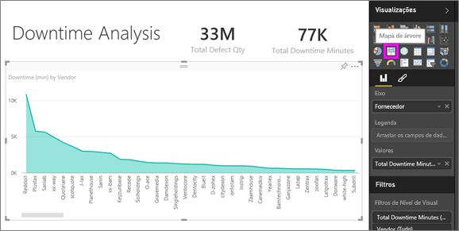
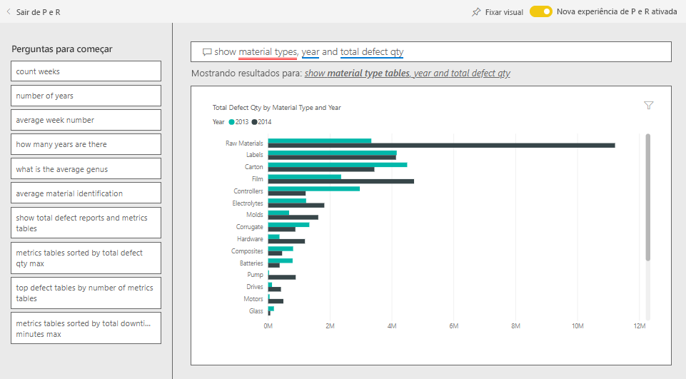

# Análise de Varejo de fornecedor para o Power BI: Faça um tour

Este dashboard de exemplo do setor e o relatório subjacente enfocam um dos desafios típicos da cadeia de fornecedores: a análise de qualidade do fornecedor. Duas métricas principais estão envolvidas na análise: o número total de defeitos e o tempo de inatividade total que causou esses defeitos. 

Este exemplo tem dois objetivos principais:

* Entender quem são os melhores e os piores fornecedores, com respeito à qualidade.
* Identificar qual fábrica realiza um trabalho melhor encontrando e rejeitando os defeitos para reduzir o tempo de inatividade.

Este exemplo faz parte de uma série que mostra como o Power BI pode ser usado com dados, relatórios e painéis orientados aos negócios. Ele foi criado pela [obviEnce](http://www.obvience.com/) usando dados reais, que foram mantidos anônimos. Os dados estão disponíveis em vários formatos: pacote de conteúdo, arquivo .pbix do Power BI Desktop ou pasta de trabalho do Excel. Confira [Exemplos para o Power BI](sample-datasets.md). 

Este tutorial explora o pacote de conteúdo de exemplo de Análise de Qualidade do Fornecedor no serviço do Power BI. Como as experiências de relatório são muito semelhantes no Power BI Desktop e no serviço, você também pode acompanhar usando o arquivo de exemplo .pbix no Power BI Desktop. 

Você não precisa de uma licença do Power BI para explorar os exemplos no Power BI Desktop. Se você não tiver uma licença do Power BI Pro, poderá salvar a amostra em Meu Espaço de Trabalho no serviço do Power BI. 

## Obter o exemplo

Antes de usar o exemplo, primeiro você deve baixá-lo como um [pacote de conteúdo](#get-the-content-pack-for-this-sample), [arquivo .pbix](#get-the-pbix-file-for-this-sample) ou [pasta de trabalho do Excel](#get-the-excel-workbook-for-this-sample).

### Obter o pacote de conteúdo para este exemplo

1. Abra o serviço do Power BI (app.powerbi.com), entre e abra o workspace em que você deseja salvar o exemplo.

   Se você não tiver uma licença do Power BI Pro, poderá salvar a amostra em Meu Espaço de Trabalho.

2. No canto inferior esquerdo, selecione **Obter Dados**.
   
   
3. Na página **Obter Dados** que aparece, selecione **Exemplos**.
   
4. Selecione o **exemplo de Análise da Qualidade do Fornecedor** e, em seguida, escolha **Conectar**.  
   
   

5. O Power BI importa o pacote de conteúdo e adiciona um novo dashboard, um relatório e um conjunto de dados ao seu workspace atual.
   
   
  
### Obter o arquivo. pbix para este exemplo

Como alternativa, você pode baixar o exemplo de Análise de Qualidade do Fornecedor como um [arquivo .pbix](http://download.microsoft.com/download/8/C/6/8C661638-C102-4C04-992E-9EA56A5D319B/Supplier-Quality-Analysis-Sample-PBIX.pbix), que foi projetado para uso com o Power BI Desktop.

### Obter a pasta de trabalho do Excel para este exemplo

Se quiser exibir a fonte de dados deste exemplo, ela também está disponível como uma [Pasta de trabalho do Excel](http://go.microsoft.com/fwlink/?LinkId=529779). A pasta de trabalho contém planilhas do Power View que você pode exibir e modificar. Para ver os dados brutos, habilite os suplementos de Análise de Dados e, em seguida, selecione **Power Pivot > Gerenciar**. Para habilitar os suplementos Power View e Power Pivot, confira [Dar uma olhada nos exemplos do Excel dentro do próprio Excel](sample-datasets.md#optional-take-a-look-at-the-excel-samples-from-inside-excel-itself) para obter detalhes.

## Tempo de inatividade causado por materiais com defeito
Vamos analisar o tempo de inatividade causado por material defeituoso e ver quais fornecedores são responsáveis.  

1. No painel, selecione o bloco **Quantidade Total de Falhas** ou o bloco **Total de minutos de inatividade**.

     

   O relatório "Exemplo de análise de qualidade do fornecedor" abre a página **Análise de Tempo de Inatividade**.

   Observe que temos 33 milhões de peças defeituosas, causando um tempo de inatividade total de 77 mil minutos. Embora alguns materiais tenham menos peças com defeito, eles podem causar atrasos, o que resulta em mais tempo de inatividade. Vamos explorá-los na página do relatório.  
2. Se analisarmos linha **Total de minutos de inatividade** no gráfico de combinação **Defeitos e tempo de inatividade (min) por tipo de Material**, poderemos ver materiais corrugados que causam a maior tempo de inatividade.  
3. Selecione a **Corrugado** para ver quais fábrica são mais afetadas por essa falha e qual fornecedor é responsável.  

     
4. No mapa **Tempo de Inatividade (min) por Fábrica**, selecione fábricas individuais em turnos para ver quais fornecedores ou material é responsável por tempo de inatividade nessa fábrica.

### Quais são os piores fornecedores?
 Queremos localizar os oito piores fornecedores e determinar qual é o percentual do tempo de inatividade que eles são responsáveis. Podemos fazer isso alterando o gráfico de área **Tempo de inatividade (min) por fornecedor** para um mapa de árvore.  

1. Na página **Análise de Tempo de Inatividade** do relatório, selecione **Editar relatório** no canto superior esquerdo.  
2. Selecione o gráfico de área **Tempo de Inatividade (min) por Fornecedor** e, no painel **Visualizações**, selecione o ícone **Mapa de árvore**.  

     

    O mapa de árvore automaticamente define o campo **Fornecedor** como o **Grupo**.  

      

   Nesse mapa de árvore, podemos ver quais são os oito principais fornecedores à esquerda do mapa de árvore. Também é possível observar que se responsabilizam por cerca de 50% de todos os minutos de inatividade.  
3. Selecione **Exemplo de Análise da Qualidade do Fornecedor** na barra de navegação superior para voltar ao dashboard.

### Comparando fábricas
Agora vamos explorar quais fábricas fazem um trabalho de melhor gerenciamento de material com defeito, resultando em menor tempo de inatividade.  

1. No dashboard, selecione o título do bloco do mapa **Relatórios de Total de Falhas por Fábrica, Tipo de Falha**.      

     

   O relatório abre a página **Análise de Qualidade do Fornecedor**.  

2. Na legenda de **Relatórios do Total de Falhas por Fábrica e Tipo de Falha**, selecione o círculo **Impacto**.  

      

    Observe no gráfico de bolhas que **Logística** é a categoria mais problemática. É a maior em termos de quantidade total de falhas, relatórios de falha e tempo de inatividade em minutos. Vamos explorar mais essa categoria.  
3. Selecione a bolha de **Logística** no gráfico de bolhas e observa as fábricas em Springfield e Naperville, IL. Naperville parece fazer um trabalho melhor de gerenciamento de fornecimentos com defeitos, uma vez tem um número alto de rejeição e alguns impactos, em comparação com o grande número de impactos de Springfield.  

     
4. Selecione **Exemplo de Análise da Qualidade do Fornecedor** na barra de navegação superior para voltar ao dashboard.

## Que tipo de material é melhor gerenciado?
O melhor tipo material gerenciado é aquele com o menor tempo de inatividade ou nenhum impacto, independentemente da quantidade de defeito.

1. No painel, examine o bloco **Quantidade de Defeito Total pelo Tipo de Material, Tipo de Defeito**.

   

   Observe que, embora o tipo de material **Matérias-Primas** tenha muitos defeitos no total, a maioria desses defeitos é rejeitada ou não tem impacto.

   Vamos verificar se esse tipo de material não causa muito tempo de inatividade, apesar da quantidade alta de falhas.

2. No painel, examine o bloco **Quantidade de Defeito Total, Total de Minutos de Inatividade por tipo de Material**.

   

   As matérias-primas parecem ser bem gerenciadas; embora tenham mais defeitos, têm menos tempo de inatividade em minutos no total.

### Comparar defeitos em tempo de inatividade por ano
1. Selecione o bloco **Relatório do Total de Falhas por Fábrica, Tipo de Falha** para abrir o relatório para a página **Análise de Qualidade de Fornecedor**.
2. No gráfico **Quantidade Total de Falhas por Mês e Ano**, observe que a quantidade de falhas é maior em 2014 do que em 2013.  

      
3. Mais defeitos se traduz em mais tempo de inatividade? Faça perguntas na caixa de P e R para descobrir.  
4. Selecione **Exemplo de Análise da Qualidade do Fornecedor** na barra de navegação superior para voltar ao dashboard.  
5. Como sabemos que as matérias-primas têm o maior número de defeitos, na caixa pergunta, digite: *mostrar tipos de material, ano e quantidade total de falhas*.  

    Havia muitos mais defeitos de matérias-primas em 2014 que em 2013.  

      
6. Em seguida, altere a pergunta para: *mostrar tipos de material, ano e total de **minutos de tempo de inatividade***.  

   

   Observe que o tempo de inatividade para matérias-primas era quase o mesmo em 2013 e 2014, mesmo que houvesse muitos mais defeitos de matérias-primas do que em 2014. Parece que mais defeitos para matérias-primas em 2014 não levaram a muito mais tempo de inatividade para matérias-primas em 2014.

### Compare defeitos em tempo de inatividade mês a mês
Vejamos outro bloco de painel relacionado à quantidade total de defeito.  

1. Selecione **Sair de P e R** no canto superior esquerdo para retornar ao painel.  

    Examine mais detalhadamente o bloco **Quantidade Total de Falhas por Mês, Ano**. Ele mostra que o primeiro semestre de 2014 tinha um número semelhante de defeitos que 2013, mas na segunda metade de 2014, o número de defeitos aumentou significativamente.  

      

    Vamos ver se esse aumento na quantidade de defeito levou a um aumento igual em minutos do tempo de inatividade.  
2. Na caixa de pergunta, digite *total de minutos de tempo de inatividade por mês e ano como um gráfico de linha*.  

   

   Além de um salto no tempo de inatividade em minutos durante junho e outubro, o número de defeitos não resultou em um tempo de inatividade significantemente maior. Esse resultado mostra que estamos gerenciando bem os defeitos.  
3. Para fixar o gráfico para o painel de controle, selecione o ícone de alfinete  acima da caixa de pergunta.  
4. Para explorar os meses de exceções, confira os minutos de tempo de inatividade durante outubro por tipo de material, introduzir local, categoria e assim por diante, fazendo perguntas como *minutos de tempo de inatividade total em outubro pela fábrica*. 
5. Selecione **Sair de P e R** no canto superior esquerdo para retornar ao painel.

## Próximas etapas: Conecte-se aos seus dados
Esse ambiente é seguro para teste, pois você pode optar por não salvar as alterações. Mas se você salvá-las, sempre é possível selecionar **Obter Dados** para ter uma nova cópia deste exemplo.

Esperamos que este tour tenha mostrado como os painéis, P e R e relatórios do Power BI podem fornecer informações sobre os dados de exemplo. Agora é sua vez – conecte-se aos seus próprios dados. Com o Power BI, é possível se conectar a uma grande variedade de fontes de dados. Para saber mais, confira [Introdução ao serviço do Power BI](service-get-started.md).
