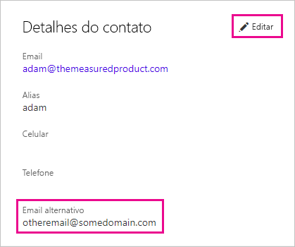

# <a name="use-an-alternate-email-address"></a>Usar um endereço de email alternativo

Quando você se inscreve no Power BI, pode fornecer um endereço de email. Por padrão, o Power BI usa esse endereço para enviar atualizações sobre a atividade no serviço. Por exemplo, quando alguém envia um convite de compartilhamento, ele vai para esse endereço.

Em alguns casos, talvez você queira que esses emails sejam entregues em um endereço de email alternativo, e não naquele com o qual você se inscreveu. Este artigo explica como especificar um endereço alternativo no Office 365 e no PowerShell. O artigo também explica como o Azure AD (Azure Active Directory) resolve um endereço de email.

> [!NOTE]
> Especificar um endereço alternativo não afeta o endereço de email usado pelo Power BI para atualizações de serviço, boletins informativos e outras comunicações promocionais. Essas comunicações são sempre enviadas ao endereço de email usado na inscrição no Power BI.

## <a name="use-office-365"></a>Usar o Office 365

Para especificar um endereço alternativo no Office 365, execute estas etapas.

1. Abra a [página de informações pessoais do Office 365](https://portal.office.com/account/#personalinfo). Se o aplicativo solicitar, entre com o endereço de email e senha que você usa no Power BI.

1. No menu à esquerda, selecione **Informações pessoais**.

1. Na seção **Detalhes de contato**, selecione **Editar**.

    Se você não puder editar seus detalhes, significa que seu administrador do Office 365 gerencia seu endereço de email. Entre em contato com o administrador para atualizar seu endereço de email.

    

1. No campo **Email alternativo**, insira o endereço de email que você gostaria que o Office 365 usasse para as atualizações do Power BI.

## <a name="use-powershell"></a>Usar o PowerShell

Para especificar um endereço alternativo no PowerShell, use o comando [Set-AzureADUser](/powershell/module/azuread/set-azureaduser/).

```powershell
Set-AzureADUser -ObjectId john@contoso.com -OtherMails "otheremail@somedomain.com"
```

## <a name="email-address-resolution-in-azure-ad"></a>Resolução de endereço de email no Azure AD

Ao capturar um token de inserção do Azure AD para o Power BI, é possível usar um destes três tipos diferentes de endereço de email:

* O endereço de email principal associado a uma conta do Azure AD do usuário

* O endereço de email UPN (UserPrincipalName)

* O atributo de matriz *outro endereço de email*

O Power BI seleciona qual email usar com base na seguinte sequência:

1. Se o atributo de email no objeto de usuário do Azure AD estiver presente, o Power BI usará esse atributo de email para o endereço de email.

1. Se o email UPN *não* for um endereço de email do domínio **\*.onmicrosoft.com** (as informações após o símbolo "\@"), o Power BI usará esse atributo de email para o endereço de email.

1. Se há um atributo de matriz *outro endereço de email* no objeto de usuário do Azure AD, o Power BI usa o primeiro email dessa lista (já que pode haver uma lista de emails nesse atributo).

1. Se nenhuma das condições acima ocorrer, o Power BI usará o endereço UPN.

Mais perguntas? [Experimente a Comunidade do Power BI](https://community.powerbi.com/)