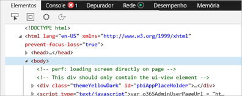
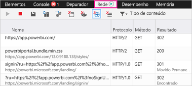
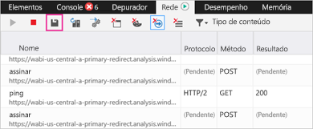

# Capturar informações adicionais de diagnóstico para o Power BI

Este artigo fornece instruções para coletar manualmente informações adicionais de diagnóstico do cliente Web do Power BI.

1. Navegue até o [Power BI](https://app.powerbi.com) com o Microsoft Edge ou o Internet Explorer.

1. Pressione **F12** para abrir as Ferramentas de Desenvolvedor do Microsoft Edge.

   

1. Selecione a guia **Rede**. Ele listará o tráfego que já foi capturado.

   

    Você pode:

    * Navegue na janela e reproduza qualquer problema que possa estar ocorrendo.

    * Oculte e exiba a janela Ferramentas de Desenvolvedor a qualquer momento durante a sessão pressionando F12.

1. Para interromper sessão de criação de perfil, clique no quadrado vermelho na guia **Rede** da área de ferramentas do desenvolvedor.

   

1. Escolha o ícone de disquete para exportar os dados como um arquivo HTTP Archive (HAR).

   

1. Forneça um nome de arquivo e salve o arquivo HAR.

    O arquivo HAR contém todas as informações sobre solicitações de rede entre a janela do navegador e o Power BI, incluindo:

    * As IDs de atividade de cada solicitação.

    * O carimbo de data/hora preciso de cada solicitação.

    * Quaisquer informações de erro retornadas para o cliente.

    Este rastreamento também conterá os dados usados para preencher os elementos visuais mostrados na tela.

1. Você pode fornecer o arquivo HAR para dar suporte à análise.

Mais perguntas? [Experimente perguntar à Comunidade do Power BI](https://community.powerbi.com/)
