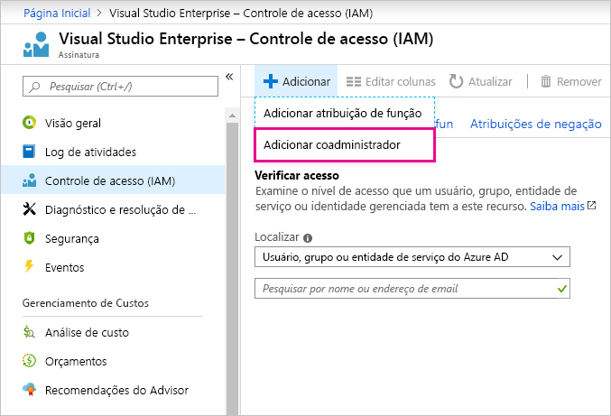

# Usando a mesma conta para Power BI e o Azure

Se você for um usuário do Power BI e do Azure, convém usar o mesmo logon para ambos os serviços para que nãos seja preciso digitar sua senha duas vezes.

O Power BI conecta você com sua conta institucional, associada ao seu endereço de email de trabalho ou da escola.  O Azure conecta você com uma conta da Microsoft ou conta organizacional.

Se você deseja usar o mesmo logon para o Azure e o Power BI, certifique-se de entrar no Azure com sua conta organizacional.

**E se eu já tiver entrado no Azure com minha conta da Microsoft?**

Você pode adicionar sua conta organizacional como um coadministrador no Azure seguindo estas etapas:

1. Entre no [portal do Azure](http://portal.azure.com/). Se você for um usuário em vários diretórios do Azure, selecione **Assinaturas** e filtre para exibir somente o diretório e as assinaturas que deseja editar.

1. No painel de navegação, selecione **Controle de acesso (IAM)** e, em seguida, selecione **Adicionar** \> **Adicionar coadministrador**.

    

1. Digite o endereço de email associado à sua conta organizacional e selecione **Adicionar**.

1. Da próxima vez que você entrar no portal do Azure, use seu endereço de email organizacional.

Mais perguntas? [Experimente a Comunidade do Power BI](http://community.powerbi.com/)
