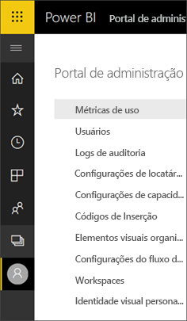
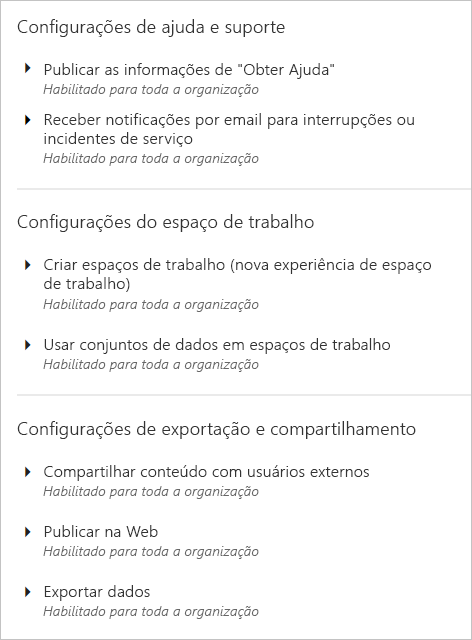
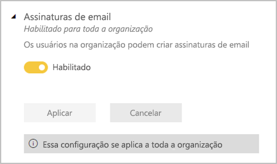
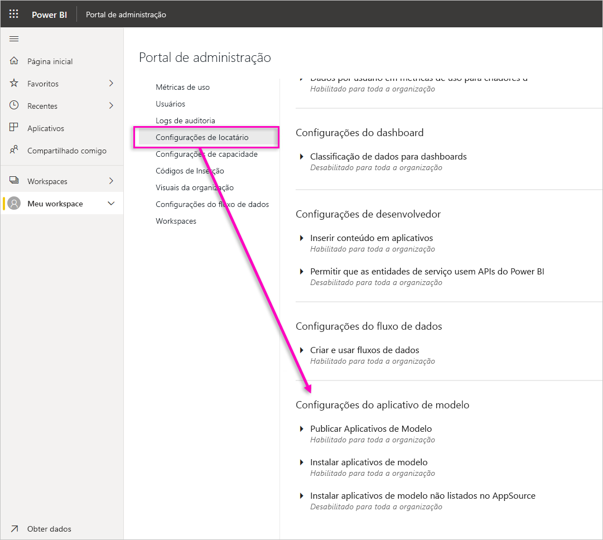
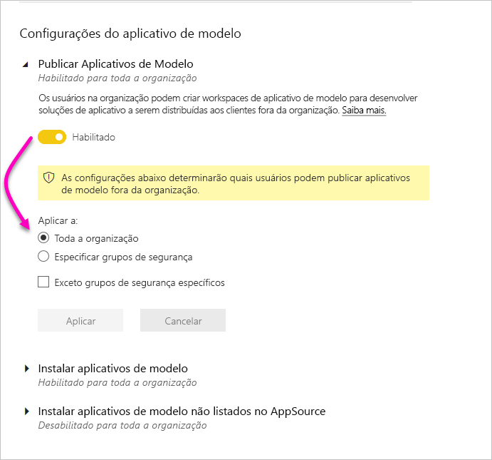

# Como administrar o Power BI no portal de administração

O portal de administração permite que você gerencie um *locatário* do Power BI para sua organização. O portal inclui itens como métricas de uso, acesso ao centro de administração do Microsoft 365 e configurações.

O portal de administração completo é acessível a todos os usuários que sejam administradores globais no Office 365 ou que detenham a função de administrador de serviços do Power BI. Se você não estiver em uma dessas funções, verá apenas **Configurações de capacidade** no portal. Para obter mais informações sobre a função de administrador de serviços do Power BI, consulte [Noções básicas sobre a função de administrador do Power BI](service-admin-role.md).

## Como obter o portal de administração

Sua conta precisa ser marcada como **Administrador Global**, no Office 365 ou no Azure AD, ou ter recebido a função Administrador de serviços do Power BI para obter acesso ao portal de administração do Power BI. Para obter mais informações sobre a função de administrador de serviços do Power BI, consulte [Noções básicas sobre a função de administrador do Power BI](service-admin-role.md). Para acessar o portal de administração do Power BI, faça o seguinte:

1. Selecione a engrenagem de configurações na parte superior direita do serviço do Power BI.

1. Selecione **portal de Administração**.

    

Há nove guias no portal. O restante deste artigo fornece informações sobre cada uma dessas guias.

* [Métricas de uso](#usage-metrics)
* [Usuários](#users)
* [Logs de auditoria](#audit-logs)
* [Configurações de locatário](#tenant-settings)
* [Configurações de capacidade](#capacity-settings)
* [Códigos de inserção](#embed-codes)
* [Elementos visuais da organização](#organizational-visuals)
* [Armazenamento de fluxo de dados (versão prévia)](#dataflowStorage)
* [Workspaces](#workspaces)
* [Identidade visual personalizada](#custom-branding)

## Métricas de uso

As **Métricas de uso** permitem que você monitore o uso do Power BI para sua organização. Ele também fornece a capacidade de ver quais usuários e grupos são mais ativos no Power BI para sua organização. 

> [!NOTE]
> Na primeira vez que acessar o dashboard ou depois de visitar novamente após um longo período de não exibição do dashboard, você provavelmente encontrará uma tela de carregamento enquanto carregamos o dashboard.

Quando o painel for carregado, você verá duas seções de blocos. A primeira inclui os dados de uso de usuários individuais e a segunda seção tem informações semelhantes para os grupos em sua organização.

Aqui está um detalhamento do que você verá em cada bloco:

* Contagem distinta de todos os painéis, relatórios e conjuntos de dados no workspace do usuário.
  
    

* Painel mais consumido pelo número de usuários que podem acessá-lo. Por exemplo, se você tem um painel que compartilhou com três usuários e também o adicionou a um pacote de conteúdo com dois usuários diferentes conectados a ele, sua contagem é de 6 (1 + 3 + 2).
  
    

* Os conteúdo mais populares aos quais os usuários estão conectados. Isso pode ser qualquer coisa que os usuários podem acessar através do processo Obter Dados, portanto, pacotes de conteúdo SaaS, pacotes de conteúdo organizacional, arquivos ou bancos de dados de conteúdo.
  
    

* Uma exibição de seus principais usuários sobre quantos painéis eles têm, incluindo painéis criados por eles mesmos e painéis compartilhados com eles.
  
    

* Uma exibição de seus principais usuários com base em quantos relatórios eles têm.
  
    

A segunda seção mostra o mesmo tipo de informação, mas com base em grupos. Isso permite que você veja quais grupos em sua organização são mais ativos e os tipos de conteúdos que estão consumindo.

Com essas informações, você fica sabendo como as pessoas estão usando o Power BI em toda a organização e consegue reconhecer esses usuários e grupos que são muito ativos na organização.

## Controlar métricas de uso

Os relatórios de métrica de uso são um recurso que o administrador do Power BI ou do Office 365 pode ativar ou desativar. Os administradores têm controle granular sobre quais usuários dispõem de acesso às métricas de uso. Eles estão **ativados** por padrão para todos os usuários na organização.

Os administradores também podem determinar se os criadores de conteúdo podem ver dados por usuário nas métricas de uso. 

Confira [Monitorar as métricas de uso dos painéis e relatórios do Power BI](service-usage-metrics.md) para obter detalhes sobre os próprios relatórios.

### Métricas de uso para criadores de conteúdo

1. No portal de Administração, selecione **Configurações do locatário** > **Métrica de uso para criadores de conteúdo**.

    

1. Habilitar (ou desabilitar) métrica de uso > **Aplicar**.

    

### Dados por usuário nas métricas de uso

Por padrão, os dados por usuário estão habilitados para as métricas de uso e as informações de conta do consumidor do conteúdo estão incluídas no relatório de métricas. Se você não quiser incluir essa informação para alguns ou todos os usuários, desabilite o recurso para grupos de segurança especificados ou para toda a organização. Em seguida, as informações da conta serão mostradas no relatório como *Sem nome*.

### Excluir todo o conteúdo de métricas de uso existente

Ao desabilitar as métricas de uso para toda a organização, os administradores também podem escolher uma ou ambas as opções para:

- **Excluir todo o conteúdo existente de métricas de uso** para excluir todos os relatórios e blocos de painéis existentes que foram criados usando os relatórios de métricas de uso e os conjuntos de dados. Esta opção remove todo o acesso aos dados de métricas de uso para todos os usuários da organização que já podem estar usando esses dados. 
- **Excluir todos os dados existentes por usuário no conteúdo atual das métricas de uso** Essa opção remove todo o acesso a dados por usuário de todos os usuários da organização que já podem estar usando-o. 

Tenha cuidado, pois a exclusão do uso existente e do conteúdo de métricas por usuário é irreversível.

## Usuários

O gerenciamento de administradores, grupos e usuários do Power BI é feito no Centro de administração do Microsoft 365. A guia **Usuários** fornece um link para o centro de administração para seu locatário.

## Logs de auditoria

O gerenciamento dos logs de auditoria do Power BI é feito na Central de Segurança e Conformidade do Office 365. A guia **Logs de auditoria** fornece um link para a Central de Segurança e Conformidade para seu locatário. [Saiba mais](service-admin-auditing.md)

Para usar os logs de auditoria, verifique se a configuração [**Criar logs de auditoria para conformidade e auditoria de atividade interna**](#create-audit-logs-for-internal-activity-auditing-and-compliance) está habilitada.

## Configurações de locatário

A guia **Configurações de locatário** possibilita um controle refinado sobre os recursos disponibilizados para sua organização. Se você tiver dúvidas relacionadas a dados confidenciais, talvez alguns dos nossos recursos não sejam adequados para sua organização, ou talvez você queira apenas que um recurso em particular esteja disponível para um grupo específico.

A imagem a seguir mostra as diversas configurações na guia **Configurações de locatário**.

> [!NOTE]
> Pode levar até 10 minutos para que uma alteração de configuração entre em vigor para todos em seu locatário.

As configurações podem ter três estados:

* **Desabilitado para toda a organização**: ninguém na sua organização pode usar esse recurso.

    

* **Habilitado para toda a organização**: todos em sua organização podem usar esse recurso.

    

* **Habilitado para um subconjunto da organização**: um subconjunto específico de usuários ou grupos em sua organização pode usar o recurso.

    Você pode habilitar o recurso para toda a organização, exceto para um grupo específico de usuários.

    

    Também é possível habilitar o recurso apenas para um grupo específico de usuários e também desabilitá-lo para um grupo de usuários. O uso dessa abordagem garante que determinados usuários não tenham acesso ao recurso mesmo que estejam no grupo permitido.

    

As próximas seções fornecem uma visão geral dos diferentes tipos de configurações de locatário.

## Configurações de ajuda e suporte

### Publicar as informações "Obter ajuda"

Os usuários da organização podem acessar os recursos internos de ajuda e suporte no menu de ajuda do Power BI. Especificamente, esses parâmetros alteram o comportamento dos itens do menu Saiba mais, Comunidade e Obter ajuda.

Além disso, especificando uma URL para solicitações de licenciamento, você personaliza a URL de destino do botão **Atualizar conta**. Os usuários sem uma licença do Power BI Pro veem esse botão na caixa de diálogo **Atualizar para o Power BI Pro**, bem como na página **Gerenciar armazenamento pessoal**. Além disso, o Power BI não oferece mais o botão **Experimente o Pro gratuitamente** nessa caixa de diálogo ou na página de armazenamento. Isso garante que o Power BI oriente os usuários de maneira confiável pelos processos definidos em sua organização por meio da solução de gerenciamento de licenças.

### Receber notificações por email para interrupções ou incidentes de serviço

Os grupos de segurança habilitados para email receberão notificações por email se esse locatário for afetado por uma interrupção ou um incidente de serviço. Saiba mais sobre as [notificações de interrupção de serviço](service-interruption-notifications.md).

## Configurações do workspace

### Criar workspaces

Os administradores usam a configuração **Criar workspaces** para indicar quais usuários na organização podem criar workspaces para colaborar em dashboards, relatórios e outros tipos de conteúdo. Saiba mais sobre [workspaces](service-create-the-new-workspaces.md).

O portal de administração tem outra seção de configurações sobre os workspaces em seu locatário. Nesta seção, é possível classificar e filtrar a lista de workspaces e exibir os detalhes de cada um deles. Confira [Workspaces](#workspaces) para obter detalhes.

No portal de administração, você também controla quais usuários têm permissões para distribuir aplicativos para a organização. Confira [Publicar pacotes de conteúdo e aplicativos para toda a organização](#publish-content-packs-and-apps-to-the-entire-organization).

## Configurações de exportação e compartilhamento

### Compartilhar conteúdo com usuários externos

Os usuários na organização podem compartilhar dashboards, relatórios e aplicativos com usuários fora da organização. Aprenda mais sobre [como compartilhar externamente](service-share-dashboards.md#share-a-dashboard-or-report-outside-your-organization).

A imagem a seguir mostra a mensagem exibida quando você compartilha com um usuário externo.

  

> [!IMPORTANT]
> Esta opção controla se os usuários do Power BI podem convidar usuários externos para se tornarem usuários convidados B2B do Azure AD em sua organização por meio do Power BI. Quando habilitada, os usuários que têm a função Emissor de convites independente no Azure AD podem adicionar endereços de email externos ao compartilhar relatórios, dashboards e aplicativos do Power BI. O destinatário externo é convidado a ingressar na sua organização como um usuário convidado B2B do Azure AD. É importante ressaltar que, quando essa configuração é desabilitada, os usuários externos que já são convidados B2B do Azure AD em sua organização continuam a aparecer nas interfaces do usuário do seletor de pessoas no Power BI e podem ter acesso a itens, workspaces e aplicativos.

### Publicar na Web

Como administrador de um locatário do Power BI, usando a configuração **Publicar na Web**, você tem opções para quais usuários podem criar códigos de inserção a fim de publicar relatórios na Web. Essa funcionalidade disponibiliza o relatório e os respectivos dados para qualquer pessoa na Web. Saiba mais sobre a [publicação na Web](service-publish-to-web.md).

> [!NOTE]
> Somente os administradores do Power BI podem permitir a criação de códigos de inserção de publicação na Web. As organizações já podem ter códigos de inserção. Confira a seção [Códigos de inserção](service-admin-portal.md#embed-codes) do portal de administração para examinar os relatórios atualmente publicados.

A imagem a seguir mostra o menu **Mais opções (...)** de um relatório quando a configuração **Publicar na Web** está habilitada.

A configuração **Publicar na Web** do portal de administração fornece opções para quais usuários podem criar códigos de inserção.

Os administradores podem definir **Publicar na Web** como **Habilitado** e **Escolher como os códigos de inserção funcionam** para **Permitir somente os códigos de inserção existentes**. Nesse caso, os usuários podem criar códigos de inserção, mas precisam entrar em contato com o administrador do Power BI para que ele conceda essa permissão.

Os usuários veem diferentes opções na interface do usuário a depender do local onde se encontra a configuração de **Publicar na Web**.

|Recurso |Habilitado para toda a organização |Desabilitado para toda a organização |Grupos de segurança específicos   |
|---------|---------|---------|---------|
|**Publicar na Web** no menu **Mais opções (...)** do relatório|Habilitado para todos|Não visível para todos|Visível somente para usuários ou grupos autorizados.|
|**Gerenciar códigos de inserção** em **Configurações**|Habilitado para todos|Habilitado para todos|Habilitado para todos  Opção * **Excluir** somente para usuários ou grupos autorizados. * **Obter códigos** habilitados para todos.|
|**Códigos de inserção** no portal de administração|O status refletirá uma das seguintes opções: * Ativo * Sem suporte * Bloqueado|O status é exibido como **desabilitado**|O status refletirá uma das seguintes opções: * Ativo * Sem suporte * Bloqueado  Se um usuário não estiver autorizado conforme a configuração do locatário, o status exibirá **Violado**.|
|Relatórios publicados existentes|Tudo habilitado|Tudo desabilitado|Os relatórios continuam a ser renderizados para todos.|

### Exportar dados

Os usuários da organização podem exportar dados de um bloco ou de uma visualização. Isso controla os recursos: analisar no Excel, exportar para .csv, baixar conjunto de dados (.pbix) e Live Connect do Serviço do Power BI. Saiba mais sobre [como exportar dados de um bloco ou de um visual](visuals/power-bi-visualization-export-data.md).

>[!NOTE]
> Antes da introdução da configuração Exportar para o Excel, essa configuração também controlava a exportação de dados para arquivos do Excel. Confira a [observação em Exportar para o Excel](#export-to-excel) para obter mais detalhes.

A imagem a seguir mostra a opção para exportar dados de um bloco.

> [!NOTE]
> Desabilitar a opção **Exportar dados** também impede os usuários de usar o recurso [Analisar no Excel](service-analyze-in-excel.md), bem como de usar a conexão dinâmica do serviço do Power BI.

### Exportar para Excel

Os usuários na organização podem exportar os dados de uma visualização para um arquivo do Excel.

>[!IMPORTANT]
> Antes da introdução da configuração Exportar para o Excel, a exportação para um arquivo do Excel era controlada pela configuração Exportar dados. Portanto, em locatários que existiam antes da introdução da configuração Exportar para o Excel, na primeira vez que os administradores de locatário observarem essa configuração, eles verão que ela tem *Alterações não aplicadas*. Eles deverão aplicar essas alterações para que a nova configuração entre em vigor. Caso contrário, a exportação para um arquivo do Excel continuará sendo controlada pela configuração Exportar dados.

### Exportar relatórios como apresentações do PowerPoint ou documentos PDF

Os usuários da organização podem exportar relatórios do Power BI como arquivos do PowerPoint ou documentos PDF. [Saiba mais](consumer/end-user-powerpoint.md)

A imagem a seguir mostra o menu **Arquivo** de um relatório quando a configuração **Exportar relatórios como apresentações do PowerPoint ou documentos PDF** está habilitada.

### Imprimir painéis e relatórios

Os usuários na organização podem imprimir dashboards e relatórios. [Saiba mais](consumer/end-user-print.md)

A imagem a seguir mostra a opção para imprimir um painel.

A imagem a seguir mostra o menu **Arquivo** de um relatório quando a configuração **Imprimir painéis e relatórios** está habilitada.

### Permitir que os usuários externos convidados editem e gerenciem o conteúdo da organização

Os usuários convidados B2B do Azure AD podem editar e gerenciar conteúdo na organização. [Saiba mais](service-admin-azure-ad-b2b.md)

A imagem a seguir mostra a opção de permitir que os usuários externos convidados editem e gerenciem o conteúdo da organização.

No portal de administração, você também controla quais usuários têm permissões para convidar usuários externos para a organização. Confira [Compartilhar conteúdo com usuários externos](#export-and-sharing-settings) neste artigo para obter detalhes.

### Assinaturas de email
Os usuários na organização podem criar assinaturas de email. Saiba mais sobre [assinaturas](service-report-subscribe.md).

### Conteúdo em destaque

Permita que alguns ou todos os autores de relatório em sua organização destaquem seu conteúdo na seção Em Destaque da Página Inicial do Power BI. Novos usuários verão o conteúdo em destaque na parte superior da Página Inicial do Power BI. O conteúdo em destaque desce na página inicial à medida que os usuários adicionam **Favoritos**, **Frequentes** e **Recentes**. 

Recomenda-se começar com um pequeno conjunto de promotores primeiro. Permitir que toda a organização destaque o conteúdo na Página Inicial pode dificultar o controle de todo o conteúdo promovido. 

Depois de habilitar o conteúdo em destaque, você também poderá gerenciá-lo no portal do Administrador. Confira [Gerenciar conteúdo em destaque](#manage-featured-content) neste artigo para ler sobre como controlar o conteúdo em destaque em seu domínio.

## Configurações de aplicativo e pacote de conteúdo

### Publicar aplicativos e pacotes de conteúdo em toda a organização

Os administradores usam esta configuração para decidir quais usuários podem publicar pacotes de conteúdo e aplicativos para toda a organização, em vez de apenas grupos específicos. Saiba mais sobre como [publicar aplicativos](service-create-distribute-apps.md).

A imagem a seguir mostra a opção **Minha organização inteira** durante a criação de um pacote de conteúdo.

### Criar aplicativos de modelo e pacotes de conteúdo organizacional

Os usuários na organização podem criar aplicativos de modelo e pacotes de conteúdo organizacional que usam conjuntos de dados criados em uma fonte de dados no Power BI Desktop. Saiba mais sobre [aplicativos de modelo](template-content-pack-authoring.md).

### Enviar aplicativos por push para usuários finais

Os criadores de relatório podem compartilhar aplicativos diretamente com os usuários finais sem exigir a instalação do [AppSource](https://appsource.microsoft.com). Saiba mais sobre como [instalar aplicativos automaticamente para os usuários finais](service-create-distribute-apps.md#automatically-install-apps-for-end-users).

## Configurações de integração

### Usar a opção Analisar no Excel com conjuntos de dados locais

Os usuários na organização podem usar o Excel para exibir e interagir com conjuntos de dados locais do Power BI. [Saiba mais](service-analyze-in-excel.md)

> [!NOTE]
> Desabilitar a opção **Exportar Dados** também impede os usuários de usar o recurso **Analisar no Excel**.

### Usar o ArcGIS Maps for Power BI

Os usuários na organização podem usar a visualização do ArcGIS Maps for Power BI, fornecida pela Esri. [Saiba mais](visuals/power-bi-visualization-arcgis.md)

### Usar a pesquisa global para o Power BI (versão prévia)

Os usuários na organização podem usar recursos de pesquisa externos que se baseiam no Azure Search.

## Configurações de visuais do Power BI

### Adicionar e usar visuais do Power BI

Os usuários na organização podem interagir com e compartilhar elementos visuais do Power BI. [Saiba mais](developer/visuals/power-bi-custom-visuals.md)

> [!NOTE]
> Essa configuração pode ser aplicada a toda a organização ou limitada a grupos específicos.

O Power BI Desktop (da versão de março de 2019 em diante) dá suporte ao uso da **Política de Grupo** para desabilitar o uso de visuais do Power BI nos computadores implantados de uma organização.

<table>
<tr><th>Atributo</th><th>Valor</th>
</tr>
<td>chave</td>
    <td>Software\Políticas\Microsoft\Power BI Desktop\</td>
<tr>
<td>valueName</td>
<td>EnableCustomVisuals</td>
</tr>
</table>

Um valor de 1 (decimal) habilita o uso de visuais do Power BI no Power BI (esse é o padrão).

Um valor de 0 (decimal) desabilita o uso de visuais do Power BI no Power BI.

### Permitir somente visuais certificados

Os usuários da organização que receberam permissões para adicionar e usar visuais do Power BI, indicado pela configuração "Adicionar e usar visuais do Power BI", só poderão usar [visuais do Power BI certificados](https://go.microsoft.com/fwlink/?linkid=2002010) (os visuais não certificados serão bloqueados e exibirão uma mensagem de erro quando usados). 

O Power BI Desktop (da versão de março de 2019 em diante) dá suporte ao uso da **Política de Grupo** para desabilitar o uso de visuais do Power BI não certificados nos computadores implantados de uma organização.

<table>
<tr><th>Atributo</th><th>Valor</th>
</tr>
<td>chave</td>
    <td>Software\Políticas\Microsoft\Power BI Desktop\</td>
<tr>
<td>valueName</td>
<td>EnableUncertifiedVisuals</td>
</tr>
</table>

Um valor de 1 (decimal) habilita o uso de visuais do Power BI não certificados no Power BI (esse é o padrão).

Um valor de 0 (decimal) desabilita o uso de visuais do Power BI não certificados no Power BI (essa opção permite somente o uso de [visuais do Power BI certificados](https://go.microsoft.com/fwlink/?linkid=2002010)).

## Configurações de elementos visuais do R

### Interagir e compartilhar visuais do R

Os usuários na organização podem interagir e compartilhar elementos visuais criados com scripts do R. [Saiba mais](visuals/service-r-visuals.md)

> [!NOTE]
> Essa configuração se aplica a toda a organização e não pode ser limitada a grupos específicos.

## Configurações de auditoria e de uso

### Criar logs de auditoria para conformidade e auditoria de atividade interna

Os usuários na organização podem usar a auditoria para monitorar as ações executadas no Power BI por outros usuários na organização. [Saiba mais](service-admin-auditing.md)

Essa configuração deve ser habilitada para que as entradas de log de auditoria sejam registradas. Pode haver um atraso de até 48 horas entre a habilitação da auditoria e a possibilidade de exibir dados de auditoria. Se os dados não forem exibidos imediatamente, verifique os logs de auditoria mais tarde. Pode haver um atraso semelhante entre a obtenção da permissão para exibir os logs de auditoria e a possibilidade de acessá-los.

> [!NOTE]
> Essa configuração se aplica a toda a organização e não pode ser limitada a grupos específicos.

### Métricas de uso para criadores de conteúdo

Os usuários na organização podem ver métricas de uso para painéis e relatórios que eles criaram. [Saiba mais](service-usage-metrics.md)

### Dados por usuário em métricas de uso para criadores de conteúdo

As métricas de uso para criadores de conteúdo expõem os nomes de exibição e os endereços de email dos usuários que estão acessando o conteúdo. [Saiba mais](service-usage-metrics.md)

Os dados por usuário são habilitados para as métricas de uso, por padrão, e as informações de conta do criador do conteúdo estão incluídas no relatório de métricas. Se você não quiser coletar essas informações para todos os usuários, desabilite o recurso para grupos de segurança especificados ou para toda a organização. As informações da conta para os usuários excluídos serão exibidas no relatório como *Sem nome*.

## Configurações do dashboard

### Classificação de dados para dashboards

Os usuários na organização podem marcar painéis com classificações indicando os níveis de segurança do painel. [Saiba mais](service-data-classification.md)

> [!NOTE]
> Essa configuração se aplica a toda a organização e não pode ser limitada a grupos específicos.

## Configurações de desenvolvedor

### Inserir conteúdo em aplicativos

Usuários da organização podem inserir relatórios e dashboards do Power BI em aplicativos de SaaS (software como serviço). Desabilitar essa configuração impede os usuários de usar as APIs REST para inserir conteúdo do Power BI em seus aplicativos. [Saiba mais](developer/embedded/embedding.md)

### Permitir que as entidades de serviço usem APIs do Power BI

Os aplicativos Web registrados no Azure Active Directory (Azure AD) usarão uma entidade de serviço atribuída para acessar as APIs do Power BI sem um usuário conectado. Para habilitar um aplicativo para a autenticação da entidade de serviço do usuário, a entidade de serviço dele deve ser incluída em um grupo de segurança permitido. [Saiba mais](developer/embedded/embed-service-principal.md)

> [!NOTE]
> As entidades de serviço herdam as permissões para todas as configurações de locatário do Power BI de seu grupo de segurança. Para restringir permissões, crie um grupo de segurança dedicado para entidades de serviço e adicione-o à lista "Exceto grupos de segurança específicos" para as configurações relevantes habilitadas do Power BI.

## Configurações do fluxo de dados

### Criar e usar fluxos de dados

Os usuários na organização podem criar e usar fluxos de dados. Para obter uma visão geral dos fluxos de dados, confira [Preparação de dados de autoatendimento no Power BI](service-dataflows-overview.md). Para habilitar os fluxos de dados em uma capacidade Premium, consulte [Configurar cargas de trabalho](service-admin-premium-workloads.md).

> [!NOTE]
> Essa configuração se aplica a toda a organização e não pode ser limitada a grupos específicos.

## Configurações do aplicativo de modelo

As três configurações controlam a capacidade de aplicativos de modelo para publicar ou instalar aplicativos de modelo.

### Publicar aplicativos de modelo

Os usuários na organização podem criar workspaces de aplicativos de modelo. Controle quais usuários podem publicar aplicativos de modelo ou distribuí-los para clientes fora de sua organização por meio do [AppSource](https://appsource.microsoft.com) ou de outro método de distribuição.

### Instalar aplicativos de modelo listados no AppSource

Os usuários da organização podem baixar e instalar aplicativos de modelo **somente** do [AppSource](https://appsource.microsoft.com). Controle quais usuários específicos ou grupos de segurança podem instalar aplicativos de modelo do AppSource.

### Instalar aplicativos de modelo não listados no AppSource

Controle quais usuários na organização podem baixar e instalar aplicativos de modelo **não listados no [AppSource](https://appsource.microsoft.com)** .

## Configurações de capacidade

### Power BI Premium

A guia **Power BI Premium** permite que você gerencie qualquer capacidade do Power BI Premium (SKU EM ou P) que tenha sido comprada para sua organização. Todos os usuários na organização podem ver a guia **Power BI Premium**, mas só verão conteúdo nela se forem atribuídos como *Administradores de capacidade* ou se forem um usuário com permissões de atribuição. Se um usuário não tiver nenhuma permissão, a mensagem de erro a seguir será exibida.

### Power BI Embedded

A guia **Power BI Embedded** permite que você exiba suas capacidades do Power BI Embedded (SKU A) que comprou para o cliente. Como você só pode comprar SKUs A do Azure, [gerencie capacidades incorporadas no Azure](developer/embedded/azure-pbie-create-capacity.md) do **portal do Azure**.

Para saber mais sobre como gerenciar as configurações do Power BI Embedded (SKU A), confira [O que é o Power BI Embedded](developer/embedded/azure-pbie-what-is-power-bi-embedded.md).

## Códigos de inserção

Como administrador, você pode exibir os códigos de inserção que são gerados para seu locatário para compartilhar os relatórios publicamente. Você também pode revogar ou excluir códigos. [Saiba mais](service-publish-to-web.md)

 ## <a name="organizational-visuals">Elementos visuais da organização</a> 

A guia **Elementos visuais da organização** permite implantar e gerenciar elementos visuais do Power BI dentro da sua organização. Com elementos visuais da organização, você pode implantar visuais proprietários em sua organização, que os autores de relatório podem, em seguida, descobrir e importar em seus relatórios do Power BI Desktop. [Saiba mais](developer/visuals/power-bi-custom-visuals-organization.md)

> [!WARNING]
> Um elemento visual personalizado pode conter código com riscos de segurança ou privacidade; verifique se você confia no autor e a fonte do visual personalizado antes de implantá-lo no repositório da organização.

A imagem a seguir mostra todos os elementos visuais do Power BI que estão implantados no momento no repositório da organização.

### Adicionar um novo elemento visual personalizado

Para adicionar um novo elemento visual personalizado à lista, siga estas etapas. 

1. No painel direito, selecione **Adicionar um visual personalizado**.

    

1. Preencha o formulário **Adicionar visual personalizado**:

    * **Escolha um arquivo .pbiviz** (obrigatório): selecione um arquivo de elemento visual personalizado para carregar. Apenas os elementos visuais do Power BI da API com controle de versão têm suporte (leia aqui o que isso significa).

    Antes de carregar um elemento visual personalizado, você deve examinar tal elemento visual em relação à segurança e à privacidade, para verificar se ele se ajusta aos padrões da sua organização.

    * **Nomeie os elementos visuais personalizados** (obrigatório): dê um título curto para o elemento visual para que os usuários do Power BI Desktop compreendam facilmente o que ele faz

    * **Ícone**: o arquivo de ícone que é mostrado na interface do usuário do Power BI Desktop.

    * **Descrição**: uma breve descrição do elemento visual para fornecer mais contexto e treinamento para o usuário

1. Selecione **Adicionar** para iniciar a solicitação de carregamento. Se for bem-sucedido, você poderá ver o novo item na lista. Se falhar, você poderá receber uma mensagem de erro apropriada

### Exclua um visual personalizado da lista

Para excluir permanentemente o visual, selecione o ícone de lixeira para o visual no repositório.

> [!IMPORTANT]
> A exclusão é irreversível. Depois de excluído, o elemento visual interrompe imediatamente a renderização em relatórios existentes. Mesmo se você carregar o mesmo elemento visual novamente, ele não substituirá o anterior que foi excluído. No entanto, os usuários podem importar o novo elemento visual novamente e substituir a instância que eles têm em seus relatórios.

### Desabilitar um visual personalizado na lista

Para desabilitar o visual do repositório organizacional, selecione o ícone de engrenagem. Na seção **Acesso**, desabilite o visual personalizado.

Depois que você desabilitar o visual, ele não será renderizado em relatórios existentes e exibirá a mensagem de erro abaixo.

*Este visual personalizado não está mais disponível. Entre em contato com o administrador para obter detalhes.*

No entanto, os elementos visuais marcados com um indicador ainda funcionam.

Após qualquer alteração de atualização ou de administrador, os usuários do Power BI Desktop devem reiniciar o aplicativo ou atualizar o navegador no serviço do Power BI para ver as atualizações.

### Atualizar um elemento visual

Para atualizar o visual do repositório organizacional, selecione o ícone de engrenagem. Procure e carregue uma nova versão do elemento visual.

Verifique se a ID do Visual permanece inalterada. O novo arquivo substitui o arquivo anterior em todos os relatórios de toda a organização. No entanto, se a nova versão do visual prejudicar qualquer estrutura de dados de uso da versão anterior do visual, não substitua a versão anterior. Em vez disso, crie uma nova lista para a nova versão do visual. Por exemplo, adicione um novo número de versão (versão X.X) ao título do novo visual listado. Desse modo, fica claro que é o mesmo visual, apenas com um número de versão atualizada, assim os relatórios existentes não prejudicam a funcionalidade. Novamente, verifique se a ID do Visual permanece inalterada. Assim, na próxima vez que os usuários inserirem o repositório da organização do Power BI Desktop, poderão importar a nova versão, que pedirá que substituam a versão atual que têm no relatório.

Para saber mais, acesse [Perguntas frequentes sobre os visuais do Power BI organizacionais](developer/visuals/power-bi-custom-visuals-faq.md#organizational-power-bi-visuals)

## <a name="dataflowStorage">Armazenamento de fluxo de dados (versão prévia)</a>

Por padrão, os dados usados com o Power BI são armazenados no armazenamento interno fornecido pelo Power BI. Com a integração de fluxos de dados e o Azure Data Lake Storage Gen2 (ADLS Gen2), você pode armazenar seus fluxos de dados na conta do Azure Data Lake Storage Gen2 da sua organização. Para saber mais, confira [Integração entre fluxos de dados e o Azure Data Lake (versão prévia)](service-dataflows-azure-data-lake-integration.md).

## Workspaces

Como administrador, você pode exibir os workspaces que existem em seu locatário. É possível classificar e filtrar a lista de workspaces e exibir os detalhes de cada um deles. As colunas da tabela correspondem às propriedades retornadas pela [API REST do administrador do Power BI](/rest/api/power-bi/admin) para workspaces. Os espaços de trabalho pessoais são do tipo **PersonalGroup**, os espaços de trabalho clássicos são do tipo **Group** e os espaços de trabalho de experiência do novo espaço de trabalho são do tipo **Workspace**. Para saber mais, confira [Criar os novos workspaces no Power BI](service-create-the-new-workspaces.md).

Na guia **Workspaces**, você vê o *estado* de cada workspace. A tabela a seguir fornece mais detalhes sobre o significado desses estados.

|Estado  |Descrição  |
|---------|---------|
| Ativo | Um workspace normal. Não indica nada sobre o uso ou o que está dentro, apenas que o workspace em si está "normal". |
| Órfão | Um workspace sem usuário administrador. |
| Excluído | Um workspace excluído. Mantemos metadados suficientes para restaurar o workspace por até 90 dias, se desejado. |
| Removendo | Um workspace no processo de ser excluído, mas que ainda não foi. Os usuários podem excluir seus próprios workspaces, colocando as coisas no estado Removendo e, eventualmente, Excluído. |

## Identidade visual personalizada

Como administrador, você pode personalizar a aparência do Power BI para toda a organização. Atualmente, há três opções principais:

* **Carregar logotipo**: para obter melhores resultados, carregue um logotipo salvo como .png de 10 KB ou menor, e com pelo menos 200 x 30 pixels.

* **Carregar imagem de capa**: para obter melhores resultados, carregue uma imagem de capa salva como .jpg ou .png de 1 MB ou menor, e com pelo menos 1920 x 160 pixels.

* **Selecionar cores do tema**: você pode selecionar o tema com base em um hexadecimal #, RGB, valor ou palete fornecido.

Para saber mais, confira o tópico [Personalizar a identidade visual da organização](https://aka.ms/orgBranding).

## Gerenciar conteúdo de destaque

Como administrador de locatários, você pode gerenciar todos os relatórios, dashboards e aplicativos que foram promovidos para a seção em destaque na Página Inicial do Power BI em toda a sua organização.

- No portal do Administrador, selecione **Conteúdo em destaque**.

Aqui, você terá uma visão geral de quem destacou o conteúdo, quando ele foi destacado e todos os seus metadados relevantes. Se algo parecer suspeito ou se você quiser limpar a seção Em Destaque, poderá excluir o conteúdo promovido conforme necessário.

Confira [Conteúdo em destaque](#featured-content) neste artigo para obter informações sobre como habilitar o conteúdo em destaque.

## Próximas etapas

[Administração do Power BI em sua organização](service-admin-administering-power-bi-in-your-organization.md)  
[Noções básicas sobre a função de administrador do Power BI](service-admin-role.md)  
[Auditoria do Power BI em sua organização](service-admin-auditing.md)  

Mais perguntas? [Experimente perguntar à Comunidade do Power BI](https://community.powerbi.com/)
