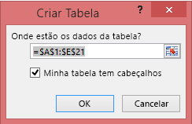

# Erro: Não foi possível localizar nenhum dado na sua pasta de trabalho do Excel

>[!NOTE]  
>Este artigo se aplica ao Excel 2007 e posterior.

Quando você importa uma pasta de trabalho do Excel para o Power BI, poderá ver o seguinte erro:

*Erro: Não foi possível encontrar nenhum dado formatado como uma tabela. Para importar do Excel para o serviço do Power BI, é necessário formatar os dados como uma tabela. Selecione todos os dados desejados na tabela e pressione Ctrl+T.*

## Solução rápida
1. Edite sua pasta de trabalho no Excel.
2. Selecione o intervalo de células que contém seus dados. A primeira linha deve conter seus cabeçalhos de coluna (os nomes de coluna).
3. Pressione **Ctrl + T** para criar uma tabela.
4. Salve sua pasta de trabalho.
5. Retorne ao Power BI e importe sua pasta de trabalho novamente, ou se estiver trabalhando no Excel 2016 e salvou a pasta de trabalho no OneDrive para Empresas, no Excel, clique em Arquivo > Publicar.

## Detalhes
### Causa
No Excel, você pode criar uma **tabela** fora de um intervalo de células, o que torna mais fácil classificar, filtrar e formatar dados.

Quando você importa uma pasta de trabalho do Excel, o Power BI procura essas tabelas e as importa para um conjunto de dados; se ele não encontrar todas as tabelas, você verá essa mensagem de erro.

### Solução
1. Abra sua pasta de trabalho no Excel. 
    >[!NOTE]
    >As imagens aqui exibidas são do Excel 2013. Se você estiver usando outra versão, a aparência poderá ser um pouco diferente, mas as etapas são as mesmas.
    
    
2. Selecione o intervalo de células que contém seus dados. A primeira linha deve conter seus cabeçalhos de coluna (os nomes de coluna):
   
    
3. Na faixa de opções da guia **INSERIR** , clique em **Tabela**. (Ou, como um atalho, pressione **Ctrl + T**.)
   
    
4. Você verá a caixa de diálogo a seguir. Certifique-se de que a opção **Minha tabela tem títulos** está marcada e selecione **OK**:
   
    
5. Agora que seus dados estão formatados como uma tabela:
   
    
6. Salve sua pasta de trabalho.
7. Volte para o Power BI. Selecione Obter Dados na parte inferior do painel de navegação.
   
    
8. Na caixa **Arquivos** , selecione **Obter**.
   
    
9. Importe novamente sua pasta de trabalho do Excel. Desta vez, a importação deve localizar a tabela e ser realizada com êxito.
   
    Se a importação ainda falhar, fale conosco clicando em **Comunidade** no menu Ajuda:
   
    
