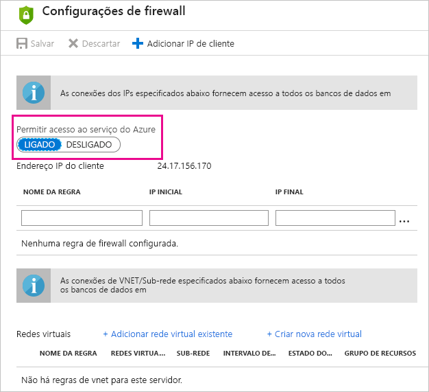

# Solucionando problemas em atualização agendada para bancos de dados SQL Azure no Power BI

Para informações detalhadas sobre a atualização, confira [Atualizar dados no Power BI](refresh-data.md) e [Configurar atualização programada](refresh-scheduled-refresh.md).

Ao configurar a atualização agendada para o Banco de Dados SQL do Azure, se você receber um erro com o código de erro 400 durante a edição de credenciais, tente o seguinte para configurar a regra de firewall apropriada:

1. Entre no [portal do Azure](https://portal.azure.com).

1. Acesse o Banco de Dados SQL do Azure para o qual você está configurando a atualização.

1. Na parte superior da folha **Visão Geral**, selecione **Definir firewall do servidor**.

1. Na folha **Configurações de firewall**, verifique se **Permitir o acesso aos serviços do Azure** está definido como **LIGADO**.

      

Mais perguntas? [Experimente a Comunidade do Power BI](http://community.powerbi.com/)
