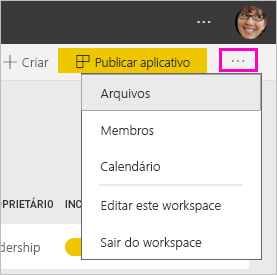
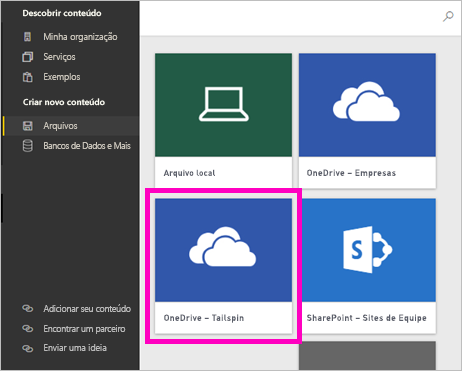

# Criar novos espaços de trabalho no Power BI

O Power BI está apresentando uma nova experiência de espaço de trabalho. Espaços de trabalho ainda são locais para colaborar com colegas para criar coleções de painéis, relatórios (paginados ou não). Depois, você pode agrupar essas coleções em *aplicativos* e distribuí-los para toda a organização ou para pessoas ou grupos específicos. 

Confira as mudanças. Nos novos espaços de trabalho, é possível:

- Atribuir funções de workspace a grupos de usuários: grupos de segurança, listas de distribuição, grupos do Office 365 e indivíduos.
- Criar um workspace no Power BI sem criar um grupo do Office 365.
- Usar funções de workspaces mais granulares para obter um gerenciamento de permissões mais flexível em um workspace.

> [!NOTE]
> Para impor a RLS (Segurança em Nível de Linha) para usuários do Power BI Pro que estão navegando pelo conteúdo de um workspace, atribua os usuários à função espectador.

Para saber mais, confira o artigo [Novos espaços de trabalho](service-new-workspaces.md).

## Criar um dos novos espaços de trabalho

1. Comece criando o workspace. Selecione **Espaços de trabalho** > **Criar espaço de trabalho**.
   
     

2. Você está criando automaticamente um espaço de trabalho atualizado, a menos que opte por **Reverter para clássico**.
   
     
     
     Se você selecionar **Reverter para clássico**, criará um [workspace baseado em um Grupo do Office 365](service-create-workspaces.md). 

2. Nomeie o workspace. Se o nome não estiver disponível, edite-o para criar um exclusivo.
   
     O aplicativo do espaço de trabalho terá o mesmo nome e ícone que o espaço de trabalho.
   
1. Estes são alguns itens opcionais que você pode definir para seu espaço de trabalho:

    Carregue uma **Imagem do espaço de trabalho**. Os arquivos podem estar no formato .png ou .jpg. O tamanho do arquivo deve ser inferior a 45 KB.
    
    [Adicione uma **Lista de contatos**](#workspace-contact-list). Por padrão, os administradores do espaço de trabalho são os contatos. 
    
    [Especifique um **OneDrive para o espaço de trabalho**](#workspace-onedrive) digitando apenas o nome de um Grupo do Office 365 existente, não a URL. Agora este espaço de trabalho pode usar o local de armazenamento de arquivos desse Grupo do Office 365. 

    

    Para associar o espaço de trabalho a uma **Capacidade dedicada**, na guia **Premium**, selecione **Capacidade dedicada**.
     
    

1. Selecione **Salvar**.

    O Power BI cria o workspace e o abre. Ele é exibido na lista de workspaces dos quais você é membro. 

## Lista de contatos do workspace

O novo contato do espaço de trabalho permite que você especifique quais usuários recebem a notificação sobre problemas que ocorrem no espaço de trabalho. Por padrão, qualquer usuário ou grupo especificado como um administrador do workspace é notificado, mas você pode personalizar a lista. Os usuários ou grupos listados na lista de contatos serão mostrados na interface do usuário (IU) para ajudar os usuários a obter ajuda relacionada ao workspace.

1. Acesse a nova configuração de **Lista de contatos** usando uma destas duas maneiras:

    No painel **Criar um espaço de trabalho** ao criá-lo pela primeira vez.

    No painel de navegação esquerdo, selecione a seta ao lado de **Espaços de trabalho**, selecione as reticências (...) ao lado do nome do espaço de trabalho > **Configurações do espaço de trabalho**. O painel **Configurações** é aberto.

    

2. Em **Avançado** > **Lista de contatos**, aceite o padrão, **Administradores de espaço de trabalho** ou adicione sua própria lista de **Usuários ou grupos específicos**. 
3. Selecione **Salvar**.

## OneDrive do Workspace

O recurso OneDrive do Workspace permite que você configure um grupo do Office 365 cujo armazenamento de arquivos da Biblioteca de Documentos do SharePoint esteja disponível para usuários do espaço de trabalho. Cria o grupo fora do Power BI primeiro. 

O Power BI não sincroniza as permissões de usuários ou grupos que estão configurados para ter acesso ao workspace com a associação ao grupo do Office 365. A prática recomendada é dar ao mesmo grupo do Office 365, cujo armazenamento de arquivos você define nessa configuração do grupo do Office 365, [acesso ao mesmo espaço de trabalho](#give-access-to-your-workspace). Em seguida, gerencie o acesso ao espaço de trabalho gerenciando a associação do grupo do Office 365. 

1. Acesse a nova configuração do **OneDrive do espaço de trabalho** usando uma destas duas maneiras:

    No painel **Criar um espaço de trabalho** ao criá-lo pela primeira vez.

    No painel de navegação esquerdo, selecione a seta ao lado de **Espaços de trabalho**, selecione as reticências (...) ao lado do nome do espaço de trabalho > **Configurações do espaço de trabalho**. O painel **Configurações** é aberto.

    

2. Em **Avançado** > **OneDrive do espaço de trabalho**, digite o nome do grupo do Office 365 que você criou anteriormente. O Power BI seleciona automaticamente o OneDrive para o grupo.

    

3. Selecione **Salvar**.

### Acessar o local do OneDrive do espaço de trabalho

Depois de configurar o local do OneDrive, você pode acessá-lo de alguns locais diferentes no espaço de trabalho:

- Selecione **Espaços de trabalho** > *Nome do espaço de trabalho* > o menu das reticências ( **...** ) > **Arquivos**. 

    

- Selecione as reticências ( **...** ) no canto superior direito do espaço de trabalho > **Arquivos**.

    
    
- Na experiência **Obter Dados** > **Arquivos**. A entrada **OneDrive – Business** é seu próprio OneDrive for Business. O segundo OneDrive é aquele que você adicionou.

    

## Adicionar conteúdo ao seu espaço de trabalho

Após criar uma experiência de novo espaço de trabalho, é hora de adicionar conteúdo a ele. A adição de conteúdo é semelhante nos espaços de trabalho novo e clássico. Use o botão Criar ou use Obter Dados para adicionar conteúdo ao seu espaço de trabalho.

1. Na tela **Boas-vindas** do seu novo espaço de trabalho, é possível adicionar conteúdo. 

    

1. Por exemplo, selecione **Exemplos** > **Exemplo de rentabilidade do cliente**.

> [!NOTE]
> Não é possível adicionar pacotes de conteúdo organizacional ou pacotes de conteúdo de terceiros aos novos espaços de trabalho. Os aplicativos estão disponíveis para vários pacotes de conteúdo de terceiros que você usou anteriormente. Use os espaços de trabalho clássicos se você precisar continuar usando pacotes de conteúdo. Os pacotes de conteúdo estão obsoletos, portanto, é uma prática recomendada usar os aplicativos em vez disso.

Quando você exibe conteúdo na lista de conteúdo de um espaço de trabalho, o nome do espaço de trabalho é listado como o proprietário.

### Conectar-se aos serviços de terceiros em novos espaços de trabalho

Na nova experiência de workspaces, estamos mudando o foco para *aplicativos*. Os aplicativos de serviços de terceiros facilitam para que os usuários obtenham dados dos serviços que usam, como o Microsoft Dynamics CRM, o Salesforce ou o Google Analytics.

Na nova experiência de espaços de trabalho, não é possível criar ou consumir pacotes de conteúdo organizacional. Em vez disso, é possível usar os aplicativos fornecidos para conectar-se aos serviços de terceiros ou pedir para suas equipes internas fornecerem aplicativos para quaisquer pacotes de conteúdo que você está usando no momento. 

## Conceder acesso ao seu espaço de trabalho

1. Na lista de conteúdo do espaço de trabalho, como você é administrador, verá uma nova ação, **Acesso**.

    

1. Selecione **Acessar**.

1. Adicione grupos de segurança, listas de distribuição, grupos do Office 365 ou indivíduos nesses workspaces como membros, colaboradores ou administradores. Consulte [Funções nos novos workspaces](service-new-workspaces.md#roles-in-the-new-workspaces) para obter uma explicação das diferentes funções.

    

9. Selecione **Adicionar** > **Fechar**.

## Distribuir um aplicativo

Se quiser distribuir conteúdo oficial para um grande público em sua organização, você poderá publicar um aplicativo do seu workspace.  Quando o conteúdo estiver pronto, escolha quais dashboards e relatórios você deseja publicar e, em seguida, publique-o como um *aplicativo*. Você pode criar um aplicativo de cada workspace.

Leia sobre [como publicar um aplicativo nos novos espaços de trabalho](service-create-distribute-apps.md)

## Próximas etapas
* Leia sobre [Organizar o trabalho na nova experiência de espaços de trabalho no Power BI](service-new-workspaces.md)
* [Criar espaços de trabalho clássicos](service-create-workspaces.md)
* [Publicar um aplicativo nos novos espaços de trabalho no Power BI](service-create-distribute-apps.md)
* Dúvidas? [Experimente perguntar à Comunidade do Power BI](http://community.powerbi.com/)
