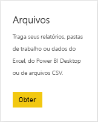
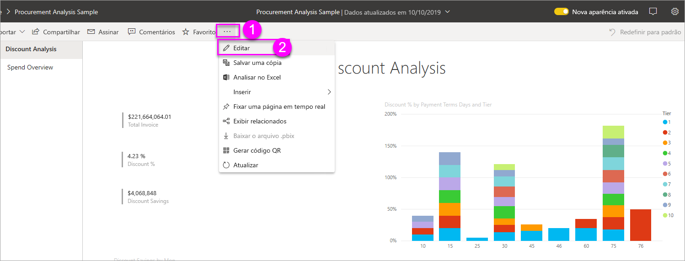
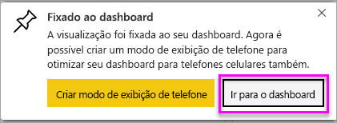
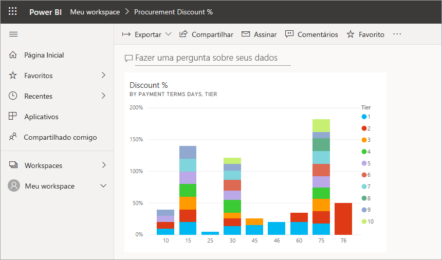
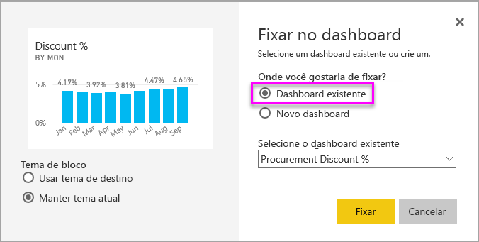

# Criar um dashboard do Power BI de um relatório
Você já leu [Introdução a dashboards no Power BI](service-dashboards.md) e agora deseja criar o seu próprio. Há diferentes maneiras de criar um painel. Por exemplo, é possível criar um dashboard com base em um relatório, do zero, com base em um conjunto de dados ou duplicando um existente.  

Começaremos criando um painel rápido e fácil que fixa visualizações de um relatório que já foi criado. 

Depois de concluir este artigo, você terá uma boa compreensão:
- Da relação entre dashboards e relatórios
- De como abrir o Modo de exibição de edição no editor de relatórios
- De como fixar blocos 
- De como navegar entre um dashboard e um relatório 
 

> [!NOTE] 
> Os dashboards são um recurso do serviço do Power BI, não do Power BI Desktop. Embora os painéis não sejam criados nos aplicativos móveis do Power BI, eles podem ser [exibidos e compartilhados](consumer/mobile/mobile-apps-view-dashboard.md) lá.
>
> 

## Vídeo: Criar um dashboard fixando visuais e imagens de um relatório
Veja a Amanda criar um novo dashboard fixando visualizações de um relatório. Em seguida, siga as etapas na próxima seção, [Importar um conjunto de dados com um relatório](#import-a-dataset-with-a-report), para tentar você mesmo, usando o exemplo de análise de compras.
    

<iframe width="560" height="315" src="https://www.youtube.com/embed/lJKgWnvl6bQ" frameborder="0" allowfullscreen></iframe>

## Importar um conjunto de dados com um relatório
Neste passo a passo, vamos importar um dos conjuntos de dados de exemplo do Power BI e usá-lo para criar nosso novo painel. O exemplo que usamos é uma pasta de trabalho do Excel com duas planilhas do PowerView. Quando o Power BI importa a pasta de trabalho, ele adiciona um conjunto de dados e um relatório ao seu workspace. O relatório é criado automaticamente das planilhas do PowerView.

1. Baixe o arquivo do Excel de [exemplo de Análise de Compras](http://go.microsoft.com/fwlink/?LinkId=529784). É recomendável salvá-lo em seu OneDrive for Business.
2. Abra o serviço do Power BI no seu navegador (app.powerbi.com).
3. No painel de navegação esquerdo, selecione **Meu Workspace** e selecione **Obter Dados**.

    
5. Em **Arquivos**, selecione **Obter**.

   
6. Navegue até o local em que você salvou o arquivo do Excel de exemplo de análise de compras. Selecione-o e escolha **Conectar**.

   
7. Para este exercício, selecione **Importar**.

    
8. Quando a mensagem de êxito for exibida, selecione o **x** para ignorá-la.

   

> [!TIP]
> Você sabia? Você pode restringir a barra de navegação esquerda selecionando o ícone com três linhas na parte superior . Isso garante mais espaço para o relatório.

### Abrir o relatório e fixar blocos no dashboard
1. No mesmo workspace, selecione a guia **Relatórios** e selecione **Exemplo de Análise de Compras** para abrir o relatório.

     O relatório é aberto no Modo de exibição de leitura. Observe que ele tem duas guias à esquerda: **Análise de Desconto** e **Visão Geral de Gastos**. Cada guia representa uma página do relatório.

2. Selecione **Mais opções (...)**  > **Editar relatório** para abrir seu relatório no modo de exibição de Edição.

    
3. Passe o mouse sobre uma visualização para revelar as opções disponíveis. Para adicionar a visualização a um dashboard, selecione o ícone de pino .

    
4. Como estamos criando um novo dashboard, selecione a opção **Novo dashboard** e dê um nome a ele.

    
5. Ao selecionar **Fixar**, o Power BI criará o novo dashboard no workspace atual. Depois que a mensagem **Afixado ao dashboard** for exibida, selecione **Ir para o dashboard**. Se for solicitado salvar o relatório, escolha **Salvar**.

    

    O Power BI abre o novo dashboard. Ele tem um bloco: a visualização que você acabou de fixar.

   
7. Selecione o bloco para retornar ao relatório. Fixe mais alguns blocos ao novo dashboard. Quando a janela **Fixar no Painel** for exibida, selecione **Painel Existente**.  

   

## Fixar uma página inteira do relatório no painel
Em vez de fixar um visual de cada vez, você pode [fixar uma página inteira do relatório como um *bloco dinâmico*](service-dashboard-pin-live-tile-from-report.md). Vamos fazer isso.

1. No editor de relatórios, selecione a guia **Visão Geral sobre Gastos** para abrir a segunda página do relatório.

   

2. Queremos todos os visuais no relatório em seu dashboard. No canto superior direito da barra de menus, selecione **Fixar página dinâmica**. Em um painel, os blocos de página dinâmica são atualizados cada vez que a página é atualizada.

   

3. Quando a janela **Fixar no dashboard** for exibida, selecione **Dashboard existente**.

   

4. Quando a mensagem de Êxito for exibida, selecione **Ir para o dashboard**. Lá, você verá os blocos fixados do relatório. No exemplo abaixo, fixamos dois blocos na página um do relatório e um bloco dinâmico, que é a página dois do relatório.

   

## Próximas etapas
Parabéns! Você criou seu primeiro dashboard! Agora que você tem um dashboard, há muito mais que você pode fazer com ele. Siga um dos artigos sugeridos abaixo ou comece explorando seu próprio: 

* [Redimensionar e mover blocos](service-dashboard-edit-tile.md)
* [Tudo sobre blocos de dashboard](service-dashboard-tiles.md)
* [Compartilhar seu dashboard criando um aplicativo](service-create-workspaces.md)
* [Power BI – conceitos básicos](service-basic-concepts.md)
* [Dicas para projetar um ótimo dashboard](service-dashboards-design-tips.md)

Mais perguntas? [Experimente a Comunidade do Power BI](http://community.powerbi.com/).
