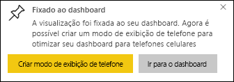

# Fixar um bloco em um painel do Power BI por meio de um relatório

Uma maneira de adicionar um [bloco de dashboard](consumer/end-user-tiles.md) é de dentro do [relatório do Power BI](consumer/end-user-reports.md). Quando você seleciona um desses blocos, ele é aberto no relatório.

Uma página inteira de relatório pode ser fixada em um dashboard, que é chamado fixando um bloco *dinâmico*. Ele é denominado bloco dinâmico porque você pode interagir com ele no dashboard. Ao contrário do que acontece com blocos de visualização individual, as alterações feitas no relatório são sincronizadas com o dashboard. Para saber mais, confira [Fixar uma página inteira de relatório](#pin-an-entire-report-page).

Não é possível fixar blocos de relatórios compartilhados com você ou do Power BI Desktop. 

> [!TIP]
> Como algumas visualizações usam imagens de tela de fundo, a fixação talvez não funcione caso a imagem seja muito grande. Tente reduzir o tamanho da imagem ou usar a compactação de imagem.  
> 
> 

## Fixar um bloco por meio de um relatório
Veja Amanda criar um dashboard fixando visuais e imagens de um relatório do Power BI.
    

<iframe width="560" height="315" src="https://www.youtube.com/embed/lJKgWnvl6bQ" frameborder="0" allowfullscreen></iframe>

Agora crie seu próprio dashboard usando um dos relatórios de exemplo do Power BI.

1. No relatório, passe o mouse sobre a visualização que você deseja fixar e selecione o ícone de pino. . O Power BI abre a tela **Fixar no painel** .
   
     
2. Selecione se você deseja fixar em um dashboard existente ou em um novo.
   
   * **Dashboard existente**: selecione o nome do dashboard na lista suspensa. Dashboards que foram compartilhados com você não aparecerão na lista suspensa.
   * **Novo dashboard**: insira o nome do novo dashboard.
3. Em alguns casos, o item que você está fixando pode ter um *tema* já aplicado. Por exemplo, visuais fixados de uma pasta de trabalho do Excel. Nesse caso, selecione o tema para aplicar ao bloco.
4. Selecione **Fixar**.
   
   Uma mensagem de êxito (perto do canto superior direito) informa que a visualização foi adicionada, como um bloco, ao dashboard.
   
   
5. No painel de navegação, selecione o dashboard com o novo bloco. [Edite a exibição e o comportamento do bloco](service-dashboard-edit-tile.md) ou selecione o bloco para retornar ao relatório.

## Fixar uma página inteira do relatório
Outra opção é fixar uma página inteira de relatório em um dashboard, que é uma maneira fácil de fixar mais de uma visualização por vez. Quando você fixa uma página inteira, os blocos são *dinâmicos*. Ou seja, você pode interagir com eles lá no dashboard. As alterações feitas a qualquer uma das visualizações no editor de relatórios, como adicionar um filtro ou alterar os campos usados no gráfico, também são refletidas no bloco do dashboard.  

Para saber mais, confira [Fixar uma página inteira de relatório](service-dashboard-pin-live-tile-from-report.md).

## Próximas etapas
- [Dashboards para consumidores de serviço do Power BI](consumer/end-user-dashboards.md)
- [Blocos de Dashboard no Power BI](consumer/end-user-tiles.md)
- [Relatórios no Power BI](consumer/end-user-reports.md)
- [Atualizar dados no Power BI](refresh-data.md)
- [Conceitos básicos para designers no serviço do Power BI](service-basic-concepts.md)

Mais perguntas? [Experimente a Comunidade do Power BI](https://community.powerbi.com/)

