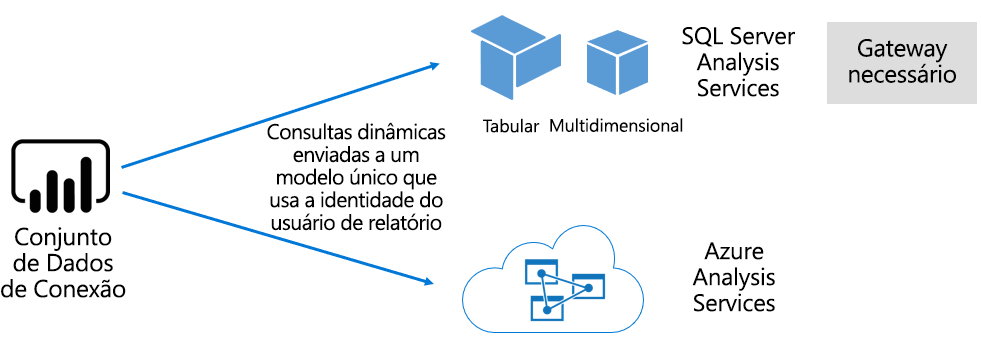

# Conjuntos de dados no serviço do Power BI

Este artigo fornece uma explicação técnica sobre os conjuntos de dados do Power BI.

## Tipos de conjuntos de dados

Os conjuntos de dados do Power BI representam uma fonte de dados pronta para geração de relatórios e visualização. Existem cinco tipos diferentes de conjuntos de dados, criados das seguintes maneiras:

- Com conexão a um modelo de dados existente não hospedado em um recurso do Power BI
- Com o carregamento de um arquivo do Power BI Desktop que contém um modelo
- Com o carregamento de uma pasta de trabalho do Excel (que contém uma ou mais tabelas do Excel e/ou um modelo de dados da pasta de trabalho) ou o carregamento de um arquivo CSV (valores delimitados por vírgula)
- Com o uso do serviço do Power BI para criar um [conjunto de dados por push](developer/automation/walkthrough-push-data.md)
- Com o uso do serviço do Power BI para criar um [conjunto de dados de streaming ou híbrido](service-real-time-streaming.md)

Exceto para conjuntos de dados de streaming, o conjunto de dados representa um modelo de dados que aproveita as tecnologias de modelagem maduras do [Analysis Services](/analysis-services/analysis-services-overview).

> [!NOTE]
> Ocasionalmente, os termos _conjuntos de dados_ e _modelos_ são usados de forma intercambiável em nossa documentação. Em geral, é usado o termo **conjunto de dados** em referência ao serviço do Power BI, e **modelo** em referência a estruturas de desenvolvimento. No contexto da nossa documentação, eles significam a mesma coisa.

### Modelos hospedados externos

Há dois tipos de modelos hospedados externos: SQL Server Analysis Services e [Azure Analysis Services](/azure/analysis-services/analysis-services-overview).

A conexão com um modelo do SQL Server Analysis Services envolve a instalação do [gateway de dados local](service-gateway-onprem.md), seja no local ou na IaaS (infraestrutura como serviço) hospedada por VM. O Azure Analysis Services não requer um gateway.

A conexão com o Analysis Services geralmente é mais recomendada para cenários de investimentos de modelo existentes, que normalmente fazem parte de um EDW (Enterprise Data Warehouse). O Power BI pode estabelecer uma _conexão dinâmica_ com o Analysis Services, aplicando permissões de dados com a identidade do usuário de relatório do Power BI. Para o SQL Server Analysis Services, os modelos com suporte são os multidimensionais (cubos) e os tabulares. Conforme mostrado na imagem a seguir, um conjunto de dados de conexão dinâmica passa consultas para modelos hospedados externos.

### Modelos desenvolvidos pelo Power BI Desktop

O Power BI Desktop, que é um aplicativo cliente destinado ao desenvolvimento do Power BI, pode ser usado para desenvolver um modelo. O modelo é efetivamente um modelo tabular do Analysis Services. Os modelos podem ser desenvolvidos importando dados de fluxos de dados, que podem ser integrados a fontes de dados externas. Embora as especificidades de modelagem estejam fora do escopo deste artigo, é importante entender que existem três tipos diferentes, ou _modos_, de modelos que podem ser desenvolvidos usando o Power BI Desktop. Esses modos determinam se os dados serão importados para o modelo ou permanecerão na fonte de dados. Os três modos são: Importação, DirectQuery e Composto. Para obter mais informações sobre cada modo, confira o artigo [Modos de conjunto de dados no serviço do Power BI](service-dataset-modes-understand.md).

Modelos hospedados externos e modelos do Power BI Desktop podem impor RLS (Segurança em Nível de Linha) a fim de limitar os dados recuperados para determinado usuário. Por exemplo, os usuários atribuídos ao grupo de segurança **Vendedores** podem exibir apenas os dados do relatório de regiões de vendas relacionadas à atribuição deles. As funções de RLS são: _dinâmica_ ou _estática_. As funções dinâmicas são filtradas pelo usuário do relatório, enquanto as funções estáticas aplicam os mesmos filtros para todos os usuários atribuídos à função. Para obter mais informações, confira [RLS (Segurança em Nível de Linha) com o Power BI](service-admin-rls.md).

### Modelos de pasta de trabalho do Excel

A criação de conjuntos de dados com base em [pastas de trabalho do Excel](service-excel-workbook-files.md) ou em [arquivos CSV](service-comma-separated-value-files.md) resulta na criação automática de um modelo. As tabelas do Excel e os dados CSV são importados para criar tabelas de modelo, enquanto um modelo de dados da pasta de trabalho do Excel é transposto para criar um modelo do Power BI. Em todos os casos, os dados do arquivo são importados para um modelo.

## Resumo

É possível fazer distinções entre os conjuntos de dados do Power BI que representam modelos:

- Eles estão hospedados no serviço do Power BI ou externamente, no Analysis Services.
- Eles podem armazenar dados importados, emitir solicitações de consulta passagem para fontes de dados subjacentes ou podem usar uma combinação de ambos.

Veja a seguir um resumo dos fatos importantes sobre os conjuntos de dados do Power BI que representam modelos:

- Os modelos hospedados do SQL Server Analysis Services exigem um gateway para executar consultas de conexão dinâmica.
- Modelos hospedados no Power BI que importam dados:
  - Devem ser totalmente carregados na memória para que possam ser consultados.
  - Requerem atualização para manter os dados atuais e devem envolver gateways quando a fonte de dados não está acessível diretamente pela Internet.
- Os modelos hospedados no Power BI que usam o modo de armazenamento [DirectQuery](desktop-directquery-about.md) requerem conectividade com a fonte de dados. Quando o modelo é consultado, o Power BI emite consultas às fontes de dados para recuperar os dados atuais. Esse modo deverá envolver gateways quando a fonte de dados não estiver acessível diretamente pela Internet.
- Os modelos podem impor regras de RLS, impondo filtros a fim de limitar o acesso a dados para determinados usuários.

## Considerações

Para implantar e gerenciar com êxito o Power BI, é importante entender onde os modelos estão hospedados, como são armazenados, quais são suas dependências nos gateways, o tamanho dos dados importados e o tipo e frequência de atualização. Todas essas configurações podem ter um impacto significativo nos recursos de capacidade do Power BI. Além disso, o próprio design do modelo, incluindo suas consultas de preparação de dados, relacionamentos e cálculos, contribui para a combinação de considerações.

Também é importante entender que os modelos de importação hospedados no Power BI podem ser atualizados de acordo com uma programação ou ser acionados sob demanda por um usuário no serviço do Power BI.

## Próximas etapas

- [Modos de conjunto de dados no serviço do Power BI](service-dataset-modes-understand.md)
- Mais perguntas? [Experimente perguntar à Comunidade do Power BI](https://community.powerbi.com/)
