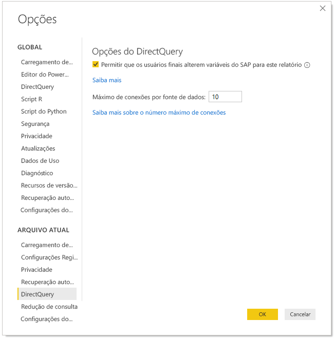

# Editar variáveis do SAP no serviço do Power BI

Ao usar o SAP Business Warehouse ou o SAP HANA com o DirectQuery, os autores de relatório agora podem permitir que os usuários finais editem variáveis do SAP no **serviço do Power BI** para workspaces Premium e compartilhados. Observe que esse recurso NÃO funciona para relatórios na guia Compartilhado comigo do Meu Workspace e aplicativos criados dos workspaces V1. 

Este documento descreve os requisitos para editar variáveis no Power BI, como habilitar esse recurso e onde editar variáveis no serviço do Power BI.

## Requisitos para editar variáveis do SAP

Há alguns requisitos para o uso do recurso editar variáveis do SAP. A lista a seguir descreve esses requisitos.

**Nova experiência de filtro necessária** – você deve ter a [nova experiência de filtro](power-bi-report-filter.md) habilitada para seu relatório. Veja como você pode habilitá-lo para seu relatório no Power BI Desktop:
- No Power BI Desktop, selecione **Arquivo** > **Opções e Configurações** > **Opções**
- No painel de navegação, em **Arquivo atual**, selecione **Configurações de relatório**.
- Em **Experiência de filtragem**, selecione **Habilitar o painel de filtros atualizado**.

**Conexões do DirectQuery necessárias** – você deve se conectar à fonte de dados do SAP usando o DirectQuery. Não há suporte para importar conexões.

**Configuração de SSO necessária** – para que este recurso funcione, o SSO (logon único) deve estar configurado. Confira [visão geral do SSO (logon único)](service-gateway-sso-overview.md) para saber mais.

**Novos bits de gateway necessários** – Baixe o gateway mais recente e atualize seu gateway existente. Confira [gateway de serviço](service-gateway-onprem.md) para saber mais.

**Somente multidimensional para SAP HANA** – para o SAP HANA, o recurso editar variáveis do SAP só funciona com modelos multidimensionais e não funciona em fontes relacionais.

**Sem suporte em nuvens soberanas** – no momento, o Power Query Online não está disponível em nuvens soberanas; portanto, também não há suporte para esse recurso em nuvens soberanas.

## Como habilitar o recurso

Para habilitar o recurso **editar variáveis do SAP**, no Power BI Desktop, conecte-se a uma fonte de dados do SAP HANA ou do SAP BW. Em seguida, acesse **Arquivo > Opções e configurações > Opções** e, em seguida, na seção Arquivo Atual no painel esquerdo, selecione **DirectQuery**. Quando você seleciona isso, é possível ver no painel direito as opções de DirectQuery e uma caixa de seleção na qual é possível **Permitir que usuários finais alterem as variáveis do SAP no relatório**, conforme mostrado na imagem a seguir.

## Usar editar variáveis do SAP no Power BI Desktop

Ao usar o recurso editar variáveis do SAP no Power BI Desktop, você pode editar as variáveis selecionando o link Editar variáveis no menu **Editar Consultas** na faixa de seleção. Lá, a seguinte caixa de diálogo é exibida. Esse recurso ficou disponível no Power BI Desktop por um tempo. Os criadores de relatório podem selecionar variáveis do relatório usando a caixa de diálogo a seguir.

## Usar o recurso editar variáveis do SAP no serviço

Depois que o relatório for publicado no serviço do Power BI, os usuários poderão ver o link **Editar variáveis** no novo painel Filtrar. Se você estiver publicando o relatório pela primeira vez, poderá levar até 5 minutos antes que o link Editar variável seja exibido. Se o link não tiver sido exibido, você precisará atualizar manualmente o conjunto de dados.
Você pode fazer isso:

1. No serviço do Power BI, selecione a guia **Conjuntos de Dados** na lista de conteúdo de um workspace.

2. Localize o conjunto de dados que você precisa atualizar e selecione o ícone **Atualizar**.

    

3. A seleção do link Editar variáveis abre a caixa de diálogo **Editar variáveis**, em que os usuários podem substituir variáveis. Selecionar o botão **Redefinir** redefine as variáveis para os valores originais que foram exibidos quando essa caixa de diálogo foi aberta.

    

4. Alterações na caixa de diálogo **Editar variáveis** persistem apenas para este usuário (semelhante a outros comportamentos de persistência no Power BI). Selecionar **Redefinir para padrão**, mostrado na imagem a seguir, redefine o relatório para o estado original do seu criador, incluindo as variáveis.

    

Ao trabalhar em um relatório publicado no serviço do Power BI que usa o SAP HANA ou o SAP BW com o recurso **Editar variáveis** habilitado, o proprietário do relatório pode alterar esses padrões. O proprietário do relatório pode alterar as variáveis no modo de edição e salvá-lo para habilitar que essas configurações se tornem as *novas configurações padrão* desse relatório. Outros usuários que acessarem o relatório depois que essas alterações forem feitas pelo proprietário do relatório verão as novas configurações como os padrões.

## Próximas etapas

Para saber mais sobre o SAP HANA, o SAP BW ou o DirectQuery, leia os seguintes artigos:

- [Usar o SAP HANA no Power BI Desktop](desktop-sap-hana.md)
- [DirectQuery e SAP BW (Business Warehouse)](desktop-directquery-sap-bw.md)
- [DirectQuery e SAP HANA](desktop-directquery-sap-hana.md)
- [Usar o DirectQuery no Power BI](desktop-directquery-about.md)
