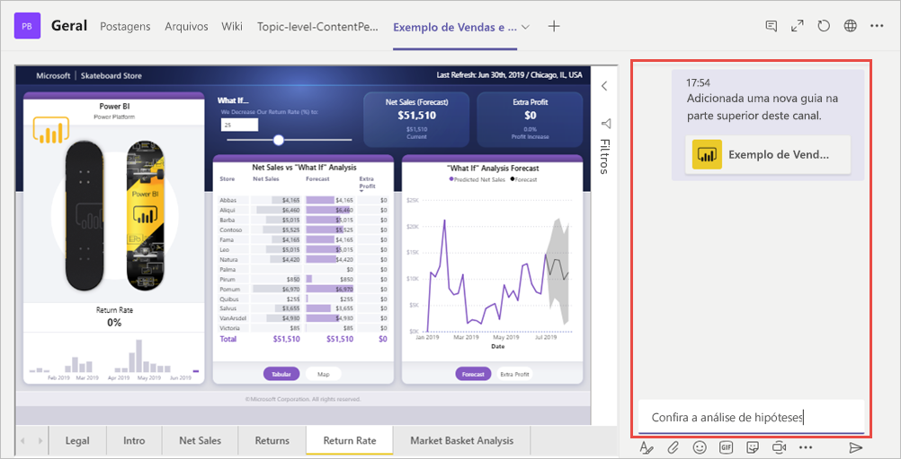

# Inserir relatório com a guia Power BI para o Microsoft Teams

Com a guia Power BI atualizada para o Microsoft Teams, você pode facilmente inserir relatórios interativos em canais e chats do Microsoft Teams.

Use a guia Power BI para o Microsoft Teams para ajudar seus colegas a localizar os dados que sua equipe usa e discutir os dados nos canais da equipe.

## Requisitos

Para a guia **Power BI para o Microsoft Teams** funcionar, é necessário o seguinte:

- Uma licença do Power BI Pro ou o relatório encontra-se em uma [capacidade do Power BI Premium (EM ou SKU P)](service-premium-what-is.md) com uma licença do Power BI.
- A guia Power BI para o Microsoft Teams.
- O usuário precisa entrar no serviço do Power BI para ativar sua licença do Power BI a fim de consumir o relatório.
- O usuário precisa ter permissão para exibir o relatório.

## Insira seu relatório
Para inserir o relatório em um canal ou chat do Microsoft Teams, adicione-o conforme descrito abaixo.

1. Abra o canal desejado ou participe de um chat no Microsoft Teams e selecione o ícone **+** .

    

2. Selecione a guia Power BI.

    

3. Use as opções fornecidas para escolher um relatório de um aplicativo de Workspace, Compartilhado comigo ou Power BI

    

4. O nome da guia é atualizado automaticamente para corresponder ao nome do relatório, mas você pode alterá-lo. 

5. Pressione **Salvar**.

## Relatórios com suporte

A guia habilita a inserção dos relatórios a seguir:

- Relatórios interativos e paginados
- Relatórios no Meu workspace, nova experiência de workspace e workspaces clássicos
- Relatórios em aplicativos do Power BI

## Conceder acesso aos relatórios

A inserção de um relatório no Microsoft Teams não concede automaticamente aos usuários permissão para ver o relatório. É necessário [permitir que os usuários vejam o relatório no Power BI](service-share-dashboards.md). Você pode usar um grupo do Office 365 para sua equipe para facilitar. 

> [!IMPORTANT]
> Certifique-se de examinar quem pode ver o relatório dentro do serviço do Power BI e de conceder acesso aos que não aparecem na lista.

Uma maneira de garantir que todos em sua equipe tenham acesso aos relatórios inseridos é colocá-los em um único workspace no Power BI e fornecer acesso ao workspace para o grupo do Office 365 da sua equipe.

## Iniciar uma conversa

Quando você adiciona uma guia de relatório do Power BI ao Teams, o Teams automaticamente cria uma conversa de guia para acompanhar o relatório. 

- Selecione **Mostrar conversa de guia** no canto superior direito.

    

    O primeiro comentário é um link para o relatório. Todos no canal do Teams podem ver e discutir o relatório na conversa.

    

## Limitações e problemas conhecidos

- O Power BI não dá suporte aos mesmos idiomas localizados que o Microsoft Teams. Como resultado, você não verá a localização correta no relatório inserido.
- Os dashboards do Power BI não podem ser inseridos na guia Power BI para o Microsoft Teams.
- Um usuário sem uma licença do Power BI ou permissão para o relatório verá uma mensagem "O conteúdo não está disponível".
- Você pode encontrar problemas se usar o Internet Explorer 10. <!--You can look at the [browsers support for Power BI](consumer/end-user-browsers.md) and for [Office 365](https://products.office.com/office-system-requirements#Browsers-section). -->
- Os [filtros de URL](service-url-filters.md) não têm suporte com a guia Power BI do Microsoft Teams.
- Em nuvens nacionais, a nova guia Power BI não está disponível. Pode estar disponível uma versão mais antiga que não dá suporte a novos workspaces, experiência no workspace ou relatórios em aplicativos do Power BI. 
- Depois que a guia é salva, o nome dela não pode ser alterado por meio das configurações da guia. Use a opção de renomear para alterá-lo.

## Próximas etapas
- [Compartilhar um painel com seus colegas e com outras pessoas](service-share-dashboards.md)  
- [Criar e distribuir um aplicativo no Power BI](service-create-distribute-apps.md)  
- [O que é o Power BI Premium?](service-premium-what-is.md)

Mais perguntas? [Experimente perguntar à Comunidade do Power BI](https://community.powerbi.com/)
