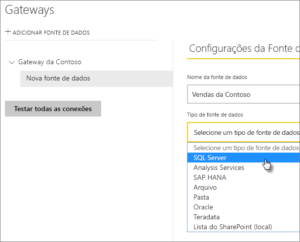
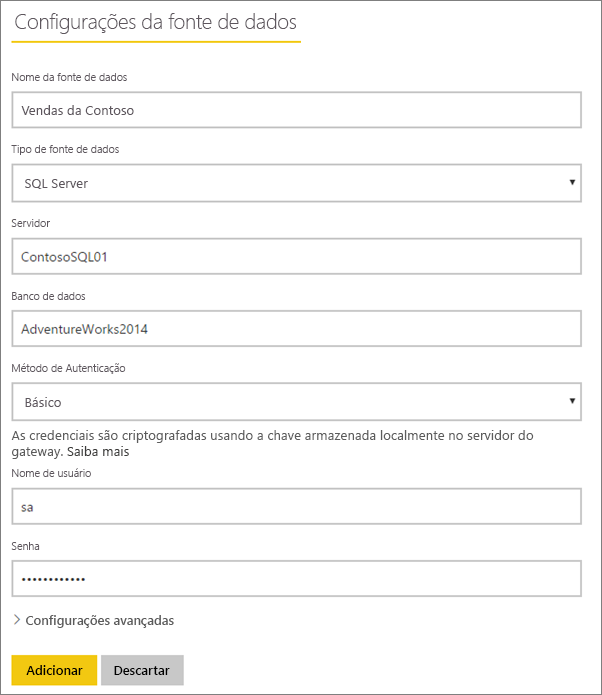
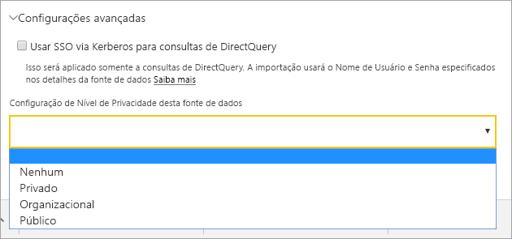
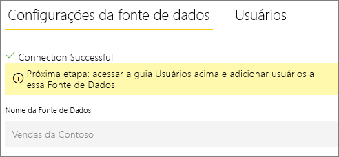
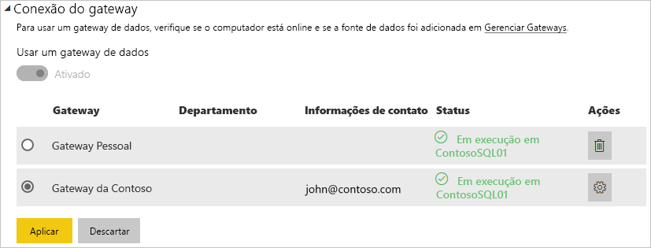
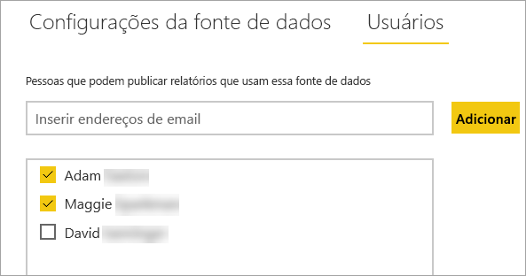

# Gerenciar fontes de dados

[!INCLUDE [gateway-rewrite](includes/gateway-rewrite.md)]

O Power BI dá suporte a várias [fontes de dados no local](power-bi-data-sources.md) e cada uma tem seus próprios requisitos. Um gateway pode ser usado para uma única fonte de dados ou para várias fontes de dados. Para este exemplo, mostramos como adicionar o SQL Server como uma fonte de dados. As etapas são semelhantes para outras fontes de dados.

A maioria das operações de gerenciamento de fontes de dados também pode ser executada usando APIs. Para obter mais informações, confira [APIs REST (Gateways)](/rest/api/power-bi/gateways).

## Adicionar uma fonte de dados

1. No canto superior direito do serviço do Power BI, selecione o ícone de engrenagem   >  **Gerenciar gateways**.

    

2. Selecione um gateway e, em seguida, selecione **Adicionar fonte de dados**. Ou vá para **Gateways** > **Adicionar fonte de dados**.

    

3. Selecione o **tipo de fonte de dados**.

    

4. Insira informações para a fonte de dados. Neste exemplo, são **Servidor**, **Banco de dados** e outras informações. 

    

5. Para o SQL Server, você escolhe um **Método de Autenticação** do **Windows** ou **Básico** (Autenticação SQL). Se você escolher **Básico**, insira as credenciais para a fonte de dados.

6. Opcionalmente, em **Configurações avançadas**, configure o [nível de privacidade](https://support.office.com/article/Privacy-levels-Power-Query-CC3EDE4D-359E-4B28-BC72-9BEE7900B540) para sua fonte de dados (não se aplica a [DirectQuery](desktop-directquery-about.md)).

    

7. Selecione **Adicionar**. Você verá *Conexão bem-sucedida* se o processo for bem-sucedido.

    

Agora, você pode usar essa fonte de dados para incluir dados do SQL Server em seus relatórios e painéis do Power BI.

## Remover uma fonte de dados

Você poderá remover uma fonte de dados se não a usar mais. A remoção de uma fonte de dados interrompe todos os dashboards e relatórios que dependem dessa fonte de dados.

Para remover uma fonte de dados, vá para a fonte de dados e selecione **Remover**.

## Usar a fonte de dados para a atualização agendada ou DirectQuery

Depois de criar a fonte de dados, ela está disponível para uso com as conexões do DirectQuery ou por meio da atualização agendada.

> [!NOTE]
>Os nomes do servidor e do banco de dados devem corresponder entre o Power BI Desktop e a fonte de dados no gateway de dados local.

O vínculo entre o conjunto de dados e a fonte de dados no gateway baseia-se no nome do servidor e no nome do banco de dados. Esses nomes devem corresponder. Por exemplo, se você fornecer um endereço IP para o nome do servidor, no Power BI Desktop, deverá usar o endereço IP para a fonte de dados na configuração do gateway. Se você usar *SERVER\INSTANCE*, no Power BI Desktop, precisará usar o mesmo na fonte de dados configurada para o gateway.

Se estiver listado na guia **Usuários** da fonte de dados configurada no gateway e houver a correspondência entre os nomes do servidor e do banco de dados, você verá o gateway como uma opção a ser usada com a atualização agendada.

> [!WARNING]
> Se seu conjunto de dados contiver várias fontes de dados, cada uma delas deverá ser adicionada ao gateway. Se uma ou mais fontes de dados não forem adicionadas ao gateway, você não o verá como disponível para a atualização agendada.

### Limitações

O OAuth é um esquema de autenticação com suporte somente para conectores personalizados com o gateway de dados local. Você não pode adicionar outras fontes de dados que exigem OAuth. Caso seu conjunto de dados tenha uma fonte de dados que exija OAuth e essa fonte de dados não for um conector personalizado, você não poderá usar o gateway para a atualização agendada.

## Gerenciar usuários

Depois de adicionar uma fonte de dados a um gateway, você dá acesso a usuários e grupos de segurança habilitados por email para a fonte de dados específica (não o gateway inteiro). A lista de usuários da fonte de dados controla somente quem tem permissão para publicar relatórios que incluem dados da fonte de dados. Os proprietários de relatório podem criar dashboards, pacotes de conteúdo e aplicativos e, em seguida, compartilhar esses itens com outros usuários.

Você também pode dar acesso administrativo a usuários e grupos de segurança para o gateway.

### Adicionar usuários a uma fonte de dados

1. No canto superior direito do serviço do Power BI, selecione o ícone de engrenagem   >  **Gerenciar gateways**.

2. Selecione a fonte de dados à qual deseja adicionar usuários.

3. Selecione **Usuários** e insira um usuário da sua organização ao qual você deseja conceder acesso à fonte de dados selecionada. Por exemplo, na tela a seguir, você adiciona Maggie e Adam.

    

4. Selecione **Adicionar** e o nome do membro adicionado aparecerá na caixa.

    

Lembre-se de que você precisa adicionar usuários a cada fonte de dados às quais deseja permitir acesso. Cada fonte de dados tem uma lista separada de usuários. Adicione usuários a cada fonte de dados separadamente.

### Remover usuários de uma fonte de dados

Na guia **Usuários** para a fonte de dados, você pode remover usuários e grupos de segurança que usam essa fonte de dados.

## Armazenar credenciais criptografadas na nuvem

Quando você adiciona uma fonte de dados ao gateway, é necessário fornecer credenciais para essa fonte de dados. Todas as consultas à fonte de dados serão executadas usando essas credenciais. As credenciais são criptografadas com segurança. Elas usam a criptografia simétrica para que elas não possam ser descriptografadas na nuvem. As credenciais são enviadas para o computador que executa o gateway, localmente, no qual são descriptografadas quando as fontes de dados são acessadas.

## Relação dos tipos de fonte de dados disponíveis

Para obter informações sobre quais fontes de dados são compatíveis com o gateway de dados local, confira [Fontes de dados do Power BI](power-bi-data-sources.md).

## Próximas etapas

* [Gerenciar sua fonte de dados – Analysis Services](service-gateway-enterprise-manage-ssas.md)
* [Gerenciar sua fonte de dados – SAP HANA](service-gateway-enterprise-manage-sap.md)
* [Gerenciar sua fonte de dados – SQL Server](service-gateway-enterprise-manage-sql.md)
* [Gerenciar sua fonte de dados – Oracle](service-gateway-onprem-manage-oracle.md)
* [Gerenciar sua fonte de dados – Importar/atualização agendada](service-gateway-enterprise-manage-scheduled-refresh.md)
* [Diretrizes para implantar um gateway de dados](service-gateway-deployment-guidance.md)

Mais perguntas? Experimente a [Comunidade do Power BI](https://community.powerbi.com/).
