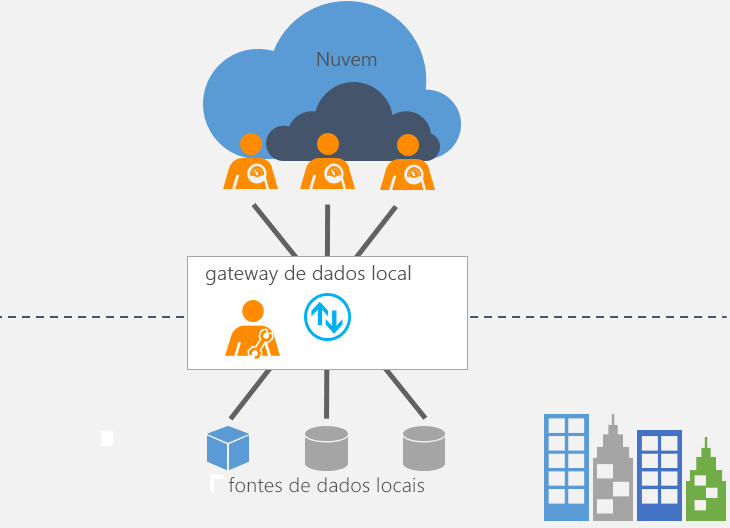

# O que é um gateway de dados local?

[!INCLUDE [gateway-rewrite](includes/gateway-rewrite.md)]

O gateway de dados local atua como uma ponte, fornecendo transferência de dados rápida e segura entre os dados locais (dados que não estão na nuvem) e vários serviços em nuvem da Microsoft. Esses serviços de nuvem incluem Power BI, PowerApps, Power Automate, Azure Analysis Services e Aplicativos Lógicos do Azure. Usando um gateway, as organizações podem manter os bancos de dados e outras fontes de dados em suas redes locais, ao mesmo tempo usando esses dados locais em serviços de nuvem.

## Como funciona o gateway

Para obter mais informações sobre como o gateway funciona, confia a [Arquitetura de gateway de dados local](/data-integration/gateway/service-gateway-onprem-indepth).

## Tipos de gateway

Há dois tipos distintos de gateways, cada um para cenários diferentes:

* **Gateway de dados local** permite que vários usuários se conectem a várias fontes de dados locais. Você pode usar um gateway de dados local com todos os serviços compatíveis com uma única instalação de gateway. Esse gateway é adequado a cenários complexos com várias pessoas acessando várias fontes de dados.

* **Gateway de dados local (modo pessoal)** permite que um usuário se conecte às fontes e não pode ser compartilhado com outras pessoas. Um gateway de dados local (modo pessoal) pode ser usado somente com o Power BI. Esse gateway é adequado a situações em que você é a única pessoa que cria relatórios e não precisa compartilhar nenhuma fonte de dados com outras pessoas.

## Usar um gateway

Há quatro etapas principais para usar um gateway.

1. [Baixe e instale o gateway](/data-integration/gateway/service-gateway-install) em um computador local.
1. [Configure](/data-integration/gateway/service-gateway-app) o gateway com base em seu firewall e outros requisitos de rede.
1. [Adicione administradores de gateway](/data-integration/gateway/service-gateway-manage) que também podem gerenciar e administrar outros requisitos de rede.
1. [Use o gateway](service-gateway-sql-tutorial.md) para atualizar uma fonte de dados local.
1. [Solucione problemas](service-gateway-onprem-tshoot.md) do gateway em caso de erros.

## Próximas etapas

* [Instalar o gateway de dados local](/data-integration/gateway/service-gateway-install)

Mais perguntas? [Experimente a Comunidade do Power BI](https://community.powerbi.com/)
