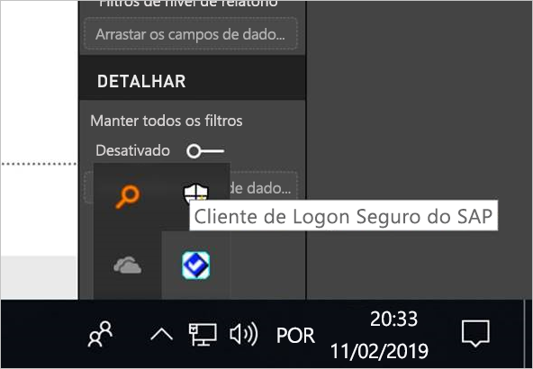
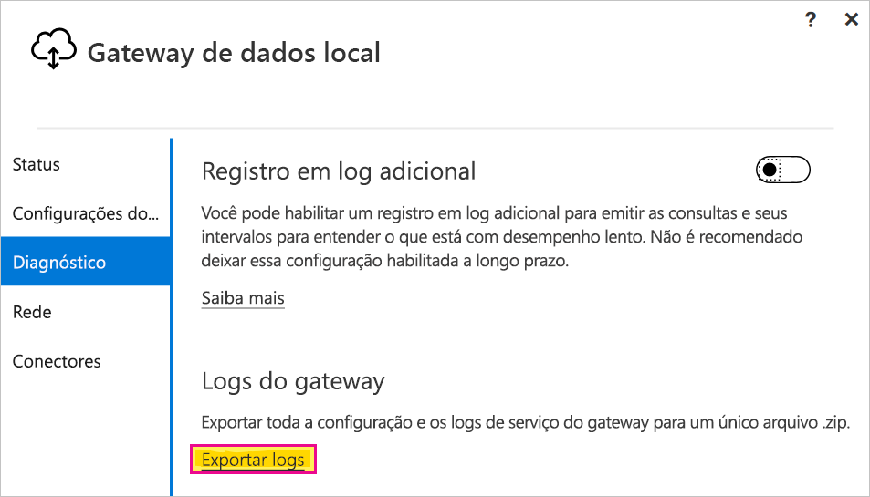

# <a name="use-kerberos-single-sign-on-for-sso-to-sap-bw-using-commoncryptolib-sapcryptodll"></a>Usar o logon único Kerberos de SSO para SAP BW usando CommonCryptoLib (sapcrypto.dll)

Este artigo descreve como configurar a fonte de dados do SAP BW para habilitar o SSO no serviço do Power BI usando a CommonCryptoLib (sapcrypto.dll).

> [!NOTE]
> Antes de tentar atualizar um relatório baseado em SAP BW que usa o SSO do Kerberos, conclua as etapas deste artigo e as etapas contidas em [Configurar o SSO do Kerberos](service-gateway-sso-kerberos.md). Usar o CommonCryptoLib como sua biblioteca SNC habilita as conexões de SSO com os servidores de aplicativos e de mensagens do SAP BW.

## <a name="configure-sap-bw-to-enable-sso-using-commoncryptolib"></a>Configurar o SAP BW para habilitar o SSO usando a CommonCryptoLib

> [!NOTE]
> O gateway de dados local é um software de 64 bits e, portanto, exige a versão de 64 bits da CommonCryptoLib (sapcrypto.dll) para realizar o SSO do BW. Se planeja testar a conexão do SSO com o servidor SAP BW na GUI do SAP antes de tentar uma conexão SSO por meio do gateway (recomendado), também precisará da versão de 32 bits da CommonCryptoLib, pois a GUI do SAP é um software de 32 bits.

1. Verifique se o servidor BW está configurado corretamente para o SSO do Kerberos usando CommonCryptoLib. Se estiver, você poderá usar o SSO para acessar o servidor BW (seja diretamente ou por meio de um Servidor de Mensagens do SAP BW) com uma ferramenta do SAP como a GUI do SAP que tenha sido configurada para usar CommonCryptoLib. 

   Para saber mais sobre as etapas de configuração, confira [Logon único do SAP: autenticar com Kerberos/SPNEGO](https://blogs.sap.com/2017/07/27/sap-single-sign-on-authenticate-with-kerberosspnego/). O servidor BW deve usar CommonCryptoLib como biblioteca SNC e ter um nome SNC que comece com *CN=* , como em *CN=BW1*. Para obter mais informações sobre os requisitos de nome do SNC (especificamente com o parâmetro snc/identity/as), confira [Parâmetros do SNC para configuração do Kerberos](https://help.sap.com/viewer/df185fd53bb645b1bd99284ee4e4a750/3.0/360534094511490d91b9589d20abb49a.html).

1. Se ainda não tiver feito isso, instale a versão x64 do [SAP .NET Connector](https://support.sap.com/en/product/connectors/msnet.html) no computador em que o gateway foi instalado. 
   
   Verifique se o componente foi instalado tentando se conectar com o servidor do BW no Power BI Desktop por meio do computador do gateway. Se você não conseguir se conectar usando a implementação 2.0, isso indicará que o Conector .NET não está instalado ou que não foi instalado no GAC.

1. Verifique se o SLC (Cliente de Logon Seguro) do SAP não está em execução no computador em que o gateway está instalado. 

   O SLC armazena em cache os tíquetes do Kerberos de um modo que pode interferir na capacidade do gateway de usar o Kerberos para SSO. 

1. Se o SLC estiver instalado, desinstale-o ou saia do cliente de logon seguro do SAP. Clique com o botão direito do mouse sobre o ícone na bandeja do sistema e selecione **Fazer logoff** e **Sair** antes de tentar uma conexão com o SSO usando o gateway. 

   O SLC não é compatível para uso em computadores que operam com o Windows Server. Para saber mais, confira [Nota SAP 2780475](https://launchpad.support.sap.com/#/notes/2780475) (usuário s necessário).

   

1. Se você desinstalar o SLC ou selecionar **Fazer logoff** e **Sair**, abra uma janela de comando e insira `klist purge` para limpar eventuais tíquetes do Kerberos armazenados em cache antes de tentar uma conexão com o SSO por meio do gateway.

1. Baixe o CommonCryptoLib (sapcrypto.dll) na versão *8.5.25 ou posterior* de 64 bits do SAP Launchpad e copie-o em uma pasta do computador do gateway. No mesmo diretório em que você copiou sapcrypto.dll, crie um arquivo chamado sapcrypto.ini, com o seguinte conteúdo:

    ```
    ccl/snc/enable_kerberos_in_client_role = 1
    ```

    O arquivo .ini contém informações de configuração necessárias do CommonCryptoLib para habilitar o SSO no cenário de gateway.

    > [!NOTE]
    > Esses arquivos devem ser armazenados no mesmo local; em outras palavras, _/path/to/sapcrypto/_ precisa conter sapcrypto.ini e sapcrypto.dll.

    O usuário de serviço do gateway e o usuário do AD (Active Directory) que o usuário do serviço representa precisam de permissões de leitura e execução para ambos os arquivos. É recomendável conceder permissões para os arquivos .ini e .dll ao Grupo de usuários autenticados. Para fins de teste, você também pode conceder explicitamente essas permissões para o usuário do serviço do gateway e o usuário do Active Directory usado para teste. Na captura de tela a seguir, concedemos ao grupo de usuários autenticados permissões de **leitura &amp; e execução** para sapcrypto.dll:

    

1. Caso você ainda não tenha uma fonte de dados do SAP BW associada ao gateway pelo qual deseja que a conexão SSO flua, adicione uma na página **Gerenciar gateways** no serviço do Power BI. Se você já tiver essa fonte de dados, edite-a: 
    - Escolha **SAP Business Warehouse** como o **Tipo de Fonte de Dados** caso você queira criar uma conexão SSO para um servidor de aplicativos BW. 
    - Escolha o **Servidor de mensagens do SAP Business Warehouse** caso você queira criar uma conexão SSO para um servidor de aplicativos do BW.

1. Na **Biblioteca SNC**, selecione a variável de ambiente **SNC\_LIB**, **SNC\_LIB\_64** ou **Personalizado**. 

   - Se você selecionar **SNC\_LIB**, precisará definir o valor da variável de ambiente **SNC\_LIB\_64** no computador do gateway como o caminho absoluto da cópia de 64 bits de sapcrypto.dll no computador do gateway. Por exemplo, *C:\Users\Test\Desktop\sapcrypto.dll*.

   - Se você escolher **Personalizado**, cole o caminho absoluto em *sapcrypto.dll*, no campo Caminho da Biblioteca SNC Personalizada, exibido na página **Gerenciar gateways**. 

1. Como o **Nome do Parceiro SNC**, insira o nome da SNC do servidor BW. Em **Configurações avançadas**, verifique se a opção **Usar SSO via Kerberos para consultas do DirectQuery** está marcada. Preencha os outros campos como se estivesse estabelecendo uma conexão de autenticação do Windows do PBI desktop.

1. Crie uma variável de ambiente do sistema **CCL\_PROFILE** e defina o seu valor como o caminho para sapcrypto.ini.

    

    Os arquivos sapcrypto.dll e .ini devem existir no mesmo local. No exemplo acima, sapcrypto.ini e sapcrypto.dll estão localizados na área de trabalho.

1. Reinicie o serviço de gateway.

    

1. [Executar um relatório do Power BI](service-gateway-sso-kerberos.md#run-a-power-bi-report)

## <a name="troubleshooting"></a>Solução de problemas

Se não for possível atualizar o relatório no serviço do Power BI, use o rastreamento de gateway, CPIC e CommonCryptoLib para diagnosticar o problema. Como o rastreamento CPIC e o CommonCryptoLib são produtos do SAP, a Microsoft não pode oferecer suporte para eles.

### <a name="gateway-logs"></a>Logs do gateway

1. Reproduza o problema.

2. Abra o [aplicativo do gateway](https://docs.microsoft.com/data-integration/gateway/service-gateway-app) e selecione **Exportar logs** na guia **Diagnóstico**.

      

### <a name="cpic-tracing"></a>Rastreamento CPIC

1. Para habilitar o rastreamento CPIC, defina duas variáveis de ambiente: **CPIC\_TRACE** e **CPIC\_TRACE\_DIR**. 

   A primeira variável define o nível de rastreamento e a segunda define o diretório do arquivo de rastreamento. O diretório deve ser um local em que os membros do grupo usuários autenticados possam gravar. 
 
2. Defina **CPIC\_TRACE** como *3* e **CPIC\_TRACE\_DIR** como qualquer diretório em que você deseja gravar os arquivos de rastreamento. Por exemplo:

   

3. Reproduza o problema e verifique se **CPIC\_TRACE\_DIR** contém arquivos de rastreamento.
 
    O rastreamento de CPIC pode diagnosticar problemas de nível superior, como uma falha ao carregar a biblioteca sapcrypto.dll. Por exemplo, veja um trecho de um arquivo de rastreamento de CPIC em que ocorreu um erro de carregamento de .dll:

    ```
    [Thr 7228] *** ERROR => DlLoadLib()==DLENOACCESS - LoadLibrary("C:\Users\test\Desktop\sapcrypto.dll")
    Error 5 = "Access is denied." [dlnt.c       255]
    ```

    Se você encontrar essa falha, mas tiver definido as permissões Ler e Executar em sapcrypto.dll e sapcrypto.ini, conforme descrito [na seção acima](#configure-sap-bw-to-enable-sso-using-commoncryptolib), tente definir as mesmas permissões Ler e Executar na pasta que contém os arquivos.

    Se, mesmo assim, não conseguir carregar o arquivo .dll, tente ativar a [auditoria para o arquivo](/windows/security/threat-protection/auditing/apply-a-basic-audit-policy-on-a-file-or-folder). Examine os logs de auditoria resultantes no Visualizador de Eventos do Windows para ajudar a determinar porque o upload do arquivo está falhando. Procure uma entrada de falha iniciada pelo usuário representado do Active Directory. Por exemplo, para o usuário representado `MYDOMAIN\mytestuser`, uma falha no log de auditoria seria semelhante a esta:

    ```
    A handle to an object was requested.

    Subject:
        Security ID:        MYDOMAIN\mytestuser
        Account Name:       mytestuser
        Account Domain:     MYDOMAIN
        Logon ID:       0xCF23A8

    Object:
        Object Server:      Security
        Object Type:        File
        Object Name:        <path information>\sapcrypto.dll
        Handle ID:      0x0
        Resource Attributes:    -

    Process Information:
        Process ID:     0x2b4c
        Process Name:       C:\Program Files\On-premises data gateway\Microsoft.Mashup.Container.NetFX45.exe

    Access Request Information:
        Transaction ID:     {00000000-0000-0000-0000-000000000000}
        Accesses:       ReadAttributes
                
    Access Reasons:     ReadAttributes: Not granted
                
    Access Mask:        0x80
    Privileges Used for Access Check:   -
    Restricted SID Count:   0
    ```

### <a name="commoncryptolib-tracing"></a>Rastreamento de CommonCryptoLib 

1. Ative o rastreamento de CommonCryptoLib adicionando essas linhas ao arquivo sapcrypto.ini criado anteriormente:

    ```
    ccl/trace/level=5
    ccl/trace/directory=<drive>:\logs\sectrace
    ```

2. Altere a opção `ccl/trace/directory` para um local em que os membros do grupo de Usuários Autenticados possam gravar. 

3. Como alternativa, crie um arquivo .ini para alterar esse comportamento. No mesmo diretório de sapcrypto.ini e sapcrypto.dll, crie um arquivo chamado sectrace.ini, com o conteúdo a seguir. Substitua a opção `DIRECTORY` por um local no computador em que os membros do grupo Usuários Autenticados possam gravar:

    ```
    LEVEL = 5
    DIRECTORY = <drive>:\logs\sectrace
    ```

4. Reproduza o problema e verifique se a localização apontada por **DIRECTORY** contém arquivos de rastreamento. 

5. Ao terminar, desative o rastreamento CPIC e CCL.

    Para obter mais informações sobre o rastreamento de CommonCryptoLib, confira [Nota SAP 2491573](https://launchpad.support.sap.com/#/notes/2491573) (usuário s SAP necessário).

## <a name="next-steps"></a>Próximas etapas

Para saber mais sobre o gateway de dados local e o DirectQuery, confira estes recursos:

* [O que é um gateway de dados local?](/data-integration/gateway/service-gateway-onprem)
* [DirectQuery no Power BI](desktop-directquery-about.md)
* [Fontes de dados com suporte do DirectQuery](desktop-directquery-data-sources.md)
* [DirectQuery e SAP BW](desktop-directquery-sap-bw.md)
* [DirectQuery e SAP HANA](desktop-directquery-sap-hana.md)
