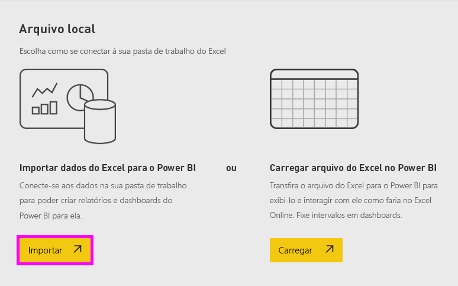

# Tutorial: Introdução ao serviço do Power BI (app.powerbi.com)
Esse tutorial ajuda você a começar a usar o *serviço do Power BI*. Para compreender como o serviço do Power BI se adapta às outras ofertas do Power BI, recomendamos que você comece lendo [O que o é Power BI](power-bi-overview.md).

Neste tutorial, você concluirá as etapas a seguir:

> [!div class="checklist"]
> * Localizar conteúdo de introdução para o serviço do Power BI.
> * Entrar em sua conta online do Power BI ou inscrever-se, caso ainda não tenha uma.
> * Abrir o serviço do Power BI.
> * Obter alguns dados e abra-os no modo de exibição de relatório.
> * Usar esses dados para criar visualizações e salvar como um relatório.
> * Criar um dashboard fixando blocos do relatório.
> * Adicionar outra visualização ao seu dashboard usando a ferramenta de linguagem natural de P e R.
> * Limpar os recursos excluindo o conjunto de dados, o relatório e o dashboard.

## Inscreva-se no serviço do Power BI
Se você não tiver uma conta do Power BI, [inscreva-se para uma avaliação gratuita do Power BI Pro](https://app.powerbi.com/signupredirect?pbi_source=web) antes de começar.

Depois de ter uma conta, insira *app.powerbi.com* no navegador para abrir o serviço do Power BI. 

Se estiver procurando ajuda com o Power BI Desktop, veja [Introdução ao Power BI Desktop](desktop-getting-started.md). Se você estiver procurando ajuda para o Power BI para Celulares, consulte [Aplicativos Power BI para dispositivos móveis](consumer/mobile/mobile-apps-for-mobile-devices.md).

> [!TIP]
> Prefere um curso de treinamento gratuito baseado no seu ritmo? [Registre-se em nosso curso Analisando e visualizando dados no EdX](http://aka.ms/edxpbi).

Visite nossa [playlist no YouTube](https://www.youtube.com/playlist?list=PL1N57mwBHtN0JFoKSR0n-tBkUJHeMP2cP). Um bom vídeo para começar é a *Introdução ao serviço do Power BI*:
> 
> <iframe width="560" height="315" src="https://www.youtube.com/embed/B2vd4MQrz4M" frameborder="0" allowfullscreen></iframe>
> 

## O que é o serviço do Power BI?
Às vezes, o serviço do Microsoft Power BI é chamado de Power BI online ou app.powerbi.com. O Power BI ajuda você a manter-se atualizado com relação às informações importantes. Os *dashboards* do serviço do Power BI ajudam a controlar o ritmo de sua empresa com um clique. Seus dashboards exibem *blocos* que você pode selecionar para abrir *relatórios* e explorar mais detalhadamente. Conecte-se a vários *conjuntos de dados* para reunir todos os dados relevantes em um único lugar. Precisa de ajuda para compreender os blocos de construção que compõem o Power BI? Confira [Conceitos básicos para designers no serviço do Power BI](service-basic-concepts.md).

Se você tiver dados importantes em arquivos do Excel ou CSV, é possível criar um painel do Power BI para se manter informado em qualquer lugar e compartilhar informações com outras pessoas.  Você tem uma assinatura de um aplicativo SaaS como o Salesforce?  Comece conectando-se ao Salesforce para criar um dashboard automaticamente com base nesses dados ou [confira todos os outros aplicativos SaaS](service-get-data.md) aos quais você pode se conectar. Se você faz parte de uma organização, veja se algum [aplicativo](service-create-distribute-apps.md) foi publicado para você.

Leia sobre todas as outras maneiras de [obter dados para o Power BI](service-get-data.md).

## Etapa 1: Obter dados
Veja um exemplo de como obter dados de um arquivo CSV. Deseja acompanhar este tutorial? [Baixar o arquivo CSV do Exemplo Financeiro](http://go.microsoft.com/fwlink/?LinkID=521962).

1. [Entre no Power BI](http://www.powerbi.com/). Não tem uma conta? Não se preocupe, você pode se inscrever para uma avaliação gratuita.
2. O Power BI abre no seu navegador. Selecione **Obter dados** na parte inferior da barra de navegação esquerda.

    A página **Obter Dados** é aberta.   

3. Na seção **Criar novo conteúdo**, selecione **Arquivos**. 
   
   
4.  Selecionar **Arquivo local**.
   
     

5. Navegue até o arquivo no seu computador e escolha **Abrir**.

5. Para este tutorial, vamos selecionar **Importar** para adicionar o arquivo do Excel como um conjunto de dados para que possamos usá-lo para criar relatórios e dashboards. Se você selecionar **Carregar**, a pasta de trabalho inteira será carregada no Power BI e você poderá abri-la e editá-la no Excel online.
   
   
6. Quando seu conjunto de dados estiver pronto, selecione **Exibir conjunto de dados** para abri-lo no editor de relatório. 

    

    Já que ainda não foi criada nenhuma visualização, a tela de relatório está em branco.

    

7. Observe que há uma opção para **Exibição de leitura** na barra de navegação superior. Porque você tem essa opção, isso significa que você está atualmente no modo de exibição de Edição. 

    

    Enquanto estiver no Modo de Exibição de Edição, você pode criar e modificar seus relatórios por ser *proprietário* do relatório. Ou seja, você é um *criador*. Quando você compartilha seu relatório com seus colegas, eles podem apenas interagir com o relatório na exibição de Leitura. Seus colegas são *consumidores*. Saiba mais sobre os [Modos de Exibição de Leitura e de Edição](consumer/end-user-reading-view.md).
    
    Uma ótima maneira de se familiarizar com o editor de relatório é [fazer um tour](service-the-report-editor-take-a-tour.md).
 

## Etapa 2: Começar a explorar o seu conjunto de dados
Agora que você se conectou aos dados, comece a explorar.  Quando encontrar algo interessante, você pode criar um dashboard para monitorá-lo e ver como ele é alterado ao longo do tempo. Vamos ver como isso funciona.
    
1. No editor de relatórios, usaremos o painel **Campos** no lado direito da página para criar uma visualização. Marque as caixas de seleção **Vendas brutas** e **Data**.
   
   

    O Power BI analisa os dados e cria um elemento de visualização. Se você selecionou **Data** primeiro, você verá uma tabela. Se você selecionou **Vendas Brutas** primeiro, verá um gráfico. 

2. Alterne para uma forma diferente de exibição dos dados. Vamos ver esses dados como um gráfico de linhas. Selecione o ícone de gráfico de linha do painel **Visualizações**.
   
   

3. Este gráfico parece interessante, então vamos *fixá-lo* em um dashboard. Focalize a visualização e selecione o ícone de alfinete. Quando fixar essa visualização, ela será armazenada em seu dashboard e mantida atualizada para que você possa acompanhar rapidamente o valor mais recente.
   
   

4. Como esse relatório é novo, você é solicitado a salvá-lo antes de fixar uma visualização no dashboard. Dê um nome ao seu relatório (por exemplo, *Vendas ao longo do tempo*) e selecione **Salvar e continuar**. 
   
   
   
5. Fixe o gráfico de linha ao novo dashboard e dê a ele o nome de *Exemplo financeiro para tutorial*. 
   
   
   
6. Selecione **Fixar**.
   
    Uma mensagem de êxito (perto do canto superior direito) informa que a visualização foi adicionada, como um bloco, ao dashboard.
   
    

7. Selecione **Ir para dashboard** para ver o gráfico de linha que você fixou como um bloco a seu novo dashboard. Melhore ainda mais a aparência do seu dashboard adicionando mais blocos de visualização e [renomeando, redimensionando, vinculando e reposicionando seus blocos](service-dashboard-edit-tile.md).
   
   
   
8. Selecione o novo bloco em seu dashboard para retornar ao relatório. O Power BI o leva de volta para o editor de relatório no Modo de Exibição de Leitura. Para voltar ao Modo de Exibição de Edição, selecione **Editar relatório** na barra de navegação superior. Quando você estiver na exibição Editar, você pode continuar a explorar e fixar blocos. 

## Etapa 3:  Continuar a exploração com P e R (consulta em linguagem natural)
1. Para explorar seus dados rapidamente, faça uma pergunta na caixa P e R. A caixa de pergunta de P e R está localizada na parte superior do dashboard (**Fazer uma pergunta sobre seus dados**) e na barra de navegação superior do seu relatório (**Fazer uma pergunta**). Por exemplo, digite *qual segmento tinha mais receita* na caixa P e R.
   
   

2. O P e R pesquisa uma resposta e a apresenta na forma de visualização. Selecione o ícone fixar  para mostrar esta visualização em seu dashboard.
3. Fixe a visualização no dashboard **Exemplo financeiro para tutorial**.
   
    

4. Volte ao seu dashboard, no qual você vê o novo bloco.

   

## Limpar recursos
Agora que você já concluiu o tutorial, é possível excluir o conjunto de dados, o relatório e o dashboard. 

1. Na barra de navegação esquerda, selecione **Meu workspace**.
2. Selecione a guia **Conjuntos de dados** e localize o conjunto de dados importado para este tutorial.  
3. Selecione as reticências (…) > **Excluir**.

    

    Quando você exclui o conjunto de relatórios, o Power BI também exclui o relatório e o dashboard. 

## Próximas etapas

> [!div class="nextstepaction"]
> [Conectar-se aos serviços online que você usa com o Power BI](service-connect-to-services.md)

