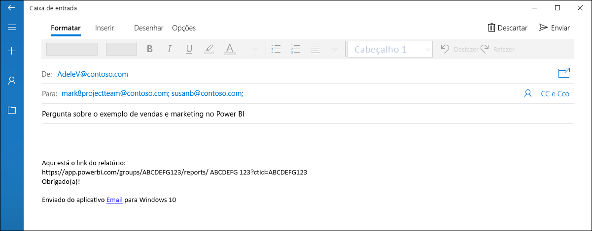

# Definir informações de contato para relatórios e painéis no serviço do Power BI
Este artigo ensina como definir informações de contato para um painel ou relatório no serviço do Power BI.

> [!NOTE]
> É possível definir informações de contato para itens em um workspace clássico ou novo. Não é possível definir informações de contato para itens no Meu Workspace. O cartão de informações é mostrado quando um relatório ou painel é exibido na [nova aparência](service-new-look.md).

Você pode adicionar vários usuários ou grupos ao contato de um item. Eles podem ser:
* Uma pessoa
* Um grupo do Office 365
* Um grupo de segurança habilitado para email
* Uma lista de distribuição

Por padrão, a pessoa que cria um novo relatório ou painel é definida como o contato. Se você definir um valor, ele substituirá o padrão. É claro que você pode remover todas as pessoas ou grupos da lista de contatos. Quando você fizer isso para workspaces clássicos, será mostrado o Grupo do Office 365 do workspace. Para novos workspaces de experiências, será usada a [lista de contatos do workspace](service-create-the-new-workspaces.md#workspace-contact-list). Se a lista de contatos do workspace não estiver definida, os administradores de workspace serão mostrados.

As informações de contato são mostradas para as pessoas que visualizam o item. 

 

Quando você clica na lista de contatos, um email é criado para que você possa fazer perguntas ou obter ajuda. 

 
 
As informações da lista de contatos também são usadas em outros locais. Por exemplo, são mostradas em alguns cenários de erro na caixa de diálogo de erro. Mensagens de email automatizadas relacionadas ao item, como solicitações de acesso, são enviadas para a lista de contatos. 

> [!NOTE]
> Ao publicar um aplicativo, as informações de contato de itens individuais são definidas para a pessoa que publicou ou atualizou o aplicativo. Você pode definir a URL de suporte do aplicativo para que os usuários do aplicativo obtenham a ajuda de que precisam.

## Definir informações de contato para um relatório
1. Em seu workspace, selecione a guia **Relatórios**.
2. Localize o relatório desejado e selecione o ícone **Configurações**.
3. Localize o campo de entrada **Contato** e defina um valor.

     

## Definir informações de contato para um painel
1. Em seu workspace, selecione a guia **Dashboards**.
2. Localize o painel desejado e selecione o ícone **Configurações**
3. Localize o campo de entrada **Contato** e defina um valor.

     

## Limitações e considerações
* O contato é definido automaticamente para novos itens criados no serviço do Power BI. Os itens existentes mostrarão o padrão do workspace.
* Você pode definir qualquer usuário ou grupo na lista de contatos, mas eles não recebem automaticamente a permissão para o item. Use o compartilhamento ou dê ao usuário que precise dele acesso ao workspace por meio de uma função. 

## Próximas etapas

Mais perguntas? [Experimente a Comunidade do Power BI](http://community.powerbi.com/)
