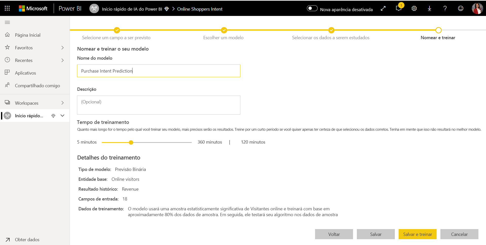
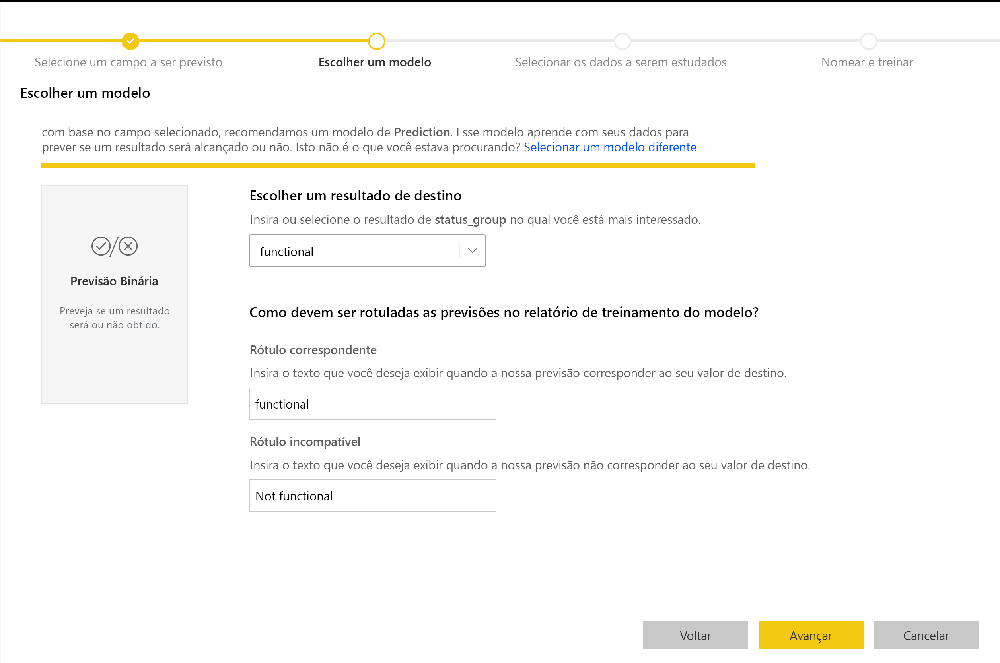

# Machine Learning Automatizada no Power BI (Versão Prévia)

A AutoML (Machine Learning Automatizada) para fluxos de trabalho permite que os analistas de negócios treinem, validem e chamem modelos de Machine Learning diretamente no Power BI. Ela apresenta uma experiência simples para criação de um novo modelo de ML, em que os analistas podem usar seus fluxos de dados para especificar os dados de entrada para treinamento do modelo. O serviço extrai automaticamente os recursos mais relevantes, seleciona um algoritmo apropriado e ajusta e valida o modelo de ML. Após o treinamento de um modelo, o Power BI gera automaticamente um relatório que inclui os resultados da validação e explica o desempenho e os resultados aos analistas. Depois, o modelo pode ser chamado em qualquer dado novo ou atualizado dentro do fluxo de dados.

A Machine Learning Automatizada está disponível apenas para fluxos de entrada hospedados no Power BI Premium e capacidades Incorporadas. Nesta versão prévia, a AutoML permite treinar modelos de machine learning para modelos de Previsão Binária, Classificação e Regressão.

## Como trabalhar com a AutoML

Os [fluxos de dados do Power BI](service-dataflows-overview.md) oferecem preparação de dados de autoatendimento para Big Data. A AutoML possibilita aproveitar seus esforços de preparação de dados para criar modelos de machine learning diretamente no Power BI.

A AutoML no Power BI permite que os analistas de dados usem fluxos de dados para criar modelos de machine learning com uma experiência simplificada, usando apenas habilidades do Power BI. A maior parte da ciência de dados por trás da criação dos modelos de ML é automatizada pelo Power BI, com proteções para garantir que o modelo produzido tenha uma boa qualidade, e visibilidade para fornecer informações completas sobre o processo usado para criar seu modelo de ML.

A AutoML dá suporte à criação de modelos de **Previsão Binária**, **Classificação** e **Regressão** para fluxos de dados. Esses são tipos de modelos de machine learning supervisionados, o que significa que eles aprendem com os resultados conhecidos das observações anteriores para prever os resultados de outras observações. O conjunto de dados de entrada para treinamento de um modelo da AutoML é um conjunto de registros **rotulados** com os resultados conhecidos.

A AutoML no Power BI integra a [ML automatizada](https://docs.microsoft.com/azure/machine-learning/service/concept-automated-ml) do [Serviço do Azure Machine Learning](https://docs.microsoft.com/azure/machine-learning/service/overview-what-is-azure-ml) para criar seus modelos de ML. No entanto, você não precisa de uma assinatura do Azure para usar a AutoML no Power BI. O processo de treinamento e hospedagem de modelos de ML é totalmente gerenciado pelo serviço do Power BI.

Após o treinamento de um modelo de ML, a AutoML gera automaticamente um relatório do Power BI que explica o provável desempenho do seu modelo de ML. A AutoML enfatiza a capacidade de explicação, destacando os principais influenciadores entre suas entradas que induzem as previsões retornadas por seu modelo. O relatório também inclui as principais métricas para o modelo, dependendo do tipo de modelo de ML.

Outras páginas do relatório gerado mostram o resumo estatístico do modelo e os detalhes do treinamento. O resumo estatístico interessa aos usuários que desejam ver as medidas padrão de ciência de dados do desempenho do modelo. Os detalhes de treinamento resumem todas as iterações executadas para criar seu modelo, com os parâmetros de modelagem associados. Também descrevem como cada entrada foi usada para criar o modelo de ML.

Em seguida, é possível aplicar seu modelo de ML aos dados para pontuação. Após a atualização do fluxo de dados, as previsões do seu modelo de ML são aplicadas automaticamente aos seus dados. O Power BI também inclui uma explicação individualizada para cada pontuação de previsão específica produzida pelo modelo de ML.

## Criar um modelo de machine learning

Esta seção descreve como criar um modelo de aprendizado da AutoML. 

### Preparação de dados para criar um modelo de ML

Para criar um modelo de machine learning no Power BI, primeiro é preciso criar um fluxo de dados para os dados com as informações de resultado histórico, que são usadas para treinar o modelo de ML. Para saber mais sobre como configurar seu fluxo de dados, confira [Preparação de dados de autoatendimento no Power BI](service-dataflows-overview.md).

Na versão atual, o Power BI usa dados de uma única entidade para treinar o modelo de ML. Portanto, se os dados históricos consistem em várias entidades, é preciso unir manualmente os dados em uma única entidade de fluxo de dados. Adicione também colunas calculadas para todas as métricas de negócios que possam representar previsões sólidas para o resultado que você está tentando prever.

A AutoML tem requisitos de dados específicos para treinar um modelo de machine learning. Esses requisitos estão descritos nas seções abaixo, com base nos respectivos tipos de modelo.

### Configurar as entradas do modelo de ML

Para criar um modelo de AutoML, selecione o ícone de ML na coluna **Ações** da entidade de fluxo de dados com os dados históricos e selecione **Adicionar um modelo de machine learning**.

Uma experiência simplificada é iniciada, composta por um assistente que orienta você pelo processo de criação do modelo de ML. O assistente inclui as etapas simples a seguir.

1. Selecione a entidade com os dados de resultado histórico e o campo para o qual você quer uma previsão
2. Escolha um tipo de modelo com base no tipo de previsão que você gostaria de ver
3. Selecione as entradas que deseja que o modelo use como sinais de previsão
4. Nomeie seu modelo e salve sua configuração

O campo de resultado histórico identifica o atributo de rótulo para treinar o modelo de ML, mostrado na imagem a seguir.

Ao especificar o campo de resultado histórico, a AutoML analisa os dados do rótulo para identificar os tipos de modelos de ML que podem ser treinados para esses dados e sugere o tipo de modelo de ML mais provável que pode ser treinado. 

> [!NOTE]
> Talvez alguns tipos de modelo não tenham suporte para os dados que você selecionou.

A AutoML também analisa todos os campos na entidade selecionada para sugerir as entradas que podem ser usadas para treinar o modelo de ML. Esse processo é aproximado e tem base na análise estatística, portanto, você deve examinar as entradas usadas. As entradas que dependem do campo de resultado histórico (ou do campo de rótulo) não devem ser usadas para treinar o modelo de ML, pois elas afetarão o desempenho.

Na etapa final, nomeie o modelo e salve suas configurações.

Neste estágio, você receberá uma solicitação para atualizar o fluxo de dados, o que inicia o processo de treinamento do modelo de ML.

### Treinamento do modelo de ML

O treinamento dos modelos de AutoML faz parte da atualização do fluxo de dados. Primeiro, a AutoML prepara seus dados para o treinamento.

A AutoML divide os dados históricos fornecidos em conjuntos de dados de treinamento e de teste. O conjunto de dados de teste é um conjunto de controle usado para validar o desempenho do modelo após o treinamento. Eles são executados como entidades de **Treinamento e Teste** no fluxo de dados. A AutoML usa validação cruzada para validar o modelo.

Em seguida, cada campo de entrada é analisado e a imputação é aplicada, inserindo valores substituídos para cada valor ausente. A AutoML usa algumas estratégias de imputação diferentes. Em seguida, qualquer amostragem e normalização necessárias são aplicadas aos seus dados.

A AutoML aplica várias transformações em cada campo de entrada selecionado com base em seu tipo de dados e em suas propriedades estatísticas. A AutoML usa essas transformações para extrair recursos para uso no treinamento do seu modelo de ML.

O processo de treinamento de modelos da AutoML é composto por até 50 iterações com algoritmos de modelagem variados e configurações de hiperparâmetros para localizar o modelo com o melhor desempenho. O desempenho de cada um desses modelos é avaliado pela validação com o conjunto de dados de teste de controle. Durante essa etapa de treinamento, a AutoML cria vários pipelines para treinamento e validação dessas iterações. O processo de avaliação do desempenho dos modelos pode demorar um pouco, desde alguns minutos a algumas horas, dependendo do tamanho do seu conjunto de dados e dos recursos de capacidade dedicada disponíveis.

Em alguns casos, o modelo final gerado pode usar o ensemble learning, em que vários modelos são usados para fornecer melhor desempenho de previsão.

### Capacidade de explicação do modelo de AutoML

Após o treinamento do modelo, a AutoML analisará a relação entre os recursos de entrada e a saída do modelo. Ele avalia a magnitude e a direção da alteração na saída do modelo para o conjunto de dados de teste de controle para cada recurso de entrada. Isso é conhecido como *importância do recurso*.

### Relatório de modelo da AutoML

A AutoML gera um relatório do Power BI que resume o desempenho do modelo durante a validação e fornece a importância do recurso global. O relatório resume os resultados da aplicação do modelo de ML aos dados de teste de controle e da comparação das previsões com os valores de resultado conhecidos.

Examine o relatório de modelo para entender seu desempenho. Você também pode validar se os principais influenciadores do modelo estão alinhados com os insights de negócios sobre os resultados conhecidos.

Os gráficos e medidas usados para descrever o desempenho do modelo no relatório dependem do tipo de modelo. Veja uma descrição desses gráficos e medidas de desempenho nas seções a seguir.

Outras páginas do relatório podem descrever medidas estatísticas sobre o modelo de uma perspectiva de ciência de dados. Por exemplo, o relatório de **Previsão Binária** inclui um gráfico de lucro e a curva de ROC do modelo.

Os relatórios também incluem uma página de **Detalhes de Treinamento** que inclui uma descrição de como o modelo foi treinado e inclui um gráfico que descreve o desempenho do modelo em cada uma das execuções de iterações.

Outra seção nesta página descreve como o método de imputação foi usado para preencher valores ausentes nos campos de entrada, bem como a forma como cada campo de entrada foi transformado para extrair os recursos usados no modelo. Também inclui os parâmetros usados pelo modelo final.

Se o modelo produzido usar o ensemble learning, a página **Detalhes do Treinamento** também incluirá uma seção que descreve o peso de cada modelo de constituinte no ensemble, bem como seus parâmetros.

## Aplicação do modelo de AutoML

Se você estiver satisfeito com o desempenho do modelo de ML criado, poderá aplicá-lo aos dados novos ou atualizados quando o fluxo de dados for atualizado. Faça isso no relatório de modelo, selecionando o botão **Aplicar** no canto superior direito.

Para aplicar o modelo de ML, você deve especificar o nome da entidade à qual ele deve ser aplicado e um prefixo para as colunas que serão adicionadas a essa entidade para a saída do modelo. O prefixo padrão para os nomes de coluna é o nome do modelo. A função *Apply* pode incluir parâmetros adicionais específicos ao tipo de modelo.

A aplicação do modelo de ML cria uma nova entidade de fluxo de dados com o sufixo **enriched <nome_do_modelo>** . Por exemplo, se você aplicar o modelo _PurchaseIntent_ à entidade _OnlineShoppers_, a saída gerará a **OnlineShoppers enriched PurchaseIntent**.

Atualmente, a entidade de saída não pode ser usada para visualizar os resultados do modelo de ML no editor do Power Query. As colunas de saída sempre mostram null como resultado. Para exibir os resultados, uma segunda entidade de saída com o sufixo **enriched <nome_do_modelo> Preview** é criada quando o modelo é aplicado.

Você deve atualizar o fluxo de dados para visualizar os resultados no Editor de Consultas.

Ao aplicar o modelo, a AutoML sempre mantém suas previsões atualizadas após a renovação do fluxo de dados.

A AutoML também inclui uma explicação individualizada para cada linha classificada na entidade de saída.

Para usar os insights e previsões do modelo de ML em um relatório do Power BI, você pode se conectar à entidade de saída no Power BI Desktop usando o conector de **fluxo de dados**.

## Modelos de Previsão Binária

Os modelos de Previsão Binária, mais formalmente conhecidos como **modelos de classificação binária**, são usados para classificar um conjunto de dados em dois grupos. Eles são usados para prever eventos que podem ter um resultado binário, por exemplo, se uma oportunidade de vendas será convertida, se uma conta será perdida, se uma fatura será paga dentro do prazo, se uma transação é fraudulenta e assim por diante.

Como o resultado é binário, o Power BI espera que o rótulo de um modelo de previsão binário seja um booliano, com os resultados conhecidos rotulados como **true** ou **false**. Por exemplo, em um modelo de conversão de oportunidade de vendas, as oportunidades de vendas que foram conquistadas serão rotuladas como true, as que forem perdidas serão rotuladas como false e as oportunidades de vendas em aberto serão rotuladas como null.

A saída de um modelo de Previsão Binária é uma pontuação de probabilidade, que identifica a probabilidade de o resultado correspondente ao valor do rótulo ser true.

### Treinar um modelo de Previsão Binária

Para criar um modelo de Previsão Binária, a entidade de entrada que contém os dados de treinamento deve ter um campo Booliano como o campo de resultado histórico para identificar os últimos resultados conhecidos.

Pré-requisitos:

* Um campo Booliano deve ser usado como o campo de resultado histórico
* É necessário um mínimo de 50 linhas de dados históricos para cada classe de resultados

Em geral, se os resultados passados são identificados por campos de um tipo de dados diferente, é possível adicionar uma coluna calculada para transformá-los em um Booliano usando o Power Query.

O processo de criação de um modelo de Previsão Binária segue as mesmas etapas que outros modelos de AutoML, descritos na seção **Configurar as entradas do modelo de ML** acima.

### Relatório do modelo de Previsão Binária

O modelo de Previsão Binária produz como saída uma probabilidade de que um registro alcançará o resultado definido pelo valor do rótulo Booliano como true. O relatório inclui uma segmentação para o limite de probabilidade, que influencia como as pontuações acima e abaixo do limite de probabilidade serão interpretadas.

O relatório descreve o desempenho do modelo em termos de *Verdadeiros Positivos*, *Falsos Positivos*, *Verdadeiros Negativos* e *Falsos Negativos*. Verdadeiros Positivos e Verdadeiros Negativos são resultados previstos corretamente para as duas classes nos dados do resultado. Falsos Positivos são resultados que tinham o rótulo Booliano real de valor False, mas que foram previstos como True. Por outro lado, Falsos Negativos são resultados em que o valor real do rótulo Booliano era True, mas que foram previstos como False.

Medidas, como Precisão e Recall, descrevem o efeito do limite de probabilidade nos resultados previstos. Você pode usar a segmentação de limite de probabilidade para selecionar um limite que alcance um comprometimento equilibrado entre Precisão e Recall.

A página **Relatório de Precisão** do relatório de modelo inclui o gráfico *Ganhos Cumulativos* e a curva ROC para o modelo. Essas são medidas estatísticas de desempenho do modelo. Os relatórios incluem descrições dos gráficos mostrados.

### Aplicar um modelo de Previsão Binária

Para aplicar um modelo de Previsão Binária, você deve especificar a entidade com os dados aos quais você quer aplicar as previsões do modelo de ML. Outros parâmetros incluem o prefixo de nome da coluna de saída e o limite de probabilidade para classificação do resultado previsto.

Quando um modelo de Previsão Binária é aplicado, ele adiciona três colunas de saída à entidade de saída enriquecida. São elas: **PredictionScore**, **PredictionOutcome** e **PredictionExplanation**. Os nomes de coluna na entidade têm o prefixo especificado quando o modelo é aplicado.

A coluna **PredictionOutcome** contém o rótulo do resultado previsto. Registros com probabilidades que excedem o limite são previstos com "probabilidade de alcançar o resultado", e aqueles que ficam abaixo são previstos com "pouca probabilidade de alcançar o resultado".

A coluna **PredictionExplanation** contém uma explicação com a influência específica que os recursos de entrada tinham no **PredictionScore**. Esta é uma coleção formatada em JSON de pesos dos recursos de entrada para a previsão.

## Modelos de classificação

Os modelos de classificação são usados para classificar um conjunto de dados em vários grupos ou classes.  Eles são usados para prever eventos que podem ter um dentre vários resultados possíveis, como se um cliente provavelmente terá um Valor de Tempo de Vida muito alto, alto, médio ou baixo; se o risco do padrão é Alto, Moderado, Baixo ou Muito Baixo e assim por diante.

A saída de um modelo de Classificação é uma pontuação de probabilidade, que identifica a probabilidade de um registro atingir os critérios para uma determinada classe.

### Treinar um modelo de Classificação

A entidade de entrada que contém seus dados de treinamento para um modelo de Classificação deve ter um campo de cadeia de caracteres ou numérico como o campo de resultado histórico, que identificará os últimos resultados conhecidos.

Pré-requisitos:

* É necessário um mínimo de 50 linhas de dados históricos para cada classe de resultados

O processo de criação de um modelo de Classificação segue as mesmas etapas que outros modelos de AutoML, descritos na seção **Configurar as entradas do modelo de ML** acima.

### Relatório do modelo de Classificação

O relatório do modelo de Classificação é produzido pela aplicação do modelo de ML nos dados de teste de controle e pela comparação da classe prevista para um registro com a classe real conhecida.

O relatório de modelo inclui um gráfico que inclui a divisão dos registros classificados correta e incorretamente para cada classe conhecida.

Um detalhamento adicional específico à classe permite uma análise de como as previsões de uma classe conhecida são distribuídas. Isso inclui as outras classes nas quais os registros dessa classe conhecida provavelmente serão classificados erroneamente.

A explicação do modelo no relatório também inclui os principais previsores de cada classe.

O relatório do modelo de Classificação também inclui uma página de Detalhes do Treinamento semelhante às páginas de outros tipos de modelo, conforme descrito na seção **Relatório do modelo de AutoML** anteriormente neste artigo.

### Aplicar um modelo de classificação

Para aplicar um modelo de ML de Classificação, você deve especificar a entidade com os dados de entrada e o prefixo de nome da coluna de saída.

Quando um modelo de Classificação é aplicado, ele adiciona três colunas de saída à entidade de saída enriquecida. São elas: **PredictionScore**, **PredictionClass** e **PredictionExplanation**. Os nomes de coluna na entidade têm o prefixo especificado quando o modelo é aplicado.

A coluna **PredictionClass** contém a classe previsível mais provável para o registro. A coluna **PredictionScore** contém a lista de pontuações de probabilidade para o registro de cada classe possível.

A coluna **PredictionExplanation** contém uma explicação com a influência específica que os recursos de entrada tinham no **PredictionScore**. Esta é uma coleção formatada em JSON de pesos dos recursos de entrada para a previsão.

## Modelos de Regressão

Os modelos de Regressão são usados para prever um valor, como a receita provável que será obtida de uma oferta de vendas, o valor de tempo de vida de uma conta, a quantia de uma fatura a receber que provavelmente será paga, a data na qual uma fatura pode ser paga e assim por diante.

A saída de um modelo de Regressão é o valor previsto.

### Treinar um modelo de Regressão

A entidade de entrada que contém os dados de treinamento para um modelo de Regressão deve ter um campo numérico como o campo de resultado histórico, o qual identificará os últimos valores de resultados conhecidos.

Pré-requisitos:

* É necessário um mínimo de 100 linhas de dados históricos para um modelo de Regressão

O processo de criação de um modelo de Regressão segue as mesmas etapas que outros modelos de AutoML, descritos na seção **Configurar as entradas do modelo de ML** acima.

### Relatório do modelo de Regressão

Assim como outros relatórios do modelo de AutoML, o relatório de Regressão tem base nos resultados da aplicação do modelo aos dados de teste de controle.

O relatório modelo inclui um gráfico que compara os valores previstos com o valor real. Neste gráfico, a distância da diagonal indica o erro na previsão.

O gráfico de erro residual mostra a distribuição do percentual de erro médio para valores diferentes no conjunto de dados de teste de controle. O eixo horizontal representa a média do valor real do grupo, com o tamanho da bolha mostrando a frequência ou a contagem de valores nesse intervalo. O eixo vertical é o erro residual médio.

O relatório do modelo de Regressão também inclui uma página de Detalhes do Treinamento como os relatórios de outros tipos de modelo, conforme descrito na seção **Relatório do modelo de AutoML** acima.

### Aplicar um modelo de Regressão

Para aplicar um modelo de ML de Regressão, você deve especificar a entidade com os dados de entrada e o prefixo de nome da coluna de saída.

Quando um modelo de Regressão é aplicado, ele adiciona duas colunas de saída à entidade de saída enriquecida. São elas: **PredictionValue** e **PredictionExplanation**. Os nomes de coluna na entidade têm o prefixo especificado quando o modelo é aplicado.

A coluna **PredictionValue** contém o valor previsto para o registro com base nos campos de entrada. A coluna **PredictionExplanation** contém uma explicação com a influência específica que os recursos de entrada tinham no **PredictionValue**. Esta é uma coleção dos pesos dos recursos de entrada formatada em JSON.

## Próximas etapas

Este artigo fornece uma visão geral da Machine Learning Automatizada para fluxos de dados no serviço do Power BI. Os artigos a seguir também podem ser úteis.

* [Tutorial: Criar um modelo de Machine Learning no Power BI (versão prévia)](service-tutorial-build-machine-learning-model.md)
* [Tutorial: Como usar os Serviços Cognitivos no Power BI](service-tutorial-use-cognitive-services.md)
* [Tutorial: Invocar um modelo de Machine Learning Studio no Power BI (versão prévia)](service-tutorial-invoke-machine-learning-model.md)
* [Serviços Cognitivos no Power BI (versão prévia)](service-cognitive-services.md)
* [Integração do Azure Machine Learning no Power BI (versão prévia)](service-machine-learning-integration.md)

Para saber mais sobre os fluxos de dados, leia estes artigos:
* [Criação e uso de fluxos de dados no Power BI](service-dataflows-create-use.md)
* [Como usar entidades computadas no Power BI Premium](service-dataflows-computed-entities-premium.md)
* [Como usar fluxos de dados com fontes de dados locais](service-dataflows-on-premises-gateways.md)
* [Recursos de desenvolvedor para fluxos de dados do Power BI](service-dataflows-developer-resources.md)
* [Integração entre fluxos de dados e o Azure Data Lake (versão prévia)](service-dataflows-azure-data-lake-integration.md)

