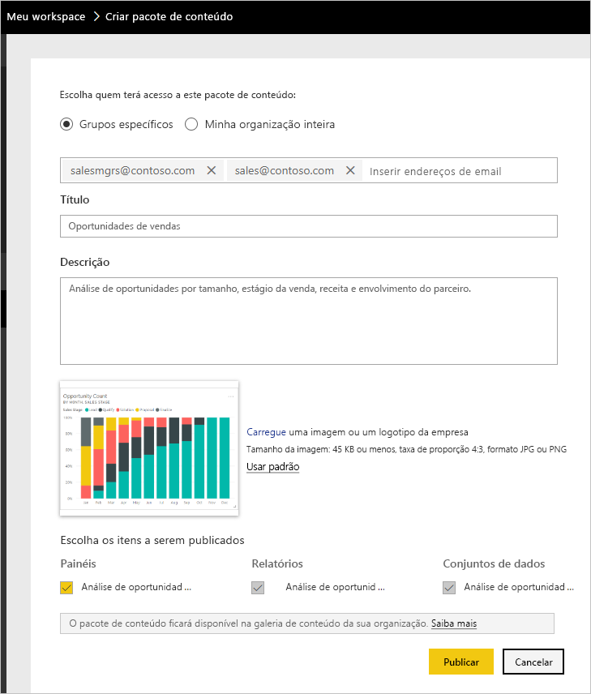

# Tutorial: Criar e publicar um pacote de conteúdo organizacional do Power BI

Neste tutorial, você criará um pacote de conteúdo organizacional, dará acesso a um grupo específico e o publicará na biblioteca do pacote de conteúdo de sua organização no Power BI.

Criar pacotes de conteúdo é diferente de compartilhar dashboards ou colaborar neles em um grupo. Leia [Maneiras de compartilhar seu trabalho no Power BI](service-how-to-collaborate-distribute-dashboards-reports.md) para decidir sobre qual é a melhor opção para a sua situação.

A criação de um pacote de conteúdo organizacional requer uma [conta Power BI Pro](https://powerbi.microsoft.com/pricing) para você e seus colegas.

> [!NOTE]
> Não é possível criar ou instalar pacotes de conteúdo organizacional na nova versão prévia de experiências de workspace. Se você ainda não começou, agora é um bom momento para atualizar seus pacotes de conteúdo para aplicativos. Saiba [mais sobre a nova experiência de workspace](service-create-the-new-workspaces.md).

## Criar e publicar um pacote de conteúdo

Imagine que você é o Gerente de Versão da Contoso e está se preparando para o lançamento de um novo produto.  Você criou um dashboard com relatórios que você gostaria de compartilhar. Outros funcionários que gerenciam o lançamento podem achá-los úteis. Você quer uma maneira de empacotar o dashboard e os relatórios como uma solução para uso de seus colegas.

Quer me acompanhar? No [serviço do Power BI](https://powerbi.com), acesse **Meu Workspace**. Em seguida, acesse **Obter Dados** > **Exemplos** > **Exemplo de Análise de Oportunidades** > **Conectar** para obter sua própria cópia.

1. No painel de navegação esquerdo, selecione **Workspaces** > **Meus workspaces**.

1. Na barra de navegação superior, selecione o ícone de engrenagem  > **Criar pacote de conteúdo**.

   

1. Na janela **Criar pacote de conteúdo**, insira as seguintes informações.  

   Tenha em mente que a biblioteca de pacotes de conteúdo da sua organização pode ficar cheia rapidamente. A biblioteca pode acabar com centenas de pacotes de conteúdo publicados para a organização ou para os grupos. Reserve um tempo para dar um nome significativo ao seu pacote de conteúdo, adicionar uma descrição válida e selecionar o público-alvo correto.  Use palavras que tornem seu pacote de conteúdo fácil de encontrar por meio de pesquisa. Isso facilita a localização no futuro.

      

    1. Selecione **Grupos Específicos**.

    1. Insira os endereços de email completos de indivíduos, [grupos do Office 365](https://support.office.com/article/Create-a-group-in-Office-365-7124dc4c-1de9-40d4-b096-e8add19209e9), grupos de distribuição ou grupos de segurança. Por exemplo: salesmgrs@contoso.com; sales@contoso.com

        Neste tutorial, experimente usar o endereço de email do seu grupo.

    1. Nomeie o pacote de conteúdo como *Oportunidades de Vendas*.

        > [!TIP]
        > Considere incluir o nome do dashboard no nome do pacote de conteúdo. Dessa forma, seus colegas podem encontrar o dashboard mais facilmente depois que se conectarem ao pacote de conteúdo.

    1. Recomendado: Adicione uma descrição. Isso ajuda os colegas de trabalho a encontrar mais facilmente os pacotes de conteúdo de que precisam. Além de uma descrição, adicione palavras-chave que nossos colegas de trabalho possam usar para pesquisar neste pacote de conteúdo. Inclua informações de contato, caso seus colegas de trabalho tenham alguma dúvida ou precisem de ajuda.

    1. Carregue uma imagem ou um logotipo para facilitar a localização do pacote de conteúdo pelos membros do grupo.

        É mais rápido verificar se há uma imagem do que verificar se há texto. A captura de tela mostra uma imagem do bloco do gráfico de colunas **Contagem de Oportunidade**.

    1. Selecione o painel **Exemplo de Análise de Oportunidade** para adicioná-lo ao pacote de conteúdo.

        O Power BI adiciona automaticamente o relatório associado e um conjunto de dados. Você poderá adicionar outros, se desejar.

       > [!NOTE]
       > O Power BI lista somente os dashboards, os relatórios, os conjuntos de dados e as pastas de trabalho que você pode editar. Portanto, o aplicativo não exibe nenhum que foi compartilhado com você.

   1. Se você tiver pastas de trabalho do Excel, veja-as em **Relatórios**, com um ícone do Excel. Você também pode adicioná-las ao pacote de conteúdo.

      

      > [!NOTE]
      > Se os membros do grupo não conseguirem exibir a pasta de trabalho do Excel, [compartilhe a pasta de trabalho com eles no OneDrive for Business](https://support.office.com/article/Share-documents-or-folders-in-Office-365-1fe37332-0f9a-4719-970e-d2578da4941c).

1. Selecione **Publicar** para adicionar o pacote de conteúdo à biblioteca de pacote de conteúdo organizacional do grupo.  

   Você vê uma mensagem de êxito quando ele é publicado com êxito.

1. Quando membros do seu grupo acessam **Obter Dados** > **Pacotes de Conteúdo Organizacional**, eles veem seu pacote de conteúdo.

   

   > [!TIP]
   > A URL exibida no navegador é um endereço exclusivo para esse pacote de conteúdo.  Quer dizer a seus colegas de trabalho sobre esse novo pacote de conteúdo?  Cole a URL em um email.

1. Quando seus membros de grupo selecionam **Conectar**, eles podem [exibir e trabalhar com seu pacote de conteúdo](service-organizational-content-pack-copy-refresh-access.md).

## Próximas etapas

* [Introduzir os pacotes de conteúdo organizacional no Power BI](service-organizational-content-pack-introduction.md).

* [Gerenciar, atualizar e excluir pacotes de conteúdo organizacional](service-organizational-content-pack-manage-update-delete.md).

* [Publicar um aplicativo no Power BI](service-create-distribute-apps.md).

* [O que é o OneDrive for Business?](https://support.office.com/article/What-is-OneDrive-for-Business-187f90af-056f-47c0-9656-cc0ddca7fdc2)

* Mais perguntas? [Experimente a Comunidade do Power BI](http://community.powerbi.com/)
