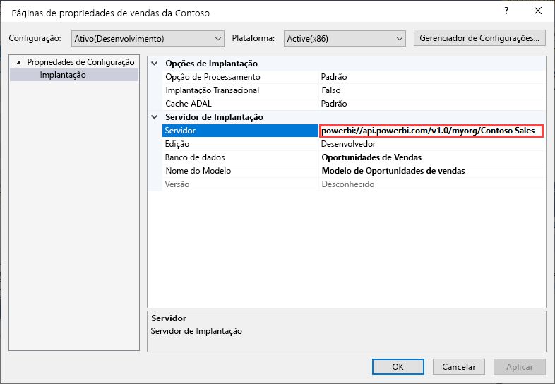
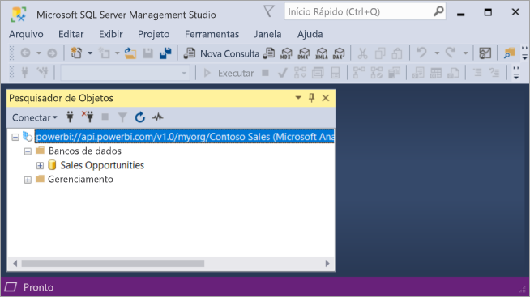

# Conectividade de conjunto de dados com o ponto de extremidade XMLA (Versão prévia)

Os espaços de trabalho e conjuntos de clientes do Power BI Premium no nível de compatibilidade 1500 e superior dão suporte à conectividade de plataforma aberta de aplicativos e ferramentas de cliente da Microsoft e de terceiros usando um *ponto de extremidade XMLA*.

> [!NOTE]
> Esse recurso está em **Versão prévia**. Recursos em versão prévia não devem ser usados em um ambiente de produção. Determinadas funcionalidades, o suporte e a documentação são limitados.  Confira os detalhes nos [Termos do OST (Microsoft Online Services)](https://www.microsoft.com/licensing/product-licensing/products?rtc=1).

## O que é um ponto de extremidade XMLA?

O Power BI Premium usa o protocolo XMLA ([XML for Analysis](https://docs.microsoft.com/analysis-services/xmla/xml-for-analysis-xmla-reference?view=power-bi-premium-current)) para a comunicação entre aplicativos cliente e o mecanismo que gerencia seus espaços de trabalho e conjuntos de dados do Power BI. Essa comunicação é feita por meio do que é normalmente conhecido como pontos de extremidade XMLA. O XMLA é o mesmo protocolo de comunicação usado pelo mecanismo do Microsoft Analysis Services, que, nos bastidores, executa a modelagem semântica, a governança, o ciclo de vida e o gerenciamento de dados do Power BI.

Por padrão, a conectividade *somente leitura* usando o ponto de extremidade está habilitada para a **Carga de trabalho dos conjuntos de dados** em uma capacidade. Com dados somente leitura, as ferramentas e os aplicativos de visualização de dados podem consultar dados de modelos, metadados, eventos e esquema do conjunto de dados. As operações de *leitura/gravação* usando o ponto de extremidade podem ser habilitadas, fornecendo gerenciamento, governança, modelagem semântica avançada, depuração e monitoramento adicionais para os conjunto de dados. Com a leitura/gravação habilitadas, os conjuntos de dados do Power BI Premium têm mais paridade com processos e ferramentas de modelagem de tabela de nível empresarial do Azure Analysis Services e do SQL Server Analysis Services.

## Ferramentas de gerenciamento e modelagem de dados

Essas são algumas das ferramentas mais comuns usadas com o Azure Analysis Services e o SQL Server Analysis Services, e agora têm o suporte de conjuntos do Power BI Premium:

**Projetos do Visual Studio com Analysis Services**  – também conhecido como SQL Server Data Tools ou simplesmente **SSDT**, é uma ferramenta de criação de modelo de nível empresarial para modelos tabulares do Analysis Services. As extensões de projetos do Analysis Services têm suporte em todas as edições do Visual Studio 2017 e posteriores, incluindo a edição gratuita da Comunidade. A versão da extensão 2.9.6 ou superior é necessária para implantar modelos tabulares em um espaço de trabalho Premium. Ao implantar em um espaço de trabalho Premium, o modelo deve ter um nível de compatibilidade 1500 ou superior. A carga de trabalho de conjuntos de dados exige XMLA somente leitura. Confira mais em [Ferramentas para o Analysis Services](https://docs.microsoft.com/analysis-services/tools-and-applications-used-in-analysis-services?view=power-bi-premium-current).

**SSMS (SQL Server Management Studio)**   – dá suporte a consultas DAX, MDX e XMLA. Execute operações de atualização granular e scripts de metadados de conjunto de detalhes usando o [TMSL (Linguagem de Script de Modelo Tabular](https://docs.microsoft.com/analysis-services/tmsl/tabular-model-scripting-language-tmsl-reference)). As operações de consulta exigem somente leitura. A leitura/gravação é necessária para metadados de scripts. Exibe o SSMS versão 18.4 ou superior. Baixe  [aqui](https://docs.microsoft.com/sql/ssms/download-sql-server-management-studio-ssms).

**SQL Server Profiler**  – instalado com o SSMS, essa ferramenta fornece rastreamento e depuração de eventos de conjuntos de dados. Embora oficialmente preterido no SQL Server, o Profiler continua sendo incluído no SSMS e permanece compatível com o Analysis Services e com o Power BI Premium. XMLA somente leitura é exigido. Para saber mais, confira  [SQL Server Profiler para Analysis Services](https://docs.microsoft.com/analysis-services/instances/use-sql-server-profiler-to-monitor-analysis-services?view=power-bi-premium-current).

**Assistente de Implantação do Analysis Services**  – instalado com o SSMS, essa ferramenta fornece a implantação de projetos de modelo de tabela criados pelo Visual Studio em espaços de trabalho do Analysis Services e do Power BI Premium. Pode ser executado interativamente ou na linha de comando para automação. O XMLA somente leitura é exigido. Para saber mais, veja o [Assistente de Implantação do Analysis Services](https://docs.microsoft.com/analysis-services/deployment/deploy-model-solutions-using-the-deployment-wizard?view=power-bi-premium-current).

**Cmdlets do PowerShell**  – os cmdlets do Analysis Services podem ser usados para automatizar tarefas de gerenciamento de conjuntos de dados, como em operações de atualização. O XMLA somente leitura é exigido. É necessária a versão **21.1.18221** ou superior do [módulo do SqlServer PowerShell](https://www.powershellgallery.com/packages/SqlServer/). Os cmdlets do Azure Analysis Services no módulo Az.AnalysisServices não dão suporte ao Power BI Premium. Para saber mais, confira [Referência do PowerShell do Analysis Services](https://docs.microsoft.com/analysis-services/powershell/analysis-services-powershell-reference?view=power-bi-premium-current).

**Power BI Report Builder**  – uma ferramenta para a criação de relatórios paginados. Crie uma definição de relatório que especifica os dados a serem recuperados, onde obtê-los e como exibi-los. Você pode visualizar o relatório no Construtor de Relatórios e publicá-lo no serviço do Power BI. O XMLA somente leitura é exigido. Para saber mais, confira  [Power BI Report Builder](https://docs.microsoft.com/power-bi/report-builder-power-bi).

**Editor Tabular** – uma ferramenta de software livre para criar, manter e gerenciar modelos de tabela usando um editor leve e intuitivo. A exibição hierárquica mostra todos os objetos do modelo de tabela. Os objetos são organizados por pastas de exibição com suporte para edição de propriedades de seleção múltipla e realce de sintaxe DAX. As operações de consulta exigem o XMLA somente leitura. Operações de metadados exigem leitura/gravação. Para saber mais, confira [tabulareditor.github.io](https://tabulareditor.github.io/).

**DAX Studio**  – uma ferramenta de software livre para criação, diagnóstico, ajuste de desempenho e análise de DAX. Os recursos incluem navegação de objeto, rastreamento integrado, detalhamentos de execução de consulta com estatísticas detalhadas, realce e formatação da sintaxe DAX. As operações de consulta exigem o XMLA somente leitura. Para saber mais, confira  [daxstudio.org](https://daxstudio.org/).

**Kit de ferramentas ALM** – uma ferramenta de comparação em esquema de software livre para conjuntos de dado do Power BI, usada com mais frequência em cenários de ALM (Gerenciamento do ciclo de vida do aplicativo). Executa a implantação entre ambientes e retém dados históricos de atualização incremental. Diferencia e mescla arquivos de metadados, ramificações e repositórios. Reutiliza definições comuns entre conjuntos de dados. As operações de consulta exigem somente leitura. As operações de metadados exigem leitura/gravação. Para saber mais, confira  [alm-toolkit.com](http://alm-toolkit.com/).

**Microsoft Excel**  – as Tabelas Dinâmicas do Excel são uma das ferramentas mais comuns usadas para resumir, analisar, explorar e apresentar dados de resumo de conjuntos de dados do Power BI. As operações de consulta exigem somente leitura. A versão Clique para Executar do Office 16.0.11326.10000 ou superior é exigida.

**Terceiros**  – inclui aplicativos de visualização de dados do cliente e ferramentas que podem se conectar a conjuntos de dados, consultá-los e consumi-los no Power BI Premium. A maioria das ferramentas exige as últimas versões das bibliotecas de clientes MSOLAP, mas algumas podem usar o ADOMD. O ponto de extremidade XMLA somente leitura ou leitura/gravação depende das operações.

### Bibliotecas de clientes

Os aplicativos cliente não se comunicam diretamente com o ponto de extremidade XMLA. Em vez disso, usam *bibliotecas de cliente* como uma camada de abstração. Esses são os mesmos aplicativos de bibliotecas de clientes usados para se conectar ao Azure Analysis Services e ao SQL Server Analysis Services. Os aplicativos da Microsoft, como Excel, SSMS (SQL Server Management Studio) e a extensão de projetos do Analysis Services para Visual Studio, instalam e atualizam as três bibliotecas de clientes com as atualizações de aplicativo regulares. Os desenvolvedores também podem usar as bibliotecas de clientes para criar aplicativos personalizados. Em alguns casos, especialmente com aplicativos de terceiros, caso não sejam instalados com o aplicativo, talvez seja necessário instalar versões mais recentes das bibliotecas de clientes. As bibliotecas de clientes são atualizadas mensalmente. Para saber mais, confira  [Bibliotecas de clientes para conexão com o Analysis Services](https://docs.microsoft.com/azure/analysis-services/analysis-services-data-providers).

## Operações de gravação compatíveis

Os metadados de conjuntos de dados são expostos por meio das bibliotecas de clientes com base no TOM (Modelo de Objeto Tabular) para desenvolvedores criarem aplicativos personalizados. Assim, o Visual Studio e as ferramentas da comunidade de software livre, como o editor de tabela, podem fornecer recursos adicionais de modelagem e implantação de dados com suporte no mecanismo do Analysis Services, mas que ainda não tenham suporte no Power BI Desktop. A funcionalidade de modelagem de dados adicional inclui:

- [Grupos de cálculos](https://docs.microsoft.com/analysis-services/tabular-models/calculation-groups?view=power-bi-premium-current) para reutilização de cálculo e consumo simplificado de modelos complexos.

- [Conversões de metadados](https://docs.microsoft.com/analysis-services/tabular-models/translations-in-tabular-models-analysis-services?view=power-bi-premium-current) para dar suporte a relatórios e conjuntos de dados em várias linguagens.

- [Perspectivas](https://docs.microsoft.com/analysis-services/tabular-models/perspectives-ssas-tabular?view=power-bi-premium-current) para definir exibições específicas de domínio comercial focadas nos metadados dos conjuntos de dados.

A OLS (Segurança de nível de objeto) ainda não tem suporte em conjuntos do Power BI Premium.

## Otimizar conjuntos de dados para operações de gravação

Ao usar o ponto de extremidade XMLA para gerenciamento de conjunto de dados com operações de gravação, é recomendável habilitar o conjunto de dados para modelos grandes. Isso reduz a sobrecarga das operações de gravação, o que pode torná-las consideravelmente mais rápidas. Para conjuntos de dados com mais de 1 GB de tamanho (após a compactação), a diferença pode ser significativa. Para saber mais, confira [Modelos grandes no Power BI Premium](service-premium-large-models.md).

## Habilitar o XMLA de leitura/gravação

Por padrão, uma capacidade Premium tem a configuração de propriedade Ponto de Extremidade XMLA habilitada como somente leitura. Ou seja, os aplicativos só podem consultar um conjunto de dados. Para que os aplicativos executem operações de gravação, a propriedade de Ponto de Extremidade XMLA deve ser habilitada para leitura/gravação. A configuração de propriedade do ponto de extremidade XMLA para uma capacidade é configurada na **Carga de trabalho dos conjuntos de dados**. A configuração do ponto de extremidade XMLA aplica-se a *todos os espaços de trabalho e conjuntos de dados* atribuídos à capacidade.

### Para habilitar a leitura/gravação de uma capacidade

1. No portal de Administração, clique em **Configurações de capacidade** > **Power BI Premium** > nome da capacidade.
2. Expanda **Cargas de Trabalho**. Na configuração **Ponto de Extremidade XMLA**, selecione **Leitura/Gravação**.

    

## Como se conectar a um workspace Premium

Os espaços de trabalho atribuídos a uma capacidade dedicada têm uma cadeia de conexão no formato de URL como esta, `powerbi://api.powerbi.com/v1.0/[tenant name]/[workspace name]`.

Os aplicativos que se conectam ao espaço de trabalho usam a URL como um nome de servidor do Analysis Services. Por exemplo, `powerbi://api.powerbi.com/v1.0/contoso.com/Sales Workspace`.

Os usuários com UPNs no mesmo locatário (não B2B) podem substituir o nome do locatário por `myorg`. Por exemplo,  `powerbi://api.powerbi.com/v1.0/myorg/Sales Workspace`.

### Para obter a URL de conexão do espaço de trabalho

No espaço de trabalho, em **Configurações** > **Premium** > **Conexão do Espaço de Trabalho**, clique em **Copiar**.

## Requisitos de conexão

### Catálogo inicial

Em algumas ferramentas, como o SQL Server Profiler, talvez seja necessário especificar um *Catálogo Inicial*. Especifique um conjunto de dados (banco de dados) no workspace. Na caixa de diálogo **Conectar-se ao Servidor**, clique em **Opções** > **Propriedades de Conexão** > **Conectar-se ao banco de dados**, e insira o nome do conjunto de dados.

### Duplicar nomes de espaço de trabalho

[Novos espaços de trabalho](service-new-workspaces.md) (criados usando a nova experiência de espaço de trabalho) no Power BI impõem validação para não permitir a criação ou renomeação de espaços de trabalho com nomes duplicados. Os espaços de trabalho que não foram migrados podem resultar em nomes duplicados. Ao se conectar a um workspace com o mesmo nome de outro workspace, você poderá receber o seguinte erro:

**Não é possível se conectar a powerbi://api.powerbi.com/v1.0/[nome do locatário]/[nome do workspace].**

Para uma solução alternativa desse erro, além do nome do espaço de trabalho, especifique o ObjectIDGuid, que pode ser copiado da objectID do espaço de trabalho na URL. Acrescente a objectID à URL de conexão. Por exemplo,  
'powerbi://api.powerbi.com/v1.0/myorg/Contoso Sales - 9d83d204-82a9-4b36-98f2-a40099093830'.

### Nome do conjunto de dados duplicado

Ao se conectar a um conjunto de dados com o mesmo nome de outro conjunto de dados no mesmo workspace, acrescente o GUID do conjunto de dados ao nome do conjunto de dados. Obtenha o nome do conjunto de dados e o GUID quando estiver conectado ao espaço de trabalho no SSMS.

### Atraso em conjuntos de dados mostrado

Ao se conectar a um espaço de trabalho, as alterações em conjuntos de dados novos, excluídos e renomeados podem levar alguns minutos para serem exibidas.

### Conjuntos de dados sem suporte

Os conjuntos de dados a seguir não podem ser acessados por meio de pontos de extremidade XMLA. Esses conjuntos de dados não serão exibidos no espaço de trabalho no SSMS nem em outras ferramentas:

- Conjuntos de dados baseados em conexão dinâmica a um modelo do Azure Analysis Services ou do SQL Server Analysis Services. 
- Conjuntos de dados baseados em uma conexão dinâmica com um conjunto de dados do Power BI em outro espaço de trabalho. Para saber mais, confira a [Introdução a conjuntos de dados entre espaços de trabalho](service-datasets-across-workspaces.md).
- Conjuntos de dados com os dados de push usando a API REST.
- Conjuntos de dados de uma pasta de trabalho do Excel.

## Segurança

Além da propriedade do Ponto de extremidade XMLA que está sendo habilitada para leitura/gravação pelo administrador da capacidade, a configuração **Exportar dados** no nível do locatário no Portal de Administração do Power BI, também exigida para Análises no Excel, deve ser habilitada.

O acesso por meio do ponto de extremidade XMLA honrará o conjunto de associação de grupo de segurança no nível do espaço de trabalho/aplicativo.

Os colaboradores do espaço de trabalho e acima têm acesso de gravação ao conjunto de dados e, portanto, são equivalentes a administradores de banco de dados do Analysis Services. Eles podem implantar novos conjuntos de dados do Visual Studio e executar scripts TMSL no SSMS.

As operações no Analysis Services que exigem permissões de administrador do servidor (em vez do administrador do banco de dados), como rastreamentos de nível de servidor e representação de usuário usando a propriedade [EffectiveUserName](https://docs.microsoft.com/analysis-services/instances/connection-string-properties-analysis-services?view=power-bi-premium-current#bkmk_auth) de conexão-cadeia de caracteres não têm suporte no Power BI Premium no momento.

Outros usuários que têm [Permissão de build](service-datasets-build-permissions.md) em um conjunto de dados são equivalentes a leitores de banco de dados do Analysis Services. Eles podem se conectar e navegar em conjuntos de dados para consumir e visualizar dados. As regras de RLS (Segurança em nível de linha) são respeitadas e eles não podem ver metadados internos dos conjuntos de linhas.

### Funções de modelo

Os metadados de conjuntos de dados, por meio do ponto de extremidade XMLA, podem criar, modificar ou excluir funções de modelo de um conjunto de dados, incluindo a configuração de filtros de RLS (Segurança em nível de linha). As funções de modelos no Power BI são usadas somente em RLS. Use o modelo de segurança do Power BI para controlar permissões além da RLS.

As seguintes limitações se aplicam ao trabalhar com funções de conjunto de dados por meio do ponto de extremidade XMLA:

- **Durante a versão prévia pública, você não pode especificar a associação de função para um conjunto de dados usando o ponto de extremidade XMLA**. Em vez disso, especifique os membros da função na página Segurança em Nível de Linha para um conjunto de dados do serviço do Power BI.
- A única permissão de função que pode ser definida para conjuntos de dados do Power BI é a permissão de leitura. A permissão de build para um conjunto de dados é exigida para o acesso de leitura por meio do ponto de extremidade XMLA, independentemente da existência de funções de conjuntos de dados. Use o modelo de segurança do Power BI para controlar permissões além da RLS.
- Atualmente, não há suporte para regras de OLS (Segurança em nível de objeto) no Power BI.

### Configuração de credenciais de fonte de dados

Os metadados especificados por meio do ponto de extremidade XMLA podem criar conexões a fontes de dados, mas não podem definir credenciais de fonte de dados. Em vez disso, as credenciais podem ser definidas na página Configurações do conjunto de dados do Serviço do Power BI.

### Entidades de serviço

Durante a versão prévia pública, ainda não há suporte à conexão com o ponto de extremidade XMLA usando uma [entidade de serviço](https://docs.microsoft.com/azure/active-directory/develop/app-objects-and-service-principals) em cenários de automação.

## Implantar projetos de modelos do SSDT (Visual Studio)

Implantar um projeto de modelo tabular do Visual Studio em um espaço de trabalho do Power BI Premium é praticamente o mesmo que implantar em um servidor do Azure ou SQL Server Analysis Services. As únicas diferenças estão na propriedade do Servidor de Implantação especificada para o projeto, e como as credenciais da fonte de dados são especificadas para que as operações de processamento possam importar dados das fontes de dados para o novo conjunto de dados do espaço de trabalho.

> [!IMPORTANT]
> Durante a versão prévia pública, as associações de função não podem ser especificadas por ferramentas usando o ponto de extremidade XMLA. Se não for possível implantar o projeto de modelo, verifique se não há nenhum usuário especificado em alguma função. Depois que o modelo for implantado com êxito, especifique os usuários para as funções de conjuntos de dados no serviço do Power BI. Para saber mais, confira [Funções de modelo](#model-roles) anteriormente neste artigo.

Para implantar um projeto de modelo tabular criado no Visual Studio, primeiro você deve definir a URL de conexão ao espaço de trabalho na propriedade **Servidor de Implantação** do projeto. No Visual Studio, no **Gerenciador de Soluções**, clique com o botão direito do mouse no projeto > **Propriedades**. Na propriedade **Servidor**, cole a URL de conexão do espaço de trabalho.

Depois que a propriedade do Servidor de Implantação estiver especificada, será possível implantar o projeto.

**Quando implantado na primeira vez**, um conjunto de dados é criado no espaço de trabalho usando metadados de model.bim. Como parte da operação de implantação, depois que o conjunto de dados for criado no espaço de trabalho a partir dos metadados do modelo, o processamento para carregar dados das fontes no conjunto de dados falhará.

O processamento falha porque, ao contrário da implantação em uma instância do Azure ou SQL Server Analysis Services, em que as credenciais da fonte de dados são solicitadas como parte da operação de implantação, ao implantar em um espaço de trabalho Premium, não é possível especificar as credenciais da fonte de dados como parte da operação de implantação. Em vez disso, depois que a implantação de metadados for bem-sucedida e o conjunto de dados estiver criado, então as credenciais de fonte serão especificadas nas configurações do conjunto de dados do serviço do Power BI. No espaço de trabalho, clique em **Conjuntos de dados** > **Configurações** > **Credenciais de fonte de dados** > **Editar credenciais**.

Quando as credenciais da fonte de dados forem especificadas, você poderá atualizar o conjunto de dado no serviço do Power BI, configurar a atualização da programação ou processar (atualizar) a partir do SQL Server Management Studio para carregar dados no conjunto de dados.

A propriedade **Opção de Processamento** da implantação especificada no projeto do Visual Studio é observada. No entanto, se uma fonte de dados ainda não tiver credenciais especificadas no serviço do Power BI, mesmo que a implantação de metadados seja bem-sucedida, o processamento falhará. Você pode definir a propriedade como **Não Processar**, impedindo uma tentativa de processar como parte da implantação, mas talvez você queira retornar a propriedade para **Padrão** porque, depois que as credenciais da fonte de dados forem especificadas nas configurações de fonte de dados para o novo conjunto de dados, o processamento, como parte das operações de implantação subsequentes, será bem sucedido.

## Conectar-se ao SSMS

Usar o SSMS para se conectar a um espaço de trabalho é como se conectar a um servidor do Azure ou SQL Server Analysis Services. A única diferença é que você especifica a URL do espaço de trabalho no nome do servidor e você deve usar a autenticação **Active Directory – Universal com MFA**.

### Conectar-se a um espaço de trabalho usando SSMS

1. Em SQL Server Management Studio, clique em **Conectar** > **Conectar-se ao Servidor**.

2. Em **Tipo de Servidor**, selecione **Analysis Services**. Em **Nome do servidor**, insira a URL do espaço de trabalho. Em **Autenticação**, selecione **Active Directory – Universal com MFA** e, em **Nome de usuário**, insira a ID de usuário organizacional.

    

Quando conectado, o workspace é mostrado como um servidor do Analysis Services e os conjuntos de dados no workspace são mostrados como bancos de dados.  

Para saber mais sobre como usar o SSMS para metadados de script, confira [Criar scripts do Analysis Services](https://docs.microsoft.com/analysis-services/instances/create-analysis-services-scripts-in-management-studio?view=power-bi-premium-current) e [TMSL (Linguagem de Script de Modelo Tabular)](https://docs.microsoft.com/analysis-services/tmsl/tabular-model-scripting-language-tmsl-reference?view=power-bi-premium-current).

## Atualização do conjunto de dados

O ponto de extremidade XMLA permite uma ampla gama de cenários para recursos de atualização refinados usando o SSMS, a automação com o PowerShell, [Automação do Azure](https://docs.microsoft.com/azure/automation/automation-intro) e [Azure Functions](https://docs.microsoft.com/azure/azure-functions/functions-overview) usando TOM. Você pode, por exemplo, atualizar determinadas partições históricas de [atualizações incrementais](service-premium-incremental-refresh.md) sem precisar recarregar todos os dados históricos.

Ao contrário da configuração de atualização no serviço do Power BI, as operações de atualização por meio do ponto de extremidade XMLA não são limitadas a 48 atualizações por dia e o [tempo limite de atualização agendada](refresh-troubleshooting-refresh-scenarios.md#scheduled-refresh-timeout) não é imposto.

## DMV (Exibições de Gerenciamento Dinâmico)

As [DMVs](https://docs.microsoft.com/analysis-services/instances/use-dynamic-management-views-dmvs-to-monitor-analysis-services) do Analysis Services proporcionam visibilidade de metadados, linhagem e uso de recursos do conjunto de dados. As DMVs disponíveis para consulta no Power BI por meio do ponto de extremidade XMLA são limitadas, no máximo, àquelas que exigem permissões de administrador de banco de dados. Alguns DMVs, por exemplo, não podem ser acessadas porque exigem permissões de administrador de servidor do Analysis Services.

## Conjuntos de dados criados no Power BI Desktop

### Metadados aprimorados

As operações de gravação XMLA em conjuntos de dados criados no Power BI Desktop e publicadas em um espaço de trabalho Premium exigem que os metadados avançados estejam habilitados. Para saber mais, confira [Metadados aprimorados de conjunto de dados](desktop-enhanced-dataset-metadata.md).

> [!CAUTION]
> Neste momento, uma operação de gravação em um conjunto de dados criado no Power BI Desktop impedirá que ele seja baixado novamente como um arquivo PBIX. Lembre-se de manter o arquivo PBIX original.

### Declaração de fonte de dados

Ao se conectar a fontes de dados e consultar dados, o Power BI Desktop usa expressões M do Power Query como declarações de fonte de dados embutidas. Embora haja suporte em espaços de trabalho do Power BI Premium, não há suporte para a declaração de fonte de dados embutida de consulta M no Power Query no Azure Analysis Services ou no SQL Server Analysis Services. Em vez disso, ferramentas de modelagem de dados do Analysis Services, como o Visual Studio, criam metadados usando declarações de fonte de dados *estruturadas* e/ou de *provedor*. Com o ponto de extremidade XMLA, o Power BI Premium também dá suporte a fontes de dados estruturadas e de provedor, mas não como parte das declarações de fonte de dados embutidas de consulta M do Power Query em modelos do Power BI Desktop. Para saber mais, confira [Noções básicas sobre provedores](https://docs.microsoft.com/azure/analysis-services/analysis-services-datasource#understanding-providers).

### Modo de conexão dinâmica do Power BI Desktop

O Power BI Desktop pode se conectar a um conjunto de dados do Power BI Premium como se fosse um banco de dados de modelos implantado para o Azure Analysis Services ou o SQL Server Analysis Services. Nesse caso, o Power BI Desktop usa o ponto de extremidade XMLA. No entanto, é recomendável que os usuários do Power BI Desktop usem o recurso de conexão dinâmica criado especificamente para conjuntos de dados do Power BI. O uso de conexão dinâmica proporciona uma experiência de descoberta aprimorada ao mostrar o nível de endosso dos conjuntos de dados, e os usuários não precisam manter o controle das URLs do espaço de trabalho, pois podem simplesmente digitar o nome do conjunto de dados. Para saber mais, confira [Conectar-se a conjuntos de dados no serviço do Power BI no Power BI Desktop](desktop-report-lifecycle-datasets.md).

## Logs de auditoria

Quando os aplicativos se conectam a um espaço de trabalho, o acesso por meio de pontos de extremidade XMLA é registrado nos logs de auditoria do Power BI com as seguintes operações:

|Nome amigável da operação   |Nome da operação   |
|---------|---------|
|Conectado ao conjunto de dados do Power BI a partir de um aplicativo externo      |  ConnectFromExternalApplication        |
|Solicitada a atualização do conjunto de dados do Power BI a partir de um aplicativo externo      | RefreshDatasetFromExternalApplication        |
|Criado o conjunto de dados do Power BI a partir de um aplicativo externo      |  CreateDatasetFromExternalApplication        |
|Editado o conjunto de dados do Power BI a partir de um aplicativo externo     |  EditDatasetFromExternalApplication        |
|Excluído o conjunto de dados do Power BI a partir de um aplicativo externo      |  DeleteDatasetFromExternalApplication        |

Para saber mais, confira  [Como auditar o Power BI](service-admin-auditing.md).

## Consulte também

Mais perguntas? [Experimente perguntar à Comunidade do Power BI](https://community.powerbi.com/)
