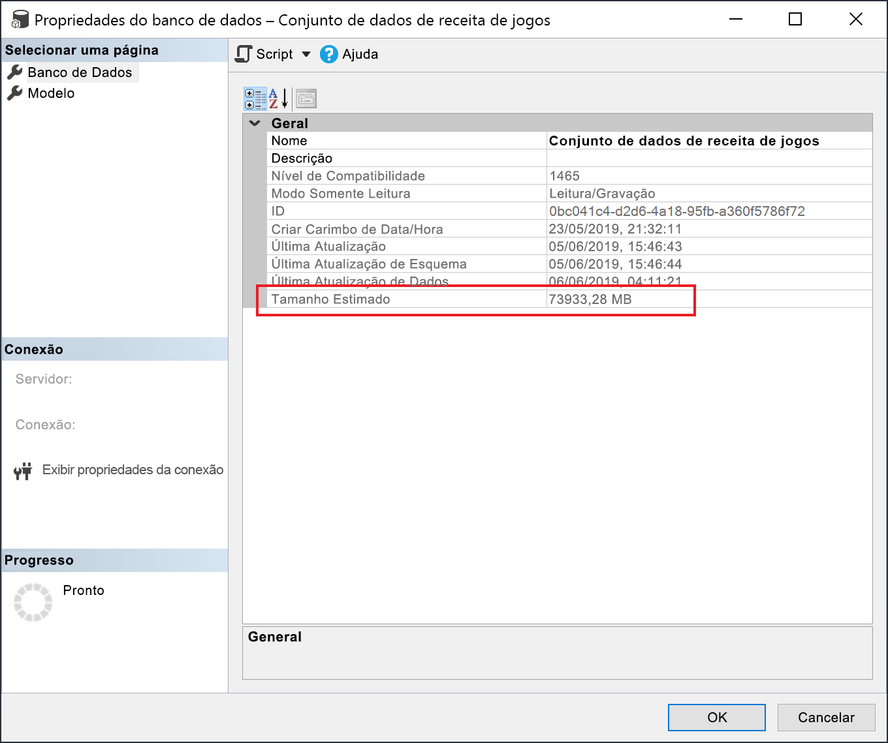

# <a name="large-models-in-power-bi-premium-preview"></a>Modelos grandes no Power BI Premium (versão prévia)

Os conjuntos de dados do Power BI podem armazenar dados em um cache de memória altamente compactado para proporcionar um desempenho de consulta otimizado a fim de agilizar a interatividade do usuário em grandes conjuntos de dados. O recurso de modelos grandes permite que os conjuntos de dados no Power BI Premium cresçam além de 10 GB. O tamanho do conjunto de recursos é limitado pelo tamanho da capacidade do Power BI Premium, que é semelhante à forma como o Azure Analysis Services funciona em termos de limitações de tamanho do modelo. Para obter mais informações sobre tamanhos de capacidade no Power BI Premium, confira Nós de capacidade. Você pode configurar modelos grandes para todas as SKUs P Premium e SKUs A Inseridas, mas eles funcionam apenas com [novos workspaces](service-create-the-new-workspaces.md).

Modelos grandes não afetam o tamanho de carregamento do PBIX, que ainda está limitado a 10 GB. Em vez disso, os conjuntos de dados crescem além de 10 GB no serviço na atualização. Você pode usar a atualização incremental para configurar um conjunto de dados para crescer além de 10 GB.

## <a name="enable-large-models"></a>Habilitar modelos grandes

Para criar um conjunto de dados que cresça além de 10 GB, siga estas etapas:

1. Crie um conjunto do Power BI Desktop e configure uma [atualização incremental](service-premium-incremental-refresh.md).

1. Publique o conjunto de dados no serviço do Power BI Premium.

1. Habilite o conjunto de dados para modelos grandes executando os cmdlets do PowerShell abaixo. Esses cmdlets fazem o Power BI armazenar o conjunto de dados em Arquivos Premium do Azure e não impor o limite de 10 GB.

1. Invoque uma atualização para carregar dados históricos com base na política de atualização incremental. A primeira atualização pode demorar um pouco para carregar o histórico. As atualizações subsequentes devem ser mais rápidas porque são incrementais.

### <a name="powershell-cmdlets"></a>Cmdlets do PowerShell

Na versão atual de modelos grandes, habilite o conjunto de armazenamento para arquivos Premium usando cmdlets do PowerShell. Você deve ter privilégios de administrador de workspace e administrador de capacidade para executar os cmdlets do PowerShell.

1. Localize a ID do conjunto de dados (GUID). Na guia **Conjunto de dados** do workspace, nas configurações do conjunto de dados, você pode ver a ID na URL.

    

1. Em um prompt de administrador do PowerShell, instale o módulo [MicrosoftPowerBIMgmt](/powershell/module/microsoftpowerbimgmt.data/).

    ```powershell
    Install-Module -Name MicrosoftPowerBIMgmt
    ```

1. Execute os cmdlets a seguir para entrar e verificar o modo de armazenamento do conjunto de dados.

    ```powershell
    Login-PowerBIServiceAccount

    (Get-PowerBIDataset -Scope Organization -Id <Dataset ID> -Include actualStorage).ActualStorage
    ```

    A resposta deve ser a seguinte. O modo de armazenamento é ABF (arquivo de backup do Analysis Services), que é o padrão.

    ```
    Id                   StorageMode

    --                   -----------

    <Dataset ID>         Abf
    ```

1. Execute os cmdlets a seguir para definir o modo de armazenamento para Arquivos Premium e verificá-lo. Pode levar alguns segundos para converter em Arquivos Premium.

    ```powershell
    Set-PowerBIDataset -Id <Dataset ID> -TargetStorageMode PremiumFiles

    (Get-PowerBIDataset -Scope Organization -Id <Dataset ID> -Include actualStorage).ActualStorage
    ```

    A resposta deve ser a seguinte. O modo de armazenamento agora está definido como Arquivos Premium.

    ```
    Id                   StorageMode
    
    --                   -----------
    
    <Dataset ID>         PremiumFiles
    ```

Você pode verificar o status das conversões de conjunto de dados de arquivos Premium usando o cmdlet [Get-PowerBIWorkspaceMigrationStatus](/powershell/module/microsoftpowerbimgmt.workspaces/get-powerbiworkspacemigrationstatus).

## <a name="dataset-eviction"></a>Remoção de conjunto de dados

O Power BI usa o gerenciamento de memória dinâmica para remover conjuntos de dados inativos da memória. O Power BI remove conjuntos de dados para que possa carregar outros conjuntos de dados para atender a consultas de usuário. O gerenciamento de memória dinâmica permite que a soma dos tamanhos do conjunto de dados seja significativamente maior do que a memória disponível na capacidade, mas um único conjunto de dados deve caber na memória. Para obter mais informações sobre o gerenciamento de memória dinâmica, confira [Como as capacidades funcionam](service-premium-what-is.md#how-capacities-function).

Você deve considerar o impacto da remoção em modelos grandes. Apesar dos tempos de carregamento de conjuntos de dados relativamente rápidos, ainda poderá haver um atraso perceptível para os usuários se eles precisarem aguardar o recarregamento de grandes conjuntos de dados removidos. Por esse motivo, em sua forma atual, o recurso de modelos grandes é recomendado principalmente para as capacidades dedicadas para os requisitos de BI empresarial, em vez daquelas capacidades combinadas com requisitos de BI de autoatendimento. As capacidades dedicadas aos requisitos de BI empresarial têm menor probabilidade de dispararem com frequência a remoção e precisam recarregar os conjuntos de dados. As capacidades de BI de autoatendimento, por outro lado, podem ter muitos conjuntos de dados pequenos que são carregados com mais frequência para dentro e para fora de memória.

## <a name="checking-dataset-size"></a>Como verificar o tamanho do conjunto de dados

Depois de carregar dados históricos, você pode usar [SSMS](https://docs.microsoft.com/sql/ssms/download-sql-server-management-studio-ssms) por meio do [ponto de extremidade XMLA](service-premium-connect-tools.md) para verificar o tamanho estimado do conjunto de dados na janela de propriedades do modelo.



Você também pode verificar o tamanho do conjunto de dados executando as consultas DMV a seguir do SSMS. Some as colunas DICTIONARY\_SIZE e USED\_SIZE para a saída para ver o tamanho do conjunto de dados em bytes.

```sql
SELECT * FROM SYSTEMRESTRICTSCHEMA
($System.DISCOVER_STORAGE_TABLE_COLUMNS,
 [DATABASE_NAME] = '<Dataset Name>') //Sum DICTIONARY_SIZE (bytes)

SELECT * FROM SYSTEMRESTRICTSCHEMA
($System.DISCOVER_STORAGE_TABLE_COLUMN_SEGMENTS,
 [DATABASE_NAME] = '<Dataset Name>') //Sum USED_SIZE (bytes)
```

## <a name="limitations-and-considerations"></a>Limitações e considerações

Tenha em mente as seguintes restrições ao usar modelos grandes:

- **Criptografia BYOK (Bring Your Own Key)** : os conjuntos de dados habilitados para Arquivos Premium não são criptografados por [BYOK](service-encryption-byok.md).
- **Suporte Multi-Geo**: Os conjuntos de dados habilitados para Arquivos Premium falharão em capacidades em que a opção [várias áreas geográficas](service-admin-premium-multi-geo.md) também esteja habilitada.

- **Baixar para o Power BI Desktop**: se um conjunto de dados for armazenado em Arquivos Premium, [Baixar como um arquivo .pbix](service-export-to-pbix.md) falhará.
- **Regiões com suporte**: Há suporte para modelos grandes em todas as regiões do Azure compatíveis com o Armazenamento de Arquivos Premium. Confira mais informações em [Produtos disponíveis por região](https://azure.microsoft.com/global-infrastructure/services/?products=storage) e veja a tabela na seção a seguir.


## <a name="availability-in-regions"></a>Disponibilidade em regiões

Os modelos grandes no Power BI só estão disponíveis em determinadas regiões do Azure que dão suporte ao [Armazenamento de Arquivos Premium do Azure](https://docs.microsoft.com/azure/storage/files/storage-files-planning#storage-tiers).

A lista a seguir informa as regiões que disponibilizam os modelos grandes no Power BI. As regiões que não estão na lista a seguir não têm suporte para modelos grandes:


|Região do Azure  |Abreviação da região do Azure  |
|---------|---------|
|Leste da Austrália     | australiaeast        |
|Sudeste da Austrália     | australiasoutheast        |
|EUA Central     | centralus        |
|Leste da Ásia     | eastasia        |
|Leste dos EUA     | eastus        |
|Leste dos EUA 2     | eastus2        |
|Leste do Japão     | japaneast        |
|Oeste do Japão     | japanwest        |
|Coreia Central     | koreacentral        |
|Sul da Coreia     | koreasouth        |
|Centro-Norte dos EUA     | northcentralus        |
|Norte da Europa     | northeurope        |
|Centro-Sul dos EUA     | southcentralus        |
|Sudeste Asiático     | southeastasia        |
|Sul do Reino Unido     | uksouth        |
|Oeste do Reino Unido     | ukwest        |
|Europa Ocidental     | westeurope        |
|Oeste dos EUA     | westus        |
|Oeste dos EUA 2     | westus2        |


## <a name="next-steps"></a>Próximas etapas

Os links a seguir fornecem informações que podem ser úteis para trabalhar com modelos grandes:

* [Armazenamento de Arquivos Premium do Azure](https://docs.microsoft.com/azure/storage/files/storage-files-planning#storage-tiers)
* [Configurar o suporte Multi-Geo para o Power BI Premium](service-admin-premium-multi-geo.md)
* [Criptografia BYOK (Bring Your Own Key) para o Power BI](service-encryption-byok.md)
* [Como as capacidades funcionam](service-premium-what-is.md#how-capacities-function)
* [Atualização incremental](service-premium-incremental-refresh.md).