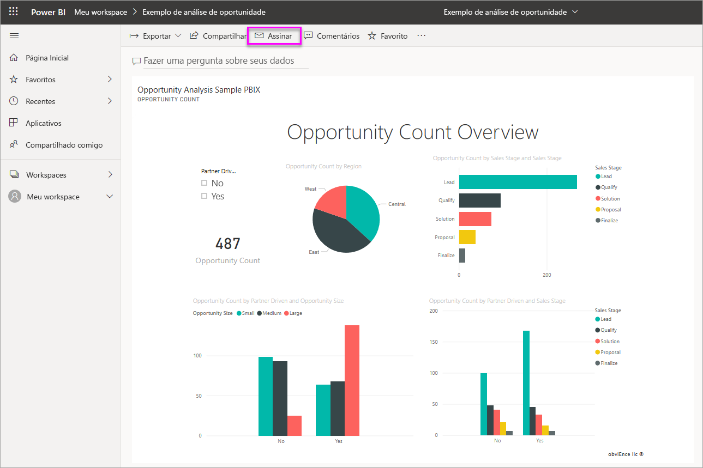
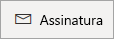
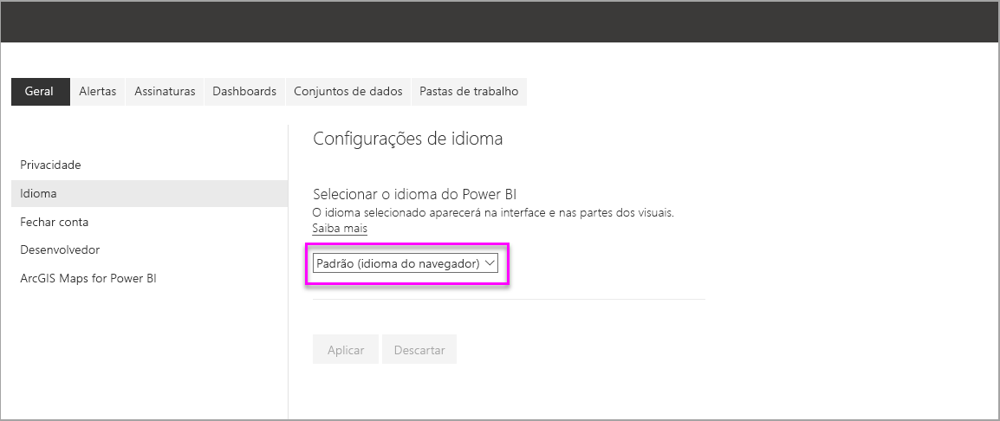
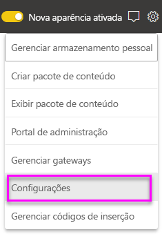
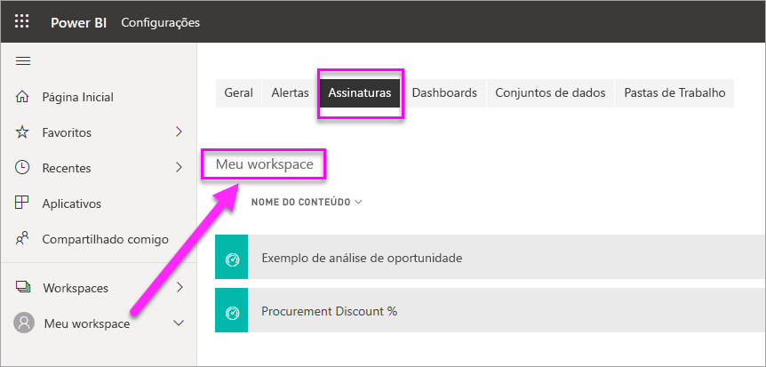

# Obtenha uma assinatura para você e outras pessoas de relatórios e dashboards no serviço do Power BI

É possível obter uma assinatura para si mesmo e para seus colegas das páginas de relatório, de dashboards e de relatórios paginados que são mais importantes para você. O Power BI envia um instantâneo por email para sua caixa de entrada. Informe ao Power BI a frequência com que deseja receber os emails: diária, semanal, por hora, mensal ou uma vez ao dia após a atualização inicial dos dados.  Se você escolher diária, semanal, por hora ou mensal, será possível selecionar a hora em que deseja executar a assinatura.  No total, você pode configurar até 24 assinaturas diferentes por relatório ou dashboard.

 

Você só pode criar assinaturas no serviço do Power BI. Você receberá um email com um instantâneo da página de relatório ou dashboard, com um link para abrir o relatório ou o dashboard. Em dispositivos móveis com aplicativos do Power BI instalados, a seleção desse link iniciará o aplicativo do Power BI em vez de abrir o relatório ou o dashboard no site do Power BI.

## Requisitos

A **criação** de uma assinatura pode ser feita por:

- Usuários com uma licença do Power BI Pro
- Os usuários que exibem conteúdo em um workspace ou aplicativo Premium também podem assinar conteúdo localizado lá, mesmo sem uma licença do Power BI Pro.

Você não precisa editar permissões para o conteúdo (dashboard ou relatório) para criar uma assinatura para si próprio, mas precisa ter permissões de edição para criar uma para outra pessoa. 

## Assine um dashboard, uma página de relatório ou um relatório paginado

Se você está assinando um dashboard, um relatório ou um relatório paginado, o processo é semelhante. O mesmo botão permite que você assine os dashboards e relatórios do serviço do Power BI.

Assinar relatórios paginados é um pouco diferente. Confira [Obter uma assinatura para você e para outras pessoas de um relatório paginado no serviço do Power BI](consumer/paginated-reports-subscriptions.md) para obter detalhes.
 
.

1. Abra o dashboard ou o relatório.
2. Na barra de menus superior, selecione **Assinar** ou selecione o ícone de envelope .
   
   

3. Use o controle deslizante amarelo para ativar e desativar a assinatura.  Definir o controle deslizante como **Desativado** não exclui a assinatura. Para excluir a assinatura, selecione o ícone de cesto de lixo.

4. Seu email já está na caixa **Assinar**. Você pode adicionar outros endereços de email para a assinatura também, mas apenas no mesmo domínio. Se o relatório ou o dashboard estiver hospedado na [capacidade Premium](service-premium-what-is.md), você poderá assinar outros endereços de email individuais e aliases de grupo. Se o relatório ou o dashboard não estiver hospedado na capacidade Premium, você poderá assinar outros indivíduos, mas eles também precisarão ter licenças do Power BI Pro. Para obter detalhes, veja [Considerações e solução de problemas](#considerations-and-troubleshooting) abaixo. 

5. Preencha os detalhes **Assunto** e **Mensagem** do email. 

5. Selecione uma **Frequência** para sua assinatura: **Diária**, **Por Hora**, **Semanal**, **Mensal** ou **Após a atualização dos dados (Diária)** .  Para receber o email de assinatura somente em determinados dias, selecione **Por Hora** ou **Semanal** e escolha em quais dias você gostaria de recebê-lo.  Por exemplo, se você quiser receber o email de assinatura somente em dias da semana, selecione **Semanal** e desmarque as caixas de seleção **Sáb** e **Dom**.  Se você selecionar **Mensal**, insira o(s) dia(s) do mês em que deseja receber o email da assinatura.  

6. Se você escolher **Diária**, **Por Hora**, **Mensal** ou **Semanal**, também poderá selecionar uma **Hora Agendada** para a assinatura.  Você faz com que ela seja executada na hora exata ou após 15, 30 ou 45 minutos.  Selecione manhã (A.M.) ou tarde/noite (P.M.). Você também pode especificar o fuso horário.  Se você escolher **Por Hora**, selecione o **Horário Agendado** em que deseja que a assinatura inicie e ela será executada de hora em hora a partir de então.

7. Por padrão, a data de início para a sua assinatura é a data em que você a cria. Você tem a opção de selecionar uma data de término. Se você não definir uma data de término, a data de término será definida automaticamente para um ano após a data de início. É possível alterar para qualquer data no futuro (até o ano 9999) a qualquer momento antes do término da assinatura. Quando uma assinatura atinge uma data de término, ela é interrompida até que você a habilite novamente. Você receberá notificações antes da data de término agendada, perguntando se deseja estendê-la.    

    Na captura de tela abaixo, observe que quando você assina um relatório, na verdade, você está assinando uma *página* de relatório.  Para assinar mais de uma página em um relatório, selecione **Adicionar outra assinatura** e selecione uma página diferente. 
      
     

7. Selecione **Salvar e fechar**. Os inscritos receberão um email e o instantâneo da página de relatório ou dashboard para a frequência e a hora que você selecionou. No total, você pode criar até 24 assinaturas por relatório ou dashboard e pode fornecer frequências, horas e destinatários exclusivos para cada assinatura.  Todas as assinaturas definidas para **Após a atualização de dados** do seu dashboard ou relatório somente enviarão um email após a primeira atualização agendada.   
      
   > [!TIP]
   > Deseja enviar o email de uma assinatura imediatamente ou sob demanda a qualquer momento? Selecione **Executar Agora** para as assinaturas do dashboard ou do relatório que deseja enviar. Você verá uma notificação indicando que um email está sendo enviado a todos para essa assinatura específica.  A execução dessa ação não é calculada no limite de 24 execuções de assinatura agendadas por dia e por relatório ou dashboard. Isso NÃO dispara uma atualização de dados do conjunto de dados subjacente. 
   > 
   > 
   
## Idiomas do Email

O instantâneo e o email usam o idioma definido nas configurações do Power BI (confira [Idiomas e países/regiões com suporte para o Power BI](supported-languages-countries-regions.md)). Se nenhum idioma for definido, o Power BI usará o idioma de acordo com a configuração de localidade no navegador atual. Para obter ou definir sua preferência de idioma, selecione o ícone de engrenagem  > **Configurações > Geral > Idioma**. 

## Gerenciar suas assinaturas
Somente a pessoa que criou a assinatura possa gerenciá-la.  Há dois caminhos que levam à tela para gerenciar suas assinaturas.  O primeiro é selecionando **Gerenciar todas as assinaturas** na caixa de diálogo **Assinar emails** (confira as capturas de tela abaixo da etapa 4 acima). O segundo é selecionar o ícone de engrenagem  do Power BI na barra de menus superior e escolher **Configurações**.

As assinaturas específicas exibidas dependerão de qual workspace está ativo no momento.  Para ver todas as suas assinaturas de todos os workspaces ao mesmo tempo, verifique se **Meu Workspace** está ativo. Para obter ajuda para entender os workspaces, consulte [Workspaces no Power BI](service-create-workspaces.md).

Uma assinatura será encerrada se a licença Pro expirar, se o proprietário excluir o dashboard ou o relatório ou se a conta de usuário usada para criar a assinatura for excluída.

## Considerações e solução de problemas

* Os dashboards com mais de 25 blocos fixos ou 4 páginas de relatório dinâmico fixas podem não ser renderizados totalmente nos emails de assinatura enviados aos usuários.  As assinaturas de dashboards que ultrapassam esse número de blocos não são bloqueadas. No entanto, elas serão consideradas sem suporte se você encontrar erros. Considere modificá-las de acordo com isso para se enquadrarem em um intervalo compatível.
* Em raras ocasiões, as assinaturas de email podem levar mais de quinze minutos para serem entregues aos destinatários. Caso isso aconteça, recomendamos a execução da atualização de dados e da assinatura de email em momentos diferentes para garantir a entrega em tempo hábil. Se o problema persistir, contate o suporte do Power BI.
* Para assinaturas de email do dashboard, se os blocos tiverem a RLS (segurança em nível de linha) aplicada, esses blocos não serão exibidos.  
* Para assinaturas de email do relatório, se o conjunto de dados usar a RLS, será possível criar uma assinatura para você mesmo. Você não pode assinar para outras pessoas em um relatório com RLS (Segurança em Nível de Linha) aplicada, a menos que esteja usando um relatório paginado, o que lhe permitirá enviar a assinatura para outras pessoas usando seu contexto de segurança. 
* As assinaturas da página de relatório são vinculadas ao nome da página de relatório. Se você assinar uma página de relatório e renomeá-la, precisará recriar sua assinatura.
* Sua organização pode definir certas configurações no Azure Active Directory que limitam a capacidade de usar assinaturas de email no Power BI.  Essas limitações incluem, sem limitação, ter autenticação multifator ou restrições de intervalo de IP ao acessar recursos.
* Atualmente, assinaturas de email para relatórios/dashboards que usam conjuntos de dados de conexão dinâmica não são compatíveis ao registrar a assinatura de usuários diferentes de você, a menos que esteja usando um relatório paginado, o que lhe permitirá enviar assinaturas a outras pessoas usando o seu contexto de segurança. 
* Assinaturas de email não dão suporte à maioria dos [visuais personalizados](developer/power-bi-custom-visuals.md).  A única exceção é para os elementos visuais personalizados que foram [certificados](developer/power-bi-custom-visuals-certified.md).  
* No momento, as assinaturas de email não dão suporte a visuais personalizados da plataforma R.  
* Assinaturas de email são enviadas com estados de segmentação e filtro padrão do relatório. As alterações feitas nos padrões após a assinatura não serão exibidas no email.  Os relatórios paginados são compatíveis com essa funcionalidade e lhe permitem definir os valores de parâmetro específicos por assinatura.   
* Especificamente para assinaturas de dashboards, ainda não há suporte para alguns tipos de blocos.  Eles incluem: blocos de streaming, blocos de vídeo, blocos de conteúdo da Web personalizado.     
* Se você compartilhar um dashboard com um colega fora de seu locatário, não será possível criar uma assinatura para esse colega também. Portanto, se você for aaron@xyz.com, poderá compartilhar com anyone@ABC.com, mas ainda não poderá incluir anyone@ABC.com, e ele não poderá assinar o conteúdo compartilhado.      
* O Power BI pausa a atualização automaticamente em conjuntos de dados associados a dashboards e relatórios que não foram visitados há mais de dois meses.  No entanto, se você adicionar uma assinatura a um dashboard ou um relatório, ele não ficará em pausa mesmo que não seja visitado.    
* Se você não estiver recebendo emails de assinatura, verifique se o nome UPN pode receber emails. 
* Se o painel ou o relatório estiver na capacidade Premium, você poderá usar o alias de email de grupo para assinaturas, em vez de inserir um endereço de email de colega de cada vez na assinatura. Os aliases são baseados no Active Directory atual. 

## Próximas etapas

- [Obter uma assinatura para você e para outras pessoas de um relatório paginado no serviço do Power BI](consumer/paginated-reports-subscriptions.md)
- Mais perguntas? [Experimente perguntar à Comunidade do Power BI](https://community.powerbi.com/)    
- [Ler a postagem no blog](https://powerbi.microsoft.com/blog/introducing-dashboard-email-subscriptions-a-360-degree-view-of-your-business-in-your-inbox-every-day/)
