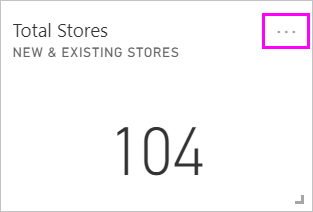
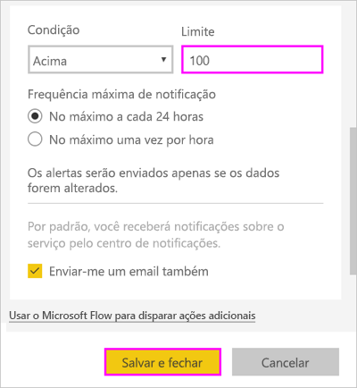
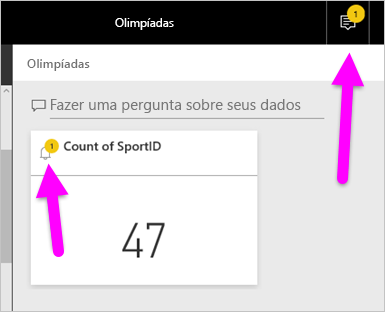
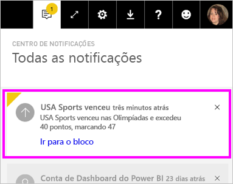
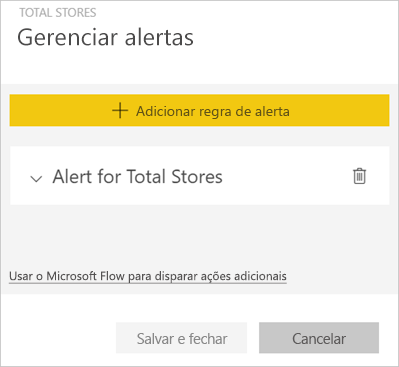
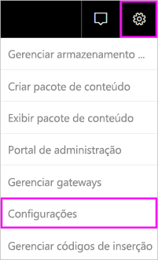

# Alertas de dados no serviço do Power BI

Defina alertas para notificá-lo quando os dados em seus dashboards forem alterados além dos limites definidos por você.

Você poderá definir alertas em blocos se tiver uma licença do Power BI Pro. Você também poderá definir alertas se alguém compartilhar um dashboard que esteja em uma [Capacidade Premium](service-premium-what-is.md). Os alertas só podem ser definidos em blocos fixos de visuais de relatório e apenas em medidores, KPIs e cartões. Os alertas podem ser definidos em visuais criados com base em conjuntos de dados de streaming que você fixa de um relatório em um dashboard. Os alertas não podem ser definidos em blocos de streaming criados diretamente no dashboard usando **Adicionar bloco** > **Dados de streaming personalizados**.

Apenas você poderá ver os alertas que definir, mesmo se compartilhar seu dashboard. Nem mesmo o proprietário do dashboard poderá ver os alertas que você definiu na sua exibição do dashboard dele. Os alertas de dados são totalmente sincronizados nas plataformas; defina e exiba alertas de dados [nos aplicativos móveis do Power BI](consumer/mobile/mobile-set-data-alerts-in-the-mobile-apps.md) e no serviço do Power BI. Eles não estão disponíveis para o Power BI Desktop. Você pode, inclusive, automatizar e integrar alertas com o Power Automate. Você pode testá-lo sozinho neste artigo [Power Automate e Power BI](service-flow-integration.md).

> [!WARNING]
> Notificações de alerta controladas por dados fornecem informações sobre seus dados. Se você exibir os dados do Power BI em um dispositivo móvel e esse dispositivo for extraviado ou roubado, será recomendável usar o serviço do Power BI para desligar todas as regras de alerta controlado por dados.

## Definir alertas de dados no serviço do Power BI

Veja Amanda adicionando alguns alertas a blocos em seu dashboard. Em seguida, siga as instruções passo a passo abaixo do vídeo para testá-la por conta própria.

<iframe width="560" height="315" src="https://www.youtube.com/embed/JbL2-HJ8clE" frameborder="0" allowfullscreen></iframe>

Este exemplo usa um bloco de cartões do dashboard de exemplo de Análise de Varejo. [Obtenha o exemplo de Análise de Varejo](sample-retail-analysis.md#get-the-content-pack-for-this-sample) se desejar acompanhar.

1. Iniciar em um dashboard. No bloco **Pontuações totais**, selecione as reticências.

   

1. Selecione o ícone de sino  para adicionar um ou mais alertas para **Total de Lojas**.

1. Para começar, selecione **+ Adicionar regra de alerta**, verifique se o controle deslizante **Ativo** está definido como **Ligado** e dê um título ao seu alerta. Os títulos ajudam a reconhecer facilmente seus alertas.

   

1. Role para baixo e insira os detalhes do alerta.  Neste exemplo, você criará um alerta que notifica você uma vez por dia caso o número do total de repositórios ultrapasse 100.

   

    Os alertas são exibidos em seu **Centro de notificações**. O Power BI também enviará um email a você sobre o alerta, se você marcar a caixa de seleção.

1. Selecione **Salvar e fechar**.

## Recebendo alertas

Quando os dados rastreados atingirem um dos limites que você definiu, várias coisas acontecerão. Primeiro, o Power BI verifica se passou mais de uma hora ou mais de 24 horas (dependendo da opção selecionada) desde o último alerta. Se os dados ultrapassarem o limite, você receberá um alerta.

Em seguida, o Power BI envia um alerta para o **Centro de notificações** e, opcionalmente, um email. Cada alerta contém um link direto com seus dados. Selecione o link para ver o bloco relevante em que você pode explorar, compartilhar e aprender mais.  

* Se tiver definido que o alerta deve lhe enviar um email, você verá algo parecido com isto na Caixa de Entrada.

   

* O Power BI adiciona uma mensagem à sua **Central de Notificações** e adiciona um novo ícone de alerta no bloco aplicável.

   

* O **Centro de notificações** exibe os detalhes do alerta.

    

   > [!NOTE]
   > Os alertas funcionam somente em dados atualizados. Depois que os dados são atualizados, o Power BI verifica se foi definido um alerta para esses dados. Se os dados atingirem um limite de alerta, o Power BI disparará um alerta.

## Gerenciando alertas

Há várias maneiras de gerenciar seus alertas:

* No bloco do dashboard.

* No menu Configurações do Power BI.

* Em um bloco nos [aplicativos móveis do Power BI](consumer/mobile/mobile-set-data-alerts-in-the-mobile-apps.md).

### No bloco do dashboard

1. Se você precisar alterar ou remover um alerta para um bloco, abra novamente a janela **Gerenciar alertas** selecionando o ícone de sino .

    O Power BI exibe os alertas que você configurou para esse arquivo.

    

1. Para modificar um alerta, selecione a seta à esquerda do nome do alerta.

    

1. Para excluir um alerta, selecione a lixeira à direita do nome do alerta.

      

### No menu de configurações do Power BI

1. Selecione o ícone de engrenagem na barra de menus do Power BI e selecione **Configurações**.

    .

1. Em **Configurações**, selecione **Alertas**.

    

1. Aqui, é possível ativar e desativar alertas, abrir a janela **Gerenciar alertas** para fazer alterações ou excluir o alerta.

## Considerações e solução de problemas

* Não há suporte para alertas em blocos de cartões com medidas de data/hora.
* Os alertas funcionam apenas com tipos de dados numéricos.
* Os alertas funcionam somente em dados atualizados. Eles não funcionam em dados estáticos.
* Os alertas só funcionarão em conjuntos de dados de streaming se você criar um visual de relatório de KPI, cartão ou medidor e fixá-lo no dashboard.

## Próximas etapas

* [Criar um Power Automate que inclui um alerta de dados](service-flow-integration.md).

* [Definir alertas de dados em seu dispositivo móvel](consumer/mobile/mobile-set-data-alerts-in-the-mobile-apps.md).

* [O que é o Power BI?](fundamentals/power-bi-overview.md)

Mais perguntas? [Experimente perguntar à Comunidade do Power BI](https://community.powerbi.com/)
