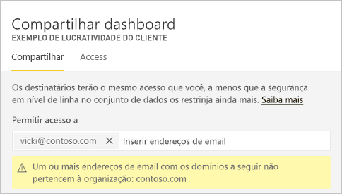
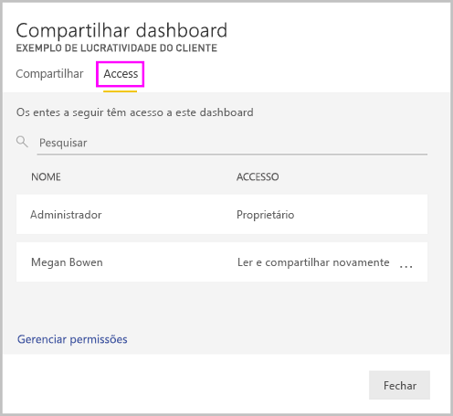
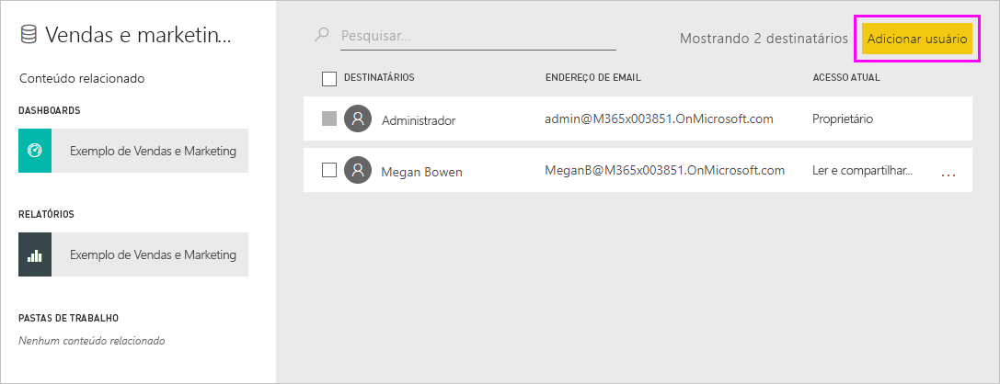

# Compartilhe os painéis e os relatórios do Power BI com colegas e outras pessoas
O *compartilhamento* é uma boa maneira de conceder acesso a algumas pessoas aos dashboards e relatórios. O Power BI também oferece [várias outras maneiras para colaborar e distribuir painéis e relatórios](service-how-to-collaborate-distribute-dashboards-reports.md).

Com o compartilhamento, se você compartilhar o conteúdo dentro ou fora de sua organização, você precisará de uma [licença do Power BI Pro](service-features-license-type.md). Os destinatários também precisarão de licenças do Power BI Pro, a menos que o conteúdo esteja em uma [capacidade Premium](service-premium-what-is.md). 

É possível compartilhar dashboards e relatórios da maioria dos locais no serviço do Power BI: Favoritos, Recentes, Meu Workspace e Compartilhado comigo, se o proprietário permitir. Você também poderá compartilhar de outros workspaces se tiver a [função Administrador, Membro ou Colaborador](service-new-workspaces.md#roles-in-the-new-workspaces) no workspace. 

Quando você compartilha um dashboard ou relatório, as pessoas com as quais você o compartilha poderão visualizá-lo e interagir com ele, mas não poderão editá-lo. Elas veem os mesmos dados que você no painel ou relatório, a menos que a [RLS (segurança em nível de linha)](service-admin-rls.md) seja aplicada. Os colegas com quem você compartilha também podem compartilhá-lo com os colegas deles, se você permitir. As pessoas de fora de sua organização podem exibir e interagir com o dashboard ou o relatório, mas não podem compartilhá-lo. 

Não é possível *compartilhar* diretamente do Power BI Desktop. Você apenas [publica relatórios do Power BI Desktop](desktop-upload-desktop-files.md) no serviço do Power BI. No entanto, você pode [compartilhar um dashboard dos aplicativos móveis do Power BI](consumer/mobile/mobile-share-dashboard-from-the-mobile-apps.md).  

## Vídeo: Compartilhar um painel
Veja Amanda compartilhar seu dashboard com os colegas dentro e fora da empresa dela. Em seguida, siga as instruções passo a passo abaixo do vídeo para testá-la por conta própria.

<iframe width="560" height="315" src="https://www.youtube.com/embed/0tUwn8DHo3s?list=PL1N57mwBHtN0JFoKSR0n-tBkUJHeMP2cP" frameborder="0" allowfullscreen></iframe>

## Compartilhar um painel ou relatório

1. Em uma lista de painéis ou relatórios ou em um painel ou relatório, selecione **Compartilhar** .

2. Na caixa superior, insira os endereços de email completos dos indivíduos, grupos de distribuição ou grupos de segurança. Você não pode compartilhar com listas de distribuição dinâmicas. 
   
   Você pode compartilhar com as pessoas cujos endereços estejam fora da organização, mas verá um aviso. Leia mais sobre como [compartilhar fora de sua organização](#share-a-dashboard-or-report-outside-your-organization) neste artigo.
   
    
 
   >[!NOTE]
   >A caixa de entrada é compatível com, no máximo, com 100 usuários separados ou grupos. Confira [Compartilhar com mais de 100 usuários](#share-with-more-than-100-separate-users) neste artigo para ver maneiras de compartilhar com mais pessoas.

3. Adicione uma mensagem, se desejar. É opcional.
4. Para permitir que seus colegas de trabalho compartilhem o conteúdo com outras pessoas, marque a opção **Permitir que os destinatários compartilhem seu dashboard (ou relatório)** .
   
   A permissão de compartilhamento por outras pessoas é chamada *novo compartilhamento*. Se você permitir, elas poderão compartilhar novamente por meio do serviço e dos aplicativos móveis do Power BI ou encaminhar o convite por email para outras pessoas em sua organização. O convite expira após um mês. As pessoas de fora da sua organização não podem compartilhar novamente. Como o proprietário do conteúdo, você pode desativar o novo compartilhamento e pode também revogá-lo individualmente. Confira [Parar ou alterar o compartilhamento](#stop-or-change-sharing) neste artigo.

5. Se você selecionar **Permitir que os usuários criem novo conteúdo usando os conjuntos de dados subjacentes**, eles poderão criar os próprios relatórios em outros workspaces com base no conjunto de dados para o dashboard. Leia mais sobre [como criar relatórios com base em conjuntos de dados de diferentes workspaces](service-datasets-discover-across-workspaces.md).

1. Selecione **Compartilhar.**
   
     
   
   O Power BI envia um convite por email para os indivíduos, mas não para grupos, com um link para o conteúdo compartilhado. Você verá uma notificação de **Êxito**. 
   
   Quando os destinatários de sua organização clicarem no link, o Power BI adicionará o painel ou relatório às suas páginas de lista **Compartilhado comigo**. Eles podem selecionar seu nome para ver todo o conteúdo que você compartilhou com eles. 
   
   
   
   Quando os destinatários fora de sua organização clicarem no link, eles verão o painel ou relatório, mas não no portal normal do Power BI. Leia mais sobre como [compartilhar com pessoas fora de sua organização](#share-a-dashboard-or-report-outside-your-organization) neste artigo.

## Veja quem tem acesso a um dashboard ou relatório
Às vezes, você precisa ver as pessoas com quem você compartilhou e ver com quem elas o compartilharam.

1. Na lista de painéis e relatórios ou no próprio painel ou relatório, selecione **Compartilhar** . 
2. Na caixa de diálogo **Compartilhar dashboard** ou **Compartilhar relatório**, clique em **Acessar**.
   
    

    As pessoas externas à sua organização são listadas como **Convidado**.

    Nessa exibição, você pode [parar ou alterar as permissões de compartilhamento](#stop-or-change-sharing) neste artigo. 

## Compartilhar um dashboard ou um relatório fora de sua organização
Quando você compartilha com pessoas de fora da sua organização, elas recebem um email com um link para o dashboard ou o relatório compartilhado. Elas devem entrar no Power BI para ver o que você compartilhou. Se não tiverem uma licença Power BI Pro, elas poderão se inscrever para obter uma licença quando clicarem no link.

Depois de entrar, elas verão o dashboard ou o relatório compartilhado em sua própria janela do navegador, não no portal usual do Power BI. Para acessar o dashboard ou o relatório posteriormente, elas precisam indicar o link.

Elas não podem editar nenhum conteúdo nesse painel ou relatório. Elas podem interagir com gráficos e alterar filtros ou segmentações de dados, mas não podem salvar suas alterações. 

Apenas seus destinatários diretos veem o dashboard ou o relatório compartilhado. Por exemplo, se você tiver enviado o email para Vicki@contoso.com, somente Vicki verá o dashboard. Ninguém mais poderá ver o dashboard, mesmo se Vicki encaminhar o link. Vicki deve usar o mesmo endereço de email para acessá-lo; se Vicki entrar com qualquer outro endereço de email, ela não terá acesso ao dashboard.

As pessoas fora de sua organização não verão os dados se a segurança em nível de linha ou de função for implementada nos modelos de tabela locais do Analysis Services.

Se você enviar um link em um aplicativo móvel do Power BI para pessoas fora da organização, quando elas clicarem no link, o dashboard será aberto em um navegador, e não no aplicativo móvel do Power BI.

### Permitir que usuários externos editem conteúdo

Seu administrador do Power BI pode permitir que usuários convidados externos editem e gerenciem conteúdo em sua organização. Nesse caso, os usuários externos não terão essa experiência somente de consumo. Eles podem editar e gerenciar conteúdo dentro de sua organização. Saiba mais sobre a [distribuição do conteúdo do Power BI para usuários convidados externos com o Azure AD B2B](service-admin-azure-ad-b2b.md).

## Parar ou alterar o compartilhamento
Somente o proprietário do painel ou relatório pode ativar e desativar o novo compartilhamento.

### Se você ainda não enviou o convite de compartilhamento
* Desmarque a caixa de seleção **Permitir que os destinatários compartilhem seu dashboard (ou relatório)** na parte inferior do convite antes de enviá-lo.

### Se você já compartilhou o painel ou relatório
1. Na lista de painéis e relatórios ou no próprio painel ou relatório, selecione **Compartilhar** . 
2. Na caixa de diálogo **Compartilhar dashboard** ou **Compartilhar relatório**, clique em **Acessar**.
   
    
3. Selecione as reticências ( **...** ) ao lado de **Ler e compartilhar novamente** e selecione:
   
   
   
   * **Ler** para impedir que a pessoa compartilhe-o com outras pessoas.
   * **Remover o acesso** para impedir que a pessoa veja o conteúdo compartilhado.

4. Na caixa de diálogo **Remover acesso**, decida se quer remover o acesso ao conteúdo relacionado, como relatórios e conjuntos de dados. Se você remover os itens com um ícone de aviso , também será melhor remover o conteúdo relacionado. Caso contrário, ele não será exibido corretamente.

    

## Limitações e considerações
Coisas para se lembrar a respeito do compartilhamento de painéis e relatórios:

* Em geral, você e seus colegas veem os mesmos dados no painel ou relatório. Portanto, se você tiver permissões para ver mais dados do que eles, eles verão todos os seus dados no dashboard ou relatório. No entanto, se a [RLS (Segurança em Nível de Linha)](service-admin-rls.md) for aplicada ao conjunto de dados subjacente a um dashboard ou relatório, as credenciais de cada pessoa determinarão quais dados podem ser acessados.
* Todas as pessoas com quem você compartilha o dashboard podem vê-lo e interagir com os relatórios relacionados no [Modo de Exibição de Leitura](consumer/end-user-reading-view.md#reading-view). Em geral, elas não podem criar relatórios nem salvar alterações nos relatórios existentes. No entanto, se você selecionar **Permitir que os usuários criem conteúdo usando os conjuntos de dados subjacentes**, eles poderão criar os próprios relatórios em outros workspaces com base no conjunto de dados para o dashboard ou o relatório.
* Ninguém pode ver nem baixar o conjunto de dados, mas é possível acessá-lo diretamente usando o recurso Analisar no Excel. Um administrador pode restringir a capacidade de usar o Analisar no Excel de todos em um grupo. No entanto, a restrição é para todos nesse grupo e para cada workspace ao qual ele pertence.
* Qualquer pessoa pode [atualizar os dados](refresh-data.md) manualmente.
* Se você usar o Office 365 para email, poderá compartilhar com os membros de um grupo de distribuição inserindo o endereço de email associado ao grupo de distribuição.
* Os colegas de trabalho que têm o mesmo domínio de email que você e os colegas cujos domínios são diferentes, mas estão registrados no mesmo locatário, podem compartilhar o dashboard com outras pessoas. Por exemplo, digamos que os domínios contoso.com e contoso2.com estejam registrados no mesmo locatário e seu endereço de email é konrads@contoso.com. ravali@contoso.com e gustav@contoso2.com podem compartilhar seu dashboard, contanto que você dê a eles permissões para compartilhar.
* Se seus colegas de trabalho já tiverem acesso a um dashboard ou relatório específico, você poderá enviar um link direto copiando a URL quando estiver no dashboard ou relatório. Por exemplo: `https://powerbi.com/dashboards/g12466b5-a452-4e55-8634-xxxxxxxxxxxx`.
* Da mesma forma, se seus colegas de trabalho já tiverem acesso a um dashboard específico, você poderá [enviar um link direto para o relatório subjacente](service-share-reports.md). 

### Compartilhar com mais de 100 usuários separados

No máximo, você pode compartilhar com 100 usuários ou grupos em uma única ação de compartilhamento. No entanto, pode-se conceder acesso a mais de 500 usuários a um item. Veja a seguir algumas sugestões:

- Compartilhar várias vezes especificando os usuários individualmente.
- Compartilhar com um grupo de usuários que contém todos os usuários. 
- Criar o relatório ou o dashboard em um workspace, depois criar um aplicativo com base no workspace. Você pode compartilhar o aplicativo com muito mais pessoas. Leia mais sobre a [publicação de aplicativos no Power BI](service-create-distribute-apps.md).

## Solucionar problemas de compartilhamento

### Destinatários do meu painel verão um ícone de bloqueio em um bloco ou uma mensagem "A permissão necessária"

As pessoas com as quais você compartilha poderão ver um bloco bloqueado em um painel ou uma mensagem "Permissão necessária" ao tentarem exibir um relatório.

Nesse caso, você precisa conceder a permissão para o conjunto de dados subjacente.

1. Vá para a guia **Conjuntos de dados** na sua lista de conteúdo.

1. Selecione as reticências ( **...** ) ao lado do conjunto de dados e, em seguida, selecione **Gerenciar permissões**.

    

1. Selecione **Adicionar usuário**.

    

1. Insira os endereços de email completos dos indivíduos, grupos de distribuição ou grupos de segurança. Você não pode compartilhar com listas de distribuição dinâmicas.

    

1. Selecione **Adicionar**.

### Não consigo compartilhar um painel ou relatório como favorito

Para compartilhar um dashboard ou relatório, você precisa de permissão para compartilhar novamente o conteúdo subjacente, ou seja, todos os relatórios e conjuntos de dados relacionados. Se você vir uma mensagem informando que não é possível compartilhar, peça ao autor do relatório para dar a você permissão para compartilhar novamente os relatórios e conjuntos de dados.

## Próximas etapas

* [Como devo colaborar e compartilhar relatórios e dashboards?](service-how-to-collaborate-distribute-dashboards-reports.md)
* [Compartilhar um relatório do Power BI filtrado](service-share-reports.md)
* Dúvidas? [Experimente a Comunidade do Power BI](https://community.powerbi.com/)

