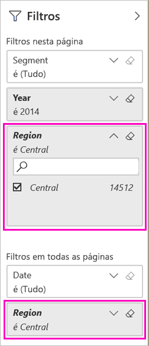

# Duas maneiras de compartilhar um relatório filtrado do Power BI
O *compartilhamento* é uma boa maneira de conceder acesso a algumas pessoas aos dashboards e relatórios. Se você deseja compartilhar uma versão filtrada de um relatório? Talvez um relatório que mostre apenas os dados para uma cidade específica, vendedor ou ano. Tente filtrar um relatório e compartilhá-lo ou criar uma URL personalizada. O relatório é filtrado quando os destinatários o abrem pela primeira vez. Eles poderão remover o filtro modificando a URL. 

O Power BI também oferece [outras maneiras para colaborar e distribuir seus relatórios](service-how-to-collaborate-distribute-dashboards-reports.md). Com o compartilhamento, você e os destinatários precisarão de uma [licença do Power BI Pro](service-features-license-type.md) ou então o conteúdo precisará estar em uma [capacidade Premium](service-premium-what-is.md). 

## Duas maneiras para filtrar um relatório

Para ambas as técnicas de filtragem, estamos usando o aplicativo de modelo Exemplo de vendas e marketing. Quer testá-lo? Você também pode instalar o [aplicativo de modelo Exemplo de vendas e marketing](https://appsource.microsoft.com/product/power-bi/microsoft-retail-analysis-sample.salesandmarketingsample?tab=Overview).

### Definir um filtro

Abra um relatório no [Modo de exibição de edição](consumer/end-user-reading-view.md) e aplique um filtro.

Neste exemplo, estamos filtrando a página Categoria de Acumulado no Ano do aplicativo de modelo Exemplo de vendas e marketing para mostrar apenas valores onde **Região** igual a **Central**. 
 

Salve o relatório.

### Criar um filtro na URL

Quando você adiciona o filtro ao fim da URL da página de relatório, o comportamento é um pouco diferente. A página filtrada parece igual. No entanto, o Power BI adiciona o filtro ao relatório todo e remove os outros valores do painel de filtro.  

Adicione o seguinte ao final da URL da página de relatório:
   
    ?filter=*tablename*/*fieldname* eq *value*
   
O campo deve ser do tipo número, datetime ou cadeia de caracteres. Os valores de *tablename* ou *fieldname* não podem conter espaços.
   
Em nosso exemplo, o nome da tabela é **Área geográfica**, o nome do campo é **Região** e o valor que queremos filtrar é **Central**:
   
    ?filter=Geo/Region eq 'Central'

O navegador adiciona caracteres especiais para representar barras, espaços e apóstrofes, portanto, você acaba com algo parecido com isso:
   
    app.powerbi.com/groups/xxxx/reports/xxxx/ReportSection4d00c3887644123e310e?filter=Geo~2FRegion%20eq%20'Central'

Salve o relatório.

Confira o artigo [Filtrar um relatório usando parâmetros da cadeia de consulta na URL](service-url-filters.md) para obter muito mais detalhes.

## Compartilhar o relatório filtrado

1. Quando você [compartilhar o relatório](service-share-dashboards.md), desmarque a caixa de seleção **Enviar notificação por email aos destinatários**.

    

4. Envie o link com o filtro que você criou anteriormente.

## Próximas etapas
* [Maneiras de compartilhar seu trabalho no Power BI](service-how-to-collaborate-distribute-dashboards-reports.md)
* [Compartilhar um dashboard](service-share-dashboards.md)
* Mais perguntas? [Experimente a Comunidade do Power BI](http://community.powerbi.com/).
* Tem comentários? Vá para o [site da comunidade do Power BI](https://community.powerbi.com/) para fazer sugestões.

