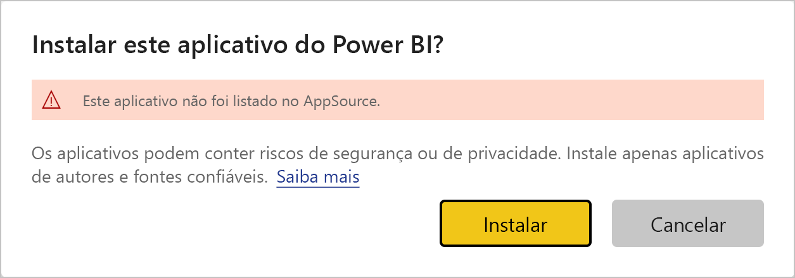
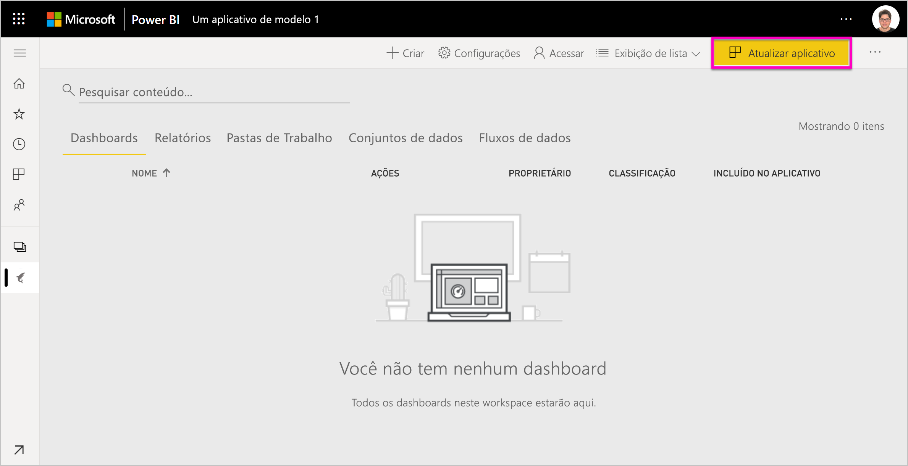
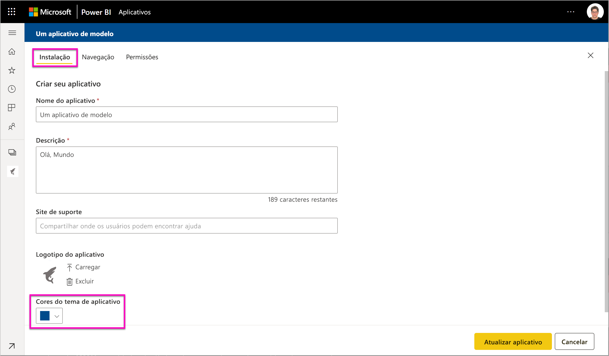
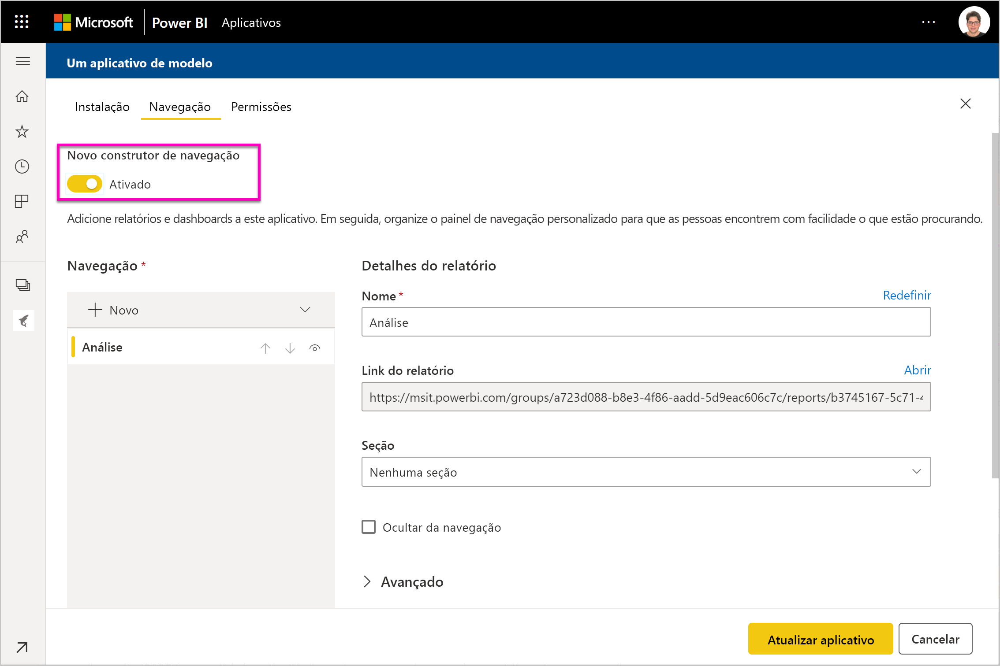

# Instalar e distribuir aplicativos de modelo em sua organização – Power BI

Você é um analista do Power BI? Caso seja, este artigo explica como instalar *aplicativos de modelo* para se conectar a muitos dos serviços que você usa para administrar sua empresa, como Salesforce, Microsoft Dynamics e Google Analytics. Você pode modificar o dashboard e os relatórios para atender às necessidades da sua organização e, depois, distribuí-los aos seus colegas como um *aplicativo*. 

Caso esteja interessado em criar aplicativos de modelo para distribuí-los por conta própria, confira [Criar um aplicativo de modelo no Power BI](service-template-apps-create.md). Parceiros Power BI podem criar aplicativos do Power BI com pouca ou nenhuma codificação e implantá-los em clientes do Power BI. 

## Pré-requisitos  

Estes são os requisitos para instalar, personalizar e distribuir um aplicativo de modelo: 

- Uma [licença do Power BI Pro](service-self-service-signup-for-power-bi.md)
- Familiaridade com os [conceitos básicos do Power BI ](service-basic-concepts.md)
- Link de instalação válido do criador do aplicativo de modelo ou do AppSource. 
- Permissões para instalar aplicativos de modelo. 

## Instalar um aplicativo de modelo

Você poderá receber um link para um aplicativo de modelo. Caso contrário, você poderá pesquisar no AppSource o aplicativo de seu interesse. De qualquer forma, após a instalação, você poderá modificá-lo e distribuí-lo para sua organização.

### Pesquisar no AppSource com um navegador

Em um navegador, selecione este link para abrir o AppSource filtrado para aplicativos do Power BI:

- https://appsource.microsoft.com/marketplace/apps?product=power-bi

### Pesquisar no AppSource com o serviço do Power BI

1. No painel de navegação à esquerda do serviço do Power BI, selecione **Aplicativos** > **Obter aplicativos**.

    

2. No AppSource, selecione **Aplicativos**.

    

3. Procure ou pesquise o aplicativo e, em seguida, selecione **Obter agora**.

4. Na caixa de diálogo, selecione **Instalar**.

     Se você já tiver uma licença do Power BI Pro, o aplicativo será instalado com o workspace associado. Personalize o aplicativo no workspace associado.

    Quando a instalação for bem-sucedida, você verá uma notificação indicando que o novo aplicativo está pronto.
4. Selecione **Ir para o aplicativo**.
5. Em **Introdução ao novo aplicativo**, selecione uma das três opções:

    

    - **Explorar o aplicativo**: Exploração básica dos dados de exemplo. Comece aqui para conhecer o aspecto geral do aplicativo. 
    - **Conectar os dados**: Altere a fonte de dados dos dados de exemplo para sua própria fonte de dados. Redefina os parâmetros do conjunto de dados e as credenciais da fonte de dados. Confira [Limitações conhecidas](service-template-apps-tips.md#known-limitations) no artigo sobre dicas de aplicativos de modelo. 
    - **Ir para o workspace** (opção mais avançada): faça qualquer alteração permitida pelo construtor do aplicativo.

    Se desejar, ignore esta caixa de diálogo e acesse o workspace associado diretamente por meio de **Workspaces** no painel de navegação à esquerda.
    >[!NOTE]
    >Ao instalar um aplicativo de modelo, são instalados um *aplicativo organizacional* e um *workspace*. Leia mais sobre a [distribuição de aplicativos no Power BI](service-create-distribute-apps.md).
 
6. Antes de compartilhá-lo com seus colegas de trabalho, o ideal é conectar-se aos seus próprios dados. Talvez você também deseje modificar o relatório ou o dashboard para adequá-lo à sua organização. Além disso, nesta altura, você poderá adicionar outros relatórios ou dashboards.

   Se você selecionar um link de instalação para um aplicativo que não esteja listado no AppSource, será exibida uma caixa de diálogo de validação solicitando a confirmação de sua escolha.

   

   >[!NOTE]
   >Para instalar aplicativos de modelo que não estejam listados no AppSource, você precisará solicitar permissão ao seu administrador. Confira o [portal de administração do Power BI, configurações de Aplicativo de modelo](service-admin-portal.md#template-apps-settings) para obter mais detalhes.

## Personalizar e publicar o aplicativo

Depois de atualizar o aplicativo para sua organização, você estará pronto para publicá-lo. As etapas são as mesmas da publicação de qualquer outro aplicativo.

1. Quando concluir a personalização, na exibição de lista do workspace, selecione **Atualizar aplicativo** no canto superior direito.  

    

2. Em **Detalhes**, modifique a descrição e a cor da tela de fundo.

   

3. Em **Navegação**, você pode usar o novo construtor de navegação para seu aplicativo ou selecionar o dashboard ou relatório para a página de aterrissagem. Confira [Projetar a experiência de navegação](service-create-distribute-apps.md#design-the-navigation-experience) para obter mais detalhes.

   

4. Em **Acesso**, permita acesso a usuários selecionados ou a toda a organização.  

   

5. Selecione **Atualizar aplicativo**. 

6. Depois de publicá-lo com êxito, você poderá copiar o link e compartilhá-lo com as pessoas a quem você permitiu acesso. Se você o compartilhou com elas, elas também podem vê-lo na guia **Minha organização** do AppSource.

## Atualizar um aplicativo de modelo

Os criadores de aplicativos de modelo podem liberar novas versões de seus aplicativos de modelo por meio do AppSource ou de um link direto. Quando isso é feito, você pode atualizar o aplicativo de modelo reinstalando-o com a mesma versão ou uma versão mais recente.

  >[!NOTE]
  >A instalação de uma nova versão substitui alterações feitas nos relatórios e dashboards. Para manter seus relatórios e dashboard atualizados, você pode salvá-los com um nome diferente ou em um local diferente antes da instalação.

- **Substituir uma versão existente:** substitui o workspace existente pela versão atualizada do aplicativo de modelo.

   

- **Instalar em um novo workspace:** instala uma nova versão do workspace e do aplicativo que você precisa reconfigurar

### Comportamento de substituição

* A substituição atualiza os relatórios, os dashboards e o conjunto de dados dentro do *workspace*, não do aplicativo. A substituição não altera a navegação, a configuração e a permissão do aplicativo.
* Depois de atualizar o workspace, você precisa *atualizar o aplicativo* para aplicar as alterações do workspace ao aplicativo organizacional.
* A substituição mantém os parâmetros e a autenticação configurados. Após a atualização, é iniciada uma atualização automática do conjunto de dados. Durante esse tempo, o aplicativo organizacional, os relatórios e os dashboards apresentam a experiência de *dados de exemplo*.
  
* A substituição sempre apresenta dados de exemplo até que a atualização seja concluída. Se o autor do aplicativo de modelo tiver alterado no conjunto de dados ou em parâmetros, os usuários do workspace e do aplicativo continuarão vendo a experiência de *dados de exemplo*.
* A substituição nunca exclui os *novos* relatórios ou dashboards que você adicionou ao workspace. Ela substitui os relatórios e os dashboards originais por alterações do autor original.

>[!IMPORTANT]
>Lembre-se de [atualizar o aplicativo](#customize-and-publish-the-app) após a substituição para aplicar as alterações aos relatórios e ao dashboard para os usuários do aplicativo organizacional.

## Próximas etapas

[Criar workspaces com seus colegas no Power BI](service-create-workspaces.md)
