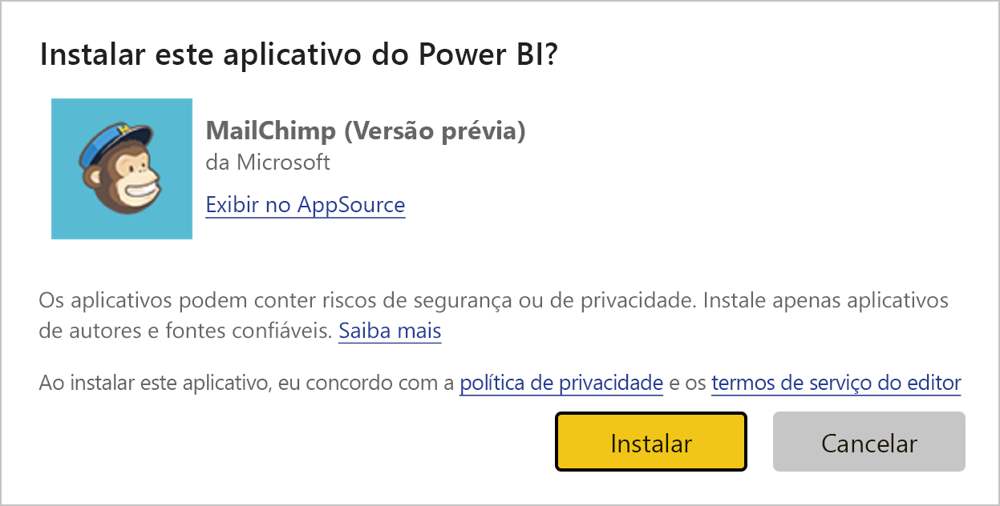
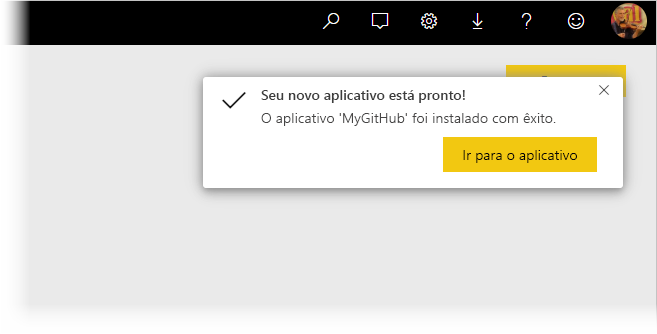
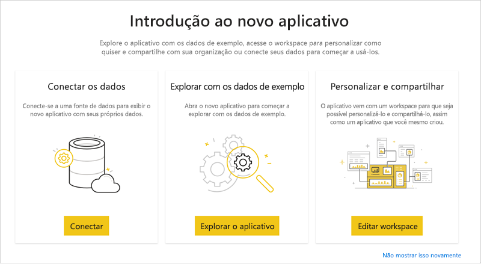
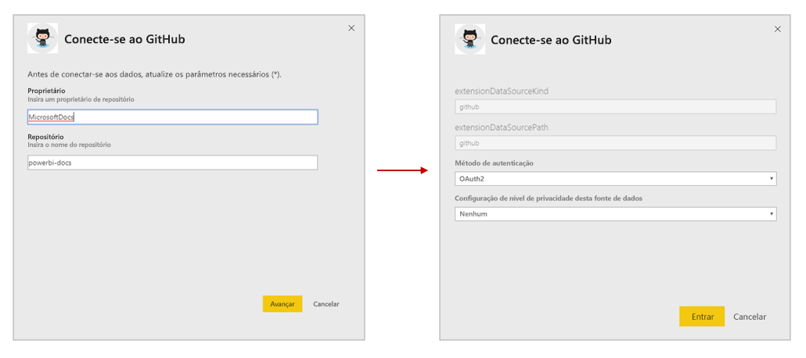
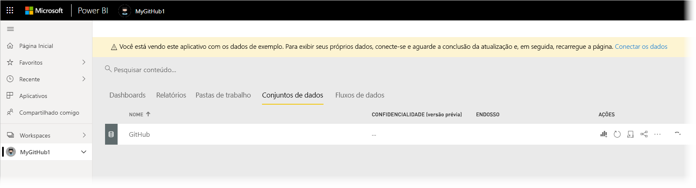
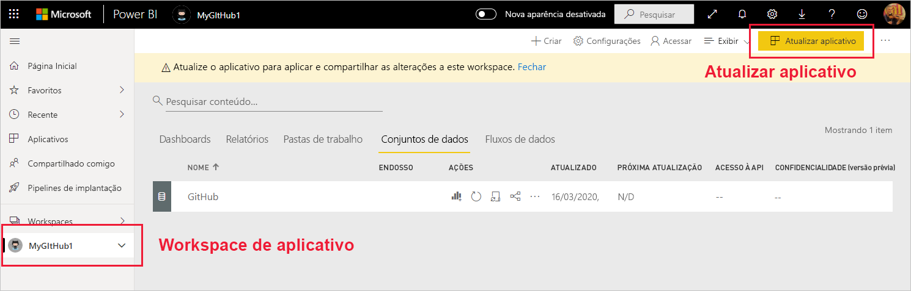

# Instalar e distribuir aplicativos de modelo em sua organização

Você é um analista do Power BI? Caso seja, este artigo explica como instalar [aplicativos de modelo](service-template-apps-overview.md) para se conectar a muitos dos serviços que você usa para administrar sua empresa, como Salesforce, Microsoft Dynamics e Google Analytics. Em seguida, você pode modificar o dashboard e os relatórios pré-criados do aplicativo de modelo para atender às necessidades da sua organização e distribuí-los para seus colegas como [aplicativos](consumer/end-user-apps.md). 

Se você estiver interessado em criar aplicativos de modelo por conta própria para distribuição fora da sua organização, confira [Criar um aplicativo de modelo no Power BI](service-template-apps-create.md). Com pouca ou nenhuma codificação, parceiros do Power BI podem criar aplicativos do Power BI e disponibilizá-los a clientes do Power BI. 

## Pré-requisitos  

Para instalar, personalizar e distribuir um aplicativo de modelo, você precisa: 

* Uma [licença do Power BI Pro](service-self-service-signup-for-power-bi.md).
* Permissões para instalar aplicativos de modelo no seu locatário.
* Um link para instalação válido para o aplicativo, que você obtém de AppSource ou do criador de aplicativos.
* Uma boa familiaridade com os [conceitos básicos do Power BI](service-basic-concepts.md).

## Instalar um aplicativo de modelo

1. No painel de navegação do serviço do Power BI, selecione **Aplicativos** > **Obter aplicativos**.

    

1. Na janela AppSource que aparece, selecione **Aplicativos**. Procure ou pesquise o aplicativo desejado e selecione **Obter agora**.

    

1. Na caixa de diálogo que aparece, selecione **Instalar**.

    
    
    O aplicativo é instalado com um workspace associado. **Se você decidir personalizar o aplicativo, isso será feito neste workspace associado**.

    > [!NOTE]
    > Se você usar um link de instalação para um aplicativo que não esteja listado no AppSource, uma caixa de diálogo de validação solicitará que você confirme sua escolha.
    >
    >Para poder instalar um aplicativo de modelo que não esteja listado na AppSource, você precisa solicitar as permissões relevantes ao administrador. Confira [Configurações do aplicativo de modelo](service-admin-portal.md#template-apps-settings) no portal do administrador do Power BI para detalhes.

    Quando a instalação for concluída com êxito, uma notificação indicará que seu novo aplicativo está pronto.

    

## Conectar aos dados

1. Selecione **Ir para o aplicativo**. A janela **Introdução ao novo aplicativo** é exibida.

   

1. Clique em **Conectar**.
    
    Isso abre uma caixa de diálogo ou uma série de caixas de diálogo em que você altera a fonte de dados dos dados de exemplo para sua própria fonte de dados. Isso geralmente significa a redefinição de parâmetros de conjunto de dados e credenciais de fonte de dados. Confira [Limitações conhecidas](service-template-apps-tips.md#known-limitations).
    
    No exemplo a seguir, a conexão a dados envolve duas caixas de diálogo.

   

    Depois que você terminar de preencher as caixas de diálogo de conexão, o processo de conexão será iniciado. Uma faixa informa que você está exibindo dados de exemplo.

    

    Aguarde até que os dados terminem de se conectar e de serem atualizados. Para saber quando esse processo foi concluído, observe o indicador de progresso na linha (aparência nova) ou na guia (aparência antiga) do conjunto de dados.

   Quando a conexão e a atualização de dados forem concluídas, atualize seu navegador. A faixa agora informa que você precisa atualizar o aplicativo para aplicar as alterações feitas ao aplicativo e compartilhá-las.

    

## Personalizar e compartilhar o aplicativo

Depois de atualizar o navegador após a conexão com os dados e a atualização de dados, você verá o workspace associado ao aplicativo. Neste ponto, você pode editar qualquer um dos artefatos ali exatamente como faria em qualquer workspace. No entanto, todas as alterações feitas serão substituídas quando você atualizar o aplicativo com uma nova versão, a menos que você salve os itens alterados com nomes diferentes. [Veja detalhes sobre a substituição](#overwrite-behavior).

Para obter informações sobre como editar artefatos no workspace, confira
* [Visão geral do editor de relatório no Power BI](service-the-report-editor-take-a-tour.md)
* [Conceitos básicos para designers no serviço do Power BI](service-basic-concepts.md)

Quando terminar de fazer as alterações desejadas nos artefatos no workspace, você estará pronto para publicar e compartilhar o aplicativo. Confira [Publicar seu aplicativo](service-create-distribute-apps.md#publish-your-app) para saber como fazer isso.

## Atualizar um aplicativo de modelo

De tempos em tempos, os criadores de aplicativo de modelo lançam novas versões aprimoradas de seus aplicativos de modelo por meio de AppSource, link direto ou ambos.

Se você originalmente tiver baixado o aplicativo do AppSource, quando uma nova versão do aplicativo de modelo ficar disponível, uma faixa de atualização aparecerá no serviço do Power BI informando que uma nova versão do aplicativo está disponível.

  

>[!NOTE]
>Se você obteve originalmente o aplicativo por meio de link direto, em vez de pela AppSource, a única maneira de saber quando uma nova versão está disponível é entrar em contato com o criador do aplicativo de modelo.

  Para instalar a atualização, clique em **Obter** na faixa de notificação ou localize o aplicativo novamente na AppSource e escolha **Obter agora**. Se você tem um link direto para a atualização do criador do aplicativo de modelo, basta clicar no link.
  
  Você será consultado sobre se deseja substituir a versão atual ou instalar a nova versão em um novo workspace. Por padrão, "substituir" está selecionado.

  

- **Substituir uma versão existente:** substitui o workspace existente pela versão atualizada do aplicativo de modelo. [Veja detalhes sobre a substituição](#overwrite-behavior).

- **Instalar em um novo workspace:** Instala uma nova versão do workspace e do aplicativo que você precisa reconfigurar (ou seja, conectar-se a dados, definir a navegação e permissões).

### Comportamento de substituição

* A substituição atualiza os relatórios, os dashboards e o conjunto de dados dentro do workspace, não do aplicativo. A substituição não altera a navegação, a configuração e a permissões do aplicativo.
* Depois de atualizar o workspace, você precisa **atualizar o aplicativo** para aplicar as alterações do workspace ao aplicativo.
* A substituição mantém os parâmetros e a autenticação configurados. Após a atualização, é iniciada uma atualização automática do conjunto de dados. **Durante essa atualização, o aplicativo, os relatórios e os dashboards apresentam dados de exemplo**.

  

* A substituição sempre apresenta dados de exemplo até que a atualização seja concluída. Se o autor do aplicativo de modelo tiver feito alterações ao conjunto de dados ou aos parâmetros, os usuários do workspace e do aplicativo não verão a nova data até que a atualização seja concluída. Em vez disso, eles continuarão vendo os dados de exemplo durante esse tempo.
* A substituição nunca exclui os novos relatórios ou dashboards que você adicionou ao workspace. Ela substitui apenas os relatórios e os dashboards originais por alterações do autor original.

>[!IMPORTANT]
>Lembre-se de [atualizar o aplicativo](#customize-and-share-the-app) após a substituição para aplicar as alterações aos relatórios e ao dashboard para os usuários do aplicativo organizacional.

## Próximas etapas

[Criar workspaces com seus colegas no Power BI](service-create-workspaces.md)
