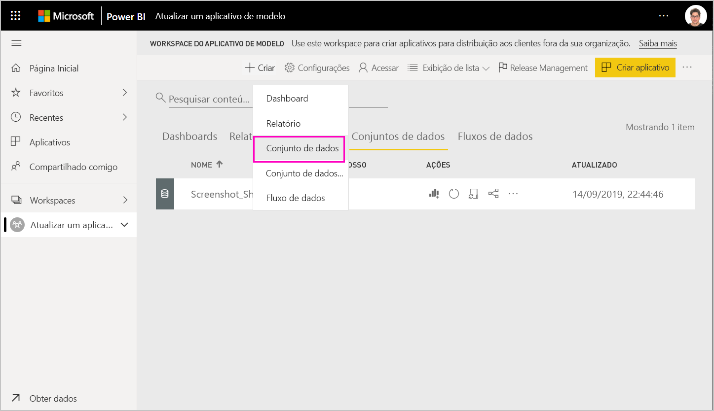
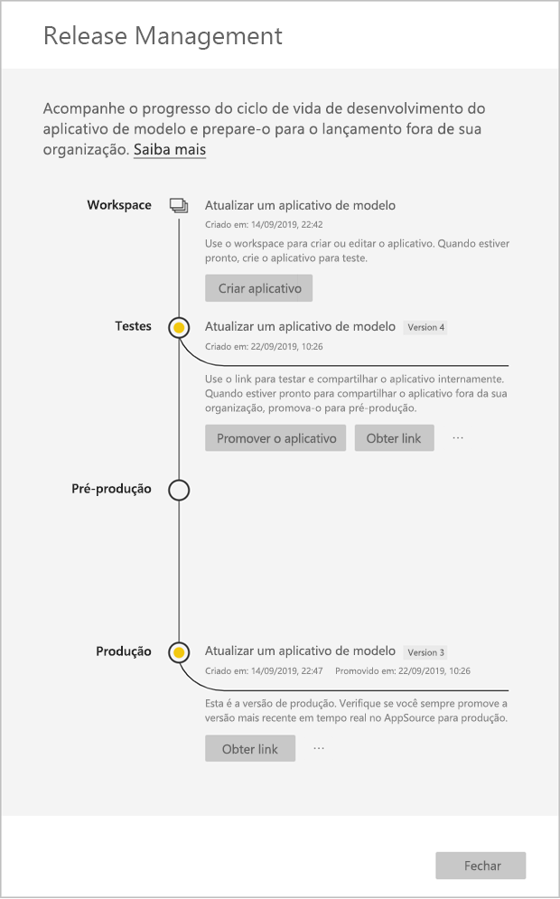
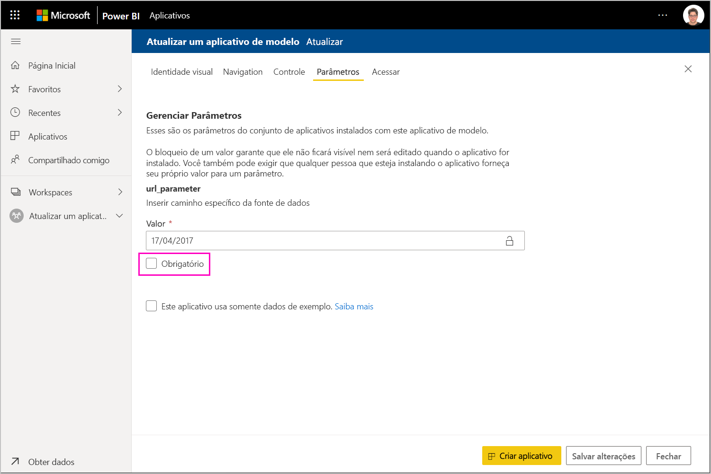

# Atualizar, excluir e extrair um aplicativo de modelo

Agora que o aplicativo está em produção, você poderá recomeçar na fase de teste, sem interromper o aplicativo em produção.
## Atualizar o aplicativo

Se você fez as alterações no Power BI Desktop, comece na etapa (1). Se você não fez as alterações no Power BI Desktop, comece na etapa (4).

1. Carregue o conjunto de dados atualizado e substitua o existente. **Certifique-se de usar exatamente o mesmo nome do conjunto de dados**. Usar um nome diferente criará um novo conjunto de dados para usuários que estão atualizando o aplicativo.

1. Importe o arquivo pbix de seu computador.

1. Confirme a substituição.

1. No painel **Gerenciamento de versão**, selecione **Criar aplicativo**.
1. Volte ao processo de criação do aplicativo.
1. Depois de configurar a **Identidade Visual**, o **Conteúdo**, o **Controle** e o **Acesso**, selecione **Criar aplicativo** novamente.
1. Selecione **Fechar** e volte a **Gerenciamento de versão**.

   Você verá que tem duas versões agora: A versão em produção e uma nova versão em teste.

    

5. Quando estiver pronto para promover o aplicativo à pré-produção para testes adicionais fora do locatário, volte ao painel Release Management e selecione **Promover aplicativo** ao lado de **Teste**.
6. Seu link agora está ativo. Envie-o novamente para o Portal do Cloud Partner (CPP), seguindo as etapas em [atualização de oferta do Aplicativo do Power BI](https://docs.microsoft.com/azure/marketplace/cloud-partner-portal/power-bi/cpp-update-existing-offer).
7. No Portal do Cloud Partner, é preciso **publicar** sua oferta novamente e validá-la mais uma vez.

   >[!NOTE]
   >Promova seu aplicativo para o estágio de produção somente depois que seu aplicativo for aprovado pelo Portal do Cloud Partner e você o publicar.

### Comportamento de atualização

1. Atualizar o aplicativo permitirá que o instalador do aplicativo de modelo [Atualize um aplicativo de modelo](service-template-apps-install-distribute.md#update-a-template-app) no workspace já instalado sem perder a configuração de conexão.
1. Consulte o [comportamento de substituição](service-template-apps-install-distribute.md#overwrite-behavior) do instalador para saber como alterações no conjunto de dados afetam o aplicativo de modelo instalado.
1. Ao atualizar (substituir) um aplicativo de modelo, primeiro ele reverte para os dados de exemplo e se reconectará automaticamente à configuração do usuário (parâmetros e autenticação). Até que a atualização seja concluída, os relatórios, os dashboards e o aplicativo da organização apresentarão a faixa de dados de exemplo.
1. Se você adicionou um novo parâmetro de consulta ao conjunto de dados atualizado que exige entrada dos usuários, marque a caixa de seleção *obrigatório*. Isso solicitará ao instalador a cadeia de conexão após a atualização do aplicativo.
 

## Extrair workspace
Reverter para a versão anterior de um aplicativo de modelo agora é mais fácil do que nunca com o recurso de extração. As etapas a seguir irão extrair uma versão de aplicativo específica de vários estágios de liberação em um novo workspace:

1. No painel de gerenciamento de versão, pressione mais **(...)** e, em seguida, **Extrair**.

     
2. Na caixa de diálogo, insira o nome para o workspace extraído. um novo workspace será adicionado.

A versão do workspace é redefinida e você pode continuar a desenvolver e distribuir o aplicativo de modelo a partir do workspace recém-extraído.

## Excluir a versão do aplicativo de modelo
Um workspace de aplicativo de modelo é a origem de um aplicativo de modelo distribuído ativo. Para proteger os usuários do aplicativo de modelo, não é possível excluir um workspace sem primeiro remover todas as versões do aplicativo criadas no workspace.
A exclusão de uma versão do aplicativo também exclui a url do aplicativo, que não funcionará mais.

1. No painel de gerenciamento de versão, selecione as reticências **(...)**  e, em seguida, **Excluir**.
 
 

>[!NOTE]
>Certifique-se de não excluir a versão do aplicativo que está sendo usada pelos clientes ou **AppSource** ou ela deixará de funcionar.

## Próximas etapas

Veja como os clientes interagem com o aplicativo de modelo em [Instalar, personalizar e distribuir aplicativos de modelo em sua organização](service-template-apps-install-distribute.md).

Confira a [oferta do Aplicativo do Power BI](https://docs.microsoft.com/azure/marketplace/cloud-partner-portal/power-bi/cpp-power-bi-offer) para obter mais detalhes sobre como distribuir o aplicativo.
