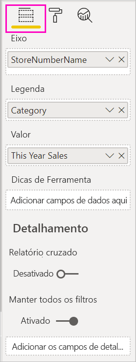
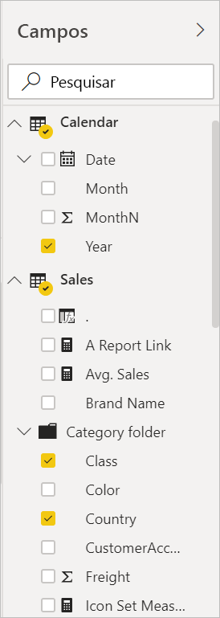

# Visão geral do editor de relatório no Power BI

No Power BI Desktop e no serviço do Power BI, o *editor de relatórios* é onde você cria os relatórios que seus consumidores veem, com gráficos, tabelas, mapas e outros elementos visuais. Ele é semelhante nos dois ambientes. Normalmente, você começa a criar um relatório no Power BI Desktop. Depois, você o publica no serviço do Power BI, onde pode continuar a modificá-lo. O serviço do Power BI também é o local onde você cria os painéis baseados em relatórios.

Depois de criar os painéis e relatórios, você os distribui aos consumidores dos relatórios. Dependendo de como você os compartilha, os usuários finais podem interagir com eles no Modo de Exibição de Leitura, mas não podem editá-los no serviço do Power BI. Leia mais sobre [o que os consumidores do relatório podem fazer no serviço do Power BI](consumer/end-user-reading-view.md). 

Este vídeo mostra o editor de relatório no Power BI Desktop. Este artigo mostra o editor de relatórios no Power BI Desktop. 

<iframe width="560" height="315" src="https://www.youtube.com/embed/IkJda4O7oGs" frameborder="0" allowfullscreen></iframe>

No serviço do Power BI, o editor de relatório só está disponível no Modo de Exibição de Edição. Para abrir um relatório no Modo de Exibição de Edição, você precisa ser proprietário ou criador do relatório ou colaborador do workspace que o hospeda.

O editor de relatórios do Power BI é dividido em várias seções principais:  

1. Painel de navegação superior
1. Tela de relatório
1. Painel Filtros
1. Painel Visualizações
1. Painel Campos

## 1. O painel de navegação superior
São várias as ações disponíveis no painel de navegação superior, com novas ações sendo adicionadas a todo momento. Para obter informações sobre uma ação específica, use o sumário da documentação do Power BI ou a caixa de Pesquisa.

## 2. A tela de relatório
A tela de relatório é o local em que seu trabalho é exibido. Quando você usa os painéis Campos, Filtros e Visualizações para criar elementos visuais, eles são criados e exibidos na sua tela de relatório. Cada guia na parte inferior da tela representa uma página no relatório. Selecione uma guia para abrir a respectiva página. 

## Os painéis do editor de relatório

Três painéis ficam visíveis quando você abre um relatório: Filtros, Visualizações e Campos. Os dois primeiros painéis do lado esquerdo, Visualizações e Filtros, controlam a aparência das visualizações: tipo, cores, filtragem e formatação. E o último painel do lado direito, Campos, gerencia os dados subjacentes usados nas visualizações. O conteúdo exibido no editor de relatório varia de acordo com as seleções feitas na tela de relatório. 

Por exemplo, quando você seleciona um visual individual como este gráfico de colunas:

**O painel Filtros** exibe todos os filtros no visual, na página ou em todas as páginas. Nesse caso, há filtros de nível de página, mas nenhum filtro de nível de visual.

**A parte superior do painel Visualização** identifica o tipo de visual em uso. Neste exemplo, é um Gráfico de colunas clusterizado. 

**A parte inferior do painel Visualização** tem três guias:

 **Campos** exibe os campos no visual. Talvez você precise rolar para baixo para ver todos os detalhes. Este gráfico está usando StoreNumberName e Vendas Deste Ano.

 **Formatar** Para exibir o painel de formatação para a visualização selecionada, selecione o ícone de rolo de pintura.

 **Análise** Para exibir o painel Análise, selecione o ícone de lupa.

**O painel Campos** lista todas as tabelas disponíveis no modelo de dados. Ao expandir uma tabela, você vê os campos nessa tabela. A marca de seleção amarela informa que pelo menos um campo da tabela está em uma visualização.

Continue lendo para conhecer os detalhes de cada painel.

## 3. O painel Filtros
Use o painel de filtros para exibir, configurar e modificar filtros persistentes para seus relatórios no nível de página, relatórios, detalhamento e visual. Sim, você pode fazer a filtragem ad hoc nas páginas de relatório e nos visuais selecionando os elementos dos visuais ou usando ferramentas como as segmentações. A filtragem no painel Filtros tem a vantagem de que o estado dos filtros é salvo com o relatório. 

O painel Filtros tem outro recurso avançado: você pode filtrar usando um campo *que ainda não está em um dos visuais em seu relatório*. Deixe-me explicar. Quando você cria uma visualização, o Power BI adiciona automaticamente todos os campos que você usa na visualização à área de filtros de nível do visual do painel Filtros. Se quiser definir um filtro de visual, página, detalhamento ou relatório usando um campo que não está sendo usado em uma visualização, basta arrastá-lo para um dos buckets de Filtros.

A nova experiência de filtragem oferece mais flexibilidade. Por exemplo, você pode formatar os filtros para que eles tenham a aparência do próprio relatório. Você pode também bloquear filtros ou ocultá-los dos consumidores do relatório. 

Leia mais sobre a [nova experiência de filtro](power-bi-report-filter.md).

## 4. O painel Visualizações

O painel de visualizações tem quatro seções. Começaremos pela parte superior do painel.

É aqui que você seleciona um tipo de visualização. Os ícones pequenos mostram os diferentes tipos de visualizações que você pode criar. Na imagem acima, o gráfico de bolhas está selecionado. Se você começar a criar uma visualização selecionando os campos sem selecionar um tipo de visualização primeiro, o Power BI escolherá o tipo de visualização para você. Você pode manter a seleção do Power BI ou alterar o tipo selecionando um ícone diferente.

Você pode baixar visualizações personalizadas para o Power BI Desktop. Seus ícones também aparecerão nesse painel. 

### Gerenciar os campos em uma visualização

Os buckets (às vezes chamados de *caixas*) mostrados nesse painel variam de acordo com o tipo de visualização selecionada.  Por exemplo, se tiver selecionado um gráfico de barras, você verá Eixo, Legenda e Valores. Quando você seleciona um campo ou o arrasta para a tela, o Power BI adiciona esse campo a um dos buckets.  Você também pode arrastar campos da lista Campos diretamente para os buckets.  Alguns buckets são limitados a determinados tipos de dados.  Por exemplo, **Valores** não aceitará campos não numéricos. Portanto, se você arrastar um campo **Categoria** para o bucket **Valores**, o Power BI o alterará para **Contagem de Categorias**.

Para obter mais informações, veja [Adicionar visualizações a um relatório do Power BI](visuals/power-bi-report-add-visualizations-i.md).

Esta parte do painel também tem opções para controlar o comportamento de [detalhamento e filtro](desktop-drillthrough.md).

### Formatar os elementos visuais
Selecione o ícone de rolo de pintura para exibir o painel Formatar. As opções disponíveis dependem do tipo de visualização selecionada.

As possibilidades de formatação são amplas.  Para saber mais, explore por conta própria ou visite esses artigos:

* [Personalização do título, da tela de fundo e da legenda da visualização](visuals/power-bi-visualization-customize-title-background-and-legend.md)
* [Formatação de cor](visuals/service-getting-started-with-color-formatting-and-axis-properties.md)
* [Personalização das propriedades dos eixos x e y](visuals/power-bi-visualization-customize-x-axis-and-y-axis.md)

### Adicionar análises às suas visualizações
Selecione o ícone de lupa para exibir o painel Análise. As opções disponíveis dependem do tipo de visualização selecionada.

Com o painel Análise no serviço do Power BI, você pode adicionar linhas de referência dinâmica às visualizações e destacar tendências ou ideias importantes. Para saber mais, consulte [Painel Análise no Power BI Desktop](desktop-analytics-pane.md).

## 5. O painel Campos
O painel Campos exibe as tabelas, pastas e campos nos seus dados que estão disponíveis para serem usados para criar visualizações.

|  |  |
| --- | --- |
|  |<ul><li>Arraste um campo até a página para iniciar uma nova visualização.  Você também pode arrastar um campo para uma visualização existente para adicioná-lo a essa visualização.  </li> <li>Quando você adiciona uma marca de seleção ao lado de um campo, o Power BI adiciona esse campo à visualização ativa (ou nova). Ele também decide em qual bucket colocar esse campo.  Por exemplo, o campo deve ser usado como uma legenda, um eixo ou um valor? O Power BI faz a melhor estimativa e você pode movê-lo desse bucket para outro se for necessário.   </li><li>De qualquer forma, cada campo selecionado é adicionado ao painel Visualizações no editor de relatório.</li></ul> |

No Power BI Desktop, também haverá opções para mostrar/ocultar campos, adicionar cálculos etc.

## Os ícones de campo

O Power BI usa vários ícones diferentes para indicar os tipos de campos em um relatório. Quando pode reconhecê-los, você entende melhor como eles atuam em visuais diferentes. Aqui estão alguns dos mais comuns.

|Ícone  |Significado  |
|---------|---------|
|  | Pasta na lista de campos |
| | Campo numérico: campos numéricos são agregações que podem ser somadas ou calculadas em médias, por exemplo. As agregações são importadas com os dados definidos no modelo de dados em que seu relatório se baseia. Para obter mais informações, veja [Agregações em relatórios do Power BI](service-aggregates.md). |
| | Coluna calculada com um tipo de dados não numérico: uma nova coluna não numérica criada com uma fórmula DAX (Data Analysis Expressions) que define os valores da coluna. Leia mais sobre [colunas calculadas](desktop-calculated-columns.md). |
|     |   Coluna calculada numérica: uma nova coluna criada com uma fórmula DAX (Data Analysis Expressions) que define os valores da coluna. Leia mais sobre [colunas calculadas](desktop-calculated-columns.md). |
| |  Medida: uma medida tem sua própria fórmula embutida em código. Não é possível alterar o cálculo; por exemplo, se ele for uma soma, ele só poderá ser uma soma. Os valores não são armazenados em uma coluna. Eles são calculados em tempo real, dependendo apenas de sua localização em um visual. Para obter mais informações, leia [Noções básicas sobre medidas](desktop-measures.md). |
|     | Grupo de medidas  |
| |      KPI: uma indicação visual que comunica a quantidade de progresso feito em relação a uma meta mensurável. Leia mais sobre visuais de [KPI (indicador chave de desempenho)](visuals/power-bi-visualization-kpi.md) |
|     |  Hierarquia dos campos: selecione a seta para ver os campos que compõem a hierarquia.  Assista a este vídeo do Power BI no YouTube sobre [Como criar e trabalhar com hierarquias](https://www.youtube.com/watch?v=q8WDUAiTGeU) para obter mais informações. |
|     | Dados geográficos: esses campos de local podem ser usados para criar visualizações de mapa. |
|      | Campo de identidade: campos com este ícone são *campos exclusivos*, definidos para mostrar todos os valores, mesmo se contiverem duplicatas. Por exemplo, seus dados podem ter dois registros para pessoas chamadas “Mateus Rodrigues” e cada um deles será tratado como exclusivo. Eles não serão somados.   |
|   | Parâmetro: defina parâmetros para fazer com que partes de seus relatórios e modelos de dados (como um filtro de consulta, uma referência de fonte de dados, uma definição de medida etc.) dependam de um ou mais valores de parâmetro. Confira esta postagem no blog do Power BI sobre [parâmetros de consulta](https://powerbi.microsoft.com/blog/deep-dive-into-query-parameters-and-power-bi-templates/) para obter mais informações. |
|  | Campo de data do calendário com uma tabela de data interna |

## Próximas etapas
[Criar um relatório](service-report-create-new.md)

Mais sobre os relatórios no [serviço do Power BI](service-report-create-new.md), no [Power BI Desktop](desktop-report-view.md) e nos [aplicativos móveis do Power BI](consumer/mobile/mobile-apps-view-phone-report.md).

[Conceitos básicos para designers do Power BI](service-basic-concepts.md)

Mais perguntas? [Experimente a Comunidade do Power BI](https://community.powerbi.com/)

