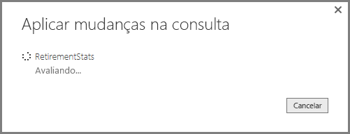

# Visão geral de Consulta no Power BI Desktop
Com o Power BI Desktop você pode se conectar ao mundo dos dados, criar relatórios atraentes e fundamentais e compartilhar seus esforços com outras pessoas — que poderão então se basear em seu trabalho e expandir seus esforços de business intelligence.

O Power BI Desktop tem três modos de exibição:

* Exibição de **Relatório** – em que você usa as consultas que cria para elaborar visualizações atraentes, organizadas como você deseja que elas apareçam e com várias páginas, que você pode compartilhar com outras pessoas
* Exibição de **Dados** – consulte os dados em seu relatório no formato de modelo de dados, em que você pode adicionar medidas, criar novas colunas e gerenciar relações
* Exibição de **Relações** – obtenha uma representação gráfica das relações que foram estabelecidas no seu modelo de dados e gerencie-as ou modifique-as conforme necessário.

Acesse essas exibições selecionando um dos três ícones no lado esquerdo do Power BI Desktop. Na imagem a seguir, a exibição de **Relatório** está selecionada, indicada pela faixa amarela ao lado do ícone.  

O Power BI Desktop também é fornecido com o Editor do Power Query. Use o Editor do Power Query para se conectar a uma ou várias fontes de dados, formatar e transformar os dados para atender às suas necessidades e, em seguida, carregar esse modelo no Power BI Desktop.

Este documento fornece uma visão geral do trabalho com os dados no Editor do Power Query, mas há mais coisas para aprender. No final deste documento, você encontrará links para diretrizes detalhadas sobre os tipos de dados compatíveis. Você também encontrará diretrizes sobre como se conectar a dados, formatar dados, criar relações e como começar a usar.

Mas, primeiro, vamos nos familiarizar com o Editor do Power Query.

## Editor do Power Query
Para ir até o Editor do Power Query, selecione **Editar Consultas** na guia **Página Inicial** do Power BI Desktop.  

Sem conexões de dados, o Editor do Power Query é exibido como um painel em branco, pronto para receber dados.  

Quando uma consulta é carregada, a exibição do Editor do Power Query torna-se mais interessante. Se nos conectarmos à seguinte fonte de dados da Web, o Editor do Power Query carregará informações sobre os dados, que você pode começar a formatar em seguida:

[*https://www.bankrate.com/retirement/best-and-worst-states-for-retirement/*](https://www.bankrate.com/retirement/best-and-worst-states-for-retirement/)

Veja como o Editor do Power Query é exibido após o estabelecimento de uma conexão de dados:

1. Na faixa de opções, muitos botões agora estão ativos para interagir com os dados na consulta.
2. No painel esquerdo, as consultas são listadas e ficam disponíveis para seleção, exibição e formatação.
3. No painel central, os dados da consulta selecionada são exibidos e ficarão disponíveis para formatação.
4. O painel **Configurações de Consulta** é exibido, listando as propriedades da consulta e as etapas aplicadas.  
   
   

Vamos examinar cada uma destas quatro áreas: a faixa de opções, o painel Consultas, a exibição de Dados e o painel Configurações de Consulta.

## A faixa de opções de consulta
A faixa de opções no Editor do Power Query é composta por quatro guias: **Página Inicial**, **Transformar**, **Adicionar Coluna** e **Exibir**.

A guia **Página Inicial** contém as tarefas comuns de consulta.

Para conectar-se aos dados e começar o processo de criação da consulta, selecione **Nova Origem**. Um menu é exibido, fornecendo as fontes de dados mais comuns.  

Para obter mais informações sobre as fontes de dados disponíveis, consulte **Fontes de Dados**. Para obter informações sobre como se conectar a dados, inclusive exemplos e etapas, consulte **Conectar-se a Dados**.

A guia **Transformar** fornece acesso a tarefas comuns de transformação de dados, como:

* Adicionar ou remover colunas
* Alterar tipos de dados 
* Dividir colunas 
* Outras tarefas controladas por dados

Para obter mais informações sobre como transformar dados, incluindo exemplos, confira [Tutorial: Formatar e combinar dados no Power BI Desktop](https://docs.microsoft.com/power-bi/desktop-shape-and-combine-data).

A guia **Adicionar Coluna** fornece tarefas adicionais associadas à adição de uma coluna, formatação de dados da coluna e adição de colunas personalizadas. A imagem a seguir mostra a guia **Adicionar Coluna** .  

A guia **Exibição** na faixa de opções é usada para ativar ou desativar a exibição de determinados painéis ou janelas. Ela também é usada para exibir o Editor Avançado. A imagem a seguir mostra a guia **Exibição** .  

É útil saber que muitas das tarefas disponíveis na faixa de opções também estão disponíveis clicando com o botão direito do mouse em uma coluna ou em outros dados, no painel central.

## O painel esquerdo (Consultas)
O painel esquerdo ou painel **Consultas**, exibe o número de consultas ativas e o nome da consulta. Quando você seleciona uma consulta no painel à esquerda, seus dados são exibidos no painel central, no qual você pode formatar e transformar os dados para atender às suas necessidades. A imagem a seguir mostra o painel esquerdo com uma consulta.  

## O painel central (Dados)
No painel central ou no painel **Dados**, os dados da consulta selecionada são exibidos. Esse painel é o local em que muito do trabalho da exibição **Consulta** é realizado.

A imagem a seguir mostra a conexão de dados da Web estabelecida anteriormente. A coluna **Product** está selecionada e você pode clicar com o botão direito do mouse no cabeçalho dela para mostrar os itens de menu disponíveis. Observe que muitos desses itens de menu de atalho são os mesmos botões nas guias da faixa de opções.  

Quando você seleciona um item de menu de clique com o botão direito do mouse (ou um botão de faixa de opções), a consulta aplica a etapa aos dados. Ela também salva a etapa como parte da consulta em si. As etapas são registradas no painel **Configurações de Consulta** em ordem sequencial, conforme descrito na próxima seção.  

## O painel direito (Configurações de Consulta)
O painel direito ou painel **Configurações de Consulta**, é o local em que todas as etapas associadas a uma consulta são exibidas. Por exemplo, na imagem a seguir, a seção **Etapas Aplicadas** do painel **Configurações de Consulta** reflete o fato de que acabamos de alterar o tipo da coluna **Pontuação geral** .

Conforme outras etapas de formatação são aplicadas à consulta, elas são capturadas na seção **Etapas Aplicadas**.

É importante saber que os dados subjacentes *não são* alterados. Em vez disso, o Editor do Power Query ajusta e forma a exibição dos dados. Ele também formata e ajusta a exibição de qualquer interação com os dados subjacentes que ocorrem com base na exibição formatada e modificada do Editor do Power Query desses dados.

No painel **Configurações de Consulta** , você pode renomear etapas, excluir etapas ou reordenar as etapas conforme necessário. Para fazer isso, clique com o botão direito do mouse na seção **Etapas Aplicadas** e selecione uma opção no menu que aparece. Todas as etapas de consulta são executadas na ordem em que aparecem no painel **Etapas Aplicadas** .

## Editor Avançado
O **Editor Avançado** permite que você veja o código que o Editor do Power Query está criando com cada etapa. Ele também permite que você crie um código de formatação próprio. Para iniciar o editor avançado, selecione **Exibição** na faixa de opções, então selecione **Editor Avançado**. Uma janela aparece, mostrando o código de consulta existente.  

Você pode editar o código diretamente na janela **Editor Avançado** . Para fechar a janela, selecione o botão **Concluído** ou **Cancelar** .  

## Salvando seu trabalho
Quando sua consulta estiver onde você deseja, selecione **Fechar e Aplicar** no menu **Arquivo** do Editor do Power Query. Essa ação aplica as alterações e fecha o editor.  

Conforme registramos progresso, o Power BI Desktop fornece uma caixa de diálogo para exibir seu status.  

Quando estiver pronto, o Power BI Desktop poderá salvar seu trabalho na forma de um arquivo *.pbix*.

Para salvar seu trabalho, selecione **Arquivo** \> **Salvar** (ou **Arquivo** \> **Salvar como**), conforme mostrado na imagem a seguir.  

## Próximas etapas
Há inúmeras coisas que você pode fazer com o Power BI Desktop. Para obter mais informações sobre seus recursos, consulte as seguintes fontes:

* [O que é o Power BI Desktop?](../fundamentals/desktop-what-is-desktop.md)
* [Fontes de dados no Power BI Desktop](../connect-data/desktop-data-sources.md)
* [Conectar-se a dados no Power BI Desktop](../connect-data/desktop-connect-to-data.md)
* [Tutorial: Formatar e combinar dados com o Power BI Desktop](../connect-data/desktop-shape-and-combine-data.md)
* [Realizar tarefas comuns de consulta no Power BI Desktop](desktop-common-query-tasks.md)   
