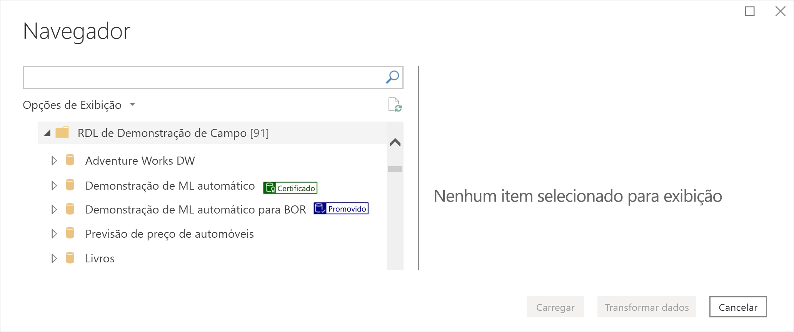
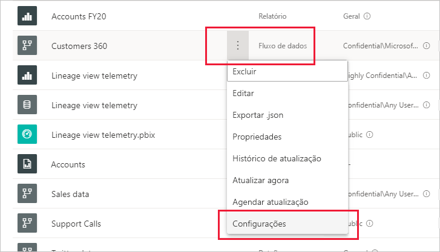
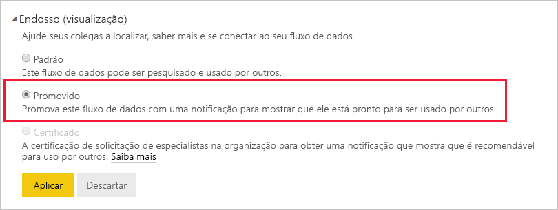
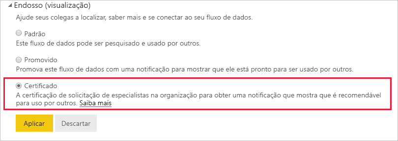

# Promover ou certificar fluxos de dados (versão prévia)

O Power BI fornece duas maneiras de aumentar a visibilidade de seus valiosos fluxos de dados de alta qualidade: **promoção** e **certificação**.

* **Promoção**: A promoção permite que os usuários realcem os fluxos de dado que eles consideram importantes e que vale a pena outras pessoas usarem. Dessa forma, incentiva a disseminação colaborativa de fluxos de entrada em uma organização. Qualquer proprietário de fluxo de dados ou qualquer membro com permissões de gravação no workspace em que um fluxo de dados está localizado pode simplesmente promover o fluxo de dados quando acreditar que ele é bom o suficiente para ser compartilhado.

* **Certificação**: A certificação significa que um fluxo de dados foi verificado por um revisor autorizado e é, na verdade, uma fonte de dados segura e autoritativa pronta para ser usada em toda a organização. Um grupo selecionado de revisores definido pelo administrador de locatários Power BI determina quais fluxos de dados certificar. Um usuário que pensa um fluxo de dados específico deve ser certificado, mas não está autorizado a certificá-lo, deve entrar em contato com o administrador de locatários.

  A certificação de fluxo de dados só será possível se tiver sido [habilitada pelo administrador de locatários do Power BI](../admin/service-admin-setup-certification.md).

Promover ou certificar um fluxo de dados é chamado de *endosso*. Os criadores de relatório do Power BI geralmente têm muitos fluxos de dados para escolher, e o endosso ajuda a orientá-los nos fluxos de entrada confiáveis e autoritativos.

Os fluxos de dados endossados são claramente rotulados em muitos lugares no Power BI, facilitando para os criadores de relatórios os encontrem quando estão procurando dados confiáveis e para que os administradores e os criadores de relatórios acompanhem como eles estão sendo usados em toda a organização.

A imagem abaixo mostra como os fluxos de dados promovidos e certificados são facilmente identificados no Power Query.

Este artigo descreve
* Promover um fluxo de dados (proprietário do fluxo de dados ou qualquer usuário com permissões de membro no workspace em que o fluxo de dados está localizado)
* Como certificar um fluxo de dados (certificador de fluxo de dados autorizado, conforme determinado pelo administrador de locatários)

Para obter informações sobre como configurar a certificação de fluxo de dados (administrador de locatários), confira [Configurar conjunto de dados e certificação de fluxo de dados](../admin/service-admin-setup-certification.md)

## Promover um fluxo de dados

Para promover um fluxo de dados, você deve ter permissões de gravação no workspace em que o fluxo de dados que você deseja promover está localizado.

1. Acesse a lista de fluxos de dados no workspace.
 
1. Selecione **Mais opções** (...) no fluxo de dados que você deseja promover e, em seguida, selecione **Configurações**.

    

1. Expanda a seção de endosso e selecione **Promovida**.

    

1. Selecione **Aplicar**.

## Certificar um fluxo de dados

Esta seção destina-se a usuários que foram autorizados por seu administrador de locatários para certificar fluxos de dados. Certificar fluxos de dados é uma grande responsabilidade. Esta seção explica o processo de certificação pelo qual você passa.

1. Obtenha permissões de gravação no workspace em que o fluxo de dados que você deseja certificar reside. Isso pode ser do proprietário do fluxo de dados ou de qualquer pessoa com permissões de administrador no workspace. 

1. Examine cuidadosamente o fluxo de dados e determine se ele merece a certificação.

1. Se você decidir certificar o fluxo de dados, vá para o workspace em que ele reside.
 
1. Localize o fluxo de informações que você está procurando, clique em **Mais opções** (...) e, em seguida, selecione **Configurações**.

    

1. Expanda a seção de endosso e clique em **Certificado**. 

    

2. Clique em **Aplicar**.

## Próximas etapas

* [Configurar a certificação de fluxos de dados e conjuntos de dados](../admin/service-admin-setup-certification.md)
* Dúvidas? [Experimente perguntar à Comunidade do Power BI](https://community.powerbi.com/)