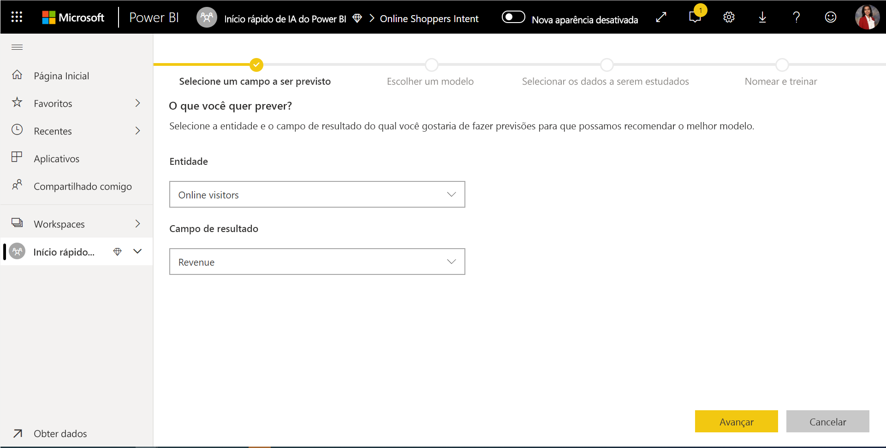
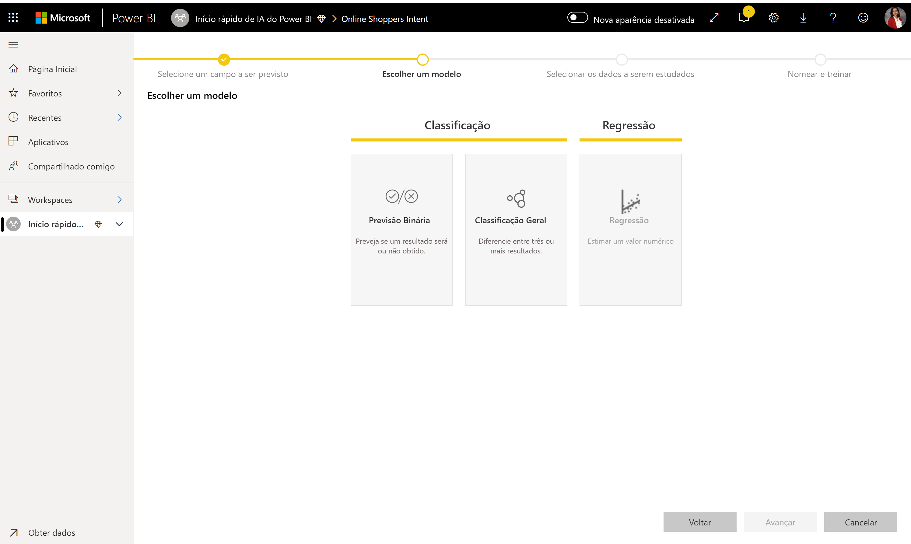
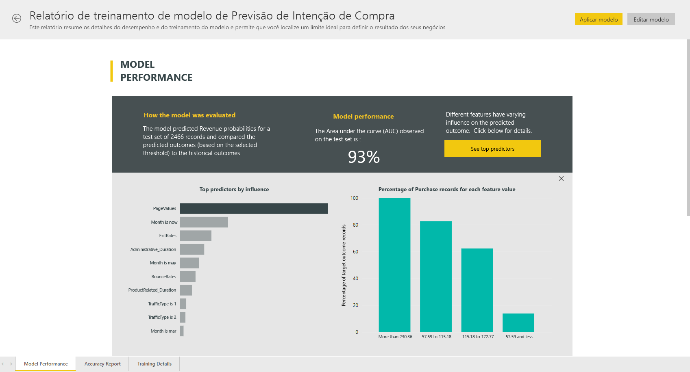
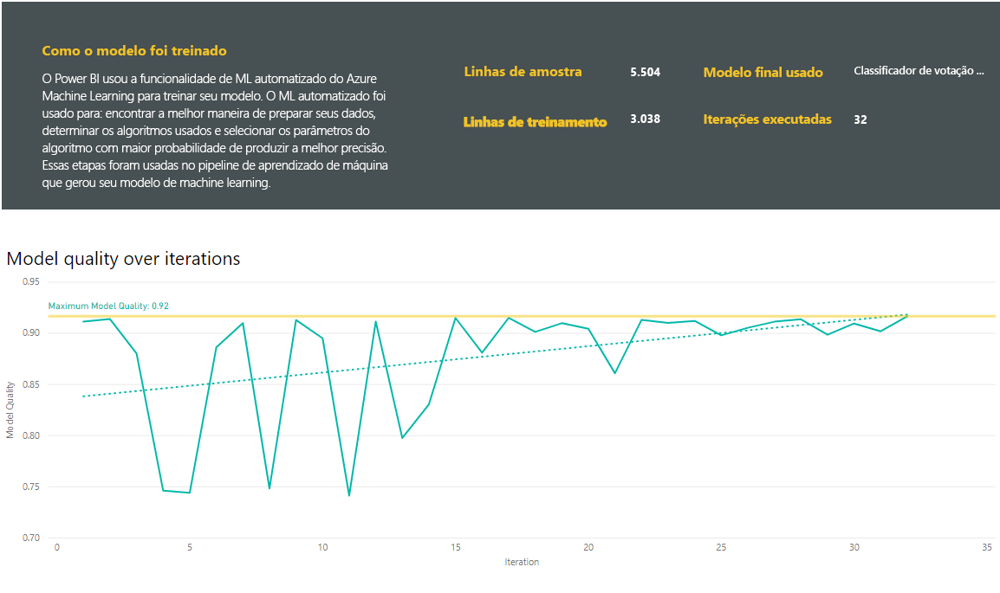
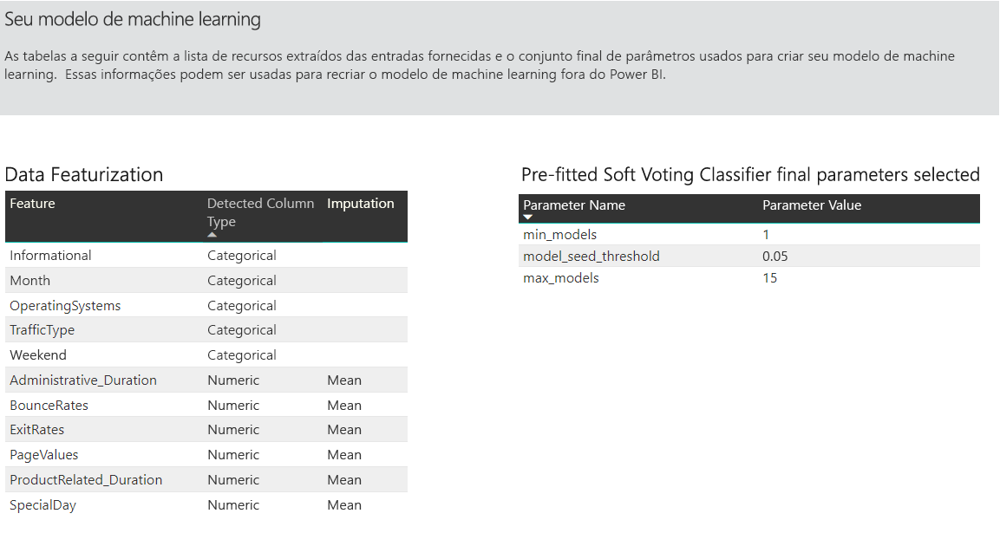
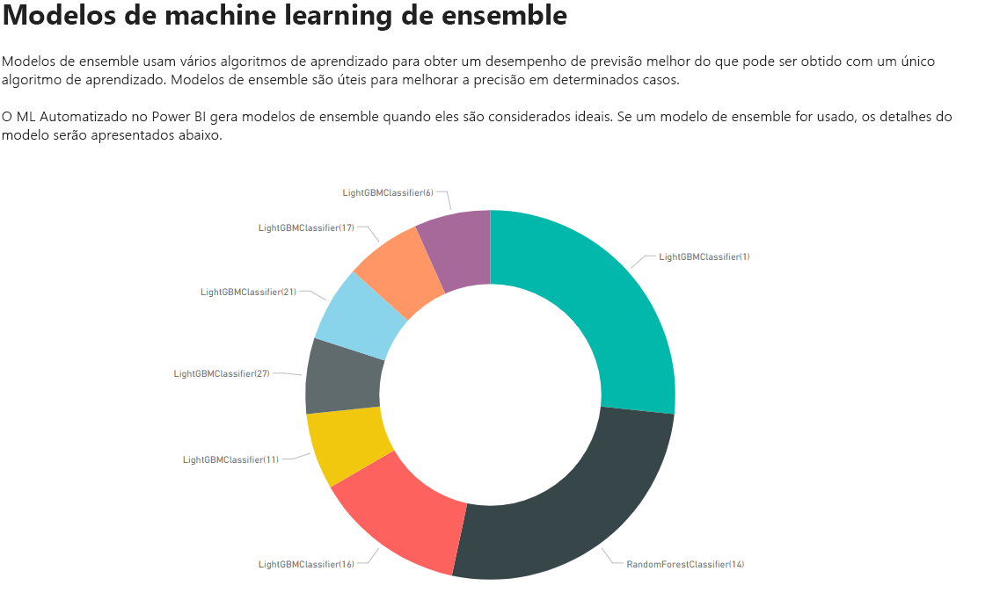
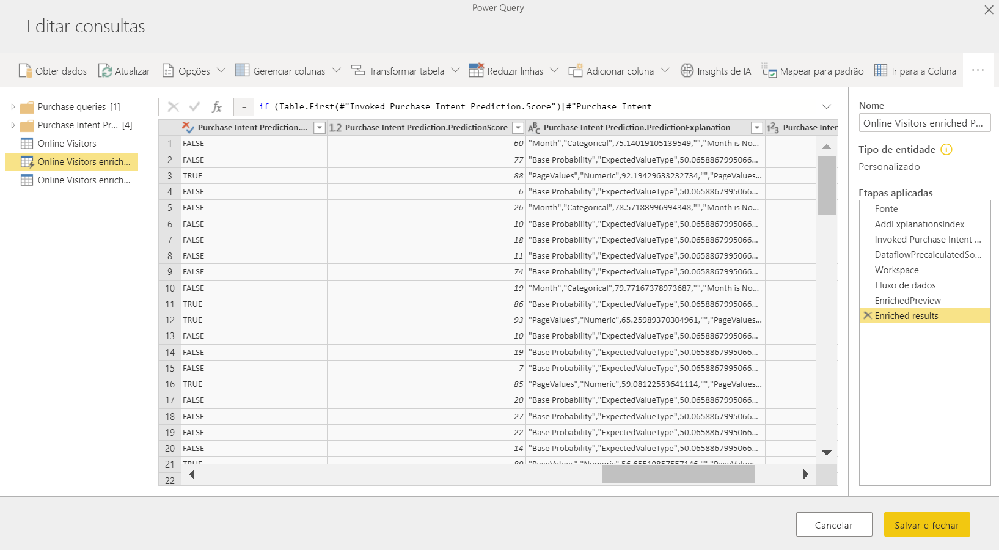
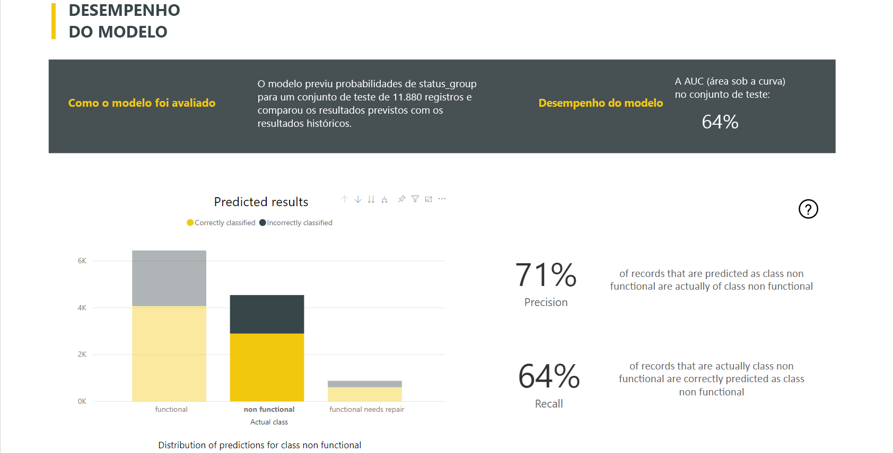
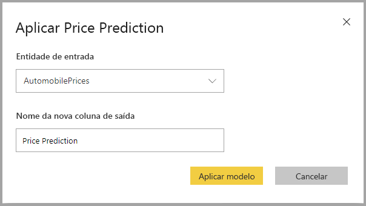

# Machine Learning Automatizado no Power BI

O AutoML (machine learning automatizado) para fluxos de trabalho permite que os analistas de negócios treinem, validem e invoquem modelos de ML (machine learning) diretamente no Power BI. Ela apresenta uma experiência simples para criação de um novo modelo de ML, em que os analistas podem usar seus fluxos de dados para especificar os dados de entrada para treinamento do modelo. O serviço extrai automaticamente os recursos mais relevantes, seleciona um algoritmo apropriado e ajusta e valida o modelo de ML. Depois que um modelo é treinado, o Power BI gera automaticamente um relatório de desempenho que inclui os resultados da validação. Depois, o modelo pode ser chamado em qualquer dado novo ou atualizado dentro do fluxo de dados.

A Machine Learning Automatizada está disponível apenas para fluxos de entrada hospedados no Power BI Premium e capacidades Incorporadas.

## Como trabalhar com a AutoML

Os [fluxos de dados do Power BI](service-dataflows-overview.md) oferecem preparação de dados de autoatendimento para Big Data. O AutoML é integrado aos fluxos de dados e permite que você aproveite seus esforços de preparação de dados para criar modelos de machine learning diretamente no Power BI.

A AutoML no Power BI permite que os analistas de dados usem fluxos de dados para criar modelos de machine learning com uma experiência simplificada, usando apenas habilidades do Power BI. A maior parte da ciência de dados por trás da criação dos modelos de ML é automatizada pelo Power BI. Ele tem grades de proteção para garantir que o modelo produzido tenha uma boa qualidade e fornece visibilidade do processo usado para criar o modelo de ML.

O AutoML dá suporte à criação de **Modelos de Previsão Binária**, **Classificação** e **Regressão** em fluxos de dados. Esses são tipos de técnicas de aprendizado de máquina supervisionado, o que significa que eles aprendem com os resultados conhecidos das observações anteriores para prever os resultados de outras observações. O conjunto de dados de entrada para treinamento de um modelo da AutoML é um conjunto de registros **rotulados** com os resultados conhecidos.

O AutoML no Power BI integra o [ML automatizado](https://docs.microsoft.com/azure/machine-learning/service/concept-automated-ml) do [Azure Machine Learning](https://docs.microsoft.com/azure/machine-learning/service/overview-what-is-azure-ml) para criar seus modelos de ML. No entanto, você não precisa de uma assinatura do Azure para usar a AutoML no Power BI. O processo de treinamento e hospedagem de modelos de ML é totalmente gerenciado pelo serviço do Power BI.

Após o treinamento de um modelo de ML, a AutoML gera automaticamente um relatório do Power BI que explica o provável desempenho do seu modelo de ML. O AutoML enfatiza a explicabilidade realçando os principais influenciadores entre as entradas que induzem as previsões retornadas pelo modelo. O relatório também inclui métricas-chave para o modelo.

Outras páginas do relatório gerado mostram o resumo estatístico do modelo e os detalhes do treinamento. O resumo estatístico interessa aos usuários que desejam ver as medidas padrão de ciência de dados do desempenho do modelo. Os detalhes de treinamento resumem todas as iterações executadas para criar seu modelo, com os parâmetros de modelagem associados. Também descrevem como cada entrada foi usada para criar o modelo de ML.

Em seguida, é possível aplicar seu modelo de ML aos dados para pontuação. Quando o fluxo de dados é atualizado, os dados são atualizados com as previsões do modelo de ML. O Power BI também inclui uma explicação individualizada para cada previsão específica produzida pelo modelo de ML.

## Criar um modelo de machine learning

Esta seção descreve como criar um modelo de AutoML.

### Preparação de dados para criar um modelo de ML

Para criar um modelo de machine learning no Power BI, primeiro, é preciso criar um fluxo de dados para os dados contendo as informações do resultado histórico, que são usadas para treinar o modelo de ML. Adicione também colunas calculadas para todas as métricas de negócios que possam representar previsões sólidas para o resultado que você está tentando prever. Para saber mais sobre como configurar seu fluxo de dados, confira [Preparação de dados de autoatendimento no Power BI](service-dataflows-overview.md).

A AutoML tem requisitos de dados específicos para treinar um modelo de machine learning. Esses requisitos estão descritos nas seções abaixo, com base nos respectivos tipos de modelo.

### Configurar as entradas do modelo de ML

Para criar um modelo de AutoML, selecione o ícone de ML na coluna **Ações** da entidade de fluxo de dados e selecione **Adicionar um modelo de machine learning**.

Uma experiência simplificada é iniciada, composta por um assistente que orienta você pelo processo de criação do modelo de ML. O assistente inclui as etapas simples a seguir.

**1. Selecionar a entidade com os dados históricos e o campo de resultado para o qual você deseja obter uma previsão**

O campo de resultado identifica o atributo de rótulo para treinar o modelo de ML, mostrado na imagem a seguir.

**2. Escolher um tipo de modelo**

Quando você especifica o campo de resultado, o AutoML analisa os dados do rótulo para recomendar o tipo de modelo de ML mais provável que pode ser treinado. Você pode escolher um tipo de modelo diferente, conforme mostrado abaixo, clicando em “Selecionar um modelo diferente”.

> [!NOTE]
> Talvez alguns tipos de modelos não sejam compatíveis com os dados selecionados e, portanto, serão desabilitados. No exemplo acima, a Regressão está desabilitada, pois uma coluna de texto está selecionada como o campo de resultado.

**3. Selecionar as entradas que você deseja que o modelo use como sinais preditivos**

O AutoML analisa uma amostra da entidade selecionada para sugerir as entradas que podem ser usadas para treinar o modelo de ML. As explicações são fornecidas ao lado dos campos que não estão selecionados. Se um campo específico tem muitos valores distintos ou apenas um valor, ou uma correlação baixa ou alta com o campo de saída, ele não é recomendado.

As entradas que dependem do campo de resultado (ou do campo de rótulo) não devem ser usadas para treinar o modelo de ML, pois elas afetarão o desempenho. Esses campos são sinalizados como tendo “correlação anormalmente alta com o campo de saída”. A introdução desses campos nos dados de treinamento causa o vazamento de rótulo, em que o modelo tem um bom desempenho nos dados de validação ou de teste, mas não pode igualar esse desempenho quando usado em produção para pontuação. O vazamento de rótulo pode ser uma possível preocupação em modelos de AutoML, quando o desempenho do modelo de treinamento é bom demais para ser verdade.

Essa recomendação de recurso se baseia em uma amostra de dados, portanto, você deve examinar as entradas usadas. Você tem a opção de alterar as seleções para incluir somente os campos que deseja que o modelo estude. Você também pode selecionar todos os campos marcando a caixa de seleção ao lado do nome da entidade.

**4. Nomear o modelo e salvar a configuração**

Na etapa final, você pode nomear o modelo e selecionar Salvar e treinar, o que começa a treinar o modelo ML. Você pode optar por reduzir o tempo de treinamento para ver resultados rápidos ou aumentar o tempo gasto no treinamento para obter o melhor modelo.

### Treinamento do modelo de ML

O treinamento dos modelos de AutoML faz parte da atualização do fluxo de dados. Primeiro, a AutoML prepara seus dados para o treinamento.
O AutoML divide os dados históricos fornecidos em conjuntos de dados de treinamento e teste. O conjunto de dados de teste é um conjunto de controle usado para validar o desempenho do modelo após o treinamento. Eles são executados como entidades de **Treinamento e Teste** no fluxo de dados. A AutoML usa validação cruzada para validar o modelo.

Em seguida, cada campo de entrada é analisado e a imputação é aplicada, inserindo valores substituídos para cada valor ausente. A AutoML usa algumas estratégias de imputação diferentes. Para atributos de entrada tratados como recursos numéricos, a média dos valores de coluna é usada para imputação. Para atributos de entrada tratados como recursos categóricos, o AutoML usa o modo dos valores de coluna para imputação. A média e o modo dos valores usados para imputação são calculados pela estrutura AutoML no conjunto de dados de treinamento da subamostra.

Em seguida, a amostragem e a normalização são aplicadas aos dados, conforme necessário. Para modelos de classificação, o AutoML executa os dados de entrada por meio da amostragem estratificada e equilibra as classes para garantir que as contagens de linhas sejam iguais para todas.

O AutoML aplica várias transformações a cada campo de entrada selecionado com base no tipo de dados e nas propriedades estatísticas. A AutoML usa essas transformações para extrair recursos para uso no treinamento do seu modelo de ML.

O processo de treinamento de modelos da AutoML é composto por até 50 iterações com algoritmos de modelagem variados e configurações de hiperparâmetros para localizar o modelo com o melhor desempenho. O treinamento poderá ser encerrado antecipadamente com iterações menores se o AutoML observar que não há nenhuma melhoria de desempenho sendo observada. O desempenho de cada um desses modelos é avaliado pela validação com o conjunto de dados de teste de controle. Durante essa etapa de treinamento, a AutoML cria vários pipelines para treinamento e validação dessas iterações. O processo de avaliação do desempenho dos modelos pode demorar um pouco, desde alguns minutos a algumas horas até o tempo de treinamento configurado no assistente, dependendo do tamanho do conjunto de dados e dos recursos de capacidade dedicada disponíveis.

Em alguns casos, o modelo final gerado pode usar o ensemble learning, em que vários modelos são usados para fornecer melhor desempenho de previsão.

### Capacidade de explicação do modelo de AutoML

Após o treinamento do modelo, a AutoML analisará a relação entre os recursos de entrada e a saída do modelo. Ele avalia a magnitude da alteração na saída do modelo para o conjunto de dados de teste de controle para cada recurso de entrada. Isso é conhecido como _importância do recurso_. Isso ocorre como parte da atualização depois que o treinamento é concluído. Portanto, a atualização pode demorar mais do que o tempo de treinamento configurado no assistente.

### Relatório de modelo da AutoML

A AutoML gera um relatório do Power BI que resume o desempenho do modelo durante a validação e fornece a importância do recurso global. Esse relatório pode ser acessado na guia Modelo de Machine Learning depois que a atualização de fluxo de dados é bem-sucedida. O relatório resume os resultados da aplicação do modelo de ML aos dados de teste de controle e da comparação das previsões com os valores de resultado conhecidos.

Examine o relatório de modelo para entender seu desempenho. Você também pode validar se os principais influenciadores do modelo estão alinhados com os insights de negócios sobre os resultados conhecidos.

Os gráficos e medidas usados para descrever o desempenho do modelo no relatório dependem do tipo de modelo. Veja uma descrição desses gráficos e medidas de desempenho nas seções a seguir.

Outras páginas do relatório podem descrever medidas estatísticas sobre o modelo de uma perspectiva de ciência de dados. Por exemplo, o relatório de **Previsão Binária** inclui um gráfico de lucro e a curva de ROC do modelo.

Os relatórios também incluem uma página **Detalhes do Treinamento**, que inclui uma descrição de como o modelo foi treinado e um gráfico descrevendo o desempenho do modelo em cada uma das execuções de iterações.

Outra seção dessa página descreve o tipo detectado do campo de entrada e o método de imputação usado para preencher os valores ausentes. Também inclui os parâmetros usados pelo modelo final.

Se o modelo produzido usar o ensemble learning, a página **Detalhes do Treinamento** também incluirá um gráfico que mostra o peso de cada modelo de constituinte no ensemble, bem como os parâmetros.

## Aplicação do modelo de AutoML

Se você estiver satisfeito com o desempenho do modelo de ML criado, poderá aplicá-lo aos dados novos ou atualizados quando o fluxo de dados for atualizado. Faça isso no relatório de modelo selecionando o botão **Aplicar** no canto superior direito ou o botão Aplicar Modelo de ML em ações na guia Modelos de Machine Learning.

Para aplicar o modelo de ML, você deve especificar o nome da entidade à qual ele deve ser aplicado e um prefixo para as colunas que serão adicionadas a essa entidade para a saída do modelo. O prefixo padrão para os nomes de coluna é o nome do modelo. A função _Apply_ pode incluir parâmetros adicionais específicos ao tipo de modelo.

A aplicação do modelo de ML cria duas entidades de fluxo de dados que contêm as previsões e explicações individualizadas para cada linha pontuada na entidade de saída. Por exemplo, se você aplicar o modelo _PurchaseIntent_ à entidade _OnlineShoppers_, a saída gerará as entidades **PurchaseIntent enriquecida com OnlineShoppers** e **explicações sobre PurchaseIntent enriquecidas com OnlineShoppers**. Para cada linha da entidade enriquecida, as **Explanations** são divididas em várias linhas na entidade de explicações enriquecidas com base no recurso de entrada. Um **ExplanationIndex** ajuda a mapear as linhas na entidade de explicações enriquecidas para a linha na entidade enriquecida.

Depois que você aplica o modelo, o AutoML sempre mantém suas previsões atualizadas sempre que o fluxo de dados é atualizado.

Para usar os insights e previsões do modelo de ML em um relatório do Power BI, você pode se conectar à entidade de saída no Power BI Desktop usando o conector de **fluxo de dados**.

## Modelos de Previsão Binária

Os modelos de Previsão Binária, mais formalmente conhecidos como **modelos de classificação binária**, são usados para classificar um conjunto de dados em dois grupos. Eles são usados para prever eventos que possam ter um resultado binário. Por exemplo, se uma oportunidade de vendas será convertida, se uma conta terá rotatividade, se uma fatura será paga no prazo, se uma transação é fraudulenta etc.

A saída de um modelo de Previsão Binária é uma pontuação de probabilidade, que identifica a probabilidade de o resultado de destino ser alcançado.

### Treinar um modelo de Previsão Binária

Pré-requisitos:

- É necessário um mínimo de 20 linhas de dados históricos para cada classe de resultados

O processo de criação de um modelo de Previsão Binária segue as mesmas etapas que outros modelos de AutoML, descritos na seção **Configurar as entradas do modelo de ML** acima. A única diferença está na etapa “Escolher um modelo”, em que você pode selecionar o valor de resultado de destino no qual está mais interessado. Forneça também rótulos amigáveis para os resultados a serem usados no relatório gerado automaticamente que resumirá os resultados da validação do modelo.

### Relatório do modelo de Previsão Binária

O modelo de Previsão Binária produz como uma saída uma probabilidade de que um registro alcance o resultado de destino. O relatório inclui uma segmentação para o limite de probabilidade, que influencia como as pontuações acima e abaixo do limite de probabilidade serão interpretadas.

O relatório descreve o desempenho do modelo em termos de _Verdadeiros Positivos, Falsos Positivos, Verdadeiros Negativos e Falsos Negativos_. Verdadeiros Positivos e Verdadeiros Negativos são resultados previstos corretamente para as duas classes nos dados do resultado. Falsos Positivos são registros para os quais foi previsto o resultado de destino, mas que, na verdade, não tiveram esse resultado. Por outro lado, Falsos Negativos são registros que tiveram o resultado de destino, mas para os quais isso não foi previsto.

Medidas, como Precisão e Recall, descrevem o efeito do limite de probabilidade nos resultados previstos. Você pode usar a segmentação de limite de probabilidade para selecionar um limite que alcance um comprometimento equilibrado entre Precisão e Recall.

O relatório também inclui uma ferramenta de análise de custo-benefício para ajudar a identificar o subconjunto da população que deve ser o alvo para gerar o lucro mais alto. Considerando um custo de direcionamento de unidade estimado e um benefício de unidade para atingir um resultado de destino, a análise de custo-benefício tenta maximizar o lucro. Use essa ferramenta para escolher o limite de probabilidade com base no ponto máximo no grafo para maximizar o lucro. Use também o grafo para calcular o lucro ou o custo de sua escolha de limite de probabilidade.

A página **Relatório de Precisão** do relatório de modelo inclui o gráfico _Ganhos Cumulativos_ e a curva ROC para o modelo. Essas são medidas estatísticas de desempenho do modelo. Os relatórios incluem descrições dos gráficos mostrados.

### Aplicar um modelo de Previsão Binária

Para aplicar um modelo de Previsão Binária, você deve especificar a entidade com os dados aos quais você quer aplicar as previsões do modelo de ML. Outros parâmetros incluem o prefixo de nome da coluna de saída e o limite de probabilidade para classificação do resultado previsto.

Quando um modelo de Previsão Binária é aplicado, ele adiciona quatro colunas de saída à entidade de saída enriquecida: **Outcome**, **PredictionScore**, **PredictionExplanation** e **ExplanationIndex**. Os nomes de coluna na entidade têm o prefixo especificado quando o modelo é aplicado.

**PredictionScore** é uma probabilidade percentual, que identifica a probabilidade de o resultado de destino ser atingido.

A coluna **Outcome** contém o rótulo do resultado previsto. Os registros com probabilidades que excedem o limite são previstos como tendo a probabilidade de alcançar o resultado de destino e são rotulados como True. Os registros abaixo do limite são previstos como não tendo a probabilidade de alcançar o resultado e são rotulados como False.

A coluna **PredictionExplanation** contém uma explicação com a influência específica que os recursos de entrada tinham no **PredictionScore**.

## Modelos de classificação

Os modelos de classificação são usados para classificar um conjunto de dados em vários grupos ou classes. Eles são usados para prever eventos que possam ter um dos vários resultados possíveis. Por exemplo, se é provável que um cliente tenha um Valor de Tempo de Vida muito alto, alto, médio ou baixo, se o risco de inadimplência é Alto, Moderado, Baixo ou Muito Baixo etc.

A saída de um modelo de Classificação é uma pontuação de probabilidade, que identifica a probabilidade de um registro atingir os critérios para uma determinada classe.

### Treinar um modelo de Classificação

A entidade de entrada que contém os dados de treinamento para um modelo de Classificação precisa ter um campo de cadeia de caracteres ou de número inteiro como o campo de resultado, que identifica os últimos resultados conhecidos.

Pré-requisitos:

- É necessário um mínimo de 20 linhas de dados históricos para cada classe de resultados

O processo de criação de um modelo de Classificação segue as mesmas etapas que outros modelos de AutoML, descritos na seção **Configurar as entradas do modelo de ML** acima.

### Relatório do modelo de Classificação

O relatório do modelo de Classificação é produzido pela aplicação do modelo de ML nos dados de teste de controle e pela comparação da classe prevista para um registro com a classe real conhecida.

O relatório de modelo inclui um gráfico que inclui a divisão dos registros classificados correta e incorretamente para cada classe conhecida.

Um detalhamento adicional específico à classe permite uma análise de como as previsões de uma classe conhecida são distribuídas. Isso mostra as outras classes nas quais os registros dessa classe conhecida provavelmente serão classificados incorretamente.

A explicação do modelo no relatório também inclui os principais previsores de cada classe.

O relatório do modelo de Classificação também inclui uma página de Detalhes do Treinamento semelhante às páginas de outros tipos de modelo, conforme descrito na seção **Relatório do modelo de AutoML** anteriormente neste artigo.

### Aplicar um modelo de classificação

Para aplicar um modelo de ML de Classificação, você deve especificar a entidade com os dados de entrada e o prefixo de nome da coluna de saída.

Quando um modelo de Classificação é aplicado, ele adiciona cinco colunas de saída à entidade de saída enriquecida: **ClassificationScore**, **ClassificationResult**, **ClassificationExplanation**, **ClassProbabilities** e **ExplanationIndex**. Os nomes de coluna na entidade têm o prefixo especificado quando o modelo é aplicado.

A coluna **ClassProbabilities** contém a lista de pontuações de probabilidade para o registro de cada classe possível.

**ClassificationScore** é uma probabilidade percentual, que identifica a probabilidade de um registro atingir os critérios para determinada classe.

A coluna **ClassificationResult** contém a classe previsível mais provável para o registro.

A coluna **ClassificationExplanation** contém uma explicação com a influência específica que os recursos de entrada tiveram na **ClassificationScore**.

## Modelos de Regressão

Os modelos de regressão são usados para prever um valor numérico. Por exemplo: a receita provável a ser obtida de uma oferta de vendas, o valor de tempo de vida de uma conta, a quantia de uma fatura a receber que provavelmente será paga, a data na qual uma fatura pode ser paga etc.

A saída de um modelo de Regressão é o valor previsto.

### Treinar um modelo de Regressão

A entidade de entrada que contém os dados de treinamento para um modelo de Regressão precisa ter um campo numérico como o campo de resultado, que identifica os valores de resultados conhecidos.

Pré-requisitos:

- É necessário um mínimo de 100 linhas de dados históricos para um modelo de Regressão

O processo de criação de um modelo de Regressão segue as mesmas etapas que outros modelos de AutoML, descritos na seção **Configurar as entradas do modelo de ML** acima.

### Relatório do modelo de Regressão

Assim como outros relatórios do modelo de AutoML, o relatório de Regressão tem base nos resultados da aplicação do modelo aos dados de teste de controle.

O relatório de modelo inclui um gráfico que compara os valores previstos com os valores reais. Neste gráfico, a distância da diagonal indica o erro na previsão.

O gráfico de erro residual mostra a distribuição do percentual de erro médio para valores diferentes no conjunto de dados de teste de controle. O eixo horizontal representa a média do valor real do grupo, com o tamanho da bolha mostrando a frequência ou a contagem de valores nesse intervalo. O eixo vertical é o erro residual médio.

O relatório do modelo de Regressão também inclui uma página de Detalhes do Treinamento como os relatórios de outros tipos de modelo, conforme descrito na seção **Relatório do modelo de AutoML** acima.

### Aplicar um modelo de Regressão

Para aplicar um modelo de ML de Regressão, você deve especificar a entidade com os dados de entrada e o prefixo de nome da coluna de saída.

Quando um modelo de Regressão é aplicado, ele adiciona três colunas de saída à entidade de saída enriquecida: **RegressionResult**, **RegressionExplanation** e **ExplanationIndex**. Os nomes de coluna na entidade têm o prefixo especificado quando o modelo é aplicado.

A coluna **RegressionResult** contém o valor previsto para o registro com base nos campos de entrada. A coluna **RegressionExplanation** contém uma explicação com a influência específica que os recursos de entrada tiveram no **RegressionResult**.

## Próximas etapas

Este artigo fornece uma visão geral da Machine Learning Automatizada para fluxos de dados no serviço do Power BI. Os artigos a seguir também podem ser úteis.

- [Tutorial: Criar um modelo de machine learning no Power BI ](../connect-data/service-tutorial-build-machine-learning-model.md)
- [Tutorial: Como usar os Serviços Cognitivos no Power BI](../connect-data/service-tutorial-use-cognitive-services.md)
- [Tutorial: Invocar um modelo do Machine Learning Studio (clássico) no Power BI (versão prévia)](../connect-data/service-tutorial-invoke-machine-learning-model.md)
- [Serviços Cognitivos no Power BI](service-cognitive-services.md)
- [Integração do Azure Machine Learning no Power BI](service-machine-learning-integration.md)

Para saber mais sobre os fluxos de dados, leia estes artigos:

- [Criação e uso de fluxos de dados no Power BI](service-dataflows-create-use.md)
- [Como usar entidades computadas no Power BI Premium](service-dataflows-computed-entities-premium.md)
- [Como usar fluxos de dados com fontes de dados locais](service-dataflows-on-premises-gateways.md)
- [Recursos de desenvolvedor para fluxos de dados do Power BI](service-dataflows-developer-resources.md)
- [Integração entre fluxos de dados e o Azure Data Lake (versão prévia)](service-dataflows-azure-data-lake-integration.md)
