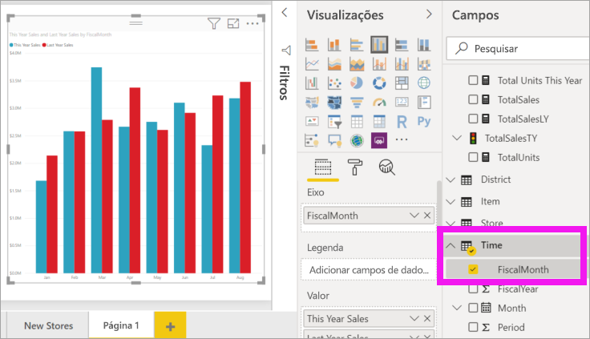
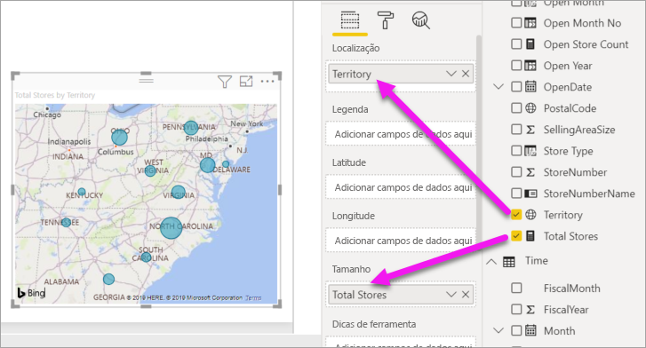
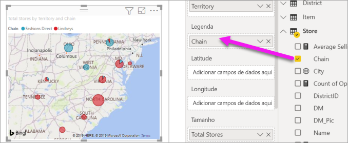

# Adicionar visuais a um relatório do Power BI (parte 2)

[!INCLUDE[consumer-appliesto-nyyn](../includes/consumer-appliesto-nyyn.md)]    

[!INCLUDE [power-bi-visuals-desktop-banner](../includes/power-bi-visuals-desktop-banner.md)]

Na [Parte 1](power-bi-report-add-visualizations-i.md), você criou uma visualização básica marcando as caixas de seleção ao lado dos nomes de campo.  Na parte 2, você aprenderá como usar o arrastar e soltar e fazer uso integral dos painéis **Campos** e **Visualizações** para criar e modificar as visualizações.

## Criar uma nova visualização
Neste tutorial, vamos examinar nosso conjunto de dados de Análise de Varejo e criar algumas visualizações chave.

## Pré-requisitos

Este tutorial usa o [Arquivo PBIX de exemplo de análise de varejo](https://download.microsoft.com/download/9/6/D/96DDC2FF-2568-491D-AAFA-AFDD6F763AE3/Retail%20Analysis%20Sample%20PBIX.pbix).

1. Na seção superior esquerda da barra de menus do Power BI Desktop, selecione **Arquivo** > **Abrir**
   
2. Encontre sua cópia do **arquivo PBIX de exemplo de Análise de Varejo**

1. Abra o **arquivo PBIX de exemplo de Análise de Varejo** na exibição de relatório .

1. Selecionar  para adicionar uma nova página.

## Adicionar visualizações ao relatório

Crie uma visualização selecionando um campo no painel **Campos** . O tipo de visualização criada dependerá do tipo de campo selecionado. O Power BI usa o tipo de dados para determinar qual visualização empregar na exibição dos resultados. Você pode alterar a visualização usada selecionando um ícone diferente no painel Visualizações. Lembre-se de que nem todas as visualizações são capazes de exibir seus dados. Por exemplo, os dados geográficos não serão bem exibidos usando um gráfico de funil ou um gráfico de linhas. 

### Adicionar um gráfico de área que examine as vendas deste ano em comparação com o ano passado

1. Na tabela **Vendas**, selecione **Vendas deste Ano** > **Valor** e **Vendas do Ano Passado**. O Power BI cria um gráfico de colunas.  Esse gráfico é interessante e você deseja investigar mais a fundo. O que torna as vendas semelhantes por mês?  
   
   

2. Na tabela Tempo, arraste **FiscalMonth** para a área **Eixo**.  
   

3. [Mude a visualização](power-bi-report-change-visualization-type.md) para um gráfico de área.  Há muitos tipos de visualização dentre as quais escolher – veja as [descrições de cada uma, dicas de melhores práticas e tutoriais](power-bi-visualization-types-for-reports-and-q-and-a.md) para ajudar a decidir qual tipo usar. Do painel Visualizações, selecione o ícone de gráfico de área .

4. Classifique a visualização selecionando **Mais ações** e escolhendo **Classificar por** >  **FiscalMonth**.

5. [Redimensione a visualização](power-bi-visualization-move-and-resize.md) selecionando a visualização, captando um dos círculos da estrutura de tópicos e arrastando-o. Torne-a grande o suficiente para eliminar a barra de rolagem e pequeno o suficiente para nos dar espaço suficiente para adicionar outra visualização.
   
   
6. [Salve o relatório](../create-reports/service-report-save.md).

### Adicionar uma visualização do mapa que analisa as vendas por local

1. Na tabela **Loja**, selecione **Território**. Arraste **Pontuação Total** na área Tamanho. O Power BI reconhece que a Região é um local e cria uma visualização de mapa.  
   

2. Adicione uma legenda.  Para ver os dados por nome de loja, arraste a **Cadeia** > **de Lojas** para a área de Legenda.  
   

> [!NOTE]
> Compartilhar seu relatório com um colega do Power BI exige que você tenha licenças de Power BI Pro individuais ou que o relatório seja salvo na capacidade Premium. Confira [compartilhamento de relatórios](../collaborate-share/service-share-reports.md).

## Próximas etapas
* Mais sobre [Visualizações nos relatórios do Power BI](power-bi-report-visualizations.md).  
* Mais perguntas? [Experimente a Comunidade do Power BI](https://community.powerbi.com/)

