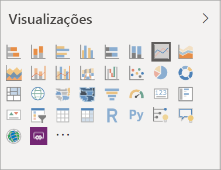
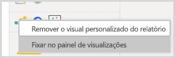
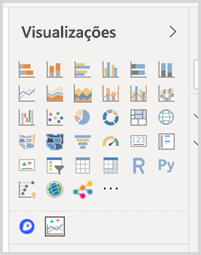

# Visualizações em relatórios do Power BI

[!INCLUDE[consumer-appliesto-yyyn](../includes/consumer-appliesto-yyyn.md)]    

Visualizações (também conhecidas como visuais) exibem insights que foram descobertos nos dados. Um relatório do Power BI pode ter uma única página com um visual ou então páginas repletas de visuais. No serviço do Power BI, os visuais podem ser [fixados dos relatórios nos dashboards](../create-reports/service-dashboard-pin-tile-from-report.md).

É importante fazer a distinção entre *designers* de relatórios e *consumidores* de relatórios.  Se estiver criando ou modificando o relatório, você será um designer.  Designers têm permissões de edição para o relatório e para o respectivo conjunto de dados subjacente. No Power BI Desktop, isso significa que você pode abrir o conjunto de dados no modo de exibição de dados e criar elementos visuais no modo de exibição de Relatório. No serviço do Power BI, isso significa que você pode abrir o relatório ou conjunto de dados no editor de relatório no [Modo de Exibição de Edição](../consumer/end-user-reading-view.md). Se um relatório ou dashboard foi [compartilhado com você](../consumer/end-user-shared-with-me.md), você é um *consumidor* de relatório. Você poderá exibir e interagir com o relatório e os respectivos visuais, mas não poderá fazer tantas alterações quanto um *designer*.

Há muitos tipos de visual diferentes disponíveis diretamente no painel Visualizações do Power BI.

Muitos outros visuais do Power BI estão disponíveis no site da [comunidade do Microsoft AppSource](https://appsource.microsoft.com). No AppSource, você pode procurar e [baixar](https://appsource.microsoft.com/marketplace/apps?page=1&product=power-bi-visuals) [visuais do Power BI](../developer/visuals/custom-visual-develop-tutorial.md) fornecidos pela Microsoft e pela comunidade.

Se você não estiver familiarizado com o Power BI ou precisar de um lembrete, use os links abaixo para aprender os fundamentos de visualizações de Power BI.  Como alternativa, use o Sumário (no lado esquerdo deste artigo) para encontrar informações ainda mais úteis.

## Adicionar uma visualização no Power BI

[Crie visualizações](power-bi-report-add-visualizations-i.md) nas páginas de seus relatórios. Navegue na [lista de visualizações e tutoriais de visualização disponíveis.](power-bi-visualization-types-for-reports-and-q-and-a.md) 

## Carregar uma visualização de um arquivo ou do AppSource

Adicione uma visualização que você criou ou que encontrou no [site da comunidade do Microsoft AppSource](https://appsource.microsoft.com/marketplace/apps?product=power-bi-visuals). Se sentindo criativo? Aprofunde-se em nosso código-fonte e use nossas [ferramentas para desenvolvedores](../developer/visuals/custom-visual-develop-tutorial.md) para criar um novo tipo de visualização e [compartilhá-la com a comunidade](../developer/visuals/office-store.md). Para saber mais sobre o desenvolvimento de um visual do Power BI, visite [Como desenvolver um visual do Power BI](../developer/visuals/custom-visual-develop-tutorial.md).

## Personalizar seu painel de visualização

Você pode personalizar o painel de visualização adicionando visuais do Power BI a ele ou removendo-os. Se tiver removido visuais padrão do painel de visualização, você poderá restaurar o painel para padrão e trazer de volta todos os visuais padrão.

### Adicionar um visual ao painel de visualização

Se estiver usando o mesmo visual em vários relatórios, você poderá adicionar o visual ao seu painel de visualização. A adição de visuais aplica-se a visuais do AppSource, visuais organizacionais e visuais de arquivos. Para adicionar um visual, clique com o botão direito do mouse no visual.

Depois que um visual for fixado, ele será movido para cima para ficar entre os outros visuais padrão. Esse visual agora está vinculado à sua conta conectada. Portanto, todos os novos relatórios que você criar automaticamente terão esse visual incluído, supondo que você está conectado. Você não precisa mais adicionar um visual específico usado regularmente a cada relatório.

### Remover um visual do painel de visualização

Se você parar de usar um visual regularmente, poderá clicar nele com o botão direito do mouse e removê-lo do painel de visualização. Qualquer tipo de visual pode ser removido do painel de visualização, incluindo os visuais padrão, de arquivo, organizacional e do AppSource.

### Restaurar o painel de visualização

A restauração do painel de visualização só se aplica aos visuais padrão. Os visuais adicionados ao painel de visualização não são afetados e permanecerão disponíveis no painel de visualização. Se você quiser remover os visuais do AppSource ou de arquivo do painel de visualização, será necessário fazer isso manualmente.

Para restaurar o painel de visualização para o padrão, clique em mais opções e selecione **Restaurar visuais padrão**.

## Altere o tipo de visualização

Tente [alterar o tipo de visualização](power-bi-report-change-visualization-type.md) para ver o que funciona melhor com seus dados.

## Fixe a visualização

No serviço do Power BI, quando a visualização estiver da forma que deseja, é possível [fixá-la em um dashboard](../create-reports/service-dashboard-pin-tile-from-report.md) como um bloco. Se você alterar a visualização em uso no relatório depois de fixá-lo, o bloco no dashboard não será alterado. Se fosse um gráfico de linhas, ele permaneceria um gráfico de linhas, mesmo que você o alterasse para um gráfico de rosca no relatório.

## Limitações e considerações
- Dependendo da fonte de dados e do número de campos (medidas ou colunas), um visual pode ser carregado lentamente.  É recomendável limitar os visuais para 10 a 20 campos no total, por motivos de desempenho e legibilidade. 

- O limite superior para visuais é de 100 campos (medidas ou colunas). Se o seu visual não for carregado, reduza o número de campos.

## Próximas etapas

* [Tipos de visualização no Power BI](power-bi-visualization-types-for-reports-and-q-and-a.md)
* [Visuais do Power BI](../developer/visuals/power-bi-custom-visuals.md)
