# Criar ArcGIS Maps no Power BI Desktop

[!INCLUDE [power-bi-visuals-desktop-banner](../includes/power-bi-visuals-desktop-banner.md)]

Este tutorial foi escrito do ponto de vista de uma pessoa que está criando um Mapa ArcGIS para o Power BI. Depois que um *designer* compartilha um Mapa ArcGIS para o Power BI com um colega, esse colega pode exibir e interagir com o mapa, mas não pode salvar alterações. Para saber mais sobre como exibir um mapa ArcGIS, confira [Interagindo com ArcGIS Maps for Power BI](power-bi-visualizations-arcgis.md).

A combinação de mapas do ArcGIS e do Power BI leva o mapeamento para além da apresentação de pontos em um mapa, para um nível totalmente novo. Escolha entre mapas de base, tipos de local, temas, estilos de símbolo e camadas de referência para criar visualizações de mapas informativas e bonitas. A combinação das camadas de dados competentes em um mapa com análise espacial transmite uma compreensão mais ampla dos dados na sua visualização.

 Embora não possa criar um mapa do ArcGIS Maps for Power BI em um dispositivo móvel, você possível exibi-lo e interagir com ele. Consulte [Interagindo com mapas do ArcGIS](power-bi-visualizations-arcgis.md).

> [!NOTE]
> Os mapas do ArcGIS para Power BI não estão disponíveis no momento para o Servidor de Relatórios do Power BI.

> [!TIP]
> GIS significa Geographic Information System (Sistema de Informações Geográficas).

O exemplo a seguir usa uma tela cinza escura para mostrar as vendas regionais como um mapa de dados em uma camada demográfica do rendimento médio disponível de 2016. Como você verá durante a leitura, o uso do ArcGIS Maps for Power BI oferece capacidades de mapeamento aprimorado quase ilimitadas, dados demográficos e visualizações de mapa ainda mais atraentes para que você possa fazer a melhor apresentação possível.

> [!TIP]
> Visite a [página da Esri sobre o ArcGIS Maps for Power BI](https://www.esri.com/powerbi) para ver muitos exemplos e ler depoimentos. E, em seguida, confira a [Página de Introdução do ArcGIS Maps for Power BI](https://doc.arcgis.com/en/maps-for-powerbi/get-started/about-maps-for-power-bi.htm) da Esri.

## Consentimento do usuário
O ArcGIS Maps for Power BI é fornecido pela Esri (https://www.esri.com). O uso do ArcGIS Maps para Power BI está sujeito aos termos e à política de privacidade da Esri. Os usuários do Power BI que queiram usar o ArcGIS Maps para o Power BI deverão aceitar a caixa de diálogo de consentimento.

**Recursos**

[Termos](https://go.microsoft.com/fwlink/?LinkID=826322)

[Política de privacidade](https://go.microsoft.com/fwlink/?LinkID=826323)

[Página do produto ArcGIS Maps para Power BI](https://www.esri.com/powerbi)

## Pré-requisitos

Este tutorial usa o Power BI Desktop e o [exemplo de Análise de Varejo](https://download.microsoft.com/download/9/6/D/96DDC2FF-2568-491D-AAFA-AFDD6F763AE3/Retail%20Analysis%20Sample%20PBIX.pbix). O ArcGIS Maps for Power BI também pode ser criado usando o serviço do Power BI. 

1. Na seção superior esquerda da barra de menus, selecione **Arquivo** \> **Abrir**
   
2. Localize o **arquivo PBIX de exemplo de Análise de Varejo** salvo no computador local.

1. Abra o **Exemplo de Análise de Varejo** na exibição de relatório .

1. Selecionar  para adicionar uma nova página.

   
## Criar uma visualização de mapa do ArcGIS Maps for Power BI

Assista ao Will criando algumas visualizações diferentes e, em seguida, use as etapas abaixo para tentar fazer isso por conta própria usando o [arquivo PBIX de exemplo de Análise de Varejo](../sample-datasets.md).
    

   > [!NOTE]
   > Este vídeo usa uma versão mais antiga do Power BI Desktop.
   > 

> [!VIDEO https://www.youtube.com/embed/EKVvOZmxg9s]

1. Selecione o ícone do ArcGIS Maps for Power BI no painel Visualizações.
   
    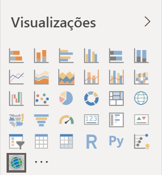    

2. O Power BI adiciona um modelo vazio à tela do relatório. Para este tutorial, vamos usar a versão gratuita.
   
   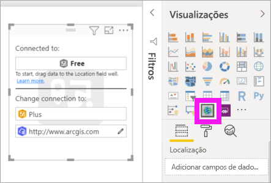

3. No painel **Campos**, arraste um campo de dados para os buckets **Localização**, **Latitude** e/ou **Longitude**. Neste exemplo, estamos usando o **Repositório > Cidade**.
   
   > [!NOTE]
   > O ArcGIS Maps para o Power BI detectará automaticamente se é melhor exibir os campos selecionados como uma forma ou um ponto em um mapa. Você pode ajustar o padrão nas configurações (veja abaixo).
   > 
   > 
   
    

4. No painel **Campos**, arraste uma medida para o bucket **Tamanho** para ajustar como os dados são mostrados. Neste exemplo, estamos usando **Vendas > Vendas do Último Ano**.
   
    

Você criou seu primeiro mapa do ArcGIS Maps for Power BI. Agora, vamos refinar e formatar nosso mapa usando mapas base, tipos de local, temas e muito mais.

## Configurações e formatação do ArcGIS Maps for Power BI
Para acessar os recursos de formatação do **ArcGIS Maps para Power BI**:

1. Acesse recursos adicionais selecionando **Mais ações** (...) no canto superior direito da visualização e escolhendo **Editar**.
   
   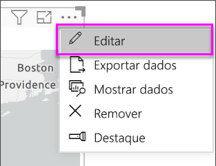
   
   A visualização é expandida e os recursos disponíveis são exibidos na parte superior. Cada recurso, quando selecionado, abre um painel de tarefas que fornece opções detalhadas. 
   
   
   

> [!TIP]
> A **Esri** oferece uma [documentação abrangente](https://go.microsoft.com/fwlink/?LinkID=828772) sobre o conjunto de recursos do **ArcGIS Maps para Power BI**.

### Mapas base
São fornecido quatro mapas básicos: Dark Gray Canvas, Light Gray Canvas, OpenStreetMap e Streets.  *Ruas* é o mapa base padrão do ArcGIS.

Para aplicar um mapa base, selecione-o no painel de tarefas.

### Tipo de local
O ArcGIS Maps for Power BI detecta automaticamente a melhor maneira de mostrar os dados no mapa. Ele selecione entre pontos ou limites. As opções de Tipo de local permitem ajustar essas seleções.

**Limites** apenas funcionará se os dados contiverem valores geográficos padrão. O ArcGIS Maps for Power BI detecta automaticamente a forma a ser mostrada no mapa. Os valores geográficos padrão incluem países, províncias, CEP, etc. Mas, da mesma forma que ocorre com o Geocódigo, o Power BI pode não detectar que um campo deve ser um limite por padrão ou pode não localizar um limite para seus dados.  

### Tema do mapa
Quatro temas de mapa são fornecidos. O Power BI seleciona automaticamente o tema **Somente localização** ou **Tamanho**, com base nos campos que você adicionou aos buckets **Localização** ou **Tamanho**. Nosso mapa usa o **Tamanho** como padrão, uma vez que adicionamos campos aos dois buckets. Experimente os outros temas e volte para **Tamanho** antes de prosseguir para a próxima etapa.  

<table>
<tr><th>Tema</th><th>Descrição</th>
<tr>
<td>Somente Localização</td>
<td>Plota pontos de dados ou limites preenchidos no mapa com base no campo que você adicionou ao bucket Localização.</td>
</tr>
<tr>
<td>Mapa de Calor</td>
<td>Plota a intensidade dos dados no mapa. Áreas de maior atividade ou valor são representadas por cores mais fortes e brilhantes. </td>
</tr>
<tr>
<td>Tamanho</td>
<td>Plota pontos de dados no mapa com base no campo que você adicionou ao bucket Tamanho.</td>
</tr>
<tr>
<td>Clustering</td>
<td>Pontos dentro do raio do cluster especificado são agrupados em um único símbolo que representa o número de pontos nessa área do mapa. </td>
</tr>
</table>

### Estilo do símbolo
Os estilos de símbolo permitem ajustar como os dados são apresentados no mapa. Os estilos de símbolo são contextuais, com base no tipo de Localização e no tema do Mapa selecionados. O exemplo abaixo mostra o tema de Mapa definido como **Tamanho** e vários ajustes de estilo no símbolo quanto à transparência, ao estilo e ao tamanho. 

### Marcadores
Chame a atenção para pontos em seu mapa ao adicionar marcadores.  

1. Selecione a guia **Marcadores**.
2. Digite palavras-chave (como endereços, locais e pontos de interesse) na caixa de pesquisa e selecione uma opção na lista suspensa. Um símbolo é exibido no mapa e o mapa é ampliado na localização. Os resultados da pesquisa são salvos como cartões de localização no painel Marcadores. Você pode salvar até 10 cartões de localização.
   
   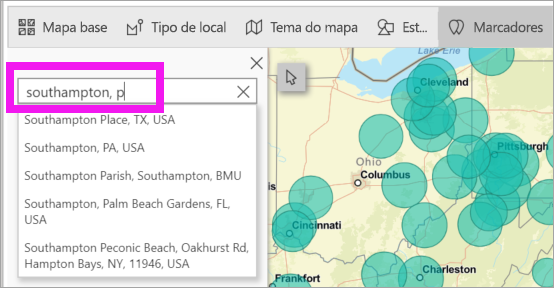
3. O Power BI adiciona um marcador a esse local e você pode alterar a cor do marcador.
   
   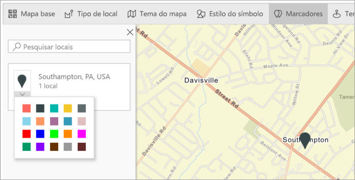
4. Adicionar e excluir marcadores.
   
   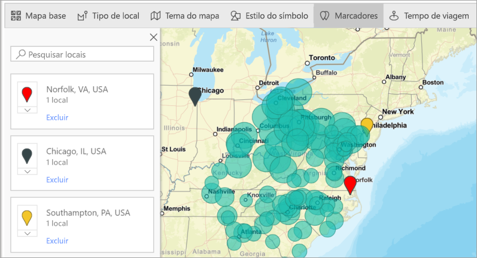

### Tempo de viagem
O painel Tempo de viagem permite selecionar uma localização e, em seguida, determinar quais outros recursos do mapa estão dentro de um raio ou tempo de viagem especificado. O exemplo a seguir mostra um raio de 50 milhas partindo de Washington D.C.  Siga as etapas abaixo para criar sua própria camada de tempo de direção. 
    

1. Selecione a ferramenta de seleção única e escolha um alfinete ou uma bolha. Neste exemplo, selecionamos um alfinete para o aeroporto Charlotte Douglas

   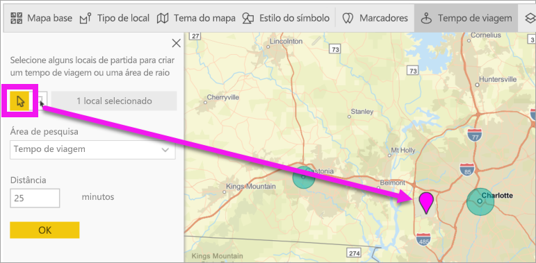
   
   > [!TIP]
   > É mais fácil selecionar um local quando você ampliar o mapa. Você pode ampliar usando o ícone + ou rolar o mouse.
   > 
   > 
2. Digamos que você vá voar para o aeroporto Charlotte Douglas em alguns dias e queira descobrir quais de suas lojas estão dentro de uma distância de direção razoável. Altere a área de pesquisa para **Tempo de direção** e a distância para **25** minutos. Selecione OK.    
   
    

    

3. Há duas lojas no perímetro de 25 minutos de direção. O raio é mostrado em roxo. Selecione uma localização para exibir seus detalhes. Opcionalmente, formate o raio alterando a cor e o contorno.
   
    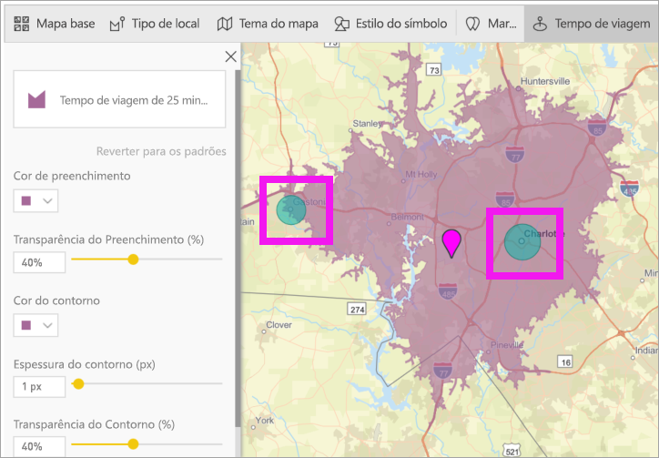

### Camada de Referência
#### Camada de Referência – dados demográficos
O ArcGIS Maps para Power BI oferece uma seleção de camadas demográficas que ajudam a contextualizar os dados do Power BI.

1. Selecione a guia **Camada de Referência** e escolha **Dados demográficos**.
2. Cada camada listada tem uma caixa de seleção. Adicione uma marca de seleção para adicionar essa camada ao mapa.  Neste exemplo, adicionamos a receita média da casa. 
   
    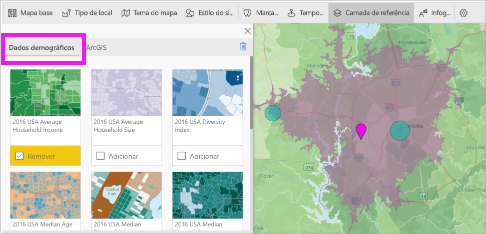
3. Cada camada também é interativa. Passe o mouse sobre uma bolha para ver os detalhes. Clique em uma área sombreada para ver os detalhes na forma de gráficos. Aqui, selecionamos o código postal 28227 e há dois gráficos para exibir.
   
    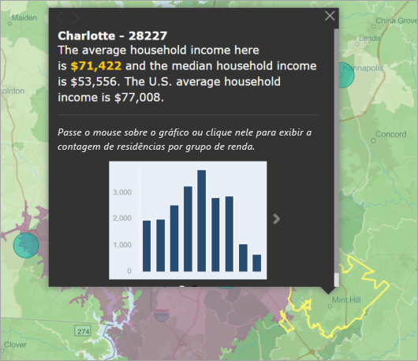

#### Camada de Referência – ArcGIS
O ArcGIS Online oferece às organizações a capacidade de publicar mapas públicos da Web. Além disso, a Esri fornece um conjunto estruturado de mapas da Web por meio do Living Atlas. Na guia ArcGIS, você pode pesquisar todos os mapas públicos da Web ou os mapas do Living Atlas e adicioná-los no mapa como camadas de referência.

1. Selecione a guia **Camada de Referência** e escolha **ArcGIS**.
2. Insira os termos de pesquisa e selecione uma camada do mapa. Neste exemplo, escolhemos Distritos congressionais dos Estados Unidos.
   
    
3. Para ver os detalhes, selecione uma área sombreada para abrir *Selecione na camada de referência*: use a ferramenta de seleção de camada de referência para escolher os limites ou objetos na camada de referência.

 

## Selecionando pontos de dados
O ArcGIS Maps for Power BI permite cinco modos de seleção para ajudá-lo a selecionar seus dados com precisão e rapidez.

Altere o modo de seleção passando o cursor do mouse sobre o ícone da ferramenta de seleção única mostrado na imagem abaixo. Isso expandirá a barra oculta para mostrar ferramentas adicionais:

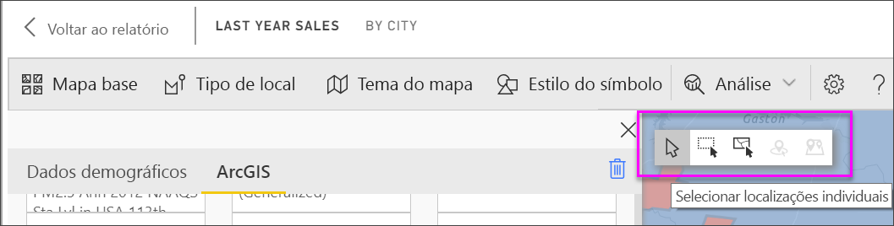

Cada ferramenta tem uma função exclusiva para permitir que você selecione seus dados: 

 Selecione pontos de dados individuais.

 Desenha um retângulo no mapa e seleciona os pontos de dados contidos.

 Permite que os limites ou polígonos nas camadas de referência sejam usados para selecionar os pontos de dados contidos.

 Permite que você selecione dados usando uma camada de buffer.

 Permite que você selecione pontos de dados semelhantes entre si.

> [!NOTE]
> No máximo, 250 pontos de dados podem ser selecionados por vez.
> 
> 

 

## Obtendo ajuda
A **Esri** oferece uma [documentação abrangente](https://go.microsoft.com/fwlink/?LinkID=828772) sobre o conjunto de recursos do **ArcGIS Maps para Power BI**.

Você pode fazer perguntas, encontrar as informações mais recentes, reportar problemas e encontrar respostas no [thread da comunidade do Power BI relacionado ao **ArcGIS Maps para o Power BI**](https://go.microsoft.com/fwlink/?LinkID=828771).

Se você tiver alguma sugestão de melhoria, envie-a para a [Lista de ideias do Power BI](https://ideas.powerbi.com).

 

## Gerenciando o uso do ArcGIS Maps para Power BI em sua organização
O Power BI oferece aos designers, administradores de locatários e administradores de TI a capacidade de gerenciar o uso do ArcGIS Maps for Power BI. Abaixo, você encontrará as etapas que cada função pode executar. 

### Opções do designer
No Power BI Desktop, os designers podem desabilitar o ArcGIS Maps for Power BI na guia de segurança. Selecione **Arquivo** > **Opções e configurações** e, em seguida, selecione **Opções** > **Segurança**. Quando desabilitado, o ArcGIS Maps não será carregado por padrão.

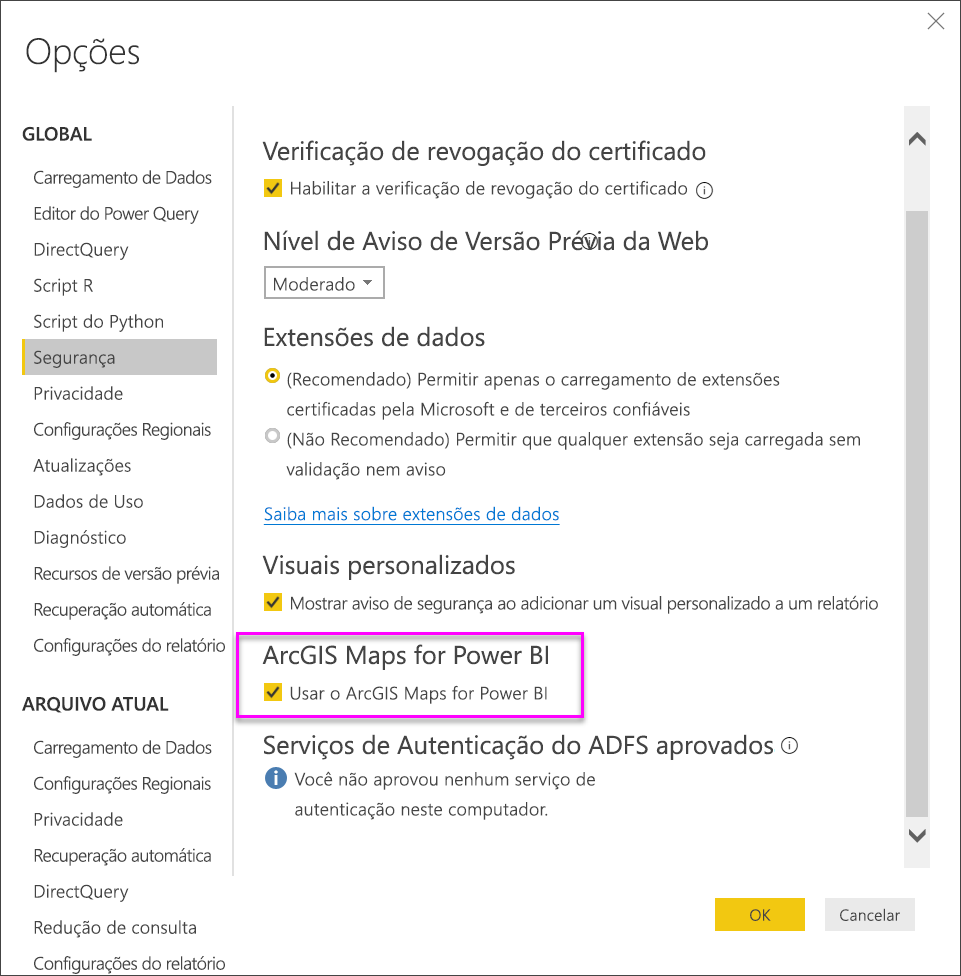

### Opções do administrador de locatários
No PowerBI.com, os administradores de locatários podem desativar o ArcGIS Maps for Power BI para todos os usuários. Selecione **Configurações** > **Portal de Administração** > **Configurações de locatário**. Quando desabilitado, o Power BI deixa de exibir o ícone do ArcGIS Maps for Power BI no painel de visualizações.

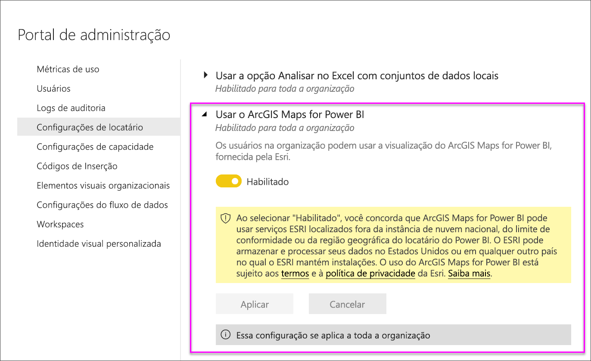

### Opções do Administrador de TI
O Power BI Desktop dá suporte ao uso de **Política de Grupo** para desabilitar o ArcGIS Maps for Power BI entre os computadores implantados em toda a organização.

<table>
<tr><th>Atributo</th><th>Valor</th>
</tr>
<tr>
<td>chave</td>
<td>Software\Políticas\Microsoft\Power BI Desktop&lt;/td&gt;
</tr>
<tr>
<td>valueName</td>
<td>EnableArcGISMaps</td>
</tr>
</table>

O valor 1 (decimal) habilita o ArcGIS Maps para Power BI.

O valor 0 (decimal) desabilita o ArcGIS Maps para Power BI.

## Considerações e limitações
Os Mapas do ArcGIS para o Power BI estão disponíveis nos seguintes serviços e aplicativos:

<table>
<tr><th>Serviço/Aplicativo</th><th>Disponibilidade</th></tr>
<tr>
<td>Power BI Desktop</td>
<td>Sim</td>
</tr>
<tr>
<td>Serviço do Power BI (app.powerbi.com)</td>
<td>Sim</td>
</tr>
<tr>
<td>Aplicativos móveis do Power BI</td>
<td>Sim</td>
</tr>
<tr>
<td>Publicar na Web do Power BI</td>
<td>Não</td>
</tr>
<tr>
<td>Power BI Embedded</td>
<td>Não</td>
</tr>
<tr>
<td>Incorporação do serviço do Power BI (PowerBI.com)</td>
<td>Não</td>
</tr>
</table>

Em serviços ou aplicativos em que os Mapas do ArcGIS para o Power BI não estiverem disponíveis, a visualização será mostrada como um visual vazio com o logotipo do Power BI.

Ao codificar endereços geograficamente, somente os primeiros 1500 endereços serão codificados. Codificações geográficas de nomes de locais ou países não estão sujeitas ao limite de 1500 endereços.

 

**Como os ArcGIS Maps for Power BI funcionam juntos?**
O ArcGIS Maps for Power BI é fornecido pela Esri (https://www.esri.com). O uso do ArcGIS Maps for Power BI está sujeito aos [termos](https://go.microsoft.com/fwlink/?LinkID=8263222) e à [política de privacidade](https://go.microsoft.com/fwlink/?LinkID=826323) da Esri. Os usuários do Power BI que queiram usar os visuais do ArcGIS Maps for Power BI precisam aceitar a caixa de diálogo de consentimento (consulte Consentimento do usuário para obter detalhes).  Usar o ArcGIS Maps for Power BI da Esri está sujeito aos Termos e à Política de Privacidade da Esri que também estão vinculados à caixa de diálogo de consentimento. Cada usuário deve consentir antes de usar o ArcGIS Maps for Power BI pela primeira vez. Depois que o usuário aceitar o consentimento, os dados vinculados ao visual são enviados aos serviços da Esri pelo menos para geocodificação, que significa transformar informações de localização em informações de latitude e longitude que podem ser representadas em um mapa. Você deve considerar que os dados associados à visualização de dados podem ser enviados aos serviços da Esri. A Esri fornece serviços como mapas de base, análise espacial, geocodificação, etc. O visual do ArcGIS Maps for Power BI interage com esses serviços usando uma conexão SSL protegida por um certificado fornecido e mantido pela Esri. Informações adicionais sobre o ArcGIS Maps for Power BI podem ser obtidas da [página do produto ArcGIS Maps for Power BI](https://www.esri.com/powerbi).

Quando um usuário se inscreve para uma assinatura Plus oferecida pela Esri por meio do ArcGIS Maps for Power BI, ele está entrando em uma relação direta com a Esri. O Power BI não envia informações pessoais sobre o usuário à Esri. O usuário entra e confia em um aplicativo AAD fornecido pela Esri usando sua própria identidade do AAD. Ao fazer isso, o usuário compartilhará suas informações pessoais diretamente com a Esri. Depois que o usuário adicionar o conteúdo Plus a um visual do ArcGIS Maps for Power BI, outros usuários do Power BI também precisarão de uma assinatura Plus da Esri para exibir ou editar esse conteúdo. 

Para obter perguntas técnicas detalhadas sobre como o ArcGIS Maps for Power BI da Esri funciona, contate a Esri por meio do site de suporte.

**Quais dados são enviados para a Esri?**
Leia na [documentação do site](https://doc.arcgis.com/en/maps-for-powerbi/get-started/data-transfer.htm) da Esri quais dados são transferidos para ela.

**O uso do ArcGIS Maps para Power BI é cobrado?**

O ArcGIS Maps for Power BI é fornecido pela **Esri** sem custo adicional. Você precisa consentir com o contrato do usuário.  

**Estou recebendo uma mensagem de erro no Power BI Desktop informando que meu cache está cheio**

Esse é um bug que está sendo resolvido.  Enquanto isso, para limpar o cache, tente excluir os arquivos neste local: C:\Users\\AppData\Local\Microsoft\Power BI Desktop\CEF e reinicie o Power BI.

**O ArcGIS Maps para Power BI dá suporte aos shapefiles da Esri?**

O ArcGIS Maps para Power BI detecta automaticamente os limites padrão como países/regiões, estados/províncias e CEP. Se você precisar fornecer suas próprias formas, faça isso usando os [Mapas de Forma para o Power BI Desktop](desktop-shape-map.md).

**Posso exibir meus mapas do ArcGIS offline?**

Não, o Power BI precisa de conectividade de rede para exibir os mapas.

**Posso me conectar à minha conta do ArcGIS Online pelo Power BI?**

Ainda não. [Vote para essa ideia](https://ideas.powerbi.com/forums/265200-power-bi-ideas/suggestions/9154765-arcgis-geodatabases) e nós lhe enviaremos um email quando iniciar o trabalho com esse recurso.  

## Próximas etapas
[Interagindo com um mapa do ArcGIS que foi compartilhado com você](power-bi-visualizations-arcgis.md)

[Postagem do blog anunciando a disponibilidade do ArcGIS Maps para o Power BI](https://powerbi.microsoft.com/blog/announcing-arcgis-maps-for-power-bi-by-esri-preview/)

Mais perguntas? [Experimente perguntar à Comunidade do Power BI](https://community.powerbi.com/)

