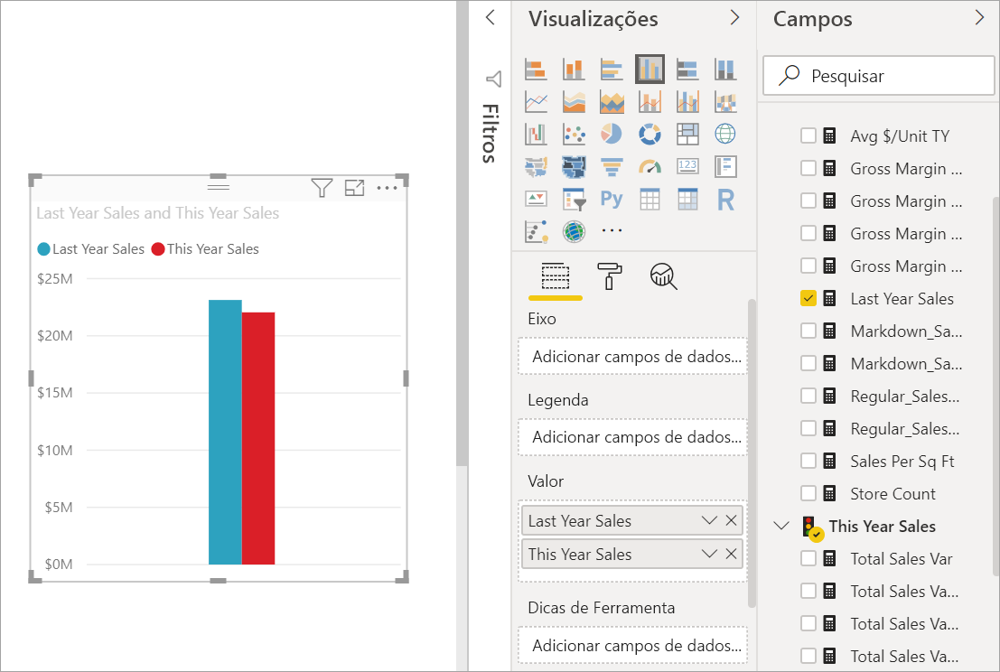
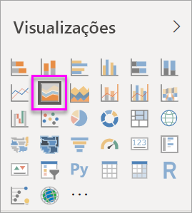
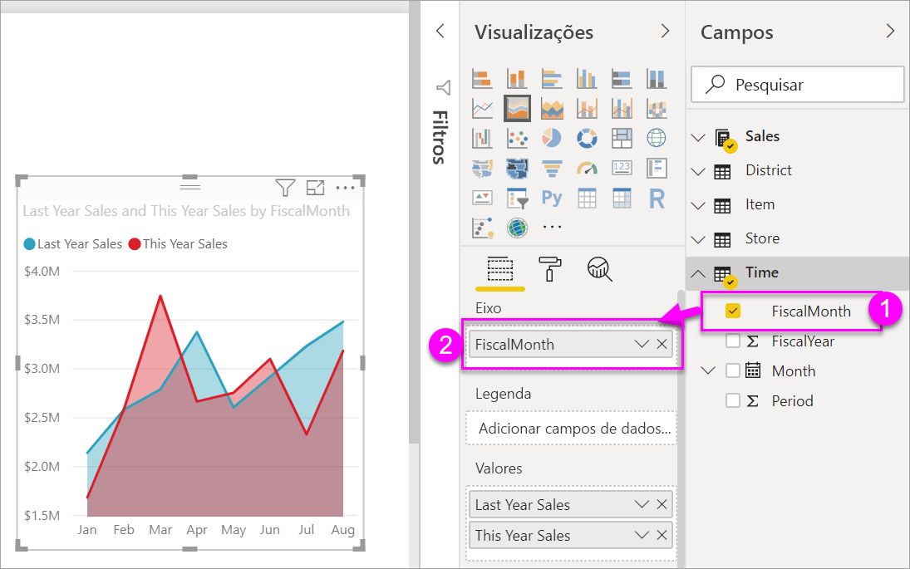

# Criar e usar gráficos básicos de área

[!INCLUDE [power-bi-visuals-desktop-banner](../includes/power-bi-visuals-desktop-banner.md)]

O gráfico de áreas básico (também conhecido como gráfico de áreas em camadas) baseia-se no gráfico de linhas. A área entre o eixo e a linha é preenchida com cores para indicar o volume. 

Os gráficos de área enfatizam a magnitude da alteração ao longo do tempo e pode ser usado para chamar a atenção para o valor total entre uma tendência. Por exemplo, os dados que representam o lucro ao longo do tempo podem ser plotados em um gráfico de área para enfatizar o lucro total.

## Quando usar um gráfico de áreas básico
Os gráficos de áreas básicos são uma ótima opção:

* para ver e comparar as tendências de volume em série de tempo 
* para as séries individuais representando conjunto contável fisicamente

### Pré-requisitos
Este tutorial usa o [arquivo PBIX de exemplo de Análise de Varejo](https://download.microsoft.com/download/9/6/D/96DDC2FF-2568-491D-AAFA-AFDD6F763AE3/Retail%20Analysis%20Sample%20PBIX.pbix).

1. Na seção superior esquerda da barra de menus, selecione **Arquivo** > **Abrir**
   
2. Encontre sua cópia do **arquivo PBIX de exemplo de Análise de Varejo**

1. Abra o **arquivo PBIX de exemplo de Análise de Varejo** na exibição de relatório .

1. Select  para adicionar uma nova página.

## Criar um gráfico de áreas básico
 

1. Essas etapas ajudarão você a criar um gráfico de áreas que exibe as vendas deste ano e as vendas do ano passado por mês.
   
   a. No painel Campos, selecione **Vendas \> Vendas do Último Ano** e **Vendas deste Ano > Valor**.

   

   b.  Converta o gráfico em um gráfico de área básico, selecionando o ícone de Gráfico de área do painel Visualizações.

   
   
   c.  Selecione **Tempo \> MêsFiscal** para adicioná-lo à caixa **Eixo**.   
   
   
   d.  Para exibir o gráfico por mês, selecione as reticências (canto superior direito do visual) e escolha **Classificar por mês**. Para alterar a ordem de classificação, selecione as reticências novamente e selecione **Classificar em ordem crescente** ou **Classificar em ordem decrescente**.

## Realce e filtragem cruzada
Para obter informações sobre como usar o painel Filtros, veja [Adicionar um filtro a um relatório](../power-bi-report-add-filter.md).

Para destacar uma área específica em seu gráfico, selecione essa área ou a respectiva borda superior.  Ao contrário de outros tipos de visualização, se houver outras visualizações na mesma página, destacar um gráfico de área básico não aplicará filtro cruzado às outras visualizações na página do relatório. No entanto, os gráficos de áreas são um alvo de filtragem cruzada acionado por outras visualizações na página do relatório. 

1. Experimente, selecionando o gráfico de áreas e copiando-o para a página do relatório **Nova Análise de Loja** (CTRL-C e CTRL-V).
2. Selecione uma das áreas sombreadas do gráfico de áreas e selecione a outra área sombreada. Você não observará nenhum impacto às outras visualizações na página.
1. Agora selecione um elemento. Observe o impacto no gráfico de áreas - ele é filtrado cruzadamente.

     

Para obter mais informações, consulte [Interações visuais em relatórios](../service-reports-visual-interactions.md)

## Considerações e solução de problemas   
* [Tornar o relatório mais acessível para pessoas com deficiências](../desktop-accessibility.md)
* Gráficos de áreas básicos não são eficazes para comparar os valores devido à oclusão nas áreas em camadas. O Power BI usa transparência para indicar a sobreposição das áreas. No entanto, ele só funciona bem com duas ou três áreas diferentes. Quando você precisa comparar tendência com mais de três medidas, tente usar os gráficos de linhas. Quando você precisa comparar volume com mais de três medidas, tente usar o mapa de árvore.

## Próxima etapa
[Relatórios no Power BI](power-bi-visualization-card.md)  

