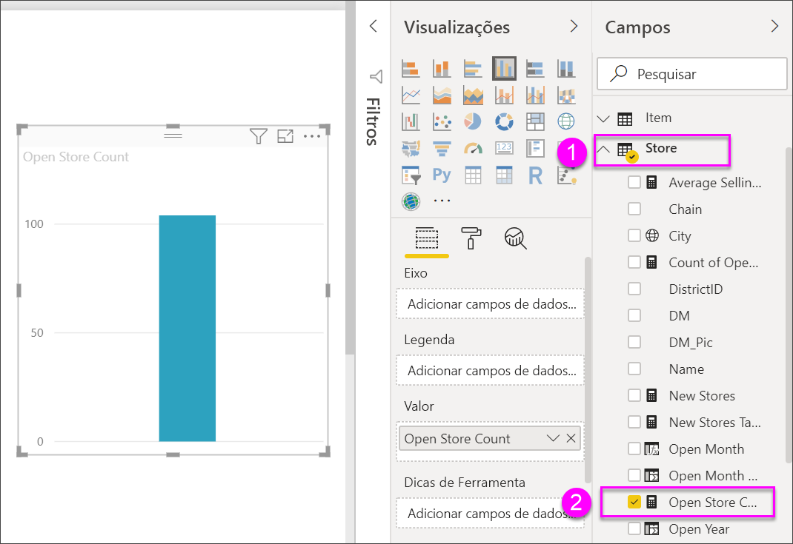
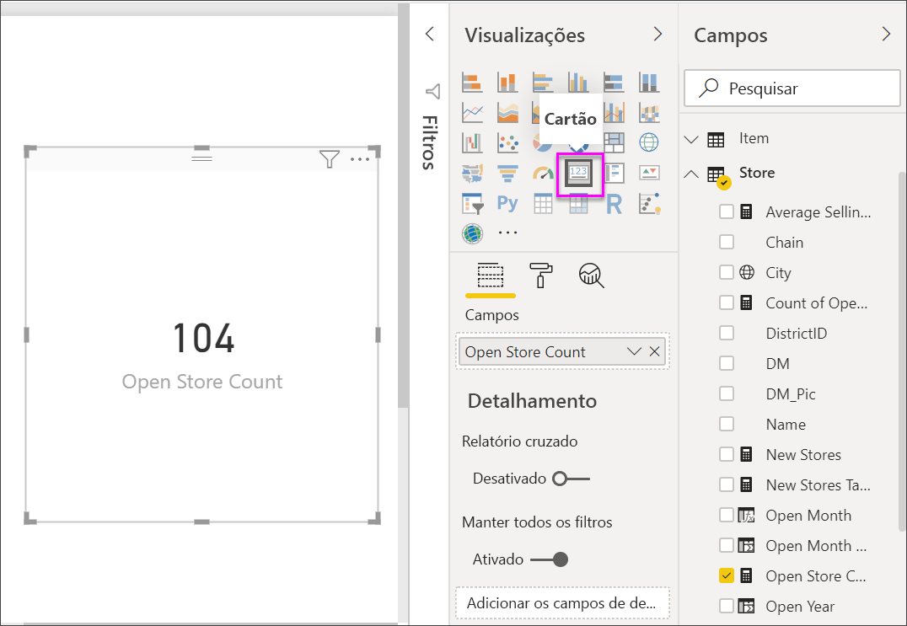
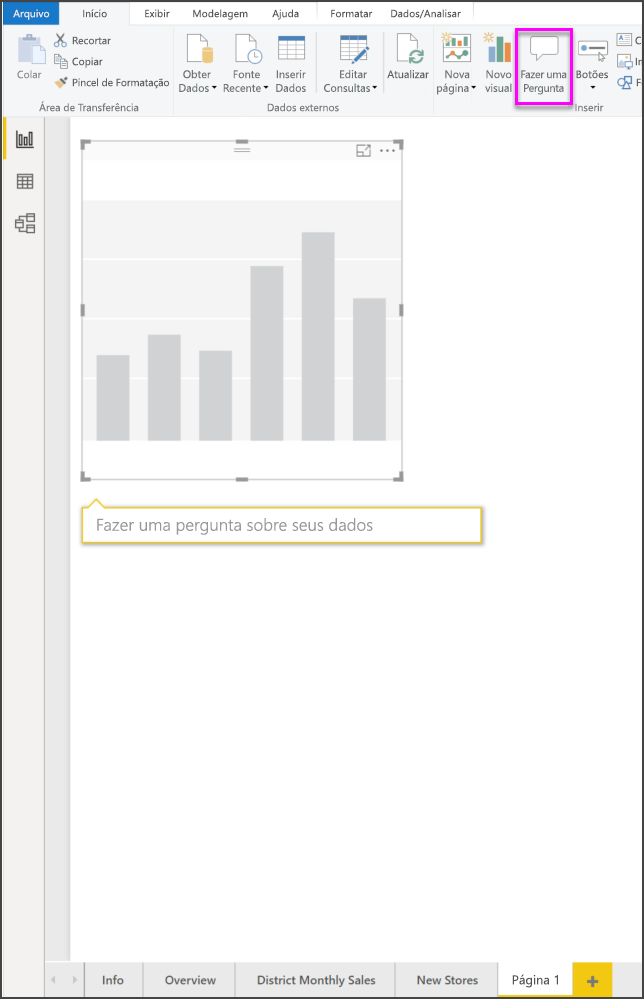
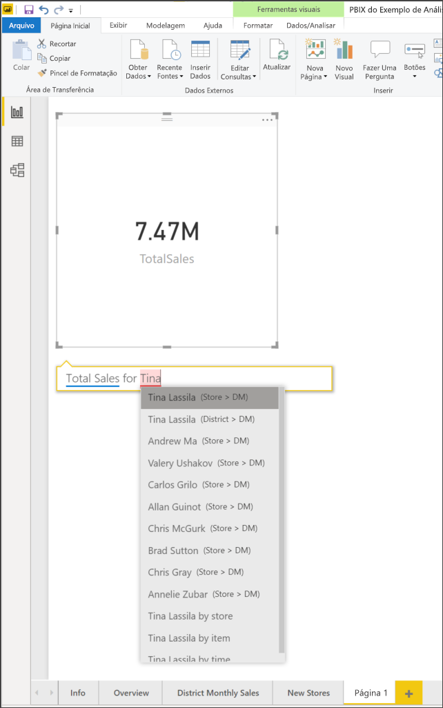
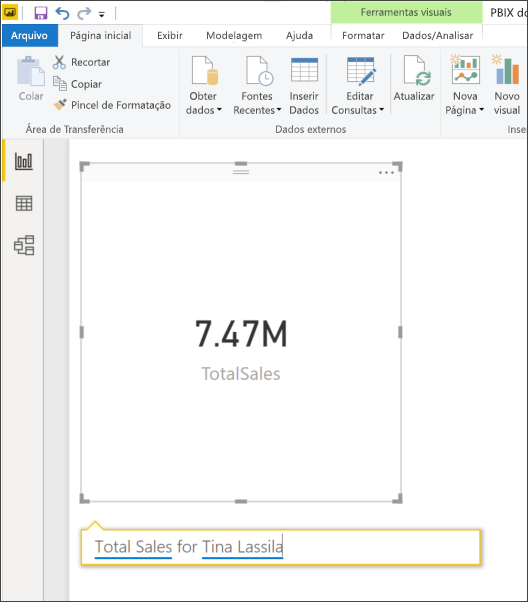
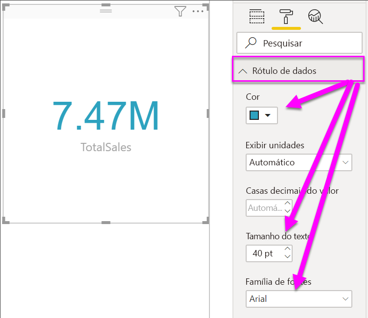
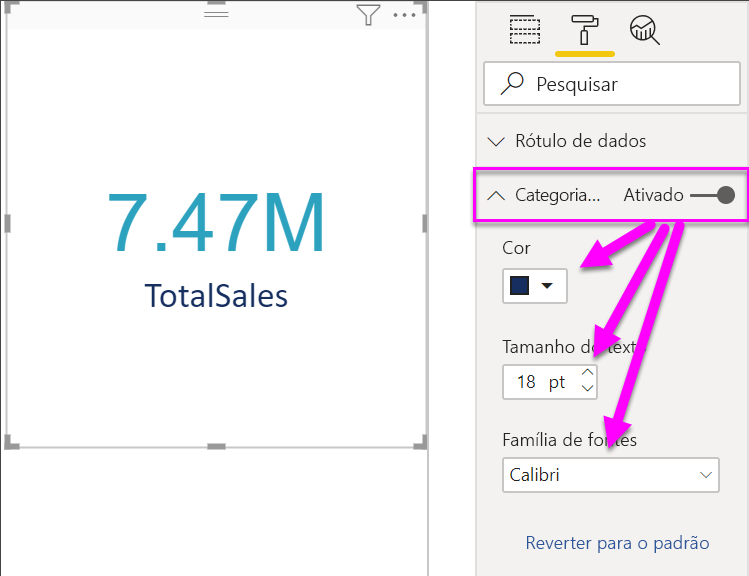
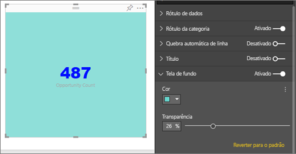

# Visualizações de cartão

[!INCLUDE [power-bi-visuals-desktop-banner](../includes/power-bi-visuals-desktop-banner.md)]

Às vezes, um único número é a coisa mais importante que você deseja acompanhar no seu painel ou relatório do Power BI, como as vendas totais, a fatia de mercado ano após ano ou o total de oportunidades. Esse tipo de visualização é chamado de *Cartão*. Assim como em quase todas as visualizações nativas do Power BI, os cartões podem ser criados usando o editor de relatório ou P e R.

## Pré-requisito

Este tutorial usa o [arquivo PBIX de exemplo de Análise de Varejo](https://download.microsoft.com/download/9/6/D/96DDC2FF-2568-491D-AAFA-AFDD6F763AE3/Retail%20Analysis%20Sample%20PBIX.pbix)

1. Na seção superior esquerda da barra de menus, selecione **Arquivo** \> **Abrir**
   
2. Encontre sua cópia do **arquivo PBIX de exemplo de Análise de Varejo**

1. Abra o **arquivo PBIX de exemplo de Análise de Varejo** na exibição de relatório .

1. Selecionar  para adicionar uma nova página.

## Opção 1: Criar um cartão usando o editor de relatório

O primeiro método para criar um cartão é usar o editor de relatórios no Power BI Desktop.

1. Comece em uma página de relatório em branco e selecione **Armazenar** \> campo **Contagem de armazenamento aberto**.

    O Power BI cria um gráfico de colunas com um número.

   

2. No painel de Visualizações, selecione o ícone de cartão.

   

Agora, você criou com êxito um cartão com o editor de relatórios. Abaixo, temos a segunda opção para criar um cartão usando a caixa de perguntas de P e R.

## Opção 2: Criar um cartão a partir de uma caixa de perguntas de P e R
A caixa de perguntas de P e R é outra opção a ser usada ao criar um cartão. A caixa de perguntas de P e R está disponível na exibição de relatórios do Power BI Desktop.

1. Comece em uma página de relatório em branco

1. Na parte superior da janela, selecione o ícone **Fazer uma pergunta**. 

    O Power BI criará um cartão e uma caixa para sua pergunta. 

   

2. Por exemplo, digite "Total de vendas para Tina" na caixa de perguntas.

    A caixa da pergunta o ajuda dando sugestões e reformulações e, por fim, exibe o número total.  

   

   

Agora, você criou com êxito um cartão com a caixa de perguntas de P e R. Abaixo, estão as etapas para formatar seu cartão para suas necessidades específicas.

## Formatar um cartão
Você tem várias opções para alterar rótulos, texto, cor e muito mais. A melhor maneira de aprender é criar um cartão e, em seguida, explorar o painel de formatação. Aqui estão algumas das opções de formatação disponíveis. 

O painel Formatação está disponível ao interagir com o cartão em um relatório. 

1. Comece selecionando o ícone de rolo de tinta para abrir o painel Formatação. 

    

2. Com o cartão selecionado, expanda **Rótulo de dados** e altere a cor, o tamanho e a família de fontes. Se você tivesse milhares de repositórios, poderia usar **Exibir unidades** para mostrar o número de repositórios por milhares e controlar as casas decimais também. Por exemplo, 125,8K em vez de 125.832,00.

    

3.  Expanda **Rótulo de categoria** e altere a cor e o tamanho.

    

4. Expanda **Plano de fundo** e mova o controle deslizante para ligado.  Agora você pode alterar a cor da tela de fundo e a transparência.

    

5. Continue para explorar as opções de formatação até que seu cartão esteja exatamente como você deseja. 

## Considerações e solução de problemas
Se uma caixa de perguntas não for exibida, entre em contato com o administrador do sistema ou de locatário.    

## Próximas etapas
[Gráficos de combinação no Power BI](power-bi-visualization-combo-chart.md)

[Tipos de visualização no Power BI](power-bi-visualization-types-for-reports-and-q-and-a.md)
