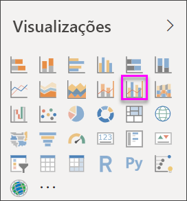
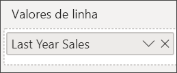
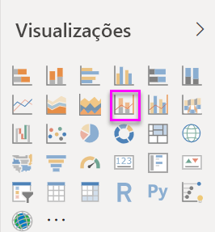
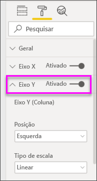
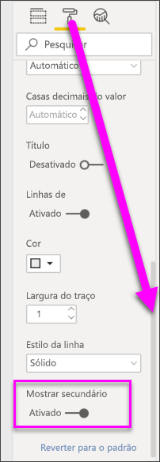

# Gráfico de combinação no Power BI

[!INCLUDE [power-bi-visuals-desktop-banner](../includes/power-bi-visuals-desktop-banner.md)]

No Power BI, um gráfico de combinação é uma visualização única que combina um gráfico de linhas e um gráfico de colunas. Combinando os 2 gráficos em um permite você faça uma comparação rápida dos dados.

Os gráficos de combinação podem ter um ou dois eixos Y.

## Quando usar o Gráfico de combinação
Os gráficos de combinação são uma ótima opção:

* Quando você tem um gráfico de linhas e um gráfico de colunas com o mesmo eixo X.
* para comparar várias medidas com intervalos de valores diferentes.
* para ilustrar a correlação entre duas medidas em uma visualização.
* para verificar se uma medida atende o destino definido pela outra medida
* para conservar o espaço de tela.

### Pré-requisitos
Este tutorial usa o [arquivo PBIX de exemplo de Análise de Varejo](https://download.microsoft.com/download/9/6/D/96DDC2FF-2568-491D-AAFA-AFDD6F763AE3/Retail%20Analysis%20Sample%20PBIX.pbix).

1. Na seção superior esquerda da barra de menus, selecione **Arquivo** > **Abrir**
   
2. Encontre sua cópia do **arquivo PBIX de exemplo de Análise de Varejo**

1. Abra o **arquivo PBIX de exemplo de Análise de Varejo** na exibição de relatório .

1. Selecionar  para adicionar uma nova página.

## Criar um gráfico de combinação básico de eixo único
Veja Will criar um gráfico de combinação usando a amostra de Vendas e Marketing.
   > [!NOTE]
   > Este vídeo usa uma versão mais antiga do Power BI Desktop.
   > 
   > 
<iframe width="560" height="315" src="https://www.youtube.com/embed/lnv66cTZ5ho?list=PL1N57mwBHtN0JFoKSR0n-tBkUJHeMP2cP" frameborder="0" allowfullscreen></iframe>  

1. Comece em uma página de relatório em branco e crie um gráfico de colunas que exibe as vendas deste e margem bruta por mês.

    a.  No painel Campos, selecione **Vendas** \> **Vendas do Deste Ano** > **Valor**.

    b.  Arraste **Vendas** \> **Margem Bruta Deste Ano** para a seção **Valor**.

    c. Selecione **Hora** \> **FiscalMonth** para adicioná-la à seção **Eixo**.

    
5. Selecione **Mais opções** (...) no canto superior direito da visualização e **Classificar por > FiscalMonth**. Para alterar a ordem de classificação, selecione as reticências novamente e escolha **Classificar em ordem crescente** ou **Classificar em ordem decrescente**. Para este exemplo, usaremos **Classificar em ordem crescente**.

6. Converta o gráfico de colunas em um gráfico de combinação. Há dois gráficos de combinação disponíveis: **Linha e coluna empilhada** e **Linha e coluna clusterizada**. Com o gráfico de coluna selecionado, no painel **Visualizações**, selecione o **Gráfico de colunas agrupadas e linha**.

    
7. No painel **Campos**, arraste **Vendas** \> **Vendas do Ano Passado** para o bucket **Valores de Linha**.

   

   O gráfico de combinação deve ter esta aparência:

   

## Criar um gráfico de combinação com dois eixos
Nesta tarefa, vamos comparar as vendas e a margem bruta.

1. Crie um gráfico de linhas que acompanha a **% de Margem Bruta do ano passado** por **FiscalMonth**. Selecione as reticências para classificá-lo por **Mês** e **Crescente**.  
Em janeiro, a % de Margem Bruta foi de 35%, chegando ao seu máximo em 45% em abril, caindo em julho e chegando ao seu máximo novamente em agosto. Será que vamos ver um padrão semelhante nas vendas do ano passado e deste ano?

   
2. Adicione **Vendas deste ano > Valor** e **Vendas do último ano** no gráfico de linhas. A escala de **% de Margem Bruta do Ano Passado** é muito menor do que a escala de **Vendas**, o que dificulta a comparação.      

   
3. Para tornar o visual mais fácil de ler e interpretar, converta o gráfico de linhas em um gráfico de linha e coluna empilhada.

   

4. Arraste **% de Margem Bruta no Ano Passado** de **Valores de Coluna** para **Valores de Linha**. O Power BI cria dois eixos, permitindo que os conjuntos de dados sejam dimensionados de modo diferente: o eixo à esquerda calcula dólares de vendas e o eixo à direita calcula o percentual. Podemos ver a resposta à nossa pergunta: sim, vemos um padrão semelhante.

       

## Adicionar títulos aos eixos
1. Selecione o ícone de rolo de pintura 
1.  para abrir o painel Formatação.
1. Selecione a seta para baixo para expandir as opções do **eixo Y** .
1. Para o **Eixo Y (Coluna)** , defina a **Posição** para a **Esquerda**, o **Título** como **Ativado**, o **Estilo** como **Mostrar somente o título** e aa **Unidades de exibição** como **Milhões**.

   
4. Em **Eixo Y (Coluna)** , role para baixo até ver **Mostrar secundário**. Como há muitas opções para os eixos Y, talvez seja necessário usar as duas barras de rolagem. A seção Mostrar secundário exibe as opções para formatar a seção de gráfico de linhas do gráfico de combinação.

   
5. Para o **Eixo Y (Linha)** , deixe a **Posição** como **Direita**, altere o **Título** para **Ativado** e defina o **Estilo** para **Mostrar apenas título**.

   Seu gráfico de combinação agora exibe eixos duplos, ambos com títulos.

   

6. Opcionalmente, modifique a fonte, o tamanho e a cor do texto e defina outras opções de formatação para melhorar a legibilidade e a exibição do gráfico.

Daqui, talvez você queira:

* [Adicione o gráfico de combinação como um bloco do dashboard](../service-dashboard-tiles.md).
* [Salve o relatório](../service-report-save.md).
* [Torne o relatório mais acessível a pessoas com necessidades especiais](../desktop-accessibility.md).

## Realce cruzado e filtragem cruzada

Realçar uma coluna ou uma linha em um gráfico de combinação realiza o realce cruzado e a filtragem cruzada das outras visualizações na página do relatório e vice-versa. Para alterar esse comportamento padrão, use [interações visuais](../service-reports-visual-interactions.md).

## Próximas etapas

[Gráficos de rosca no Power BI](power-bi-visualization-doughnut-charts.md)

[Tipos de visualização no Power BI](power-bi-visualization-types-for-reports-and-q-and-a.md)
