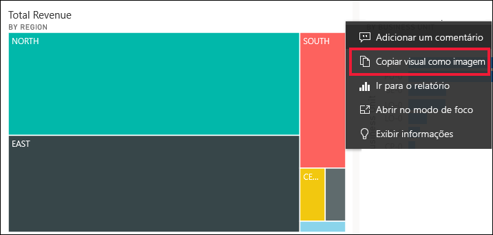
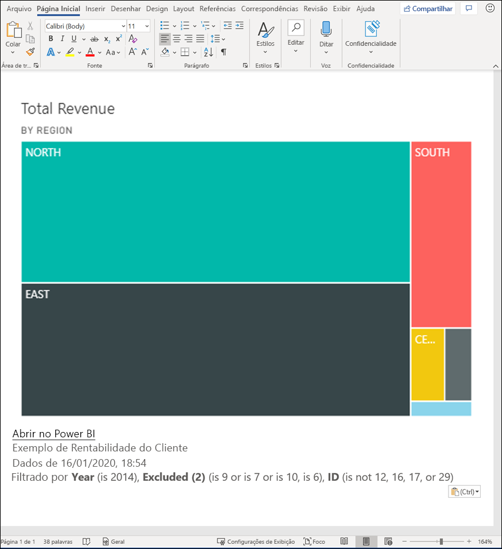
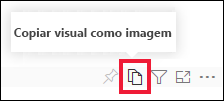
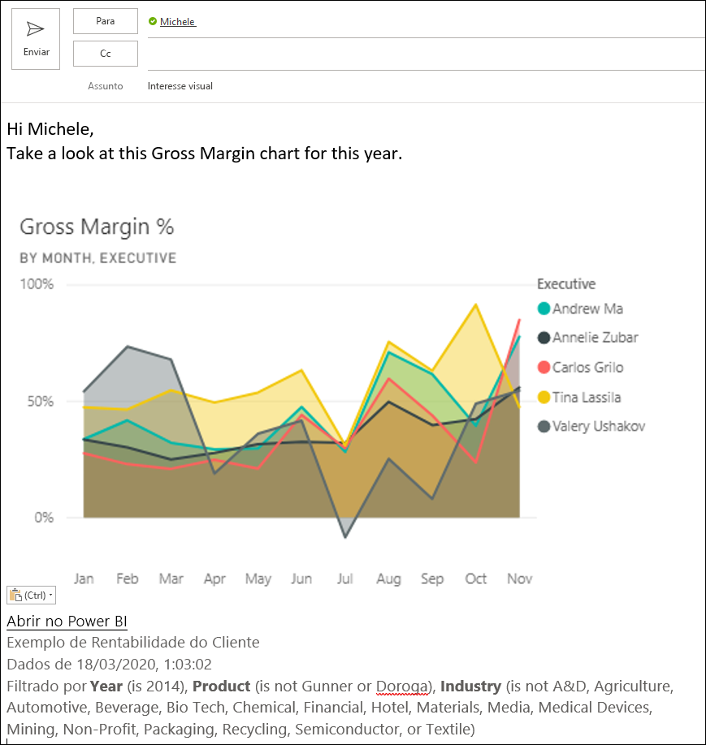
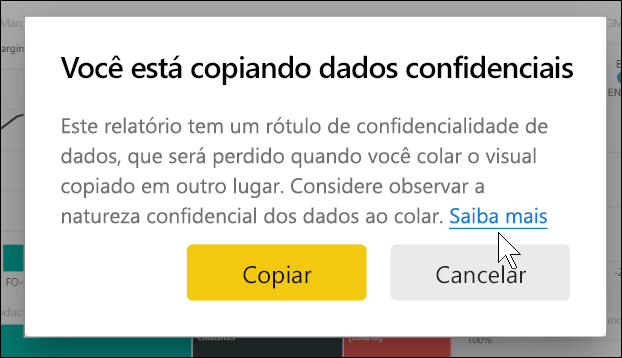
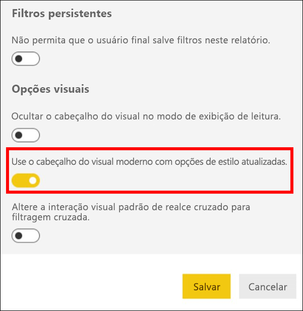
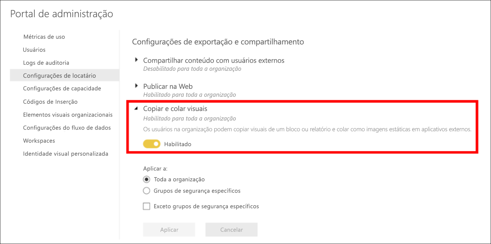
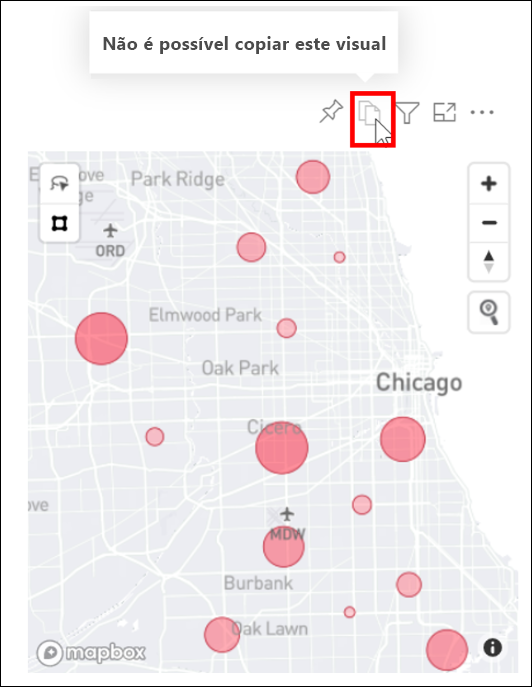

# Copie e cole uma visualização de relatório

[!INCLUDE[consumer-appliesto-yyyn](../includes/consumer-appliesto-yyyn.md)]

Este artigo aborda duas maneiras diferentes de copiar e colar um visual. 
* copiar um visual em um relatório e colá-lo em outra página desse relatório (requer permissões de edição para o relatório)

* copiar uma imagem de um visual do Power BI para a área de transferência e colá-la em outros aplicativos

## Copiar e colar no mesmo relatório
Os elementos visuais nos relatórios do Power BI podem ser copiados de uma página no relatório para a mesma página ou para uma página diferente no mesmo relatório. 

Copiar e colar uma visualização requer permissões de edição para o relatório. No serviço do Power BI, isso significa abrir o relatório no [Modo de exibição de edição](../consumer/end-user-reading-view.md). 

As visualizações em *dashboards* não podem ser copiadas e coladas em relatórios do Power BI ou em outros dashboards.

1. Abra um relatório que tenha pelo menos uma visualização.  

2. Selecione a visualização e use **Ctrl + C** para copiar, e **Ctrl + V** para colar.      

   

## Copiar um visual como uma imagem para a área de transferência

Você já quis compartilhar uma imagem de um relatório ou dashboard do Power BI? Agora você pode copiar o visual e colá-lo em qualquer outro aplicativo compatível com colagem. 

Quando você copia uma imagem estática de um Visual, obtém uma cópia do visual, junto com os metadados. Isso inclui:
* link de volta para o relatório ou dashboard do Power BI
* título do relatório ou dashboard
* observe se a imagem contém informações confidenciais
* carimbo de data/hora da última atualização
* filtros aplicados ao visual

### Copiar de um bloco do dashboard

1. Navegue até o dashboard do qual você deseja copiar.

2. No canto superior direito do visual, selecione **Mais opções(...)** e escolha **Copiar visual como imagem**. 

    

3. Quando a caixa de diálogo **Seu visual está pronto para copiar** é exibida, selecione **Copiar para a área de transferência**.

    

4. Quando seu visual estiver pronto, cole-o em outro aplicativo usando **Ctrl + V** ou clique com o botão direito do mouse e escolha Colar. Na captura de tela abaixo, colamos o visual no Microsoft Word. 

    

### Copiar de um visual de relatório 

1. Navegue até o relatório do qual você deseja copiar.

2. No canto superior direito do visual, selecione o ícone para **Copiar visual como imagem**. 

    

3. Quando a caixa de diálogo **Seu visual está pronto para copiar** é exibida, selecione **Copiar para a área de transferência**.

    

4. Quando seu visual estiver pronto, cole-o em outro aplicativo usando **Ctrl + V** ou clique com o botão direito do mouse e escolha Colar. Na captura de tela abaixo, colamos o visual em um email.

    

5. Se houver um rótulo de confidencialidade de dados aplicado ao relatório, você receberá um aviso quando selecionar o ícone de cópia.  

    

    Além disso, um rótulo de confidencialidade será adicionado aos metadados abaixo do visual colado. 

    

### Gerenciar o uso da cópia de um visual como imagem
Se você for proprietário do conteúdo ou for um administrador do locatário, poderá controlar se um visual pode ser copiado como imagem desde um relatório ou dashboard.

#### Desabilitar copiar como uma imagem para um visual específico
Se você não quiser que os usuários possam copiar um visual específico, poderá remover o ícone de cópia desse visual.
1. Selecione o ícone de rolo de pintura para abrir o painel Formatação. 

1. Abra o cartão **Formatação de visual**.
1. Role para baixo até **Cabeçalho visual**, expanda o cartão e desative o **Ícone de cópia**.

    

1. Se você não encontrar a configuração **Cabeçalho do visual**, ative a opção de cabeçalho visual moderno em **Configurações do relatório**. 

    

1. Salve as alterações. Recompartilhe e republique conforme necessário.

#### Desabilite copiar como uma imagem para um grupo de usuários

Se você for proprietário do conteúdo ou for um administrador do locatário, poderá controlar quem pode copiar visuais. Essa configuração desabilita a *cópia de visual como imagem* para todo o conteúdo acessado pelo usuário no locatário do Power BI.
  
1. Navegue até o Portal do Administrador.

1. Em **Configurações de locatário**, selecione **Configurações de exportação e compartilhamento**. 

    

1. Desabilite **Copiar e colar visuais** para os grupos de usuários selecionados. 

1. Salve as alterações e os grupos especificados não poderão usar **Copiar visual como imagem** no Power BI. 
  

## Considerações e solução de problemas

   

P: Por que o ícone de Cópia está desabilitado em um visual?    
R: Atualmente, há compatibilidade com visuais do Power BI nativos e visuais certificados. A compatibilidade é limitada com determinados elementos visuais, incluindo: 
- ESRI e outros visuais de mapa 
- Visuais de Python 
- Visuais do R 
- PowerApps 
- Elementos visuais personalizados não certificados Para que o Visual personalizado seja compatível, saiba mais sobre [como certificar seu visual personalizado](../developer/visuals/power-bi-custom-visuals-certified.md). 

P: Por que meu visual não está sendo colado corretamente?    
R: Há limitações em relação ao visual de cópia como uma imagem, incluindo: 
- Para visuais personalizados 
    - Visuais com temas e cores aplicados 
    - Ajuste de bloco ao colar 
    - Visuais personalizados com animações 
- Restrições de cópia 
    - Não é possível copiar um bloco de dashboard fixado recentemente 
    - Não é possível redirecionar os usuários para o conteúdo com filtros OData e estados temporários, como indicadores pessoais 
- Os aplicativos com compatibilidade limitada para colagem de conteúdo formatado em HTML da área de transferência podem não renderizar tudo o que foi copiado do visual 

## Próximas etapas
Mais sobre [Visualizações nos relatórios do Power BI](power-bi-report-visualizations.md)

Mais perguntas? [Experimente a Comunidade do Power BI](https://community.powerbi.com/)

