# Personalizar as propriedades dos eixos X e Y

[!INCLUDE [power-bi-visuals-desktop-banner](../includes/power-bi-visuals-desktop-banner.md)]

Neste tutorial, você aprenderá várias maneiras diferentes de personalizar os eixos X e Y de seus visuais. Nem todos os visuais têm eixos. Gráficos de pizza, por exemplo, não têm eixos. E as opções de personalização variam de visual para visual. Existem muitas opções para abordar em um único artigo, então vamos dar uma olhada em algumas das personalizações mais usadas e familiarizarmo-nos com o painel **Formato** do visual na tela de relatório do Power BI.  

Assista à Amanda personalizar os eixos X e Y. Ela também demonstrará as diferentes maneiras de controlar a concatenação ao fazer drill down e drill up.

> [!NOTE]
> Este vídeo usa uma versão mais antiga do Power BI.

<iframe width="560" height="315" src="https://www.youtube.com/embed/9DeAKM4SNJM" frameborder="0" allowfullscreen></iframe>

## Pré-requisitos

- Power BI Desktop

- [Exemplo de Análise de Varejo ](https://download.microsoft.com/download/9/6/D/96DDC2FF-2568-491D-AAFA-AFDD6F763AE3/Retail%20Analysis%20Sample%20PBIX.pbix)

## Adicionar uma nova visualização

Antes de personalizar a visualização, você precisa compilá-la.

1. No Power BI Desktop, abra a amostra de Análise de Varejo.  

2. Na parte inferior, selecione o ícone amarelo de adição para adicionar uma nova página. 

    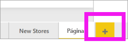

1. No painel de **Visualizações**, selecione o ícone do gráfico de colunas empilhadas. Isso adiciona um modelo vazio à tela de relatório.

    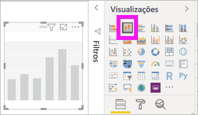

1. Para definir os valores do eixo X, no painel **Campos**, selecione **Time** > **FiscalMonth**.

1. Para definir os valores do eixo Y, no painel **Campos**, selecione **Vendas** > **Vendas do Ano Passado** e selecione **Vendas** > **Vendas deste Ano** > **Valor**.

    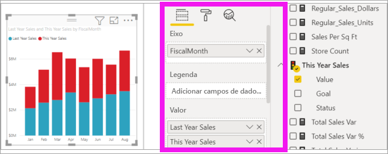

    Agora você pode personalizar o eixo X. O Power BI fornece opções quase ilimitadas para formatar sua visualização. 

## Personalizar o eixo X
Há muitos recursos que são personalizáveis para o eixo X. Você pode adicionar e modificar os rótulos de dados e o título do eixo X. Para categorias, você pode modificar a largura, o tamanho e o preenchimento de barras, colunas, linhas e áreas. Para valores, você pode modificar as unidades de exibição, as casas decimais e as linhas de grade. O exemplo a seguir mostra a personalização de um gráfico de colunas. Vamos adicionar algumas personalizações para você familiarizar-se com as opções e então poder explorar o restante por conta própria.

### Personalizar os rótulos do eixo X
Os rótulos do eixo X são exibidos abaixo das colunas no gráfico. No momento, eles são cinza-claro, pequenos e difíceis de ler. Vamos mudar isso.

1. No painel **Visualizações**, selecione **Formato** (ícone de rolo de tinta  ) para revelar as opções de personalização.

2. Expanda as opções de eixo X.

   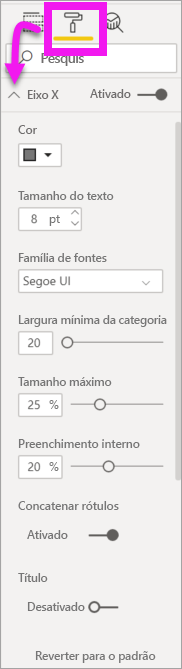

3. Mova o controle deslizante do **eixo X** para **Ativado**.

    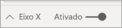

    Alguns motivos pelos quais você pode querer definir o eixo X como **Desligado** é se a visualização for autoexplicativa sem rótulos ou se você tiver uma página de relatório cheia e precisar liberar espaço para exibir mais dados.

4. Formatar a fonte, o tamanho e a cor do texto:

    - **Cor**: selecione preto

    - **Tamanho do texto**: insira *14*

    - **Família de fontes**: selecione **Arial Black**

    - **Preenchimento interno**: Insira *40%*

        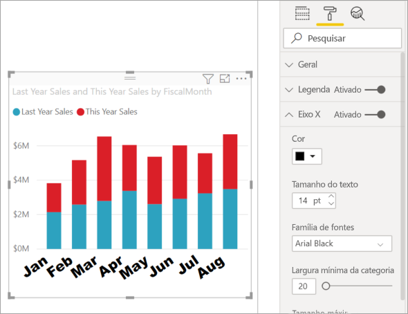
    
5. Talvez você não goste da maneira como o texto do eixo X é exibido em uma diagonal. Você tem várias opções. 
    - Altere o tamanho do texto para algo menor que 14.
    - Aumente a visualização. 
    - Exiba menos colunas e adicione uma barra de rolagem aumentando **largura mínima da categoria**. 
    
    Aqui, selecionamos a segunda opção e capturamos uma das barras de redimensionamento para deixar a visualização mais larga. Agora, ela acomoda o texto de 14 pontos sem necessidade de exibir o texto em um ângulo ou com uma barra de rolagem. 

   

### Personalizar o título do eixo X
Quando o título do eixo X está **Ligado**, o título do eixo X é exibido abaixo dos rótulos do eixo X. 

1. Comece virando o título do eixo X para **Ligado**.  

    

    A primeira coisa que você observará é que sua visualização agora tem um título de eixo X padrão.  Nesse caso, é o **FiscalMonth**.

   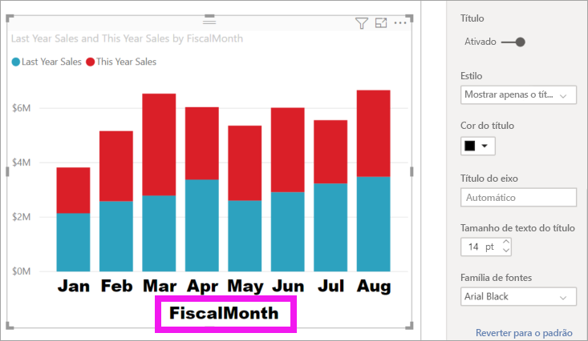

1. Formatar a fonte, o tamanho e a cor do texto do título:

    - **Cor do título**: selecione laranja

    - **Título do eixo**: Digite *Mês Fiscal* (com um espaço)

    - **Tamanho de texto do título**: Insira *18*

    Depois de concluir as personalizações, o gráfico de colunas empilhadas tem a aparência a seguir:

    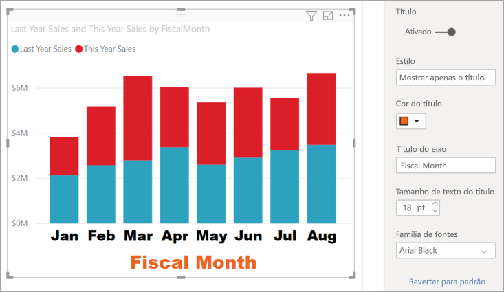

1. Salve as alterações e vá para a próxima seção. Se você precisar reverter todas as alterações, selecione **Reverter ao Padrão** na parte inferior do painel de personalização do **eixo X**. Em seguida, você personalizará o eixo Y.

## Personalizar o eixo Y
Há muitos recursos que podem ser personalizados para o eixo Y. Você pode adicionar e modificar os rótulos de dados, o título do eixo Y e as linhas de grade. Para valores, você pode modificar as unidades de exibição, as casas decimais, o ponto inicial e o ponto de extremidade. Para categorias, você pode modificar a largura, o tamanho e o preenchimento de barras, colunas, linhas e áreas. 

O exemplo a seguir continua a nossa personalização de um gráfico de colunas. Vamos fazer algumas alterações para você familiarizar-se com as opções e então poder explorar o restante por conta própria.

### Personalizar os rótulos do eixo Y
Os rótulos do eixo Y são exibidos à esquerda por padrão. No momento, eles são cinza-claro, pequenos e difíceis de ler. Vamos mudar isso.

1. Expanda as opções de eixo Y.

   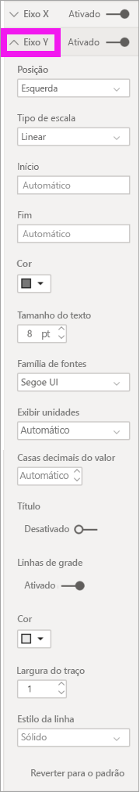

1. Mova a segmentação do **eixo Y** para **Ativado**.  

    

    Um motivo pelo qual você talvez queira desativar o eixo Y é para economizar espaço para mais dados.

1. Formatar a fonte, o tamanho e a cor do texto:

    - **Cor**: selecione preto

    - **Tamanho do texto**: Insira *10*

    - **Unidades de exibição**: Selecione **Milhões**

    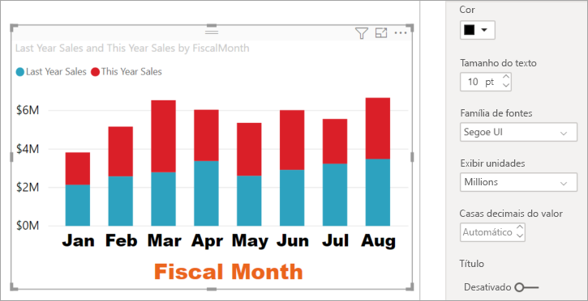

### Personalizar o título do eixo Y
Quando o título do eixo Y está **Ligado**, o título do eixo y é exibido ao lado dos rótulos do eixo Y. Para essa visualização, o fato de ter um título de eixo Y não melhora o visual; portanto, deixe o **Título** **Desativado**. Adicionaremos títulos do eixo Y a um visual de dois eixos posteriormente neste tutorial. 

### Personalizar as linhas de grade
Destacaremos as linhas de grade, alterando a cor e aumentando o traço:

- **Cor**: selecione laranja

- **Traço**: insira *2*

Depois de todas essas personalizações, o gráfico de colunas deve ser parecido com isto:

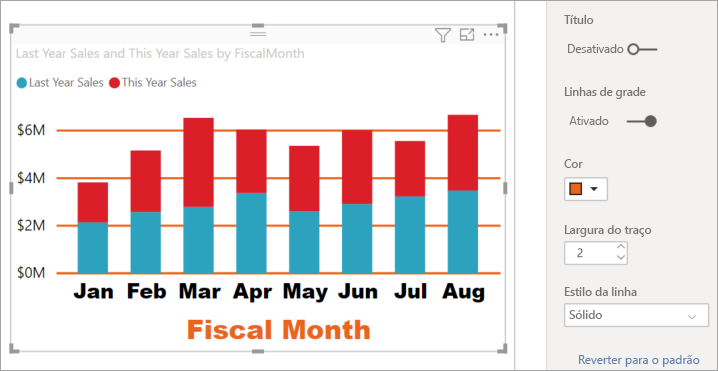

## Personalizar visualizações de eixo Y duplo

Algumas visualizações podem se beneficiar de ter dois eixos Y. Os gráficos de combinação são um bom exemplo. Antes que possamos formatar eixos Y duplos, criaremos um gráfico de combinação que compara tendências para vendas e margem bruta.  

### Crie um gráfico com dois eixos Y

1. Selecione o gráfico de colunas e altere-o para um gráfico de *Linhas e colunas empilhadas*. Esse tipo de visual dá suporte a um valor de gráfico de linha única e a vários valores de colunas empilháveis. 

    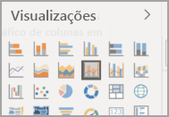
   

2. Arraste **Vendas** >  **% de Margem Bruta no Ano Passado** do painel Campos para o bucket **Valores da Linha**.

    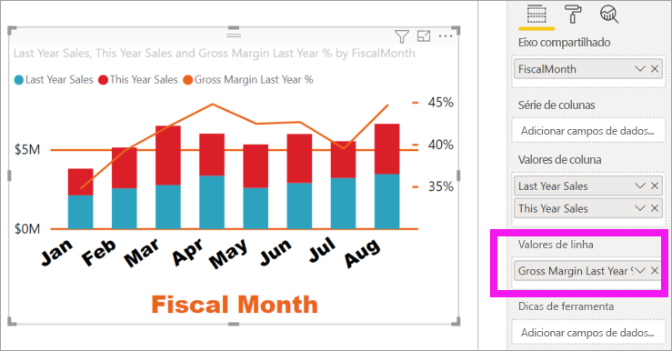

    
3. Reformate a visualização para remover os rótulos do eixo X angulares. 

   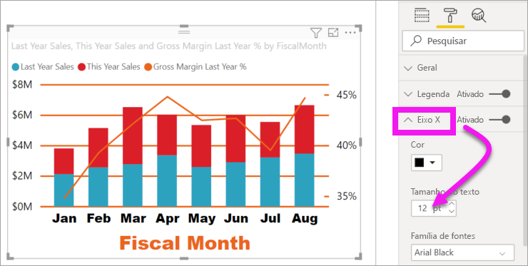

   O Power BI cria dois eixos Y permitindo que os valores sejam dimensionados de forma diferente. O eixo esquerdo calcula os dólares das vendas e o eixo direito calcula o percentual da margem bruta.

### Formatar o segundo eixo Y
Como começamos com uma visualização com um eixo Y formatado, o Power BI criou o segundo eixo Y usando as mesmas configurações. Mas podemos alterar isso. 

1. No painel **Visualizações**, selecione o ícone de rolo de tinta para exibir as opções de formato.

1. Expanda as opções de eixo Y.

1. Role a tela para baixo até encontrar a opção **Mostrar secundário**. Verifique se está **Ativada**. Nosso eixo Y secundário representa o gráfico de linhas.

   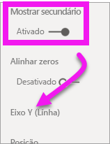

1. (Opcional) Personalize a cor, o tamanho e as unidades de exibição da fonte para os dois eixos. Se você mudar a **Posição** para o eixo da coluna ou o eixo de linha, os dois eixos trocarão de lado.

### Adicionar títulos a ambos os eixos

Com uma visualização complexa, convém adicionar títulos de eixos.  Os títulos ajudam seus colegas a compreender a história que a sua visualização está mostrando.

1. Alterne **Título** para **Ativado** para o **Eixo Y (Coluna)** e o **Eixo Y (Linha)** .

1. Defina o **Estilo** para **Mostrar somente o título** de ambos.

   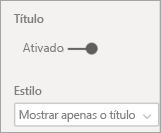

1. Seu gráfico de combinação agora mostra eixos duplos, ambos com títulos.

   

1. Formate os títulos. Neste exemplo, resumimos um dos títulos e reduzimos o tamanho da fonte para ambos. 
    - Tamanho da fonte: **9**
    - Reduzimos o **Título do eixo** para o primeiro eixo Y (o gráfico de colunas): Vendas no ano passado e neste ano

    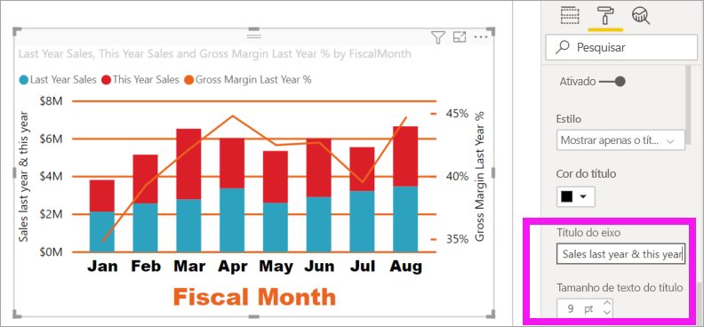

Para obter mais informações, confira [Dicas e truques para formatação de cores no Power BI](service-tips-and-tricks-for-color-formatting.md) e [Personalizar títulos de visualização, legendas e planos de fundo](power-bi-visualization-customize-title-background-and-legend.md). Procure também novas atualizações para formatar títulos em breve. 

## Próximas etapas

- [Visualizações em relatórios do Power BI](power-bi-report-visualizations.md)

Mais perguntas? [Experimente a Comunidade do Power BI](https://community.powerbi.com/)
