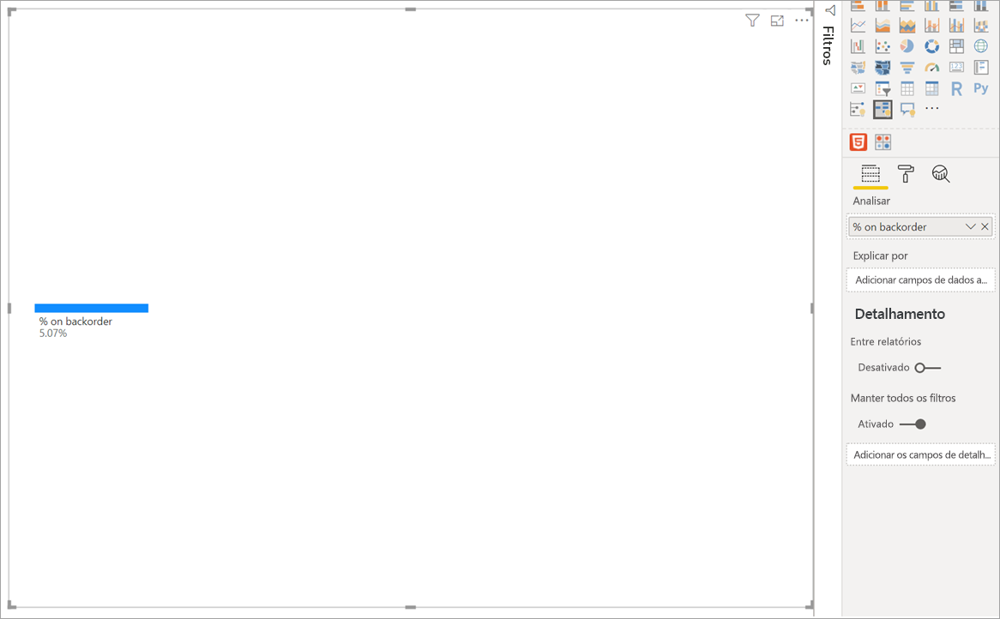
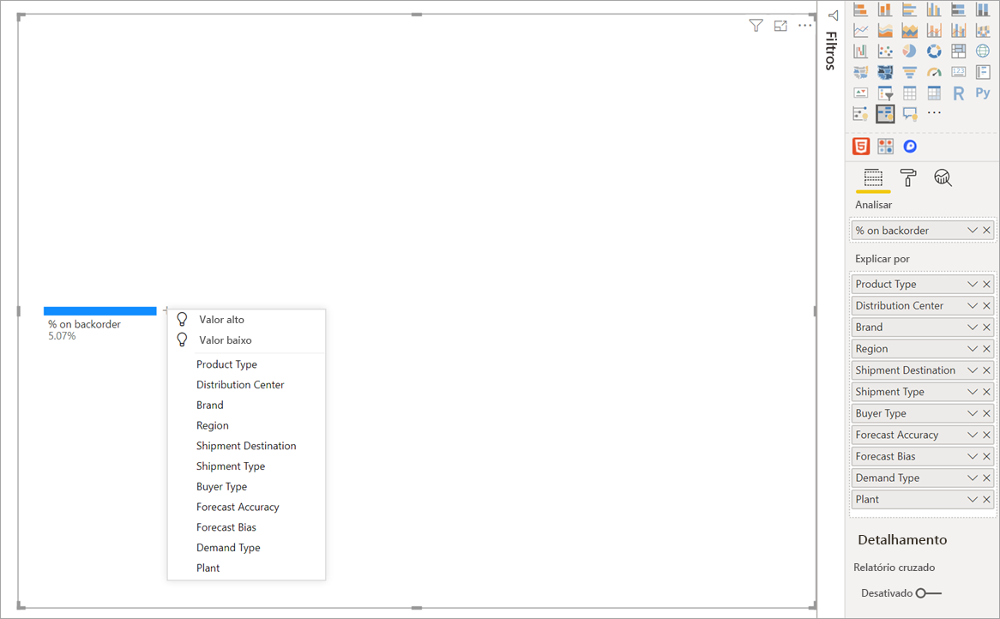
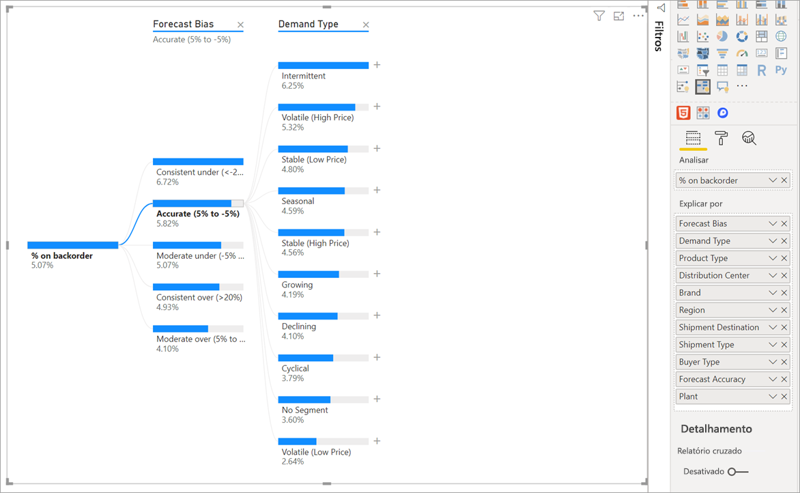
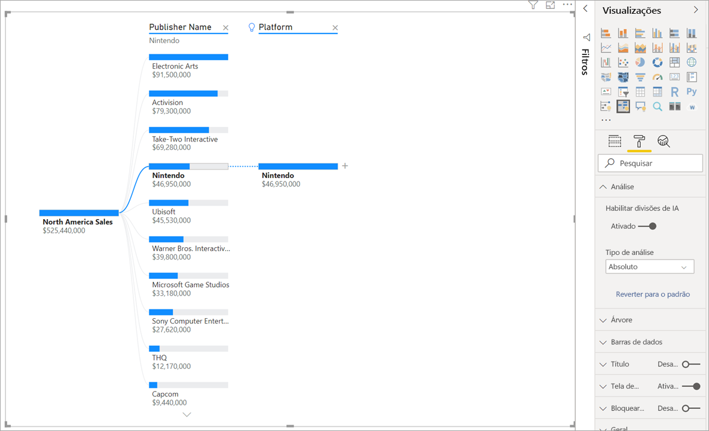
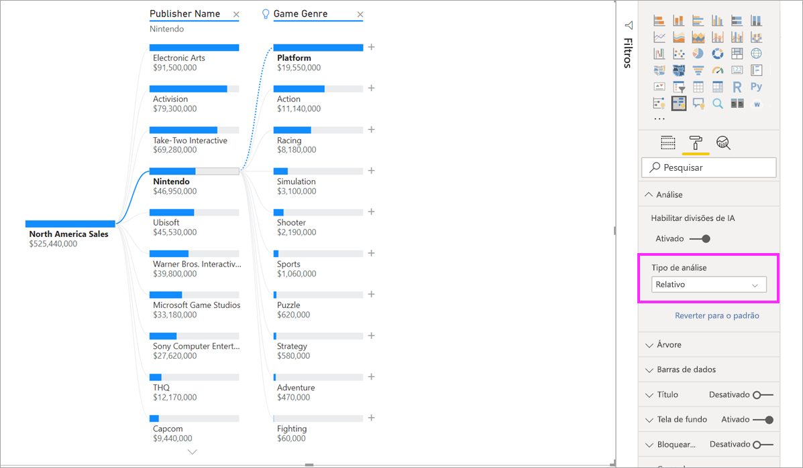
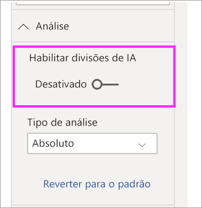

# Criar e exibir visuais de árvore de decomposição no Power BI (versão prévia)
[!INCLUDE [power-bi-visuals-desktop-banner](../includes/power-bi-visuals-desktop-banner.md)]

O visual da árvore de decomposição no Power BI permite que você visualize os dados em várias dimensões. Ele agrega dados automaticamente e permite fazer busca detalhada em suas dimensões em qualquer ordem. Também é uma visualização de IA (inteligência artificial), para que você possa encontrar a próxima dimensão para fazer busca detalhada com base em determinados critérios. Isso o torna uma ferramenta valiosa para exploração ad hoc e condução de análises de causas raiz.

Este tutorial usa dois exemplos:

- Um cenário de cadeia de fornecimento que analisa a porcentagem de produtos que uma empresa tem em ordem pendente (fora de estoque).  
- Um cenário de vendas que divide as vendas de videogames por vários fatores, como gênero e distribuidor do jogo.

## Introdução
Selecione o ícone de árvore de decomposição no painel Visualizações.

A visualização requer dois tipos de entrada.

**Analisar** – a métrica que você gostaria de analisar. Deve ser uma medida ou uma agregação.  
**Explicar por** – uma ou mais dimensões em que você gostaria de fazer uma busca detalhada.

Depois de arrastar a medida para o campo, as atualizações visuais mostram a medida agregada. No exemplo a seguir, estamos visualizando a % média de produtos em ordem pendente (5,07%) 

A próxima etapa é colocar uma ou mais dimensões nas quais você deseja fazer uma busca detalhada. Adicione esses campos ao bucket **Explicar por**. Observe que um sinal de adição aparece ao lado do nó raiz. Selecione o + para escolher qual campo analisar (você pode analisar os campos na ordem que preferir).

Selecionar **Desvio de previsão** resulta na expansão da árvore e na divisão da medida pelos valores na coluna. Para repetir esse processo, escolha outro nó para análise.

Selecionar um nó do último nível filtra os dados de forma cruzada. A seleção de um nó de um nível anterior altera o caminho.

Interagir com outros visuais filtra de forma cruzada a árvore de decomposição. Como resultado, a ordem dos nós nos níveis pode ser alterada.
No exemplo a seguir, filtramos de forma cruzada a árvore por Ubisoft. As atualizações de caminho e as vendas do Xbox se movem do primeiro para o segundo lugar, ultrapassadas pelo PlayStation. 

Se, em seguida, filtrarmos de forma cruzada a árvore por Nintendo, as vendas do Xbox ficarão em branco porque não há jogos da Nintendo desenvolvidos para o Xbox. O Xbox, junto com seu caminho subsequente, fica fora do modo de exibição.

Apesar do caminho desaparecer, os níveis existentes (neste caso, Gênero de jogo) permanecem fixados na árvore. A seleção do nó Nintendo, portanto, expande automaticamente a árvore para o Gênero de jogo.

## Divisões de IA

Você pode usar "Divisões de IA" para descobrir onde deve procurar os próximos dados. Essas divisões aparecem na parte superior da lista e são marcadas com uma lâmpada. As divisões existem para ajudar você a localizar automaticamente valores altos e baixos nos dados.

A análise pode funcionar de duas maneiras, dependendo das suas preferências. O comportamento padrão é o seguinte:

**Valor alto**: considera todos os campos disponíveis e determina qual deles analisar para obter o valor mais alto da medida que está sendo analisada.  
**Valor baixo**: considera todos os campos disponíveis e determina qual deles analisar para obter o valor mais baixo da medida que está sendo analisada.  

A seleção de **Valor alto** no exemplo de ordens pendentes resulta no seguinte: 

Uma lâmpada aparece ao lado de **Tipo de produto** indicando que foi uma "Divisão de IA". A árvore também fornece uma linha pontilhada que recomenda o nó **Monitoramento do paciente** porque isso resulta no valor mais alto de ordens pendentes (9,2%). 

Passe o mouse sobre a lâmpada para ver uma dica de ferramenta. Neste exemplo, a dica de ferramenta é “A % em ordem pendente é maior quando o Tipo de produto é Monitoramento de paciente”.

Você pode configurar o visual para localizar divisões de IA **Relativas**, ao contrário das **Absolutas**. 

O modo relativo procura valores altos que se destacam (em comparação com o restante dos dados na coluna). Para ilustrar isso, veja um exemplo: 

Na captura de tela acima, vemos as vendas de videogames na América do Norte. Primeiro, dividimos a árvore por **Nome do distribuidor** e, em seguida, detalhamos Nintendo. A seleção de **Valor alto** resulta na expansão de **Plataforma é Nintendo**. Como Nintendo (o distribuidor) apenas desenvolve os consoles, há apenas um valor presente e, portanto, não é surpreendente ser o valor mais alto.

No entanto, uma divisão mais interessante seria examinar qual valor alto se destaca em relação a outros valores na mesma coluna. Se alterarmos o Tipo de análise de **Absoluta** para **Relativa**, obteremos o seguinte resultado para Nintendo: 

Desta vez, o valor recomendado é **Plataforma dentro do Gênero de jogo**.  A plataforma não produz um valor absoluto mais alto do que Nintendo (U$ 19.950.000 contra U$ 46.950.000). No entanto, é um valor que se destaca.

Mais precisamente, como há 10 valores de Gênero de jogo, o valor esperado para a Plataforma seria U$ 4,6 milhões se fossem divididos uniformemente. Como a Plataforma tem um valor de quase U$ 20 milhões, esse é um resultado interessante porque é quatro vezes maior do que o resultado esperado.

O cálculo é o seguinte:

Vendas na América do Norte da Plataforma/Abs(média(Vendas na América do Norte por Gênero de jogo))  
versus  
Vendas na América do Norte da Nintendo/Abs(média(Vendas na América do Norte por Gênero de jogo))  

Que se traduz em:

19.550.000/(19.550.000 + 11.140.000 +... + 470.000 + 60.000/10) = 4,25 x  
versus  
46.950.000/(46.950.000/1) = 1x  

Se preferir não usar nenhuma divisão de IA na árvore, você também terá a opção de desativá-la nas opções **Formatação de análise**:  

## Interações de árvore com divisões de IA

Você pode ter vários níveis de IA subsequentes. Você também pode combinar tipos diferentes de níveis de IA (vá de Valor alto para Valor baixo e retorne para Valor alto): 

Se você selecionar um nó diferente na árvore, as Divisões de IA serão recalculadas do zero. No exemplo a seguir, alteramos o nó selecionado no nível de **Desvio de previsão**. Os níveis subsequentes são alterados para produzir os Valores altos e baixos corretos nas 

Os níveis de IA também são recalculados quando você faz a filtragem cruzada da árvore de decomposição com outro visual. No exemplo a seguir, podemos ver que a % de ordem pendente é mais alta na fábrica 0477.

Porém, se selecionarmos **Abril** no gráfico de barras, as alterações mais altas do **Tipo de produto são Cirurgia avançada**. Nesse caso, não são apenas os nós que foram reordenados, mas uma coluna completamente diferente foi escolhida. 

Se quisermos que os níveis de IA se comportem como não IA, basta selecionar a lâmpada para reverter o comportamento para o padrão. 

Embora vários níveis de IA possam ser encadeados, um nível não IA não pode seguir um nível de IA. Se fizermos uma divisão manual após uma divisão de IA, a lâmpada do nível de IA desaparecerá, e o nível será transformado em um nível normal. 

## Bloqueio

Um criador de conteúdo pode bloquear níveis para os consumidores de relatórios. Quando um nível é bloqueado, ele não pode ser removido ou alterado. Um consumidor pode explorar caminhos diferentes dentro do nível bloqueado, mas não pode alterar o próprio nível. Como um criador, você pode passar o mouse sobre os níveis existentes para ver o ícone de cadeado. Você pode bloquear quantos níveis quiser, mas não pode ter níveis desbloqueados anteriores aos níveis bloqueados.

No exemplo a seguir, os dois primeiros níveis estão bloqueados. Isso significa que os consumidores de relatório podem alterar os níveis 3 e 4 e até mesmo adicionar novos níveis posteriormente. No entanto, os dois primeiros níveis não podem ser alterados:

## Limitações conhecidas

O número máximo de níveis para a árvore é 50. O número máximo de pontos de dados que podem ser visualizados ao mesmo tempo na árvore é 5.000. Truncamos os níveis para mostrar os n superiores. Atualmente, o valor dos n superiores por nível está definido como 10. 

Não há suporte para a árvore de decomposição nos seguintes cenários:  
-   Analysis Services local

Não há suporte para as divisões de IA nos seguintes cenários:  
-   Azure Analysis Services
-   Consulta direta
-   Servidor de Relatórios do Power BI
-   Publicar na Web
-   Medidas e medidas complexas de esquemas de extensões em "Analisar"

Outras limitações de visualização:
- Power BI Mobile  
- Fixação no painel
- Mostrar funcionalidade de dados
- Suporte dentro de P e R

## Próximas etapas

[Gráfico de rosca do Power BI](power-bi-visualization-doughnut-charts.md)

[Visualizações do Power BI](power-bi-report-visualizations.md)

