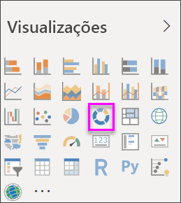
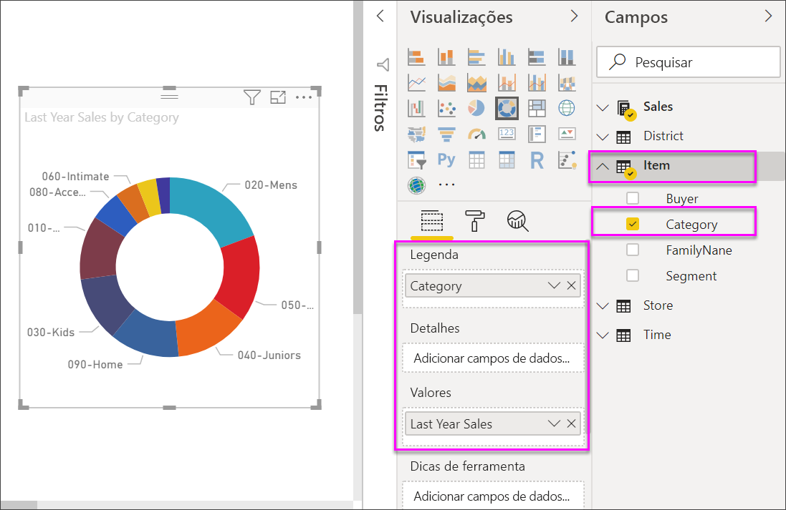

# Gráficos de rosca no Power BI

[!INCLUDE [power-bi-visuals-desktop-banner](../includes/power-bi-visuals-desktop-banner.md)]

Um gráfico de rosca é semelhante a um gráfico de pizza que mostra a relação das partes com um todo. A única diferença é que o centro está em branco e permite o espaço para um rótulo ou ícone.

## Pré-requisito

Este tutorial usa o [arquivo PBIX de exemplo de Análise de Varejo](https://download.microsoft.com/download/9/6/D/96DDC2FF-2568-491D-AAFA-AFDD6F763AE3/Retail%20Analysis%20Sample%20PBIX.pbix).

1. Na seção superior esquerda da barra de menus, selecione **Arquivo** > **Abrir**
   
2. Encontre sua cópia do **arquivo PBIX de exemplo de Análise de Varejo**

1. Abra o **arquivo PBIX de exemplo de Análise de Varejo** na exibição de relatório .

1. Selecionar  para adicionar uma nova página.

## Crie um gráfico de rosca

1. Inicie em uma página de relatório em branco e, no painel Campos, selecione **Vendas** \> **Vendas do Ano Passado**.  
   
3. No painel Visualizações, selecione o ícone de gráfico de rosca  para converter seu gráfico de barras em um gráfico de rosca. Se as **Vendas do Ano Passado** não estiverem na área **Valores**, arraste-as para lá.
     
   

4. Selecione **Item** \> **Categoria** para adicioná-lo à área **Legenda**. 
     
    

5. Opcionalmente, [ajuste o tamanho e a cor do texto do gráfico](power-bi-visualization-customize-title-background-and-legend.md). 

## Considerações e solução de problemas
* A soma dos valores do gráfico de rosca deve somar até 100%.
* Muitas categorias são difíceis de ler e interpretar.
* Os gráficos de rosca são melhor usados para comparar uma determinada seção ao toda, em vez de comparar as seções individuais entre si. 

## Próximas etapas
[Gráficos de funil no Power BI](power-bi-visualization-funnel-charts.md)

[Tipos de visualização no Power BI](power-bi-visualization-types-for-reports-and-q-and-a.md)

