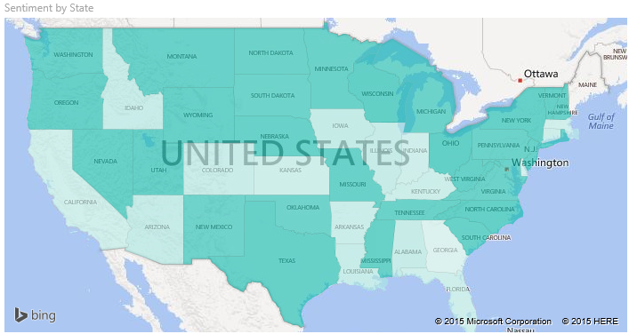
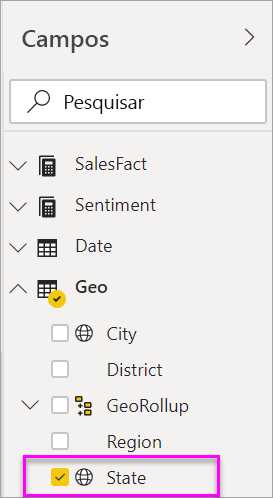
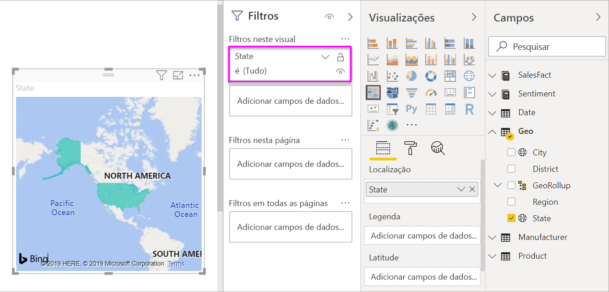
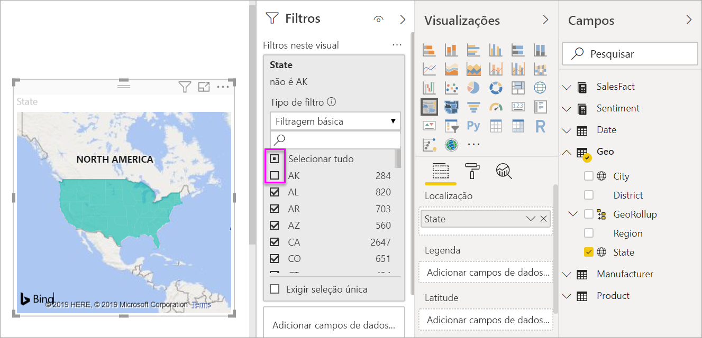
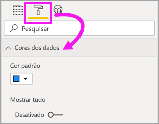
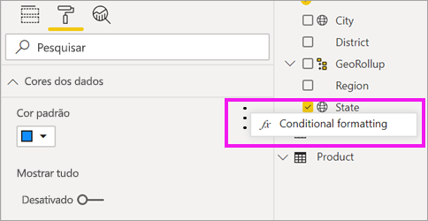
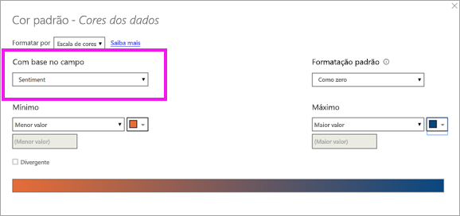
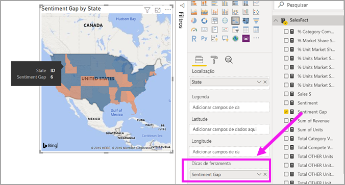
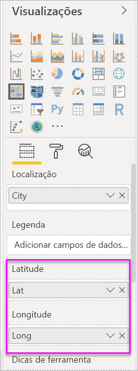

# Criar e usar mapas coropléticos no Power BI

[!INCLUDE[consumer-appliesto-nyyn](../includes/consumer-appliesto-nyyn.md)]

[!INCLUDE [power-bi-visuals-desktop-banner](../includes/power-bi-visuals-desktop-banner.md)]

Um mapa coroplético usa sombreamento ou tonalidade ou padrões para exibir como um valor difere na proporção em uma localização geográfica ou região.  Exiba rapidamente essas diferenças relativas com sombreamento que varia de claro (menos frequente/inferior) para escuro (mais frequente/mais).    

## O que é enviado ao Bing
O Power BI é integrado ao Bing para fornecer as coordenadas de mapa padrão (um processo chamado geocódigo). Quando você cria uma visualização de mapa no serviço do Power BI ou no Power BI Desktop, os dados nos buckets **Local**, **Latitude** e **Longitude** (que estão sendo usados para criar essa visualização) são enviados ao Bing.

Você ou seu administrador talvez precise atualizar o firewall para permitir o acesso às URLs usadas pelo Bing para geocodificação.  Essas URLs são:
- https://dev.virtualearth.net/REST/V1/Locations    
- https://platform.bing.com/geo/spatial/v1/public/Geodata    
- https://www.bing.com/api/maps/mapcontrol

Para obter mais informações sobre os dados enviados ao Bing e ver dicas sobre como aumentar seu sucesso com o geocódigo, consulte [Dicas e truques para visualizações de mapa](power-bi-map-tips-and-tricks.md).

## Quando usar um mapa coroplético
Mapas coropléticos são uma ótima opção:

* para exibir informações quantitativas em um mapa.
* para mostrar as relações e os padrões espaciais.
* quando seus dados são padronizados.
* ao trabalhar com dados socioeconômicos.
* quando regiões definidas são importantes.
* para obter uma visão geral da distribuição entre os locais geográficos.

### Pré-requisitos
Este tutorial usa o [Arquivo PBIX de exemplo de Vendas e Marketing](https://download.microsoft.com/download/9/7/6/9767913A-29DB-40CF-8944-9AC2BC940C53/Sales%20and%20Marketing%20Sample%20PBIX.pbix).
1. Na seção superior esquerda da barra de menus, selecione **Arquivo** > **Abrir**
   
2. Localize sua cópia do **Arquivo PBIX de exemplo de vendas e marketing**

1. Abra o **Arquivo PBIX de exemplo de Vendas e Marketing** na exibição de relatório .

1. Selecionar  para adicionar uma nova página.

> [!NOTE]
> Compartilhar seu relatório com um colega do Power BI exige que você tenha licenças de Power BI Pro individuais ou que o relatório seja salvo na capacidade Premium.    

### Criar um mapa coroplético
1. No painel Campos, selecione o campo **Geo** \> **Estado**.    

   
2. [Converta o gráfico](power-bi-report-change-visualization-type.md) em um mapa coroplético. Observe que o **Estado** agora está no contêiner **Local**. O Bing Maps usa o campo no contêiner **Local** para criar o mapa.  O local pode ser uma variedade de locais válidos: países, estados, condados, cidades, CEPs ou outros códigos postais, etc. O Bing Maps fornece formas de mapa coroplético para locais em todo o mundo. Sem uma entrada válida no Local, o Power BI não pode criar o mapa coroplético.  

   
3. Filtre o mapa para exibir somente os Estados Unidos.

   a.  À esquerda do painel Visualizações, procure o painel **Filtros**. Expanda-o se estiver minimizado

   b.  Passe o mouse sobre **Estado** e selecione a divisa de expansão  
   

   c.  Coloque uma marca de seleção ao lado de **Todos** e remova a marca de seleção ao lado de **AK**.

   
4. Selecione o ícone de rolo de tinta para abrir o painel Formatação e escolha **Cores de dados**.

    

5. Selecione os três pontos verticais e escolha **Formatação condicional**.

    

6. Use a tela **Cor padrão – Cores de dados** para determinar como seu mapa coroplético será sombreado. As opções disponíveis para você incluem em qual campo basear o sombreamento e como aplicar o sombreamento. Neste exemplo, estamos usando o campo **SalesFact** > **Sentimento** e definindo o valor mais baixo para sentimento como laranja e o valor mais alto como azul. Os valores que ficam entre o máximo e o mínimo serão sombreados de laranja e azul. A ilustração na parte inferior da tela mostra o intervalo de cores que serão usados. 

    

7. O mapa coroplético é sombreado em verde e vermelho, sendo que vermelho representa os números de sentimento inferiores e verde representando os sentimentos superiores, mais positivos.  Para exibir detalhes adicionais, arraste um campo para o espaço Dicas de ferramenta.  Aqui, adicionamos **SalesFact** > **Lacuna de sentimento**. Realçar o estado de Idaho (ID) mostra que a lacuna de sentimento é baixa, em 6.
   

10. [Salve o relatório](../create-reports/service-report-save.md).

O Power BI fornece muito controle sobre a aparência de seu mapa coroplético. Familiarize-se com esses controles de cor dos dados até obter a aparência desejada. 

## Realce e filtragem cruzada
Para obter informações sobre como usar o painel Filtros, veja [Adicionar um filtro a um relatório](../create-reports/power-bi-report-add-filter.md).

Realçar um local em um mapa coroplético faz a filtragem cruzada com outras visualizações na página do relatório e vice-versa.

1. Para acompanhar, primeiro salve esse relatório selecionando **Arquivo > Salvar**. 

2. Copie o mapa coroplético usando CTRL-C.

3. Na parte inferior da tela do relatório, selecione a guia **Sentimento** para abrir a página de relatório de sentimento.

    

4. Mova e redimensione as visualizações na página para aumentar o espaço disponível e, em seguida, use CTRL-V para colar o mapa coroplético do relatório anterior. (Veja as seguintes imagens)

   

5. No mapa coroplético, selecione um estado.  Isso destaca e filtra cruzadamente as outras visualizações na página. Selecionar **Texas**, por exemplo, faz a filtragem cruzada dos cartões e realça de forma cruzada o gráfico de barras. Com isso, eu sei que o Sentimento é 75 e que o Texas está no Distrito Central nº 23.   
   
2. Selecione um ponto de dados no gráfico de linhas na VanArsdel – Sentimento por Mês. Isso filtra o mapa coroplético para mostrar os dados de Sentimento para VanArsdel, e não a concorrência.  
   

## Considerações e solução de problemas
Dados de mapa podem ser ambíguos.  Por exemplo, há uma Paris, França, mas também há uma Paris, no Texas. Seus dados geográficos provavelmente são armazenados em colunas separadas – uma coluna de nomes de cidades, uma coluna de nomes de estado ou província, etc. – portanto, o Bing pode não ser capaz de dizer qual Paris é. Se o seu conjunto de dados já contém dados de latitude e longitude, o Power BI tem campos especiais para ajudar a tornar os dados do mapa inequívocos. Basta arrastar o campo que contém os dados de latitude na área Visualizações \> Latitude.  E faça o mesmo para os dados de longitude.    

Se você tiver permissões para editar o conjunto de dados no Power BI Desktop, assista a este vídeo para obter ajuda e resolver a ambiguidade de mapa.

> [VÍDEO https://www.youtube.com/embed/Co2z9b-s_yM ]

Se você não tiver acesso a dados de latitude e longitude, mas tiver acesso de edição ao conjunto de dados, [siga estas instruções para atualizar o conjunto de dados](https://support.office.com/article/Maps-in-Power-View-8A9B2AF3-A055-4131-A327-85CC835271F7).

Para obter mais ajuda com Visualizações de mapa, veja [Tips and tricks for map visualizations](../power-bi-map-tips-and-tricks.md) (Dicas e truques para visualizações de mapa).

## Próximas etapas

[Mapa de formas](desktop-shape-map.md)

[Tipos de visualização no Power BI](power-bi-visualization-types-for-reports-and-q-and-a.md)

