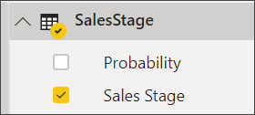
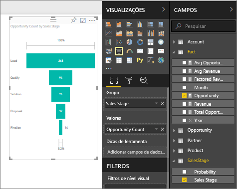

# Gráficos de funil

[!INCLUDE [power-bi-visuals-desktop-banner](../includes/power-bi-visuals-desktop-banner.md)]

Um gráfico de funil ajuda você a visualizar um processo linear com estágios conectados sequenciais. Por exemplo, um funil de vendas que acompanha clientes pelos estágios: Oportunidade \> Oportunidade qualificada \> Cliente potencial \> Contrato \> Fechamento.  Em um relance, a forma do funil transmite a integridade do processo que você está controlando.

Cada estágio de funil representa um percentual do total. Portanto, na maioria dos casos, um gráfico de funil tem a forma de um funil – com o primeiro estágio sendo o maior, e cada estágio subsequente, menor do que seu antecessor.  Um funil em forma de pera também é útil - ele pode identificar um problema no processo.  Mas, em geral, o primeiro estágio, o estágio de "entrada", é o maior.

## Quando usar um gráfico de funil
Os gráficos de funil são uma ótima opção:

* Quando os dados são sequenciais e se movimentam em pelo menos 4 estágios.
* Quando o número de "itens" no primeiro for maior que o número no estágio final.
* calcular o potencial (receita de vendas/negociações/etc.) por estágios.
* calcular e controlar as taxas de conversão e retenção.
* revelar afunilamentos em um processo linear.
* controlar o fluxo de trabalho do carrinho de compras.
* rastrear o progresso e o sucesso das campanhas de propaganda/marketing.

## Como trabalhar com gráficos de funil
Gráficos de funil:

* Podem ser classificados.
* Vários suportes.
* Podem ser realçados e cruzados por outras visualizações na mesma página de relatório.
* Podem ser usados para destacar e cruzar outras visualizações na mesma página de relatório.
   > [!NOTE]
   > Assista a este vídeo para ver Will criar um gráfico de funil usando o exemplo de Vendas e Marketing. Em seguida, siga as etapas abaixo do vídeo para tentar você mesmo, usando o arquivo PBIX de exemplo de Análise de Oportunidade
   > 
   > 
## Pré-requisito

Este tutorial usa o [arquivo PBIX de exemplo de Análise de Oportunidade](https://download.microsoft.com/download/9/1/5/915ABCFA-7125-4D85-A7BD-05645BD95BD8/Opportunity%20Analysis%20Sample%20PBIX.pbix
).

1. Na seção superior esquerda da barra de menus, selecione **Arquivo** > **Abrir**
   
2. Encontre sua cópia do **arquivo PBIX de exemplo de Análise de Oportunidade**

1. Abra o **arquivo PBIX de exemplo de Análise de Oportunidade** na exibição de relatório .

1. Selecionar  para adicionar uma nova página.

## Criar um gráfico de funil básico
Assista a este vídeo para ver Will criar um gráfico de funil usando o exemplo de Vendas e Marketing.

<iframe width="560" height="315" src="https://www.youtube.com/embed/qKRZPBnaUXM" frameborder="0" allow="autoplay; encrypted-media" allowfullscreen></iframe>

Agora crie seu próprio gráfico de funil que mostra o número de oportunidades que temos em cada um de nossos estágios de vendas.

1. Comece em uma página de relatório em branco e selecione o campo **SalesStage** \> **Sales Stage**.
   
    

1. Selecione o ícone de funil  para converter o gráfico de colunas em um gráfico de funil.

2. No painel **Campos**, selecione **Fato** \> **Contagem de Oportunidades**.
   
    
4. Passar o mouse sobre uma barra exibe uma variedade de informações.
   
   * O nome do estágio
   * Número de oportunidades no momento deste estágio
   * Taxa de conversão geral (% do cliente potencial) 
   * Passo a passo (também conhecido como taxa de eliminação), que é % do estágio anterior (nesse caso, Estágio de Proposta/Estágio de Solução)
     
     

6. [Salve o relatório](../service-report-save.md).

## Realce e filtragem cruzada
Para obter informações sobre como usar o painel Filtros, veja [Adicionar um filtro a um relatório](../power-bi-report-add-filter.md).

Realçar uma barra em um funil faz a filtragem cruzada das outras visualizações na página do relatório e vice-versa. Para acompanhar, adicione mais alguns elementos visuais à página do relatório que contém o gráfico de funil.

1. No funil, selecione a barra **Proposta**. Isso destaca de forma cruzada as outras visualizações na página. Use CTRL para fazer uma seleção múltipla.
   
   
2. Para definir as preferências de como os visuais são realçados e filtrados de forma cruzada entre si, veja [Interações de visuais no Power BI](../service-reports-visual-interactions.md)

## Próximas etapas

[Medidores no Power BI](power-bi-visualization-radial-gauge-charts.md)

[Tipos de visualização no Power BI](power-bi-visualization-types-for-reports-and-q-and-a.md)
