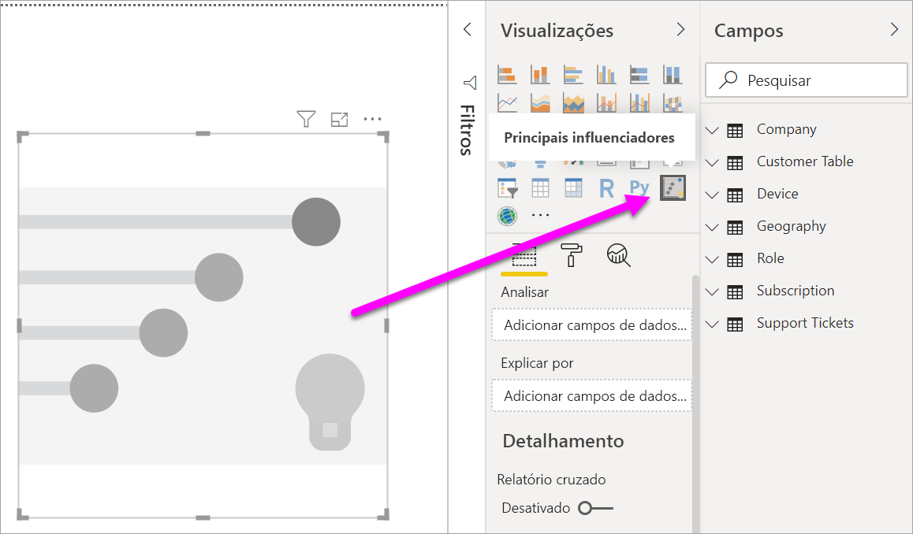
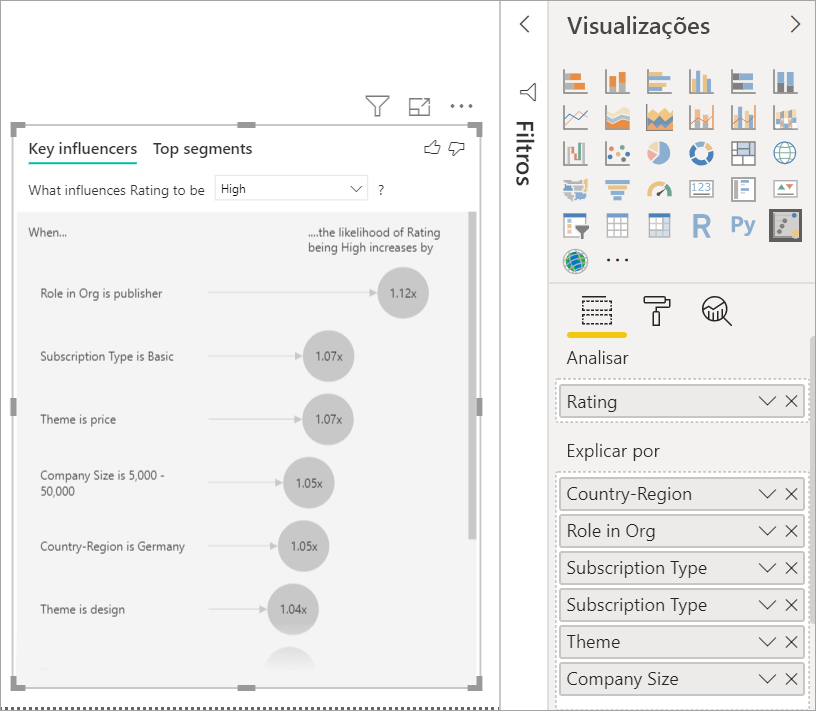
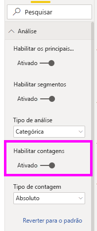
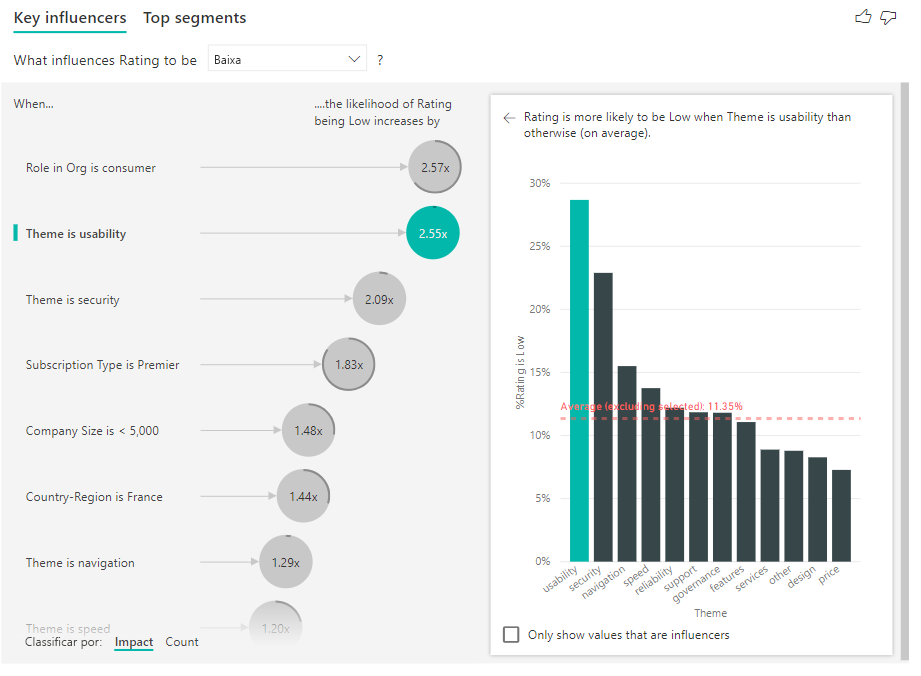
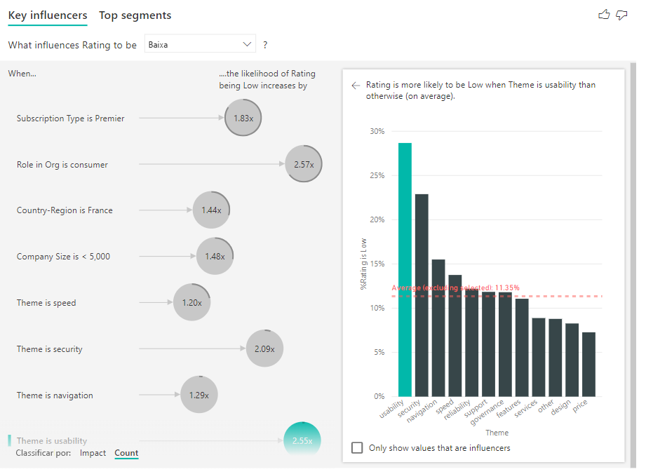
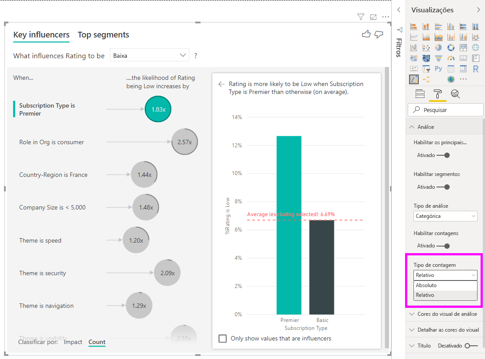
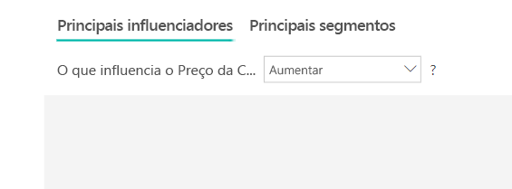
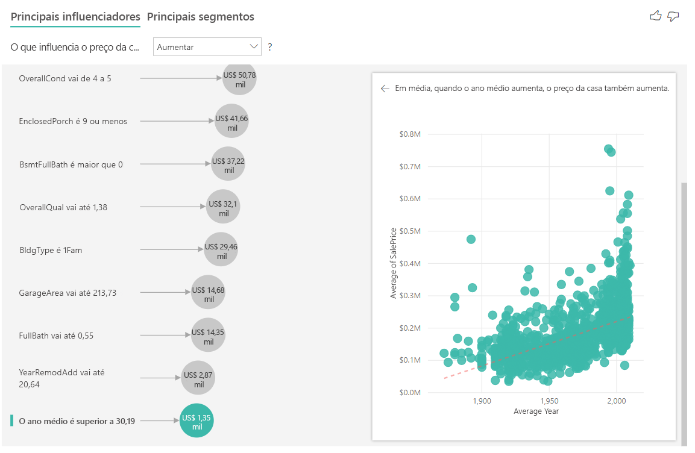
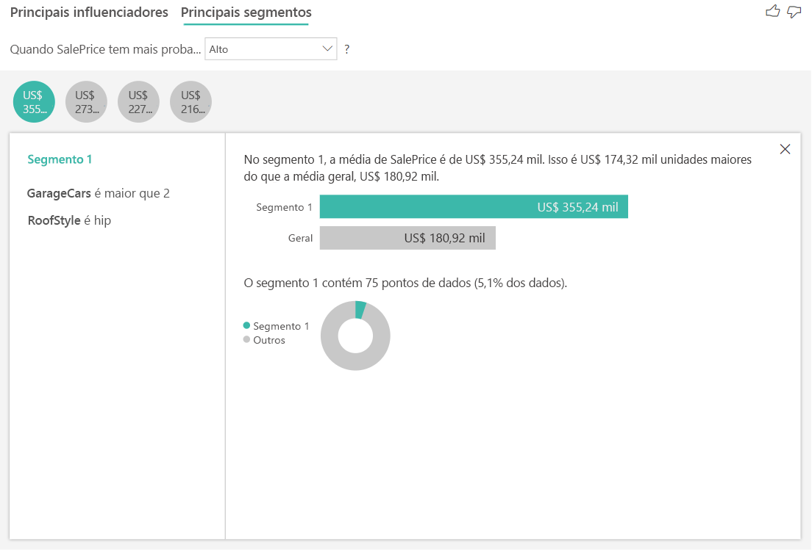
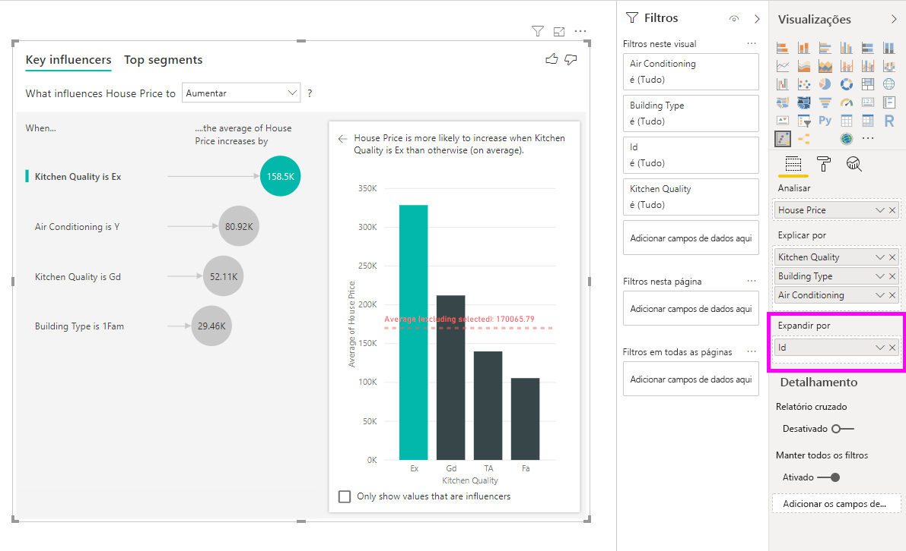

# Criar visualização de influenciadores chave

[!INCLUDE [power-bi-visuals-desktop-banner](../includes/power-bi-visuals-desktop-banner.md)]

O visual de influenciadores principais ajuda a entender os fatores que influenciam uma métrica na qual está interessado. Ele analisa os dados, classifica os fatores importantes e os exibe como influenciadores principais. Por exemplo, suponha que você queira descobrir o que influencia a variedade de pessoal, também conhecida como rotatividade. Um dos fatores pode ser a duração do contrato de trabalho e outro fator pode ser a idade do funcionário. 
 
## Quando usar os influenciadores principais 
O visual de influenciadores principais será uma ótima opção se você quiser: 
- Veja quais fatores afetam a métrica que está sendo analisada.
- Compare a importância relativa desses fatores. Por exemplo, os contratos de curto prazo têm mais impacto na rotatividade comparado aos contratos de longo prazo? 

## Recursos do visual de influenciadores principais

1. **Guias**: selecione uma guia para alternar entre exibições. Os **influenciadores principais** mostram os primeiros colaboradores para o valor de métrica selecionado. Os **principais segmentos** mostram os principais segmentos que contribuem para o valor de métrica selecionado. Um *segmento* é composto por uma combinação de valores. Por exemplo, um segmento pode ser formado por consumidores que são clientes durante, pelo menos, 20 anos e vivem na região oeste. 

2. **Caixa suspensa**: O valor da métrica sob investigação. Neste exemplo, examine a métrica **Classificação**. O valor selecionado é **Baixo**.

3. **Redefinição**: ajuda você a interpretar o visual no painel esquerdo.

4. **Painel esquerdo**: o painel esquerdo contém um visual. Nesse caso, o painel esquerdo mostra uma lista dos primeiros influenciadores principais.

5. **Redefinição**: ajuda você a interpretar o visual no painel direito.

6. **Painel direito**: o painel direito contém um visual. Nesse caso, o gráfico de colunas exibe todos os valores para o **Tema** do influenciador principal, selecionado no painel esquerdo. O valor específico da **usabilidade** no painel esquerdo é mostrado em verde. Todos os outros valores para o **Tema** são mostrados em preto.

7. **Linha média**: A média é calculada para todos os valores possíveis para o **Tema**, exceto **usabilidade** (que é o influenciador selecionado). Portanto, o cálculo se aplica a todos os valores em preto. Ele informa qual percentual dos outros **Temas** você teve uma classificação baixa. Nesse caso, 11,35% teve uma classificação baixa (mostrada pela linha pontilhada).

8. **Caixa de seleção**: Filtra o visual no painel direito para mostrar apenas os valores que são influenciadores para esse campo. Neste exemplo, isso filtraria o visual para usabilidade, segurança e navegação.

## Analisar uma métrica categórica
 
Assista a este vídeo para aprender a criar um visual de influenciadores principais com uma métrica categórica. Depois, siga estas etapas para criar um. 

   > [!NOTE]
   > Este vídeo usa uma versão anterior do Power BI Desktop.
   > 
   > 
<iframe width="560" height="315" src="https://www.youtube.com/embed/fDb5zZ3xmxU" frameborder="0" allow="accelerometer; autoplay; encrypted-media; gyroscope; picture-in-picture" allowfullscreen></iframe>

Seu Gerente de Produto quer que você descubra quais fatores levam os clientes a deixar revisões negativas sobre nosso serviço de nuvem. Para acompanhar, abra o [arquivo PBIX de Comentários do Cliente](https://github.com/microsoft/powerbi-desktop-samples/tree/master/Monthly%20Desktop%20Blog%20Samples/2019/customerfeedback.pbix) no Power BI Desktop. Baixe também o [arquivo do Excel de Comentários do Cliente para o serviço do Power BI ou o Power BI Desktop](https://github.com/microsoft/powerbi-desktop-samples/tree/master/Monthly%20Desktop%20Blog%20Samples/2019/customerfeedback.xlsx). Selecione um link e, em seguida, selecione **Baixar** na página do GitHub que é aberta.

> [!NOTE]
> O conjunto de dados de Comentários do Cliente baseia-se em [Moro e colaboradores, 2014] S. Moro, P. Cortez e P. Rita. “A Data-Driven Approach to Predict the Success of Bank Telemarketing.”(Uma abordagem controlada por dados para prever o sucesso de telemarketing bancário). *Decision Support Systems*, Elsevier, 62:22-31, junho de 2014. 

1. Abra o relatório e selecione o ícone **Influenciadores principais**. 

    

2. Arraste a métrica que deseja investigar para o campo **Analisar**. Para ver o que leva um cliente a obter baixa classificação do serviço, selecione **Tabela do Cliente** > **Classificação**.

3. Arraste os campos que você acha que podem influenciar a **Classificação** para o campo **Explicar por**. Você pode arrastar quantos campos quiser. Nesse caso, inicie com:
    - País-Região 
    - Função na Organização 
    - Tipo de Assinatura 
    - Porte da Empresa 
    - Tema
    
4. Deixe o campo **Expandir por** vazio. Esse campo só é usado apenas ao analisar uma medida ou um campo resumido. 

5. Para se concentrar nas classificações negativas, selecione **Baixa** na caixa suspensa **O que influencia a classificação**.  

    

A análise é executada no nível da tabela do campo que está sendo analisado. Nesse caso, é a métrica de **Classificação**. Essa métrica é definida em um nível de cliente. Cada cliente forneceu uma pontuação alta ou baixa. Todos os fatores explicativos devem ser definidos no nível do cliente para serem usados pelo visual. 

No exemplo anterior, todos os nossos fatores explicativos têm uma relação um-para-um ou muitos para um com a métrica. Neste caso, cada cliente atribuiu um único tema à sua classificação. Da mesma forma, os clientes provenientes de um país têm um tipo de associação e executam uma função em suas organizações. Os fatores explicativos já são atributos de um cliente e nenhuma transformação é necessária. O visual pode fazer uso imediato deles. 

Mais adiante no tutorial, você verá exemplos mais complexos nos quais há relações um-para-muitos. Nesses casos, as colunas primeiro precisam ser agregadas no nível do cliente antes que a análise possa ser executada. 

As medidas e as agregações usadas como fatores explicativos também são avaliadas no nível da tabela da métrica **Analisar**. Alguns exemplos são mostrados neste artigo. 

## Interpretar os influenciadores principais categóricos 
Vamos dar uma olhada nos influenciadores principais para classificações baixas. 

### O primeiro fator único que influencia a probabilidade de uma classificação baixa

Neste exemplo, o cliente pode ter três funções: consumidor, administrador e editor. Ser um consumidor é o primeiro fator que contribui para uma classificação baixa. 

Mais precisamente, nossos clientes estão 2,57 vezes mais propensos a dar uma pontuação negativa para seu serviço. O gráfico de influenciadores principais lista **A Função na Organização é consumidor** em primeiro lugar na lista à esquerda. Ao selecionar **A Função na Organização é consumidor**, o Power BI mostra outros detalhes no painel direito. O efeito comparativo de cada função sobre a probabilidade de uma classificação baixa é mostrado.
  
- 14,93% dos consumidores dão uma pontuação baixa. 
- Em média, todas as outras funções dão uma pontuação baixa 5,78% do tempo.
- Os consumidores tem 2,57 mais probabilidade de dar uma pontuação baixa em comparação a todas as outras funções. Você pode determinar isso ao dividir a barra verde pela linha pontilhada vermelha. 

### O segundo fator único que influencia a probabilidade de uma classificação baixa

O visual de influenciadores principais compara e classifica fatores de muitas variáveis diferentes. O segundo influenciador não tem nenhuma relação com a **Função na Organização**. Selecione o segundo influenciador na lista, que é **O Tema é usabilidade**. 

O segundo fator mais importante está relacionado ao tema da análise do cliente. Os clientes que comentaram sobre a usabilidade do produto eram 2,55 vezes mais propensos a darem uma pontuação baixa comparado aos clientes que comentaram sobre outros temas, como confiabilidade, design ou velocidade. 

Entre os visuais, a média, que é mostrada na linha pontilhada vermelha, foi alterada de 5,78% para 11,34%. A média é dinâmica, pois se baseia na média de todos os outros valores. Para o primeiro influenciador, a média excluiu a função do cliente. Para o segundo influenciador, o tema de usabilidade foi excluído. 
 
Selecione a caixa de seleção **Mostrar apenas valores que são os influenciadores** para filtrar usando somente os valores influentes. Nesse caso, eles são as funções que orientam uma pontuação baixa. Doze temas são reduzidos para os quatro identificados pelo Power BI como os temas que levam a classificações baixas. 

## Interagir com outros visuais 
 
Sempre que um usuário seleciona uma segmentação, um filtro ou outro visual na tela, o visual de influenciadores principais executa novamente sua análise sobre a nova parte dos dados. Por exemplo, vamos arrastar o **Porte da Empresa** para o relatório e usá-lo como uma segmentação. Queremos ver se os influenciadores principais para nossos clientes empresariais são diferentes da população geral. O porte da empresa é maior que 50 mil funcionários.
 
Selecionar **>50.000** executa a análise novamente e você pode ver que os influenciadores mudaram. Para clientes de empresas de grande porte, os influenciadores principais para classificações baixas têm um tema relacionado à segurança. Você pode querer investigar mais detalhadamente, para ver se há recursos de segurança específicos com os quais seus clientes de empresas de grande porte estão insatisfeitos. 

## Interpretar influenciadores principais contínuos 
 
Até agora, você viu como usar o visual para explorar como diferentes campos categóricos influenciam as classificações baixas. Também é possível ter fatores contínuos como idade, altura e preço no campo **Explicar por**. Vejamos o que acontece quando **Tempo de Uso** é movido da tabela de clientes para **Explicar por**. O Tempo de Uso representa o tempo que o cliente usa o serviço. 
 
Conforme o tempo de uso aumenta, a probabilidade de recebimento de uma classificação mais baixa também aumenta. Essa tendência sugere que os clientes a longo prazo têm mais chances de dar uma pontuação negativa. Essa ideia é interessante e uma que você talvez queira acompanhar posteriormente. 
 
A visualização mostra que sempre que o tempo de uso aumenta em 13,44 meses, em média, a probabilidade de uma classificação baixa aumenta em 1,23 vez. Nesse caso, os 13,44 meses representam o desvio padrão do tempo de uso. Portanto, o insight recebido examina como o aumento do tempo de uso em um valor padrão que é o desvio padrão do tempo de uso, afeta a probabilidade de recebimento de uma classificação baixa. 
 
O gráfico de dispersão no painel direito plota o percentual médio de classificações baixas para cada valor de tempo de uso. Ele realça o declive com uma linha de tendência.

## Influenciadores principais contínuos compartimentalizados

Em alguns casos, você perceberá que os fatores contínuos foram automaticamente transformados em categóricos. Isso ocorre porque percebemos que a relação entre as variáveis não é linear e, portanto, não podemos descrever a relação como simplesmente um aumento ou uma diminuição (como fizemos no exemplo acima).

Executamos testes de correlação para determinar a linearidade do influenciador com relação ao destino. Se o destino for contínuo, executaremos a correlação de Pearson e, se o destino for categórico, executaremos testes de correlação de pontos biseriais. Se detectarmos que a relação não é suficientemente linear, realizaremos a compartimentalização supervisionada e geraremos um máximo de cinco compartimentos. Para descobrir quais compartimentos fazem mais sentido, usamos um método de compartimentalização supervisionada que examina a relação entre o fator explicativo e o destino que está sendo analisado.

## Interpretando medidas e agregações como influenciadores principais 
 
Você pode usar medidas e agregações como fatores explicativos em suas análises. Talvez você queira ver qual é o efeito que a contagem de tíquetes de suporte do cliente ou a duração média de um tíquete em aberto tem sobre a pontuação que recebe. 
 
Nesse caso, você quer ver se o número de tíquetes de suporte de um cliente influencia a pontuação que ele dá. Vamos inserir a **ID do tíquete de suporte** da tabela tíquete de suporte. Como um cliente pode ter vários tíquetes de suporte, você precisa agregar a ID ao nível do cliente. A agregação é importante, pois a análise é executada no nível do cliente, então todos os fatores devem ser definidos nesse nível de granularidade. 
 
Vamos examinar a contagem de IDs. Cada linha do cliente tem uma contagem de tíquetes de suporte associado a ela. Nesse caso, conforme a contagem de tíquetes de suporte aumenta, a probabilidade de a classificação ser baixa aumenta para 5,51 vezes. O visual do lado direito mostra o número médio de tíquetes de suporte por diferentes valores de **Classificação** avaliados no nível do cliente. 

## Interpretar os resultados: Principais segmentos 
 
Você pode usar a guia **Influenciadores principais** para avaliar cada fator individualmente. Você também pode usar a guia **Principais segmentos** para ver como uma combinação de fatores afeta a métrica que está analisando. 
 
Os principais segmentos inicialmente apresentam uma visão geral de todos os segmentos que foram descobertos pelo Power BI. O exemplo a seguir mostra que seis segmentos foram encontrados. Esses segmentos são classificados pelo percentual de classificações baixas no segmento. O segmento 1, por exemplo, tem 74,3% de classificações do cliente que são baixas. Quanto maior a bolha, maior é a proporção de classificações baixas. O tamanho da bolha representa o número de clientes que estão no segmento. 

A seleção de uma bolha faz uma busca detalhada nos detalhes desse segmento. Se você selecionar Segmento 1, por exemplo, descobrirá que ele é composto por clientes relativamente estabelecidos. Foram clientes por mais de 29 meses e têm mais de quatro tíquetes de suporte. Por fim, eles não são editores. Portanto, são consumidores ou administradores. 
 
Nesse grupo, 74.3% dos clientes deram uma classificação baixa. O cliente médio deu uma classificação baixa 11,7% do tempo, então esse segmento tem uma proporção maior do que as classificações baixas. Ele tem 63% a mais. O segmento 1 também contém aproximadamente 2,2% dos dados, representando uma parte acessível da população. 

## Como adicionar contagens

Às vezes, um influenciador pode ter um grande impacto, mas representar muito pouco os dados. Por exemplo, **Tema** é **usabilidade** é o segundo maior influenciador para baixas classificações. No entanto, pode haver apenas alguns clientes que reclamaram da usabilidade. As contagens podem ajudá-lo a priorizar os influenciadores nos quais você deseja se concentrar.

Você pode ativar as contagens por meio do **Cartão de análise** do painel formatação.

Depois que as contagens forem ativadas, você verá um anel em volta da bolha de cada influenciador, que representa o percentual aproximada de dados que o influenciador contém. Quanto mais bolhas o anel circula, mais dados ele contém. Podemos ver que **Tema** é **usabilidade** contém uma proporção muito pequena de dados.

Você também pode usar a opção Classificar por na parte inferior esquerda do visual para classificar as bolhas por contagem primeiro, em vez de impacto. **Tipo de assinatura** é **Premier** é o principal influenciador com base na contagem.

Ter um anel completo em volta do círculo significa que o influenciador contém 100% dos dados. Você pode alterar o tipo de contagem para ser relativo ao influenciador máximo usando o menu suspenso **Tipo de contagem** no **cartão de Análise** do painel formatação. Agora, o influenciador com a maior quantidade de dados será representado por um anel completo e todas as outras contagens serão relativas a ele.

## Analisar uma métrica numérica

Se você mover um campo numérico não resumido para o campo **Analisar**, poderá escolher como lidar com esse cenário. Você pode alterar o comportamento do visual entrando no **Painel de Formatação** e alternar entre **Tipo de Análise Categórica** e **Tipo de Análise Contínua**.

Um **Tipo de Análise Categórica** se comporta conforme descrito acima. Por exemplo, se estivesse olhando as pontuações de pesquisa variando de 1 a 10, você poderia perguntar “O que influencia pontuações de pesquisa a ser 1?”

Um **Tipo de Análise Contínua** altera a pergunta para uma contínua. No exemplo acima, a nova pergunta seria “O que influencia as pontuações de pesquisa a aumentar/diminuir?”

Essa distinção é muito útil quando você tem muitos valores exclusivos no campo que está analisando. No exemplo a seguir, vemos os preços de casas. Não faz muito sentido perguntar “O que influencia o Preço da Casa a ser 156.214?” porque isso é muito específico e, provavelmente, não tem dados suficientes para inferir um padrão.

Em vez disso, podemos perguntar: “O que influenciará o aumento do Preço da Casa?” que nos permite tratar os preços da casa como um intervalo em vez de valores distintos.

## Interpretar os resultados: Principais influenciadores 

Nesse cenário, vamos examinar “O que influencia o aumento do Preço da Casa”. Estamos observando uma série de fatores explicativos que poderiam afetar um preço da casa, como **Year Built** (o ano em que a casa foi criada), **KitchenQual** (qualidade da cozinha) e **YearRemodAdd** (o ano em que a casa foi remodelada). 

No exemplo a seguir, vamos examinar nosso influenciador principal, que é a qualidade da cozinha como Excelente. Os resultados são muito semelhantes aos que vimos quando analisamos as métricas categóricas com algumas diferenças importantes:

- O gráfico de colunas à direita está voltado para as médias em vez de porcentagens. Ele, portanto, nos mostra o que o preço médio de uma casa com uma excelente cozinha é (barra verde) em comparação com o preço médio de uma casa sem uma cozinha excelente (linha pontilhada)
- O número na bolha ainda é a diferença entre a linha pontilhada vermelha e a barra verde, mas é expresso como um número (US$ 158,49 mil) em vez de uma probabilidade (1,93x). Então, em média, as casas com excelentes cozinhas são quase US$ 160 mil mais caras do que casas sem cozinhas excelentes.

No exemplo a seguir, vemos o impacto que um fator contínuo (casa do ano foi remodelada) tem no preço da casa. As diferenças em comparação com a forma que podemos analisar os influenciadores contínuos para métricas categóricas são as seguintes:

-   O gráfico de dispersão no painel direito plota o preço médio da casa para cada valor distinto do ano remodelado. 
-   O valor na bolha mostra o quanto o preço médio da casa aumenta (neste caso, US$ 2,87 mil) enquanto o ano em que a casa foi remodelada aumenta pelo seu desvio padrão (nesse caso, 20 anos)

Finalmente, no caso de medidas, estamos analisando o ano médio em que uma casa foi construída. A análise aqui é a seguinte:

-   O gráfico de dispersão no painel direito plota o preço médio da casa para cada valor distinto na tabela
-   O valor na bolha mostra o quanto o preço médio da casa aumenta (neste caso, US$ 1,35 mil) enquanto o ano médio aumenta pelo seu desvio padrão (nesse caso, 30 anos)

## Interpretar os resultados: Principais Segmentos

Os principais segmentos para destinos numéricos mostram grupos nos quais os preços da casa em média são maiores do que no conjunto de dados geral. Por exemplo, abaixo vemos que **Segmento 1** é composto de casas em que **GarageCars** (número de carros que cabem na garagem) é maior que 2 e o **RoofStyle** é Hip. Casas com essas características têm um preço médio de U$S 355 mil em comparação com a média geral nos dados, que é de US$ 180 mil.

## Analisar uma métrica que é uma medida ou uma coluna resumida

No caso de uma medida ou coluna resumida, a análise usa como padrão o **Tipo de Análise Contínua** descrito [acima](https://docs.microsoft.com/power-bi/visuals/power-bi-visualization-influencers#analyze-a-metric-that-is-numeric). Isso não pode ser alterado. A maior diferença entre analisar uma medida/coluna resumida e uma coluna numérica não resumida é o nível no qual a análise é executada.

No caso de colunas não resumidas, a análise sempre é executada no nível de tabela. No exemplo de preço da casa acima, analisamos a métrica de **Preço da casa** para ver o que influencia o aumento/redução de um preço de casa. A análise é executada automaticamente no nível da tabela. Nossa tabela tem uma ID exclusiva para cada casa, de modo que a análise é executada no nível da casa.

Para medidas e colunas resumidas, não sabemos imediatamente em que nível analisar. Se o **Preço da casa** tiver sido resumido como uma **Média**, precisaremos considerar em qual nível gostaríamos de calcular o preço médio da casa. O preço médio da casa está no nível do bairro? Ou talvez no nível regional?

Medidas e colunas resumidas são analisadas automaticamente no nível dos campos **Explicar por** usados. Imagine que temos três campos em **Explicar por** em que estamos interessados: **Qualidade da Cozinha**, **Tipo de Construção** e **Ar-Condicionado**. O **Preço Médio da Casa** seria calculado para cada combinação exclusiva desses três campos. Geralmente, é útil alternar para um modo de exibição de tabela para dar uma olhada em como são os dados que estão sendo avaliados.

Essa análise é muito resumida e, portanto, será difícil para o modelo de regressão localizar quaisquer padrões nos dados com os quais ele pode aprender. Devemos executar a análise em um nível mais detalhado para obter resultados melhores. Se quiséssemos analisar o preço da casa no nível da casa, precisaríamos adicionar explicitamente o campo **ID** à análise. No entanto, não queremos que a ID da casa seja considerada um influenciador. Não é útil saber que, à medida que a ID da casa aumenta, o preço de uma casa aumenta. É aí que a opção do campo **Expandir por** é muito útil. Você pode usar **Expandir por** para adicionar os campos que deseja usar para definir o nível da análise sem procurar novos influenciadores.

Veja a aparência da visualização depois de adicionarmos **ID** a **Expandir por**. Depois de definir o nível no qual você deseja que sua medida seja avaliada, a interpretação de influenciadores é exatamente a mesma que para as [colunas numéricas não resumidas](https://docs.microsoft.com/power-bi/visuals/power-bi-visualization-influencers#analyze-a-metric-that-is-numeric).

Se você quiser saber mais sobre como é possível analisar medidas com a visualização de influenciadores de chave, assista ao tutorial a seguir.

<iframe width="1167" height="631" src="https://www.youtube.com/embed/2X1cW8oPtc8" frameborder="0" allow="accelerometer; autoplay; encrypted-media; gyroscope; picture-in-picture" allowfullscreen></iframe>

## Considerações e solução de problemas 
 
**Quais são as limitações do visual?** 
 
O visual de principais influenciadores tem algumas limitações:

- Não é compatível com o Direct Query
- Não há suporte para a Conexão Dinâmica com o Azure Analysis Services e o SQL Server Analysis Services
- Não é compatível com publicação na Web
- Exige o .NET Framework 4.6 ou posterior

**Vejo um erro no qual nenhum influenciador ou segmento foi encontrado. Por que isso acontece?** 

Esse erro ocorre quando você inclui campos em **Explicar por**, mas nenhum influenciador é encontrado. 
- Você incluiu a métrica analisada em **Analisar** e **Explicar por**. Remova-a de **Explicar por**. 
- Os campos explicativos tem muitas categorias com poucas observações. Essa situação dificulta que a visualização determine quais fatores são influenciadores. É difícil generalizar com base em apenas algumas observações. Se estiver analisando um campo numérico, talvez você queira alternar de **Análise Categórica** para **Análise Contínua** no **Painel de Formatação** no cartão **Análise**.
- Os fatores explicativos têm observações suficientes para generalizar, mas a visualização não encontrou nenhuma correlação significativa para relatar.
 
**Vejo um erro indicando que a métrica analisada não tem dados suficientes para a análise ser executada. Por que isso acontece?** 

A visualização funciona ao analisar os padrões nos dados para um grupo em comparação a outros grupos. Por exemplo, procura por clientes que deram classificações baixas em comparação aos clientes que deram classificações altas. Se os dados do modelo têm somente poucas observações, fica difícil encontrar padrões. Se a visualização não tiver dados suficientes para encontrar influenciadores significativos, ela indicará que mais dados são necessários para executar a análise. 

É recomendável que você tenha pelo menos 100 observações para o estado selecionado. Nesse caso, o estado é composto pelos clientes que variam. Você também precisa de, pelo menos, 10 observações para os estados usados para comparação. Nesse caso, o estado de comparação é composto pelos clientes que não variam.

Se estiver analisando um campo numérico, talvez você queira alternar de **Análise Categórica** para **Análise Contínua** no **Painel de Formatação** no cartão **Análise**.

**Vejo um erro quando 'Analyze' não é resumido, a análise sempre é executada no nível de linha de sua tabela pai. Não é permitido alterar este nível por meio de campos 'Expandir por'. Por que isso acontece?**

Ao analisar uma coluna numérica ou categórica, a análise sempre é executada no nível de tabela. Por exemplo, se você estiver analisando os preços da casa e a tabela contiver uma coluna de ID, a análise será executada automaticamente no nível de ID da casa. 

Ao analisar uma medida ou coluna resumida, você precisará declarar explicitamente em qual nível deseja que a análise seja executada. Você pode usar **Expandir por** para alterar o nível da análise de medidas e colunas resumidas sem adicionar novos influenciadores. Se o **Preço da casa** tiver sido definido como uma medida, você poderá adicionar a coluna de ID da casa para **Expandir por** para alterar o nível da análise.

**Vejo um erro indicando que um campo em *Explicar por* não está relacionado exclusivamente à tabela que contém a métrica analisada. Por que isso acontece?**
 
A análise é executada no nível da tabela do campo que está sendo analisado. Por exemplo, se estiver analisando os comentários do cliente sobre seu serviço, você poderá ter uma tabela que informa se um cliente deu uma classificação alta ou baixa. Nesse caso, a análise é executada no nível da tabela de clientes. 

Se você tiver uma tabela relacionada definida em um nível mais granular do que a tabela que contém a métrica, você verá esse erro. Veja um exemplo: 
 
- Você analisa o que influencia os clientes a dar classificações baixas para seu serviço.
- Você quer ver se o dispositivo no qual o cliente está consumindo o serviço influencia as revisões fornecidas.
- Um cliente pode consumir o serviço de várias maneiras diferentes.
- No exemplo a seguir, o cliente 10000000 usa um navegador e um tablet para interagir com o serviço.

Se você tentar usar a coluna de dispositivo como um fator explicativo, verá o seguinte erro: 

Esse erro ocorre porque o dispositivo não está definido no nível do cliente. Um cliente pode consumir o serviço em diversos dispositivos. Para que a visualização encontre padrões, o dispositivo precisa ser um atributo do cliente. Há várias soluções que dependem da sua compreensão dos negócios: 
 
- Você pode alterar o resumo de dispositivos para contagem. Por exemplo, use a contagem se o número de dispositivos puder afetar a pontuação que um cliente dá. 
- Você pode dinamizar a coluna de dispositivos para ver se o consumo do serviço em um dispositivo específico influencia a classificação de um cliente.
 
Neste exemplo, os dados foram dinamizados para criar novas colunas para navegador, celular e tablet (não se esqueça de excluir e recriar suas relações no modo de exibição de modelagem após dinamizar seus dados). Agora, você pode usar esses dispositivos específicos em **Explicar por**. Todos os dispositivos passam a ser influenciadores e o navegador tem o maior efeito sobre a pontuação do cliente.

Mais precisamente, os clientes que não usam o navegador para consumir o serviço são 3,79 vezes mais propensos a dar uma pontuação baixa do que aqueles que usam o navegador. Mais abaixo na lista, para dispositivo móvel, o inverso é verdadeiro. Os clientes que usam o aplicativo móvel são mais propensos a dar uma pontuação baixa do que aqueles que não usam o aplicativo móvel. 

**Vejo um aviso indicando que as medidas não foram incluídas na análise. Por que isso acontece?** 

A análise é executada no nível da tabela do campo que está sendo analisado. Se analisar a rotatividade de clientes, você poderá ter uma tabela que informa se um cliente deixou ou não de usar o serviço. Nesse caso, a análise é executada no nível da tabela de clientes.
 
Por padrão, as medidas e as agregações são analisadas no nível da tabela. Se existisse uma medida para média de gastos mensais, isso seria analisado no nível da tabela de clientes. 

Se a tabela de clientes não tiver um identificador exclusivo, você não poderá avaliar a medida e ela será ignorada pela análise. Para evitar essa situação, verifique se que a tabela com sua métrica tem um identificador exclusivo. Nesse caso, ele é a tabela de cliente e o identificador exclusivo é a ID do cliente. Também é fácil adicionar uma coluna de índice usando o Power Query.
 
**Vejo um aviso indicando que a métrica analisada tem mais de 10 valores exclusivos e que isso pode afetar a qualidade da análise. Por que isso acontece?** 

A visualização de IA pode analisar os campos categóricos e numéricos. No caso de campos categóricos, um exemplo pode ser a Rotatividade como Sim ou Não e a Satisfação do Cliente como Alta, Média ou Baixa. Aumentar o número de categorias para analisar significa que há menos de observações por categoria. Essa situação torna mais difícil para a visualização encontrar padrões nos dados. 

Ao analisar os campos numéricos, você pode escolher entre tratar os campos numéricos como texto. Nesse caso, você executará a mesma análise como faria para dados categóricos (**Análise Categórica**). Se você tiver muitos valores distintos, recomendamos que mude a análise para **Análise Contínua**, pois isso significa que você pode inferir padrões quando os números aumentam ou diminuem, em vez de tratá-los como valores distintos. Você pode alternar de **Análise Categórica** para **Análise Contínua** no **Painel de Formatação** no cartão **Análise**.

Para encontrar influenciadores mais fortes, recomendamos o agrupamento de valores semelhantes em uma única unidade. Por exemplo, se você tiver uma métrica por preço, será provável que obtenha resultados melhores agrupando preços semelhantes em categorias Alta, Média e Baixa vs. o uso de faixas de preço individuais. 

**Há fatores nos dados que parecem que deveriam ser influenciadores principais, mas não são. Como isso pode acontecer?**

No exemplo a seguir, os clientes que são consumidores influenciam classificações baixas, com 14,93% de classificações que estão baixas. A função de administrador também tem uma grande proporção de classificações baixas, em 13,42%, mas não é considerada uma influenciadora. 

O motivo para essa determinação é que a visualização também considera o número de pontos de dados quando encontra os influenciadores. O exemplo a seguir tem mais de 29.000 consumidores e 10 vezes menos administradores, aproximadamente 2.900. Somente 390 deles deram uma classificação baixa. O visual não tem dados suficientes para determinar se encontrou um padrão com as classificações do administrador ou se é apenas um resultado casual. 

**Quais são os limites de ponto de dados para influenciadores chave?**
Executamos a análise em uma amostra de 10.000 pontos de dados. As bolhas de um lado mostram todos os influenciadores que foram encontrados. Os gráficos de colunas e dispersões do outro lado obedecem às estratégias de amostragem para esses visuais principais.

**Como calcular os influenciadores principais para análise categórica?**

Nos bastidores, a Visualização de IA usa o [ML.NET](https://dotnet.microsoft.com/apps/machinelearning-ai/ml-dotnet) para executar uma regressão logística e calcular os influenciadores principais. Uma regressão logística é um modelo estatístico que compara diferentes grupos entre si. 

Se quiser saber o que influencia as classificações baixas, a regressão logística examinará as diferenças entre os clientes que deram uma pontuação baixa e aqueles que deram uma pontuação alta. Se tiver várias categorias, como pontuações altas, neutras e baixas, você analisará como os clientes que lhe deram uma classificação baixa se diferem dos clientes que não lhe deram uma classificação baixa. Nesse caso, como os clientes que lhe deram uma pontuação baixa se diferem dos clientes que lhe deram uma classificação alta ou uma classificação neutra? 
 
A regressão logística pesquisa padrões nos dados e procura as diferenças entres os clientes que deram uma classificação baixa e aqueles que deram uma classificação alta. Por exemplo, ela pode descobrir que os clientes com mais tíquetes de suporte dão um percentual muito maior de classificações baixas do que aqueles que têm poucos tíquetes de suporte ou nenhum.
 
A regressão logística também considera a quantidade de pontos de dados presentes. Por exemplo, se os clientes que têm uma função de administrador derem proporcionalmente pontuações mais negativas, mas houver apenas alguns administradores, esse fator não será considerado influente. Essa determinação é feita porque não existem pontos de dados disponíveis suficientes para inferir um padrão. Um teste estatístico, conhecido como teste de Wald, é usado para determinar se um fator é considerado um influenciador. O visual usa um valor p de 0,05 para determinar o limite. 

**Como calcular os influenciadores principais para análise numérica?**

Nos bastidores, a visualização de IA usa o [ML.NET](https://dotnet.microsoft.com/apps/machinelearning-ai/ml-dotnet) para executar uma regressão linear e calcular os influenciadores principais. Uma regressão linear é um modelo estatístico que examina como o resultado do campo que você está analisando é alterado com base em seus fatores explicativos.

Por exemplo, se estivermos analisando os preços das casas, uma regressão linear examinará o impacto que uma excelente cozinha terá no preço da casa. Casas com excelentes cozinhas geralmente têm preços de casa maiores ou menores em comparação a casas sem excelentes cozinhas?

A regressão linear também considera o número de pontos de dados. Por exemplo, se casas com quadras de tênis têm preços mais altos, mas como há bem poucas casas com quadras de tênis, esse fator não é considerado influente. Essa determinação é feita porque não existem pontos de dados disponíveis suficientes para inferir um padrão. Um teste estatístico, conhecido como teste de Wald, é usado para determinar se um fator é considerado um influenciador. O visual usa um valor p de 0,05 para determinar o limite. 

**Como calcular os segmentos?**

Nos bastidores, a visualização de IA usa o [ML.NET](https://dotnet.microsoft.com/apps/machinelearning-ai/ml-dotnet) para executar uma árvore de decisão e encontrar subgrupos interessantes. O objetivo da árvore de decisão é acabar com um subgrupo de pontos de dados que seja relativamente alto na métrica em que você está interessado. Isso poderia ser clientes com classificações baixas ou casas com preços altos.

A árvore de decisão usa cada fator explicativo e tenta inferir qual fator fornecerá a melhor *divisão*. Por exemplo, se você filtrar os dados para incluir somente os clientes de empresas de grande porte, isso separará os clientes que deram uma classificação alta vs. classificação baixa? Ou talvez seja melhor filtrar os dados para incluir somente os clientes que comentaram sobre a segurança? 

Depois que a árvore de decisão faz uma divisão, ela usa o subgrupo de dados e determina a próxima melhor divisão para os dados. Neste caso, o subgrupo são os clientes que comentaram na segurança. Após cada divisão, ela também considera se tem pontos de dados suficientes para este grupo, de modo que isso seja um grupo representativo do qual um padrão será inferido ou se isso pode ser uma anomalia nos dados e não um segmento real. Outro teste estatístico é aplicado para verificar a significância estatística da condição de divisão, com um valor p igual a 0,05. 

Depois que a árvore de decisão conclui a execução, ela usa todas as divisões, como comentários sobre a segurança e empresas de grande porte, e cria filtros do Power BI. Essa combinação de filtros é empacotada como um segmento no visual. 
 
**Por que alguns fatores se tornam influenciadores ou deixam de ser influenciadores conforme mais campos são arrastados para o campo *Explicar por*?**

A visualização avalia todos os fatores explicativos em conjunto. Um fator pode ser um influenciador por si só, mas quando é considerado com outros fatores, pode não ser. Suponha que queira analisar o que influencia o preço alto de uma casa, com os quartos e o tamanho da casa como fatores explicativos:

- Por si só, uma quantidade maior de quartos pode ser um fator para o preço alto da casa.
- A inclusão do tamanho da casa na análise significa que agora você examinará o que acontece com os quartos enquanto o tamanho da casa permanece constante.
- Se o tamanho de casa estiver fixo em 140 m², é pouco provável que um aumento contínuo no número de quartos elevará consideravelmente o preço da casa. 
- Os quartos podem não ser um fator tão importante como antes de o tamanho da casa ser considerado. 

## Próximas etapas
- [Gráficos de combinação no Power BI](power-bi-visualization-combo-chart.md)
- [Tipos de visualização no Power BI](power-bi-visualization-types-for-reports-and-q-and-a.md)
