# Introdução ao visual de P e R do Power BI

[!INCLUDE [power-bi-service-new-look-include](../includes/power-bi-service-new-look-include.md)]

## O que é o visual de P e R

O visual de P e R permite que os usuários façam perguntas em idioma natural e obtenha respostas na forma de um visual. 

[!INCLUDE [power-bi-visuals-desktop-banner](../includes/power-bi-visuals-desktop-banner.md)]

O visual de P e R pode ser usado como uma ferramenta para permitir que os *consumidores* obtenham rapidamente respostas a seus dados e, para os *designers* criarem visuais no relatório, basta que cliquem duas vezes em qualquer lugar em um relatório e usem idioma natural para começar. Uma vez que ele se comporta como qualquer outro visual, o visual de P e R pode ser com filtrado/realçado de modo cruzado e também dá suporte a marcadores. O visual de P e R também dá suporte a temas e outras opções de formatação padrão disponíveis no Power BI.

O visual de P e R consiste em quatro componentes principais:

- A caixa de perguntas. É nela que os usuários digitam a pergunta e veem sugestões para ajudá-los a concluir a pergunta.
- Uma lista de perguntas sugeridas previamente preenchida.
- Ícone para converter o visual de P e R em um visual padrão. 
- Ícone para abrir a ferramenta de P e R que permite aos designers configurar o mecanismo de linguagem natural subjacente.

## Pré-requisitos

1. Este tutorial usa o [exemplo de arquivo PBIX de Vendas e Marketing](http://download.microsoft.com/download/9/7/6/9767913A-29DB-40CF-8944-9AC2BC940C53/Sales%20and%20Marketing%20Sample%20PBIX.pbix). 

1. Na seção superior esquerda da barra de menus do Power BI Desktop, selecione **Arquivo** > **Abrir**
   
2. Localize sua cópia do **Arquivo PBIX de exemplo de vendas e marketing**

1. Abrir o arquivo no modo de exibição de relatório .

1. Selecionar  para adicionar uma nova página.

Se você encontrar um erro ao criar um visual de P e R, confira a seção [limitações](../natural-language/q-and-a-limitations.md) para ver se há suporte para a configuração da fonte de dados.

## Criar um visual de P e R usando uma pergunta sugerida
Neste exercício, selecionaremos uma das perguntas sugeridas para criar nosso visual de P e R. 

1. Comece em uma página de relatório em branco e selecione o ícone de visual de P e R no painel Visualizações.

    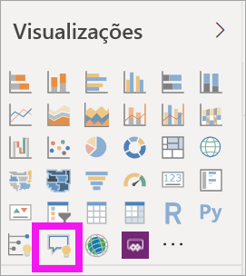

2. Arraste a borda para redimensionar o visual.

    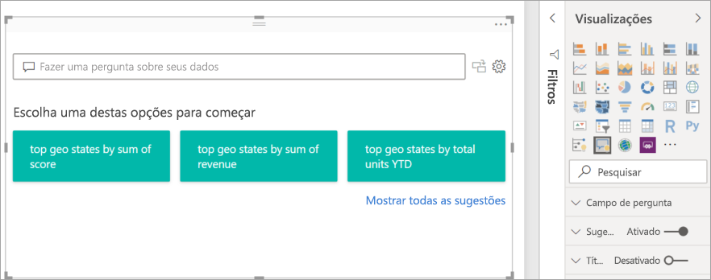

3. Para criar o visual, selecione uma das perguntas sugeridas ou comece a digitar na caixa de pergunta. Neste exemplo, selecionamos **principais estados geográficos por soma de receita**. O Power BI faz o melhor para selecionar o tipo de visual a ser usado. Nesse caso, é um mapa.

    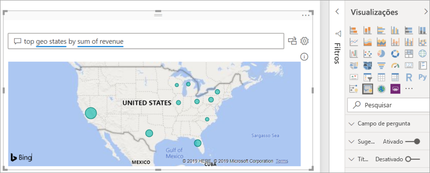

    Mas você pode informar o Power BI qual tipo de visual deve ser usado adicionando-o à sua consulta de linguagem natural. Saiba que nem todos os tipos de visuais funcionarão ou farão sentido com seus dados. Por exemplo, esses dados não produzirão um gráfico de dispersão útil. Porém, funciona como um mapa preenchido.

    

## Criar um visual de P e R usando uma consulta em idioma natural
No exemplo acima, selecionamos uma das perguntas sugeridas para criar nosso visual de P e R.  Neste exercício, vamos digitar nossa própria pergunta. À medida que digitamos nossa pergunta, o Power BI nos ajuda com preenchimento automático, sugestão e comentários.

Se você não tiver certeza de que tipo de perguntas deve ser feita ou que terminologia deve ser usada, expanda **Mostrar todas as sugestões** ou confira o painel Campos, que pode ser encontrado no lado direito da tela. Isso o ajudará a familiarizar-se com os termos e com o conteúdo do conjunto de dados de Vendas e Marketing.

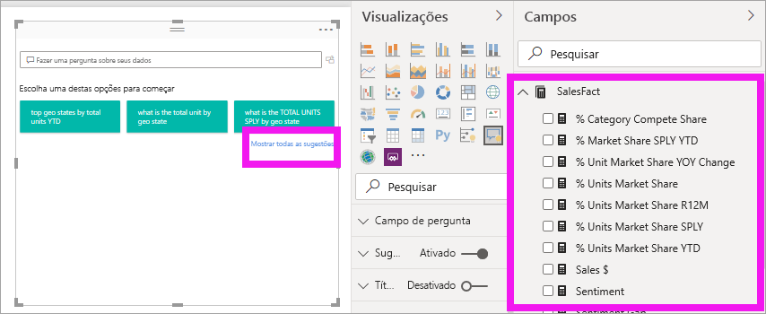

1. Digite uma pergunta no campo de P e R. O Power BI adiciona um sublinhado vermelho às palavras que ele não reconhece. Sempre que possível, o Power BI ajuda a definir palavras não reconhecidas.  No primeiro exemplo abaixo, selecionar uma das sugestões funcionará para nós.  

    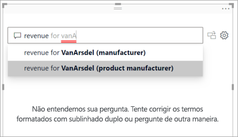

2. Conforme digitamos mais partes da uma pergunta, o Power BI informa se ele não entende a pergunta e tenta ajudar. No exemplo a seguir, o Power BI pergunta "Você quis dizer..." e sugere uma maneira diferente de formular a pergunta usando a terminologia do conjunto de seus. 

    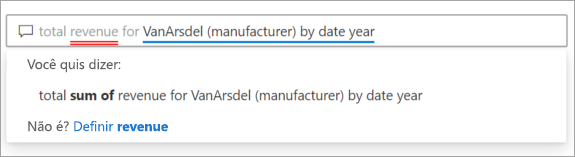

5. Com a ajuda do Power BI, conseguimos fazer uma pergunta com todos os termos reconhecíveis. O Power BI exibe os resultados como um gráfico de linhas. 

    

6. Vamos alterar o visual para um gráfico de colunas. 

    

## Formatar e personalizar o visual de P e R
O visual de P e R pode ser personalizado usando o painel de formatação e aplicando um tema. 

### Aplicar um tema
Quando você seleciona um tema, ele é aplicado a toda a página do relatório. Há muitos temas disponíveis, experimente-os até encontrar a aparência desejada. 

1. Na barra de menus, selecione a guia **Página inicial** e escolha **Alternar tema**. 

    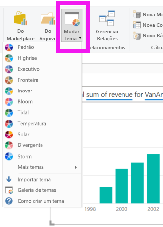

    
    
2. Neste exemplo, selecionamos **Mais temas** > **Seguro para daltônicos**.

    

### Formatar o visual de P e R
Formate o visual de P e R, o campo de pergunta e a maneira como as sugestões são exibidas. Você pode alterar tudo, desde a tela de fundo de um título até a cor de foco para palavras não reconhecidas. Aqui, adicionamos uma tela de fundo cinza à caixa de pergunta e alteramos os sublinhados para amarelo e verde. O título é centralizado e tem uma tela de fundo amarela. 

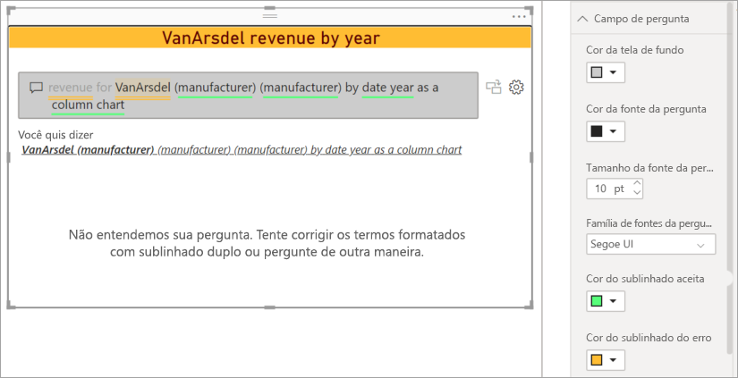

## Converter o visual de P e R em um visual padrão
Formatamos um pouco nosso gráfico de colunas seguro para daltônicos: adicionamos um título e uma borda. Agora estamos prontos para convertê-lo em um visual padrão em nosso relatório e para fixá-lo em um dashboard.

Selecione o ícone  para **Transformar esse resultado de P e R em um visual padrão**.

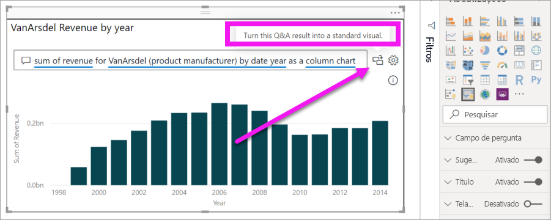

Este visual não é mais um visual de P e R, mas um gráfico de colunas padrão. Ele pode ser fixado em um dashboard. No relatório, esse visual comporta-se da mesma forma que outros visuais padrão. Observe que o painel Visualizações mostra um ícone de Gráfico de colunas selecionado. em vez do ícone de visual de P e R.

Se estiver usando o ***Serviço do Power BI***, agora você poderá fixar o visual em um dashboard selecionando o ícone de pino. 

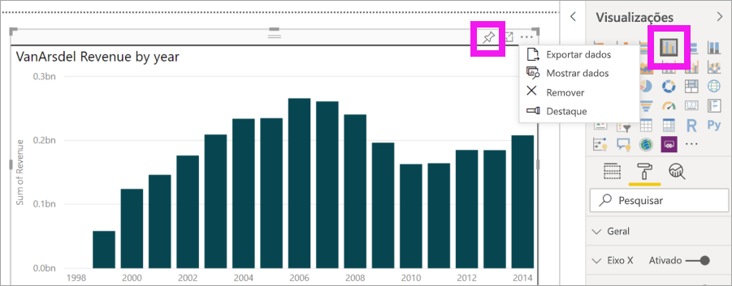

## Recursos avançados do visual de P e R
Selecionar o ícone de engrenagem abre o painel de Ferramentas de visuais de P e R. 

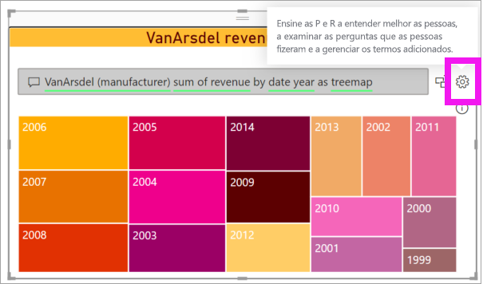

Use o painel Ferramentas para ensinar à P e R termos que ele não reconhece, gerenciar esses termos e gerenciar as perguntas sugeridas para esse conjunto de dados e relatório. No painel Ferramentas, você também pode examinar as perguntas feitas usando este visual de P e R e ver as perguntas que foram sinalizadas pelos usuários. Para saber mais, confira [Ferramenta de P e R](../natural-language/q-and-a-tooling-intro.md).

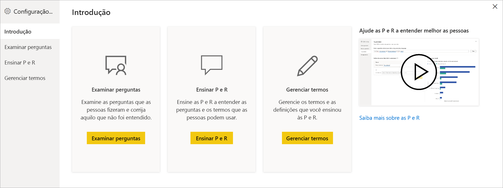

## Considerações e solução de problemas
O visual de P e R integra-se ao Office e ao Bing para tentar fazer a correspondência de palavras comuns não reconhecidas com campos em seu conjunto de dados.  

## Próximas etapas

É possível integrar o idioma natural de várias maneiras. Para obter mais informações, consulte os seguintes artigos:

* [Ferramentas de P e R](../natural-language/q-and-a-tooling-intro.md)
* [Melhores práticas de P e R](../natural-language/q-and-a-best-practices.md)
